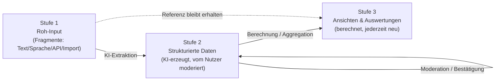
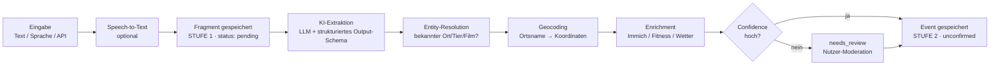
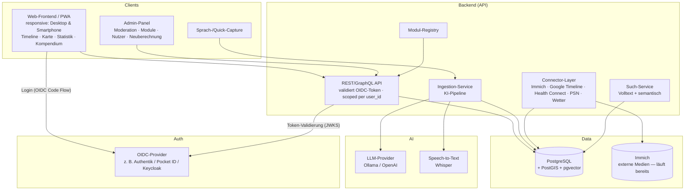

# Life-Dash — Konzept & MVP

> **Status:** In Betrieb — P0 & P1 fertig, D1 live im Homelab, P2.2–P2.7 umgesetzt (siehe Kap. 14)
> **Dokumenttyp:** Architektur- & Produktkonzept
> **Zielumgebung:** Self-hosted / Homelab (Docker-basiert)
> **Letzte Aktualisierung:** 2026-07-16

---

## 1. Vision

**Life-Dash ist eine durchsuchbare, auswertbare und visuell erlebbare Datenbank über das eigene Leben.**

Das Ziel ist es, verstreute Lebensdaten (Erinnerungen, Orte, Fotos, Fitnessdaten, Ereignisse) in einer zentralen, strukturierten Datenbank zusammenzuführen und über verschiedene Ansichten erfahrbar zu machen: einen Zeitstrahl, eine Karte, Statistiken und ein Kompendium.

Der entscheidende Unterschied zu klassischen Journaling-Apps: **Die Dateneingabe erfolgt niedrigschwellig über Freitext oder Sprache. Eine KI strukturiert, verortet, datiert und verknüpft die Fragmente automatisch.**

### Leitprinzipien

| Prinzip | Bedeutung |
|---|---|
| **Capture first, structure later** | Eingabe muss reibungslos sein. Struktur entsteht durch KI, nicht durch Formularzwang. |
| **Drei-Stufen-Modell** | Roh-Input (Stufe 1) → moderierte Struktur (Stufe 2) → berechnete Ansichten (Stufe 3). Jede Stufe leitet sich reproduzierbar aus der vorherigen ab. |
| **Rohdaten sind die Wahrheit** | Alles bezieht sich immer auf den unveränderten Roh-Input. Struktur & Ansichten sind jederzeit neu berechenbar (z. B. mit besseren Modellen). |
| **Alles konfigurierbar** | Ein Admin-Panel erlaubt das Anpassen von Modulen, Prompts, Modellen, Enrichment-Quellen und Ansichten — ohne Code-Änderung. |
| **Modular erweiterbar** | Neue trackbare Kategorien (z. B. „Konzerte", „Bücher", „Krankheiten") ohne Code-Umbau. |
| **Self-hosted & Datenhoheit** | Alle Daten bleiben im Homelab. Externe KI nur optional/austauschbar. |
| **Bestätigt vs. unbestätigt** | Bevorzugt werden konkrete Zeitangaben. KI-Ableitungen sind als „unbestätigt" markiert, bis der Nutzer sie moderiert. |
| **Ein Datenmodell, viele Ansichten** | Timeline, Karte, Statistik, Kompendium sind nur berechnete Projektionen (Stufe 3) derselben Daten. |
| **Mobile first** | Erfassung passiert unterwegs. Das UI ist eine responsive PWA; Quick-Capture, Timeline und Karte sind für das Smartphone genauso ausgelegt wie für den Desktop. |
| **Multi-User von Anfang an** | Jede Zeile in Stufe 1–3 gehört einem Nutzer (`user_id`). Login via **OIDC** (SSO im Homelab). Nachrüsten von Auth ist teuer — daher ab P0 im Datenmodell verankert. |

---

## 2. Glossar & Kernkonzepte

| Begriff | Definition |
|---|---|
| **Event (Ereignis)** | Zentrale Entität. Etwas, das zu einem Zeitpunkt/-raum an einem Ort passiert ist. „Urlaub in Frankreich", „Adler in Detmold gesehen". |
| **Entity (Kompendium-Objekt)** | Ein wiederkehrendes „Ding" im Leben: ein Tier, ein Film, ein Land, ein Spiel. Events referenzieren Entities. |
| **Fragment** | Rohe, unstrukturierte Eingabe (Text/Sprache/API), bevor die KI sie verarbeitet hat. **Stufe 1 — die unveränderliche Quelle der Wahrheit.** |
| **Trackable / Modul** | Ein registrierter Typ, den man tracken kann (z. B. `movie`, `animal`, `trip`). Definiert Schema, Icons, Statistiken. |
| **Fuzzy Date** | Zeitangabe mit Präzisionsstufe (`exact`, `day`, `month`, `season`, `year`, `decade`) + Zeitspanne. Bevorzugt werden konkrete Zeiten; Unschärfe ist der Ausnahmefall. |
| **Confirmed-Status** | Kennzeichnet, ob ein strukturierter Wert vom Nutzer moderiert/bestätigt wurde (`confirmed`) oder KI-Ableitung ist (`unconfirmed`). |
| **Source (Quelle)** | Herkunft eines Datensatzes: `manual`, `ai`, `immich`, `google_timeline`, `health_connect`, `psn`, `weather`, `api`. |
| **Track (Routenverlauf)** | Ein aufgezeichneter Bewegungspfad (LineString) aus Google Timeline oder Fitness-Workouts. Stufe-3-Daten, auf der Karte als Linien-Layer dargestellt. |
| **User** | Ein angemeldeter Nutzer (OIDC-Identität). Alle Fragmente, Events, Entities und Anreicherungen sind nutzergebunden. |
| **Enrichment** | Automatische Anreicherung eines Events mit Fotos, Fitnessdaten, Wetter etc. anhand von Zeit & Ort — auch **nachträglich** (Re-Enrichment). |
| **Admin-Panel** | Zentrale Konfigurationsoberfläche: Module, KI-Prompts/Modelle, Enrichment-Quellen, Ansichts-Regeln, Neuberechnung. |

---

## 3. Drei-Stufen-Architektur (Kernprinzip)

Das gesamte System ist als **Pipeline aus drei klar getrennten Stufen** aufgebaut. Jede Stufe leitet sich **reproduzierbar** aus der vorherigen ab. Nichts „Berechnetes" ist je die Quelle der Wahrheit — es kann jederzeit verworfen und neu erzeugt werden (z. B. mit einem besseren KI-Modell).



### Stufe 1 — Roh-Input (unveränderlich)
- Jede Eingabe wird **verlustfrei und unverändert** als `Fragment` gespeichert (Originaltext, Audio, importierte Rohdaten).
- Wird **nie überschrieben**. Alle späteren Stufen behalten eine Rückreferenz auf ihr Ursprungs-Fragment.
- Konsequenz: Man kann das gesamte System jederzeit „von Null" aus den Rohdaten neu aufbauen.

### Stufe 2 — Strukturierte Datenbank (moderiert)
- Die KI erzeugt aus Stufe 1 strukturierte `Event`- und `Entity`-Einträge (Datum, Ort, Kategorie, verknüpfte Objekte).
- Jeder abgeleitete Wert trägt einen **`confirmed`-Status**: `unconfirmed` (KI-Vorschlag) oder `confirmed` (vom Nutzer moderiert).
- Der Nutzer moderiert im Review-/Admin-Panel: bestätigen, korrigieren, verwerfen, zusammenführen.
- Manuelle Korrekturen sind „klebrig": Eine erneute KI-Verarbeitung darf bestätigte Werte **nicht** überschreiben.

### Stufe 3 — Ansichten & Auswertungen (berechnet, neu erzeugbar)
- Timeline, Karte, Statistik und Kompendium sind **berechnete Projektionen** aus Stufe 2.
- Enthalten zusätzlich KI-Anreicherungen (Fotos, Fitness, Wetter) und Aggregationen (Statistik-Widgets).
- **Vollständig neu berechenbar** — per Knopfdruck im Admin-Panel, z. B. nach Modellwechsel, neuen Enrichment-Quellen oder Modul-Updates.

### Warum diese Trennung?
| Vorteil | Erklärung |
|---|---|
| **Reproduzierbarkeit** | Bessere Modelle → einfach Stufe 2/3 neu berechnen, Rohdaten bleiben. |
| **Vertrauen** | Klare Trennung zwischen „was ich gesagt habe" (S1), „was die KI daraus machte" (S2) und „wie es dargestellt wird" (S3). |
| **Sicherheit** | Keine stille Datenkorruption: Roh-Input ist immer die Rückfallebene. |
| **Moderation** | Der Nutzer hat volle Kontrolle über Stufe 2, ohne die Rohdaten zu verlieren. |

### 3.1 Präzisierung: Vier Schichten (Entscheidung 2026-07-15)

Die „Stufe 2" vermischt begrifflich zwei Dinge, die getrennt gedacht werden
müssen. Konzeptionell besteht das System aus **vier Schichten** (über
denselben Tabellen — der `confirmed`-Status ist die Trennlinie, kein
DB-Umbau nötig):

| Schicht | Was | Lebensdauer |
|---|---|---|
| **1 · Eingang** | Rohe Fragmente (Text, Sprache, Import-Zusammenfassungen). | Unveränderlich, dauerhaft. Beweisarchiv. |
| **2 · Vorschlagsraum** | Unbestätigte KI-Ableitungen (`confirmed = unconfirmed`). *Behauptungen, keine Wahrheit.* | Wegwerfbar — wird bei Neuberechnung verworfen und neu erzeugt. |
| **3 · Lebensdatenbank** | Bestätigte Events/Entities/Locations (`confirmed`) **plus faktische Anreicherungen**: Wetter, Medien-Referenzen, Tracks. Fakten ändern sich nicht — einmal geholt, für immer wahr. | **Fix.** Das eigentliche Ziel des Systems. |
| **4 · Ableitungen** | Ansichten, Statistik, Aggregationen, **Embeddings** (modellabhängig). | Jederzeit wegwerfbar und neu berechenbar; kein Backup nötig. |

**Die harte Invariante:** *Bestätigte Daten werden von Maschinen nie
verändert, nur additiv ergänzt (Metriken, Medien-Referenzen).* Neuberechnung
betrifft ausschließlich Schicht 2 und 4. Bestätigen ist der Übergang 2 → 3
(dieselbe Zeile, Status kippt); `field_overrides` schützt zusätzlich einzelne
manuell korrigierte Felder.
*Dokumentierte Ausnahme:* „Ortsnamen auflösen" ersetzt generierte
Koordinaten-Titel („Besuch: Ort (53.49…)") auch an bestätigten
Import-Besuchen — das ist eine nutzergestartete Datenverbesserung, keine
KI-Neubewertung; manuell umbenannte Titel bleiben geschützt.

**Verknüpfung & Löschbarkeit:** Jede Schicht-2/3-Zeile referenziert ihr
Eingangs-Fragment (`origin_fragment_id`, n:1 — ein Fragment kann mehrere
Events erzeugen). Der Vorschlagsraum räumt sich selbst (Bestätigen wandelt
um, Verwerfen löscht). Der **Eingang wird bewusst nicht gelöscht**, auch
wenn alles bestätigt ist: Er kostet fast nichts (Text), ist der
Herkunftsnachweis der Lebensdatenbank und die einzige Quelle für spätere
Re-Extraktion/Vergleiche. Legitim ist allenfalls ein manuelles Aufräumen
*verwaister* Fragmente (alle Events verworfen) — nie automatisch.

---

## 4. Nutzer-Szenarien (User Stories)

### Eingabe
- *Als Nutzer* öffne ich Life-Dash auf dem **Smartphone** (installierte PWA), tippe unterwegs zwei Sätze ins Quick-Capture und bin fertig — Moderation mache ich später am Desktop.
- *Als Nutzer* tippe ich „12.07.2026 war in Detmold und habe einen Adler gesehen", damit die KI ein Event mit Datum, Ort (Detmold) und einer Tier-Sichtung (Adler) anlegt.
- *Als Nutzer* diktiere ich per Sprache „Sommer 2002 Urlaub in Frankreich", damit ein Event mit Zeitangabe (Sommer 2002, als `unconfirmed` markiert), Ort (Frankreich) und Kategorie „Reise" entsteht.
- *Als Nutzer* moderiere ich KI-Vorschläge: Ich sehe, welche Werte `unconfirmed` sind, und bestätige/korrigiere sie, bevor sie als Fakt gelten.
- *Als Nutzer* möchte ich bei mehrdeutigen Eingaben eine Rückfrage/Vorschau bekommen, bevor der Datensatz übernommen wird.
- *Als Nutzer* schreibe ich zu einem Reisetag einen **formatierten Tagebucheintrag** (Markdown) — als Tages-Zusammenfassung über den Einzel-Events, damit Life-Dash auch als Reisetagebuch mit eigener Stimme funktioniert (→ Paket F1). Die KI fasst den Text nie an.
- *Als Nutzer* tippe ich unterwegs „gerade einen Eisvogel gesehen" und übernehme **optional per Knopf meinen Handy-Standort** als Ort — ohne Tippen, aber nie automatisch (→ Paket F2).

### Ansichten
- *Als Nutzer* zoome ich im Zeitstrahl von der Dekaden- auf die Tagesebene, um Ereignisdichte und Details zu sehen.
- *Als Nutzer* sehe ich auf einer Karte alle Orte, an denen ich war, gefiltert nach Zeitraum.
- *Als Nutzer* öffne ich den Statistik-Reiter und sehe „In wie vielen Ländern war ich?", „Wie viele km bin ich 2025 gelaufen?", „Welche Tiere habe ich gesehen?".
- *Als Nutzer* öffne ich im Kompendium das Tier „Adler" und sehe alle Sichtungen, Fotos und Orte, die damit verknüpft sind.

### Anreicherung & Import
- *Als Nutzer* verknüpft das System automatisch Immich-Fotos vom 12.07.2026 mit dem Detmold-Event (Immich läuft bereits als Dienst im Homelab).
- *Als Nutzer* importiere ich meinen **Google-Timeline-Export** vom Smartphone und sehe besuchte Orte als Events und meine **Routenverläufe** als Linien auf der Karte.
- *Als Nutzer* importiere ich meine **Health-Connect-Daten** (Schritte, Herzfrequenz, Workouts) und sehe zu einer Wanderung die Schritte/Herzfrequenz.
- *Als Nutzer* importiere ich meine **PSN-Spielehistorie** (gespielte Spiele, Trophäen, Spielzeiten) und sehe im Kompendium unter „Spiele", wann ich was gespielt habe.
- *Als Nutzer* sehe ich zu jedem verorteten Event das **Wetter** an diesem Tag/Ort (automatisch angereichert).
- *Als Nutzer* reichere ich **nachträglich** an: Wenn ich später neue Fotos, Fitness- oder Wetterdaten importiere, werden bestehende Events automatisch aktualisiert (Re-Enrichment).

### Konto & Zugriff
- *Als Nutzer* melde ich mich per **SSO (OIDC)** an — dieselbe Anmeldung wie bei den übrigen Homelab-Diensten.
- *Als Nutzer* sehe ich ausschließlich meine eigenen Daten; weitere Nutzer (z. B. Familienmitglieder) führen ihre eigene, getrennte Lebensdatenbank.

### Suche
- *Als Nutzer* suche ich „alle Male, in denen ich am Meer war" und bekomme semantisch passende Events, nicht nur Volltext-Treffer.

---

## 5. Feature-Bereiche (Views)

### 5.1 Zeitstrahl (Timeline)
Die zentrale Ansicht. Horizontaler oder vertikaler Strahl mit stufenlosem Zoom.

- **Zoomstufen:** Tag → Woche → Monat → Jahr → Jahrzehnt.
- **Aggregation:** Auf hohen Ebenen werden Events zu „Heat"-Clustern verdichtet (Ereignisdichte, Kategorien-Farben).
- **Unscharfe Events** (z. B. „Sommer 2002") werden als Balken/Spanne dargestellt, nicht als Punkt, und als `unconfirmed` gekennzeichnet.
- **Filter:** Nach Kategorie, Ort, Quelle, Tag, Confirmed-Status.
- **Interaktion:** Klick auf Event → Detail-Panel mit Fotos, Ort, Wetter, verknüpften Entities.

### 5.2 Karte (Map)
- Alle verorteten Events als Marker / Cluster / Heatmap.
- **Zeitschieberegler**, synchronisiert mit der Timeline.
- Ebenen: **Routenverläufe (Tracks)** aus Google Timeline & Workouts als Linien-Layer, Reisen, einzelne Orte, Wohnorte, „besondere Momente".
- Datenquellen: manuelle Orte, Google-Timeline-Import (Besuche **und** Routen), Geo-Tags aus Immich-Fotos, GPS-Tracks aus Fitness-Workouts.

### 5.3 Statistik
Konfigurierbares Dashboard aus „Widgets". Jedes Modul kann eigene Statistiken beisteuern. Die Widgets sind **berechnete Stufe-3-Projektionen** und jederzeit neu berechenbar.

- Beispiele: Länder-Zähler, Reisekilometer, gesehene Tierarten, Filme pro Jahr, Fitness-Trends, „Lebensjahre in Zahlen".
- Zeitraumfilter, Vergleich zwischen Jahren.

### 5.4 Kompendium
Strukturierte Sammlungen von Entities, gruppiert nach Typ.

- Reiter/Kategorien: **Tiere, Filme, Spiele, Länder, Orte, Bücher, …** (modul-getrieben).
- Detailseite pro Entity: Beschreibung, Metadaten, verknüpfte Events, Timeline-Mini-Ansicht, Fotos.
- Beispiel: „Adler" → alle Sichtungen, Karte der Sichtungsorte.

### 5.5 Dateneingabe (Ingestion)
- Freitext-Feld, Sprachaufnahme (Speech-to-Text), API-Endpoint.
- Jede Eingabe wird zuerst als **Stufe-1-Fragment** verlustfrei gespeichert.
- **KI-Vorschau:** Zeigt, wie die KI das Fragment interpretiert hat (Datum, Ort, Entities, Kategorie) → Nutzer bestätigt oder korrigiert (→ Stufe 2).
- Batch-Import (z. B. altes Tagebuch, Chatverläufe).

### 5.6 Admin-Panel & Moderation
Zentrale Steuerungsoberfläche für das gesamte System.

- **Moderations-Queue:** Alle `unconfirmed` Stufe-2-Einträge sichten, bestätigen, korrigieren, verwerfen, zusammenführen.
- **Modul-Verwaltung:** Trackables aktivieren/definieren, Schemas, Icons, Statistik-Widgets.
- **KI-Konfiguration:** Provider/Modell wählen, Prompts anpassen, Confidence-Schwellen setzen.
- **Enrichment-Quellen:** Immich, Google Timeline, Fitness, Wetter konfigurieren und Verknüpfungsregeln festlegen.
- **Neuberechnung:** Stufe 2 und/oder Stufe 3 gezielt oder komplett neu berechnen (z. B. nach Modellwechsel) — bestätigte Werte bleiben erhalten.
- **Roh-Daten-Einsicht:** Zu jedem Event zurück zum ursprünglichen Fragment (Stufe 1) navigieren.
- **Nutzerverwaltung:** OIDC-Provider-Konfiguration, Nutzerliste, Rollen (`admin` | `user`). Import-Konfiguration (Immich-API-Key, PSN-Token) ist **pro Nutzer** hinterlegt.

### 5.7 Mobile Nutzung (Smartphone)

Das UI wird von Anfang an **responsive** entworfen — nicht als nachträgliche Anpassung. Der wichtigste mobile Anwendungsfall ist das **Erfassen unterwegs**; Auswertung und Moderation passieren eher am Desktop, müssen mobil aber funktionieren.

- **PWA:** Installierbar auf dem Homescreen, App-Manifest, Offline-Queue für Quick-Capture (Fragmente werden lokal gepuffert und bei Verbindung synchronisiert — passt zum Stufe-1-Prinzip „Capture first").
- **Layout:** Desktop = Sidebar-Navigation; Mobil = **Bottom-Navigation** (Timeline · Karte · ➕ Capture · Statistik · Kompendium) mit Quick-Capture als zentralem, prominentem Button.
- **Timeline mobil:** vertikal scrollend statt horizontal; Detail-Panel als Bottom-Sheet statt Seitenpanel.
- **Karte mobil:** Vollbild mit einblendbarem Zeitfilter; Touch-Gesten (Pinch-Zoom).
- **Sprach-Eingabe** ist mobil der natürlichste Kanal (Phase 2, Whisper serverseitig).
- **Share Target (später):** Text/Fotos aus anderen Apps direkt an Life-Dash teilen → wird Fragment.

---

## 6. Datenmodell (Kern)

Das Herzstück. Bewusst schlank und generisch gehalten, damit Module ohne Schema-Migration andocken können.

### 6.1 Entitäten (konzeptionell)

```
User                     (Identität — via OIDC)
  id
  oidc_subject         (stabile `sub`-Claim aus dem OIDC-Token)
  email
  display_name
  role                 (admin | user)
  settings             (JSON: z. B. Immich-API-Key, PSN-Token, Import-Präferenzen)
  created_at

Fragment                 (STUFE 1 — unveränderlich)
  id
  user_id              (FK → User; gilt ebenso für Event, Entity,
                        MediaRef, Metric, Track — hier nicht wiederholt)
  raw_text
  audio_ref            (optional)
  source               (manual | voice | api | import)
  status               (pending | processed | needs_review | discarded)
  created_at
  processed_event_ids  (Ergebnis der KI-Verarbeitung)

Event                    (STUFE 2 — strukturiert, moderiert)
  id
  title                (KI- oder nutzergeneriert)
  description
  date_start           (timestamp)
  date_end             (timestamp, optional)
  date_precision       (exact | day | month | season | year | decade)
  location_id          (FK → Location, optional)
  category             (trackable key, z. B. "trip", "sighting")
  confidence           (0..1, wie sicher ist die KI)
  confirmed            (unconfirmed | confirmed)  ← vom Nutzer moderiert?
  field_overrides      (JSON: welche Felder manuell bestätigt/korrigiert
                        wurden → vor Re-Processing geschützt)
  source               (manual | ai | immich | google_timeline | fitness | weather)
  origin_fragment_id   (FK → Fragment, Stufe-1-Rückreferenz)
  embedding            (Vektor für semantische Suche)
  created_at / updated_at

Entity            (Kompendium-Objekt, STUFE 2)
  id
  type              (animal | movie | game | country | place | book | ...)
  name
  attributes        (JSON, schemaabhängig vom Modul)
  confirmed         (unconfirmed | confirmed)
  embedding
  created_at

EventEntityLink   (n:m zwischen Event und Entity)
  event_id
  entity_id
  role              (subject | location | mentioned)

Location
  id
  name
  geo               (PostGIS Point/Polygon)
  type              (city | country | poi | home)
  external_ref      (z. B. OSM-ID)

MediaRef          (STUFE 3 — Enrichment; Verweis auf externe Medien, KEINE Kopie)
  id
  event_id
  provider          (immich | local | url)
  external_id       (z. B. Immich Asset-ID)
  captured_at
  geo               (optional, für Auto-Verknüpfung)

Metric            (STUFE 3 — Enrichment; generische Kennzahlen: Fitness, Wetter)
  id
  event_id
  key               (steps | heart_rate_avg | distance_km |
                     temperature_c | weather_condition |
                     play_minutes | trophies_earned | ...)
  value
  unit
  source            (health_connect | weather | psn | ...)
  enriched_at       (wann angereichert → erlaubt Re-Enrichment)

Track             (STUFE 3 — Routenverlauf; aus Google Timeline / Workouts)
  id
  date_start / date_end
  geo               (PostGIS LineString, vereinfacht/komprimiert
                     z. B. per Douglas-Peucker)
  activity_type     (walk | drive | cycle | run | transit | unknown)
  distance_m
  source            (google_timeline | health_connect)
  event_id          (optional, FK → Event — z. B. Wanderung)
  origin_fragment_id (FK → Fragment, Roh-Import-Rückreferenz)
```

### 6.2 Design-Entscheidungen

- **Drei-Stufen-Herkunft im Modell verankert:** `Fragment` = Stufe 1, `Event`/`Entity` = Stufe 2, `MediaRef`/`Metric` = Stufe 3. Jede Stufe-2/3-Zeile referenziert zurück auf Stufe 1.
- **`confirmed` + `field_overrides`:** Trennung von KI-Vorschlag (`unconfirmed`) und moderiertem Fakt (`confirmed`). `field_overrides` schützt einzelne, manuell korrigierte Felder vor Überschreiben bei einer Neuberechnung.
- **Konkrete Zeiten bevorzugt:** `date_precision` erlaubt Unschärfe („Sommer 2002" → `season`), aber unscharfe/abgeleitete Zeiten sind `unconfirmed`, bis der Nutzer sie bestätigt. Ziel ist, möglichst konkrete, bestätigte Zeitangaben zu haben.
- **Event ↔ Entity als n:m:** Ein Event kann mehrere Tiere/Objekte referenzieren; eine Entity taucht in vielen Events auf. Grundlage für Kompendium **und** Statistik. (Personen bewusst vorerst ausgeklammert — siehe Kap. 8.3.)
- **`attributes` als JSON:** Modul-spezifische Felder (z. B. Film-Rating, Tier-Art) in flexiblem JSON-Feld mit vom Modul definiertem Schema (JSON-Schema-Validierung). Kein DB-Umbau bei neuen Modulen.
- **Embeddings für semantische Suche:** Events und Entities bekommen Vektor-Embeddings (pgvector) → „alle Male am Meer" findet auch „Strandtag in Italien".
- **Medien & Metriken sind Stufe 3:** Referenziert, nicht kopiert (Immich bleibt Single Source of Truth). `enriched_at` erlaubt **nachträgliches Re-Enrichment**, ohne Stufe 2 zu verändern.
- **`user_id` überall, Mandanten-Trennung strikt:** Jede Stufe-1/2/3-Zeile gehört genau einem Nutzer. Die API filtert **immer** nach dem angemeldeten Nutzer — es gibt keine geteilten Events/Entities (bewusst einfach gehalten; „Sharing" wäre ein späteres Feature). Auch Locations sind zunächst nutzergebunden.
- **Tracks getrennt von Events:** Ein Routenverlauf ist kein Event (kein „Erlebnis"), sondern Kontext. Rohe Timeline-/GPS-Daten bleiben als Fragment (S1) erhalten; `Track` ist die berechnete, vereinfachte Geometrie (S3) — bei besseren Vereinfachungs-Algorithmen neu erzeugbar.

---

## 7. KI-Pipeline (Ingestion)

Der Weg vom Fragment (Stufe 1) zum moderierten Event (Stufe 2) und zur angereicherten Ansicht (Stufe 3).



### 7.1 Schritte im Detail

1. **Capture (Stufe 1):** Fragment wird sofort roh gespeichert (nie Datenverlust, auch offline-fähig).
2. **Speech-to-Text** (optional): z. B. `whisper` lokal.
3. **Strukturierte Extraktion (Stufe 2):** LLM erhält das Fragment + ein **strukturiertes Ausgabeschema** (Function-Calling / JSON-Schema). Output: Titel, Datum(-sspanne) + Präzision, Orte, erkannte Entities mit Typ, Kategorie, Confidence. Alle Werte zunächst `unconfirmed`.
4. **Entity-Resolution:** Abgleich erkannter Namen mit bestehenden Entities („Adler" → existierende Tier-Entity? „Frankreich" → Land?). Fuzzy-Matching + Embedding-Ähnlichkeit. Neue Entities werden als Kandidaten angelegt.
5. **Geocoding:** Ortsnamen → Koordinaten (lokaler Nominatim/OSM-Dienst, keine externe Abhängigkeit nötig).
6. **Enrichment (Stufe 3):** Anhand Zeit+Ort werden Immich-Fotos, Fitness-Metriken und **Wetterdaten** verknüpft. Läuft auch **nachträglich** als Re-Enrichment-Job, wenn neue Quelldaten dazukommen.
7. **Review-Gate:** Bei niedriger Confidence oder Mehrdeutigkeit → `needs_review`. Der Nutzer moderiert und setzt Werte auf `confirmed`.
8. **Neuberechnung:** Stufe 2 und 3 sind jederzeit aus Stufe 1 reproduzierbar (z. B. mit neuem Modell) — `confirmed`-Werte bleiben dabei geschützt.

### 7.2 Austauschbarer KI-Provider

Die KI ist hinter einem **Provider-Interface** gekapselt:

```
LLMProvider (Interface)
  extract_structured(fragment, schema) -> StructuredResult
  embed(text) -> vector

Implementierungen:
  - OllamaProvider   (lokal, z. B. Llama/Mistral)  ← Default Homelab
  - OpenAIProvider   (optional, höhere Qualität)
  - AnthropicProvider
```

So bleibt Datenhoheit gewahrt, und man kann je nach Aufgabe (Extraktion vs. Embedding) unterschiedliche Modelle wählen.

---

## 8. Modularität / Erweiterbarkeit

Das zentrale Nicht-funktionale Ziel: **Neues tracken, ohne den Kern anzufassen.**

### 8.1 Modul-Konzept („Trackable")

Ein Modul registriert einen neuen Typ deklarativ:

```yaml
# module: animals
key: animal
label: Tiere
icon: paw
entity_schema:            # JSON-Schema für Entity.attributes
  species: string
  wild: boolean
  first_seen: date
event_categories:
  - sighting              # "Adler gesehen"
statistics:
  - id: species_count
    label: "Beobachtete Arten"
    type: count_distinct
    field: entity.species
  - id: sightings_per_year
    label: "Sichtungen pro Jahr"
    type: timeseries
compendium_view:
  group_by: species
  detail_map: true        # zeigt Sichtungsorte auf Karte
```

### 8.2 Was ein Modul beisteuern kann

| Bereich | Beitrag des Moduls |
|---|---|
| **Datenmodell** | JSON-Schema für `Entity.attributes` (validiert, aber keine DB-Migration). |
| **Ingestion** | Hinweise/Prompts, wie die KI diesen Typ erkennt. |
| **Statistik** | Deklarative Widgets (count, timeseries, distinct, sum). |
| **Kompendium** | Gruppierung, Detailansicht, Kartenoption. |
| **UI** | Icon, Label, Farbe. |

### 8.3 Beispiel-Module (Startset)

**Umgesetzt:** `trip` (Reisen) · `animal` (Tiere) · `country` (Länder) · `artist` (Künstler/Konzerte) · `food` (Essen/Mahlzeiten) · `milestone` (Meilensteine: Hochzeit, Geburt, Umzug, Abschluss …).
**Geplant:** `movie` · `game` · `book` · `place` · `sport_activity` · `health_event`.

> Erfahrung aus der Umsetzung: Eine neue Kategorie besteht aus **drei Stellen** — Modul-YAML (Backend), Regeln/Beispiel im KI-Prompt und Frontend (Label, Farbe, Kompendium-Tab, Formular-Optionen). Das deklarative Ziel „nur YAML" ist noch nicht ganz erreicht (siehe Kap. 15, Frage 3).

> **Personen bewusst ausgeklammert (vorerst):** Ein `person`-Modul ist konzeptionell reizvoll, in der Pflege aber zu komplex (Dubletten, Beziehungen, Datenschutz Dritter, ständige Zuordnungsentscheidungen). Fokus liegt zunächst auf **konkreten, bestätigbaren Fakten** (Zeit, Ort, Objekt). Das n:m-Datenmodell bleibt so ausgelegt, dass Personen später als weiteres Modul ergänzt werden können, ohne Umbau.

---

## 9. Integrationen

| Quelle | Zweck | Ansatz |
|---|---|---|
| **Immich** | Fotos & Videos, Geo-Tags, Zeitstempel | **Läuft bereits als Dienst im Homelab** → erste umzusetzende Integration. Immich-API (`/api/search/metadata`: Assets nach Zeitraum/Geo abfragen), Auth per API-Key (pro Nutzer in `User.settings`). Verknüpfung per `MediaRef` — **nur Referenzen, keine Kopien**; Thumbnails werden über einen Backend-Proxy von Immich durchgereicht. |
| **Google Timeline** | Besuchte Orte **und Routenverläufe** | ⚠️ Timeline liegt seit 2024 **nur noch auf dem Gerät** (Takeout „Semantic Location History" gibt es nicht mehr). Import über den **Geräte-Export**: Android → Einstellungen → Standort → Zeitachse → „Zeitachse exportieren" (JSON, `semanticSegments`). Datei-Upload im UI → roh als Fragment (S1) → `visit`-Segmente werden Events/Locations, `activity`-/`timelinePath`-Segmente werden `Track`s (S3). Kein Live-Zugriff möglich, wiederkehrender manueller Upload. |
| **Google Health / Health Connect** | Schritte, Distanz, HF, Workouts (inkl. GPS) | ⚠️ Google Fit REST API ist eingestellt (2025); Nachfolger **Health Connect** speichert nur **on-device**, ohne Cloud-API. Import daher per Datei: Health-Connect-Export (ZIP) oder Sync-App (z. B. Health Connect → Home Assistant / GadgetBridge-Export), alternativ direkt Garmin-/Fitbit-Export. Tageswerte & Workouts → `Metric` an Events; Workout-GPS → `Track`. |
| **PSN (PlayStation Network)** | Gespielte Spiele, Trophäen, Spielzeiten | Keine offizielle öffentliche API. Ansatz: inoffizielle API via **NPSSO-Token** (z. B. Python-Lib `psnawp`) — Token pro Nutzer in `User.settings`. Periodischer Sync: Titel → `game`-Entities, Sessions/„zuletzt gespielt" → Events, Trophäen & Spielzeit → `Metric`. Fallback: reiner Trophäen-Verlauf (Zeitstempel je Trophäe) als Ereignisquelle. Risiko: inoffizielle API kann brechen → Connector isoliert halten, Sync-Ergebnisse als Fragmente (S1) sichern. |
| **Wetter** | Kontext-Anreicherung (Temperatur, Bedingungen) | Historische Wetter-API (Open-Meteo-Tagesarchiv) anhand Zeit+Ort. Als `Metric` an verortete Events gehängt — auch nachträglich. Aktuelle Logik: Temperatur = Mittel aus Tagesmax/-min, Bedingung = signifikantester Wettercode des Tages (Verfeinerung → Paket F3). |
| **Geocoding** | Ortsname ↔ Koordinaten | Self-hosted Nominatim (OSM), keine externe Abhängigkeit. |

**Integrationsprinzip:** Jede Quelle ist ein **Connector** mit einheitlichem Interface (`fetch`, `map_to_events`, `enrich`). Neue Quellen andockbar ohne Kernänderung. Alle Connector-Ergebnisse sind **Stufe-3-Anreicherungen** und jederzeit neu berechenbar.

**Zwei Connector-Arten:**
- **Pull-Connectoren** (Immich, PSN, Wetter): Backend fragt die Quelle aktiv/periodisch ab.
- **Upload-Connectoren** (Google Timeline, Health Connect): Nutzer lädt Export-Dateien hoch — mobiltauglicher Upload-Flow im UI (vom Smartphone direkt teilbar). Roh-Dateien werden als Fragmente (S1) archiviert, damit Re-Processing möglich bleibt.

**Dubletten-Schutz beim Re-Import:** Importe sind **idempotent** — jeder importierte Datensatz trägt einen stabilen `external_id`-Schlüssel (Immich-Asset-ID, Timeline-Segment-Hash, PSN-Trophäen-ID), sodass wiederholte Uploads/Syncs keine Duplikate erzeugen.

---

## 10. Technische Architektur



### Schichten

- **Frontend:** Ansichten als Stufe-3-Projektionen desselben API. State-Sync zwischen Timeline & Karte über gemeinsamen Zeitraum-Filter. **Responsive PWA** — eine Codebasis für Desktop und Smartphone (Sidebar ↔ Bottom-Navigation, Panels ↔ Bottom-Sheets).
- **Auth:** OIDC Authorization Code Flow (PKCE) im Frontend; das Backend validiert Tokens gegen den JWKS-Endpoint des Providers und legt beim ersten Login automatisch den `User`-Datensatz an (JIT-Provisioning über den `sub`-Claim).
- **Admin-Panel:** Eigene Oberfläche für Moderation (Stufe 2), Modul-/KI-Konfiguration, Nutzerverwaltung und Neuberechnung.
- **API:** Dünn, autorisierend, delegiert an Services. Jede Query ist per `user_id` gescoped.
- **Ingestion-Service:** Orchestriert die KI-Pipeline (Kap. 7). Asynchron (Queue) für Batch-Importe und Re-Enrichment.
- **Modul-Registry:** Lädt Modul-Definitionen, stellt Schemas/Statistiken bereit.
- **Connector-Layer:** Kapselt externe Quellen (inkl. Wetter).
- **Datenhaltung:** Ein PostgreSQL mit PostGIS (Geo) + pgvector (Embeddings) deckt relationale, geografische und semantische Anforderungen in **einer** DB ab — ideal fürs Homelab.

---

## 11. Tech-Stack Empfehlung (Homelab)

| Ebene | Empfehlung | Begründung |
|---|---|---|
| **Backend** | Python + **FastAPI** | Passt zur bestehenden Python-Umgebung; exzellent für KI-Integration; async. |
| **DB** | **PostgreSQL** + **PostGIS** + **pgvector** | Eine DB für relational, geo und semantisch. Weniger bewegliche Teile. |
| **ORM/Migration** | SQLAlchemy + Alembic | Etabliert, migrationssicher. |
| **Queue** | Redis / RQ (oder DB-basiert zum Start) | Asynchrone Ingestion & Batch-Import. |
| **KI (LLM)** | **Ollama** (lokal), Provider-abstrahiert | Datenhoheit; austauschbar gegen OpenAI. |
| **STT** | **Whisper** (lokal) | Sprach-Eingabe ohne Cloud. |
| **Geocoding** | **Nominatim** (self-hosted) | Keine externe Abhängigkeit. |
| **Auth** | **OIDC** — bestehender Homelab-Provider (Authentik/Keycloak) oder leichtgewichtig **Pocket ID**; Backend: `python-jose`/`authlib` für Token-Validierung | SSO über alle Homelab-Dienste; Life-Dash verwaltet keine Passwörter. |
| **Frontend** | **React** (o. Svelte) als **responsive PWA** + Karten-Lib (MapLibre/Leaflet) + Timeline-Lib | Reiches interaktives UI; eine Codebasis für Desktop & Smartphone; installierbar, Offline-Capture. |
| **PSN-Connector** | `psnawp` (Python, NPSSO-Token) | Etablierteste inoffizielle PSN-Lib; isoliert im Connector-Layer. |
| **Deployment** | **Docker Compose** | Homelab-Standard; reproduzierbar. Immich läuft bereits separat — nur URL + API-Key nötig. |

> Bewusst **eine** Datenbank statt separatem Vector-Store/Geo-Store, um die Betriebskomplexität im Homelab gering zu halten.

---

## 12. Sicherheit & Datenschutz

- **Self-hosted only:** Standardmäßig kein Datenabfluss. Externe KI-Provider sind opt-in und klar gekennzeichnet.
- **Auth: Multi-User via OIDC von Anfang an.** Life-Dash speichert keine Passwörter; Anmeldung läuft über den Homelab-OIDC-Provider (SSO). Jeder Nutzer hat eine strikt getrennte Datenbasis (`user_id`-Scoping in jeder Query); Rollen: `admin` (Systemkonfiguration) und `user`.
- **Nutzer-Secrets:** Verbindungsdaten pro Nutzer (Immich-API-Key, PSN-NPSSO-Token) werden verschlüsselt in `User.settings` abgelegt und nie ans Frontend ausgeliefert.
- **Sensible Daten:** Lebensdaten sind hochsensibel → Backups verschlüsselt, DB nicht öffentlich exponiert (nur via Reverse Proxy/VPN). Bewegungsprofile (Tracks) und Gesundheitsdaten (Metrics) sind die sensibelsten Kategorien — Export/Löschung muss sie vollständig erfassen.
- **KI-Transparenz:** KI-abgeleitete Aussagen sind über `confidence`, `source` und `confirmed` als solche erkennbar; das Moderations-/Review-Gate verhindert stille Falschdaten.
- **Rohdaten als Rückfallebene:** Da Stufe 1 unveränderlich ist, kann eine fehlerhafte KI-Verarbeitung jederzeit gefahrlos verworfen und neu berechnet werden.
- **Datenkontrolle:** Vollständiger Export (Rohdaten + strukturiert) und Löschung jederzeit möglich.

---

## 13. MVP-Definition

Ziel des MVP: **Der Kernloop über alle drei Stufen funktioniert** — Fragment eingeben (S1) → KI strukturiert + Nutzer moderiert (S2) → auf Zeitstrahl & Karte sehen + durchsuchen (S3).

### 13.1 MVP-Scope (In)

| Bereich | MVP-Umfang |
|---|---|
| **Drei-Stufen-Fundament** | `Fragment` (S1) unveränderlich → `Event`/`Entity` (S2) mit `confirmed`-Status → Ansichten (S3) neu berechenbar. |
| **Dateneingabe** | Freitext-Eingabe + KI-Vorschau mit Bestätigung/Korrektur. (Sprache: Phase 2) |
| **KI-Pipeline** | Extraktion (Datum + Präzision, Ort, Kategorie, einfache Entities), Geocoding, Confidence + Review-Gate. |
| **Datenmodell** | `Fragment`, `Event`, `Entity`, `EventEntityLink`, `Location` inkl. `confirmed`/`field_overrides`. |
| **Moderation / Admin** | Einfaches Moderations-Panel: `unconfirmed` sichten, bestätigen, korrigieren; Neuberechnung auslösen. |
| **Timeline** | Zoom Jahr → Monat → Tag; Events als Punkte/Spannen; Klick-Detail; `unconfirmed` sichtbar markiert. |
| **Karte** | Verortete Events als Marker + Zeitraumfilter. |
| **Suche** | Volltext + semantische Suche (Embeddings). |
| **Kompendium** | Typ **Tiere** als Nachweis der Modularität. |
| **Module** | Modul-Registry mit 2–3 fest definierten Modulen (`trip`, `animal`, `country`). |
| **Auth & Multi-User** | OIDC-Login + `user_id` in allen Tabellen + JIT-Provisioning. Kein Nutzer-Management-UI im MVP — Nutzer entstehen durch Login. |
| **Responsive Grundlayout** | Mobile-taugliches Layout (Bottom-Navigation, Quick-Capture) von Beginn an; PWA-Manifest. Offline-Queue: Phase 2. |
| **Deployment** | Docker Compose (App + Postgres + Ollama). |

### 13.2 Bewusst NICHT im MVP (Out)

- Sprach-Eingabe / Whisper, Offline-Capture-Queue (PWA-Grundlage aber gelegt)
- Immich-, Google-Timeline-, Health-Connect-, PSN-, Wetter-Integration (Datenmodell & Stufe-3-Konzept aber vorbereitet)
- Statistik-Dashboard (nur rudimentäre Zähler)
- Personen-Modul (bewusst ausgeklammert)
- Vollständiges Module-Set, Dekaden-Aggregation
- Nutzerverwaltungs-UI, Sharing zwischen Nutzern (OIDC-Login + Datentrennung sind aber **im** MVP)

### 13.3 Definition of Done (MVP)

1. Ich tippe „12.07.2026 war in Detmold und habe einen Adler gesehen" → sehe eine KI-Vorschau (Stufe 2, `unconfirmed`) → bestätige (→ `confirmed`).
2. Das Event erscheint korrekt datiert auf dem Zeitstrahl **und** als Marker in Detmold auf der Karte.
3. „Sommer 2002 Urlaub in Frankreich" wird als Spanne (Sommer 2002, `season`, `unconfirmed`) mit Ort Frankreich gespeichert.
4. Im Kompendium erscheint „Adler" (Tier) mit der Sichtung.
5. Ich kann „Frankreich" suchen und finde das Event (Volltext + semantisch).
6. Ich kann im Admin-Panel die Stufe-2/3-Daten löschen und **aus den Rohdaten neu berechnen** — bestätigte Werte bleiben erhalten.
7. Ich melde mich per OIDC an; ein zweiter Nutzer meldet sich an und sieht **keine** meiner Daten.
8. Auf dem Smartphone kann ich über die Bottom-Navigation ein Fragment erfassen und die Timeline lesen, ohne horizontal zu scrollen.

---

## 14. Roadmap & Umsetzungsstand

### 14.1 Was bereits läuft (Stand 2026-07-16)

**P0 + P1 vollständig, D1 (Deployment) live**, dazu P2.2–P2.7:

| Bereich | Umgesetzt |
|---|---|
| **Fundament** | Drei-Stufen-Datenmodell mit `user_id`, `confirmed`, `field_overrides`; Fragment→Event-Pipeline; Mini-Migration (`migrate.py`). |
| **Deployment (D1, live)** | Läuft produktiv im Homelab: Raspberry Pi 5 (ARM64), Multi-Arch-Image aus GHCR (GitHub Actions), Reverse Proxy Pangolin (Traefik), Pocket ID live (`AUTH_MODE=oidc`), PostgreSQL 18 als Compose-Standard, alle Daten als Bind-Mounts neben der Compose (`./db`, `./data`), Runbook docs/DEPLOY.md. |
| **Auth** | OIDC (Pocket ID, Code Flow + PKCE), JIT-Provisioning, erster Nutzer = Admin + Altdaten-Adoption, Dev-Modus für lokale Entwicklung. Läuft live hinter dem Reverse Proxy. |
| **KI** | Provider-Abstraktion (Mock / OpenAI-kompatibel); aktuell **Gemini** (`gemini-3.5-flash` + `gemini-embedding-2`); ausgearbeiteter Prompt mit Few-Shot-Beispielen; Retry mit Backoff; Quota-Schutz (Batch bricht sauber ab, Capture-first-Fallback beim Einzel-Ingest). |
| **Ansichten** | Timeline (Zoom Tag→Jahrzehnt, Kategorie-Filter); Karte (Modi Tag→Alles, Kategorie-Filter, Kalender-Sprung, Tagesrouten); Statistik (12 Kacheln inkl. Alter/Umzüge/heißester/kältester Tag, 4 Charts); Kompendium (Zähler, Detailseite mit Karte + **Wikipedia-Beschreibung** via Wikidata-Konzeptsuche). |
| **Eingabe & Moderation** | KI-Vorschau mit Korrektur; **manuelle Eingabe** (Formular, sofort bestätigt); **Bearbeiten-Dialog** an jeder Event-Karte (inkl. Ort→Geocoding bis Hausnummer, Kommentarfeld); Moderations-Queue; Bestätigen zieht verknüpfte Entities mit. |
| **Stufe 3** | Wetter-Enrichment (Open-Meteo, on-demand + force); Embeddings + hybride Suche (Volltext + semantisch); Admin-Aktionen mit Beschreibungen. |
| **Datenkontrolle** | **Export/Import** (JSON, idempotent, pro Nutzer) = Backup/Restore/Umzug; „Alle Daten löschen" mit doppelter Nachfrage. |
| **Lebensdatenbank-Werkzeuge** (2026-07-16) | **P2.5** Bulk-Bestätigen mit Filter (Kategorie/Quelle/Confidence/Zeitraum) + Pflicht-Vorschau; **P2.6** Invarianten-Tests „Bestätigtes ist unantastbar" (`backend/tests/`, pytest, offline); **P2.7** Bestätigungs-Provenienz `confirmed_at`/`confirmed_by` (manuell/bulk/import) inkl. Bestandsdaten-Migration, sichtbar im Bearbeiten-Dialog; **P2.4** Auto-Wetter direkt nach Eingabe/KI-Analyse, Wetter-Nachzug bei Zeit-/Ort-Korrektur durch den Nutzer. |
| **UX & Betrieb (A1–A3, v0.6.0)** | Toasts + Bestätigungs-Modal im App-Stil statt nativer Browser-Popups (alle ~20 Stellen, inkl. Tipp-Bestätigung beim Daten-Wipe); Fortschrittsbalken für Timeline-/JSON-Import (Etappen-Import, idempotent, `auto_resolve`-Param); Versionsnummer aus `backend/app/version.py` in Sidebar, `/health` und OpenAPI. |
| **Nutzung & Betrieb (v0.7.0, 2026-07-16)** | **A8** Export-Rückmeldung (Toast mit Inhalt/Größe/Dateiname); **A9** zentrales Logging (`lifedash.*`, `LOG_LEVEL`, Log-Rotation in Compose, Admin-/Import-/Geocoding-/Wetter-Logs); **A10** Ortsnamen-Sprachfallback de→en + `namedetails` + Admin-Aktion „Fremdschrift-Namen eindeutschen" (`scope=nonlatin`); **A13** Uhrzeiten bei `exact` sichtbar („12.07.2026, 14:30–16:05") + Uhrzeit-Felder im Bearbeiten-Dialog (Fix: stiller `exact`→`day`-Downgrade); **A5-Karten-Teil** Marker-Clustering — alle Punkte statt 300er-Deckel (nummerierte Route bis 300 Stopps bleibt). |
| **Module** | trip, animal, country, artist (Konzerte), food (Mahlzeiten), milestone (Lebensereignisse). |

### 14.2 Fahrplan (Stand 2026-07-16)

**Prinzip:** Zwei Gruppen — **A: notwendig/sinnvoll für die allgemeine
Nutzung** (Betrieb, Bedienbarkeit, Datensicherheit) und **B: neue Features**.
**Der Fokus liegt auf Gruppe A**; Features aus B kommen danach oder als
bewusste Ausnahme dazwischen.

Aufwand: S = Stunden · M = ~1 Tag · L = mehrere Tage. Kein Paket blockiert ein anderes, außer wo vermerkt.

**Bereits erledigt** (Details in 14.1): D1 Deployment · P2.2 Timeline-Import ·
P2.3 Unscharfe-Zeiten-Review · P2.4 Auto-Enrichment · P2.5 Bulk-Bestätigen ·
P2.6 Invarianten-Test · P2.7 Bestätigungs-Provenienz · **A1–A3 (v0.6.0):**
UI-Dialoge/Toasts statt Browser-Popups, Fortschrittsbalken bei großen
Importen (Etappen-Import, idempotent), Versionsnummer in Sidebar + `/health` ·
**A8/A9/A10/A13 + A5-Karten-Teil (v0.7.0):** Export-Rückmeldung, zentrales
Logging, Ortsnamen-Sprachfallback + Fremdschrift-Auflösung, Uhrzeiten
sichtbar/bearbeitbar, Marker-Clustering statt 300er-Deckel.

#### Gruppe A — Notwendig & sinnvoll für die Nutzung (Fokus)

| Nr. | Paket | Aufwand | Inhalt | Nutzen |
|---|---|---|---|---|
| **A4** | **DB-Rohansicht absichern** | M | Rohes Ändern/Löschen im Admin bekommt Leitplanken: (a) Schreibpfade wo möglich durch bestehende Endpoints (Moderation-PATCH) statt rohem UPDATE; (b) sonst Validierung von Enums/JSON; (c) Folge-Neuberechnungen anstoßen/anzeigen — Titel/Beschreibung → Embedding neu, Ort/Datum → Wetter neu (Pfad existiert seit P2.4), Entity gelöscht → verwaiste Links aufräumen; (d) Fragment-Löschen sperren oder doppelt bestätigen (Eingang = Beweisarchiv, Kap. 3.1). | Admin-Eingriffe können die Invarianten nicht mehr still verletzen. |
| **A5** | **Dekaden-Aggregation & Besuchs-Verdichtung** *(vorher P3.2)* | M | Heat-/Dichte-Darstellung auf Jahrzehnt-/Jahres-Ebene statt langer Kartenlisten; wiederholte Besuche desselben Orts gruppieren („59× Besuch: X"), Alltagsorte (Zuhause/Arbeit) optional zusammenfassen. **Dazu (Frage 14):** ✅ *(v0.7.0)* der harte Karten-Deckel (max. 300 Marker pro Zeitraum) ist durch **Marker-Clustering** ersetzt — alle Punkte werden repräsentiert, bei Dichte gebündelt statt abgeschnitten. | Übersicht trotz zehntausender Timeline-Events — aktuell die größte Nutzungs-Bremse. |
| **A6** | **Nutzerverwaltungs-UI** *(vorher P5.3)* | S | Nutzerliste, Rollen ändern, Nutzer löschen (Admin-Panel). | Komfort für den realen Multi-User-Betrieb. |
| **A7** | **Modul-Vollausbau** *(aus Frage 3, entschieden)* | M | Kategorie-Label/Farbe/Emoji aus dem Modul-YAML ins Frontend durchreichen, Modul-Regeln automatisch in den KI-Prompt einspeisen. Danach ist ein neues Modul wirklich „nur eine YAML-Datei" (statt heute drei Stellen: YAML, Prompt, Frontend). | Neue Kategorien ohne Code-Änderung — senkt die Hürde, das System wachsen zu lassen. |
| **A11** | **Job-Übersicht & Gleichzeitigkeit** *(Frage 17)* | M | Lang laufende Admin-Aktionen (Wetter ergänzen, Neuberechnen, Embeddings, Ortsnamen auflösen, große Importe) als **Jobs** registrieren: Job-Tabelle (Typ, Status, Fortschritt, gestartet von/wann, Ergebnis), **ein Lock pro Job-Typ** — startet eine zweite Instanz denselben Job, bekommt sie „läuft bereits" statt eines Doppel-Laufs. Dazu DB-seitiger Dubletten-Schutz (Wetter-Metrik pro Event+Quelle einmalig). Neuer Admin-Reiter **„Jobs"** zeigt laufende und letzte Läufe. | Zwei offene Browser/Rechner können keine doppelten Anreicherungen, Duplikate oder doppelte API-Kosten mehr erzeugen. |
| **A12** | **Timeline-Import: semantische Orte → echte Adressen** *(Fragen 19+20)* | S–M | Der Geräte-Export kennt keine Ortsnamen, nur `semanticType` — der Import setzt heute Labels („Zuhause", „Arbeit", „Gesuchte Adresse"), die **nie** reverse-geocodet werden (die Auflösung greift nur bei „Ort (lat, lng)"). Neu: auch semantische Orte auflösen — Label bleibt als Präfix erhalten („Zuhause — Musterstraße 1, Detmold"; `type=home` bleibt, mehrere Wohnorte im Lebenslauf bleiben durch getrennte `place_id`s getrennt). Bestandsdaten zieht „Ortsnamen auflösen" mit. Optional: Import-Filter nach Mindest-`probability`, um unsichere Ortszuordnungen (häufig bei „Gesuchte Adresse") auszusortieren. | Besuche zeigen echte Adressen statt generischer Labels. |

**Empfohlene Reihenfolge in A** (A1–A3, A8–A10, A13 und der
A5-Karten-Teil sind erledigt): **A5-Rest** (Besuchs-Verdichtung,
Heat-Darstellung) zuerst, dann A12 (baut auf A10 auf) → A4 → A11 → A6 → A7.

#### Gruppe B — Neue Features (nach A bzw. als bewusste Ausnahme)

| Nr. | Paket | Aufwand | Inhalt | Nutzen |
|---|---|---|---|---|
| **P2.1** | **Immich-Connector** | M | Immich-URL/API-Key pro Nutzer (Einstellungen), Assets nach Zeit+Geo zu Events verknüpfen (`MediaRef`), Thumbnail-Proxy, Fotos in Event-Karte/Detail, Re-Enrichment-Button. | Fotos erscheinen automatisch an Erinnerungen — größter „Wow"-Effekt. Erster Kandidat aus B, sobald A steht. |
| **F1** | **Reisetagebuch (formatierter Text)** | M–L | Ausbau des Kommentar-Gedankens (`note`-Feld existiert, wird nie von der KI angefasst) zu echten Tagebucheinträgen: **formatierter Text (Markdown)** statt einzeiliger Notiz, längere Texte pro Event; dazu **Tagesebene** — ein Journal-Eintrag pro Tag (z. B. eigene Kategorie `journal` mit `date_precision=day`, passt ohne Schema-Umbau ins Event-Modell), in der Timeline als Tageskopf über den Einzel-Events gerendert. Optional später: KI schlägt eine Tages-Zusammenfassung aus den Events des Tages vor (landet als Vorschlag im Vorschlagsraum, Kap. 3.1). Markdown wird sanitisiert gerendert. | Aus der Faktensammlung wird ein echtes Reisetagebuch — Erinnerungen mit eigener Stimme statt nur strukturierter Daten. |
| **F2** | **Handy-Standort beim Erfassen übernehmen (optional)** | S–M | Beim Quick-Capture (KI-Analyse **und** manuelle Eingabe) den aktuellen Gerätestandort per Geolocation-API anbieten: Knopf „📍 Standort verwenden" bzw. opt-in Toggle — **nie automatisch** (Standort ist sensibel, und Einträge betreffen oft die Vergangenheit oder andere Orte). Koordinaten → Reverse-Geocoding (Nominatim, vorhanden) → Ortsvorschlag im Vorschau-/Formularfeld, vom Nutzer überschreibbar; nennt der Text selbst einen Ort, hat der Text Vorrang. Ins Fragment (S1) wandern die Roh-Koordinaten mit, damit Re-Processing sie kennt. Braucht HTTPS (liegt hinter dem Reverse Proxy vor). | Unterwegs entfällt das Eintippen des Orts — der häufigste Capture-Fall („bin gerade hier und sehe X") wird ein Zwei-Tap-Eintrag. |
| **F3** | **Wetter-Logik verfeinern** *(Frage 18)* | S–M | Heute: `temperature_c` = Mittel aus Tagesmax/-min, `weather` = **signifikantester Wettercode des Tages** (Open-Meteo-Tagesarchiv — 1 Std. Morgenregen überdeckt einen sonnigen Tag). Neu: `temp_min_c`/`temp_max_c` als eigene Metriken (Statistik „heißester/kältester Tag" wird ehrlicher), Bedingung aus **Stundendaten** ableiten (dominantes Wetter tagsüber, z. B. 8–20 Uhr), optional Niederschlagssumme/-stunden. Bestandsdaten per Re-Enrichment additiv ergänzbar (Wetter bleibt Fakten-Anreicherung, Kap. 3.1). | Das angezeigte Wetter entspricht dem gefühlten Tag; präzisere Statistik. |
| **F4** | **Import füttert das Kompendium (Länder)** *(Frage 21)* | M | Der Timeline-Import erzeugt heute nur Events + Locations — **keine Entities/Links**, daher bleiben Länder-Kompendium und Länder-Statistik von Importen unberührt. Neu: Beim (Reverse-)Geocoding das Land aus den `addressdetails` mitnehmen (werden bereits angefragt, aber verworfen), an der `Location` speichern und je Besuchsland eine `country`-Entity anlegen/verknüpfen — als Teil der Ortsauflösung, rückwirkend über „Ortsnamen auflösen". Baut auf A10/A12 auf. Später erweiterbar auf Städte/Orte als eigene Kompendium-Typen (`place`-Modul). | „In wie vielen Ländern war ich?" stimmt endlich — gespeist aus echten Bewegungsdaten. |
| **P3.1** | **Deklarative Statistik-Widgets** | M | Widgets aus Modul-YAML (`count`, `count_distinct`, `timeseries`) generisch rendern statt hart codiert. Baut sinnvoll auf A7 auf. | Neue Module bringen ihre Statistik automatisch mit. |
| **P4.1** | **Health-Connect-Import** | M | Upload des Health-Connect-Exports, Schritte/HF/Workouts → `Metric`, Workout-GPS → `Track`. | Fitness-Kontext an Events. |
| **P4.2** | **PSN-Connector** | M | NPSSO-Token pro Nutzer, Sync via `psnawp`: Spiele→`game`-Entities, Trophäen/Spielzeit→Metrics. | Gaming-Historie im Kompendium. Braucht `game`-Modul (S, inklusive). |
| **P5.1** | **Offline-Capture + Share-Target** | M | PWA: Fragmente offline puffern & synchronisieren; Teilen aus anderen Apps → Fragment. | Erfassen unterwegs ohne Netz. |
| **P5.2** | **Whisper-Sprach-Eingabe** | M | Serverseitiges Speech-to-Text (statt Browser-API), auch für Sprachmemos als Datei. | Bessere Diktat-Qualität, unabhängig vom Browser. |

---

## 15. Offene Fragen & zu schärfende Entscheidungen

**Bereits entschieden (aus Konzeptionsphase):**
- ✅ **Drei-Stufen-Architektur:** Roh-Input (S1, unveränderlich) → moderierte Struktur (S2, `confirmed`) → berechnete Ansichten (S3, neu erzeugbar).
- ✅ **Rückwirkende Anreicherung:** Ja — Re-Enrichment-Jobs reichern bestehende Events nachträglich an (Immich, Fitness, Wetter).
- ✅ **Wetter:** Wird als `Metric` an verortete Events angereichert.
- ✅ **Personen:** Vorerst ausgeklammert (zu komplex/pflegeintensiv); Fokus auf konkrete, bestätigbare Fakten. Später als Modul nachrüstbar.
- ✅ **Konfliktauflösung:** `field_overrides` schützt manuell bestätigte Felder vor Überschreiben bei Neuberechnung.

**Neu entschieden (2026-07-14):**
- ✅ **Mobile first:** Responsive PWA von Beginn an (Bottom-Navigation, Bottom-Sheets, Quick-Capture); kein nachträglicher Mobile-Umbau.
- ✅ **Multi-User via OIDC ab P0:** `user_id` in allen Tabellen, OIDC-Login mit JIT-Provisioning, strikte Datentrennung pro Nutzer. Nutzerverwaltungs-UI und Sharing erst später.
- ✅ **Immich zuerst:** Immich läuft bereits als Dienst → erster umzusetzender Connector (P2), nur Referenzen, Thumbnails via Backend-Proxy.
- ✅ **Google Timeline inkl. Routen:** Import über den Geräte-Export (JSON); Besuche → Events, Routenverläufe → neue Entität `Track` mit eigenem Karten-Layer.
- ✅ **Fitness via Health Connect (Datei-Import):** Google Fit API ist eingestellt; Health Connect ist on-device → Upload-Connector statt Live-API.
- ✅ **PSN-Import:** Über inoffizielle API (NPSSO-Token, `psnawp`); als isolierter, optionaler Connector wegen Bruchrisiko.
- ✅ **OIDC-Provider: Pocket ID** — läuft bereits im Homelab. Life-Dash nutzt den Authorization Code Flow mit PKCE (Public Client möglich); Redirect-URI: `<PUBLIC_BASE_URL>/api/auth/callback`. *(Damit ist Frage 8 beantwortet; P0+P1 sind seit 2026-07-14 umgesetzt — siehe backend/README.md.)*

**Beantwortet am 2026-07-15:**
0. ✅ **Vier-Schichten-Präzisierung** (siehe Kap. 3.1): Eingang → Vorschlagsraum → **Lebensdatenbank (fix, inkl. Fakten-Anreicherung wie Wetter)** → Ableitungen (wegwerfbar, inkl. Embeddings). Konsequenz: Wetter wird nicht mehr bei „Stufe 3 neu berechnen" verworfen, sondern nur ergänzt, wo es fehlt; Eingang wird nie automatisch gelöscht. Operative Folgepakete: **P2.5** (Bulk-Bestätigen), **P2.6** (Invarianten-Test), **P2.7** (Bestätigungs-Provenienz) — alle drei am 2026-07-16 umgesetzt, ebenso **P2.4** (Auto-Enrichment).
1. ✅ **Datums-Granularität:** Die Stufen `exact/day/month/season/year/decade` **reichen**. Angaben wie „Anfang der 90er" werden als `decade` gespeichert und mit einem Hinweis „Zeit nicht genau genug" versehen; ein eigener Admin-Bereich listet alle grob datierten Events zur Nachbearbeitung (→ Paket **P2.3**).
2. ✅ **Entity-Dubletten:** **Kein automatisches Zusammenführen.** Dubletten („Seeadler"/„Adler") werden manuell über die vorhandene Bearbeitung aufgelöst.
5. ✅ **UI für Unsicherheit:** Die umgesetzten Badges reichen — „⚠ unbestätigt · XX %" (orange) vs. „✓ bestätigt" (grün).
7. ✅ **Versionierung von Stufe-2-Ergebnissen:** Vorerst **nein** — der JSON-Export/-Import deckt Sicherung & Wiederherstellung ab; wer Modellvergleiche will, exportiert vor der Neuberechnung.
8. ✅ **OIDC-Provider:** **Pocket ID** läuft bereits im Homelab.
9. ✅ **Timeline-Import-Routine:** **Manueller Upload reicht** fürs Erste (kein Sync-Ordner-Automatismus).
10. ✅ **Health-Connect-Weg:** **Direkter Export-Upload, manuell** (keine Zwischenschicht).
11. ✅ **Track-Speicherung:** **Gar nicht vereinfachen** — Routen werden in voller Punktdichte gespeichert; erst bei Performance-Problemen wird nachjustiert.
12. ✅ **PSN-Sync:** „Zuletzt gespielt" + Trophäen-Zeitstempel **reichen** als Ereignisquelle.

**Beantwortet am 2026-07-16** (Empfehlungen angenommen):
3. ✅ **Modul-Definition (YAML vs. Python-Plugin):** **Gestuft — YAML bleibt der Standard.** Schema, Keywords und Statistik sind dort gut aufgehoben. Was noch fehlt (Kategorie-Label/Farbe/Emoji aus dem YAML ins Frontend, Modul-Regeln automatisch in den KI-Prompt), wird als Paket **A7 „Modul-Vollausbau"** umgesetzt — danach ist ein neues Modul wirklich „nur eine YAML-Datei". Python-Plugins erst, wenn ein Modul eigene Logik braucht (z. B. eigener Import-Parser); das ist faktisch der Connector-Layer und bleibt dort.
4. ✅ **Frontend-Framework:** **Vanilla-JS bleibt**, solange es trägt — kein Build-Schritt, eine Datei, PWA funktioniert, bewusst wenig bewegliche Teile im Homelab. Ein Framework-Rewrite lohnt erst, wenn die UI-Komplexität spürbar wächst; falls doch: Svelte (schlank, nah am jetzigen Stil) oder React (größtes Ökosystem). Die API bleibt identisch — die Entscheidung ist jederzeit nachholbar und blockiert nichts.

**Feedback-Runde 2026-07-16 (aus der laufenden Nutzung):**
13. ✅ **Export ohne Rückmeldung:** Der Export funktioniert, gibt aber kein Feedback (stiller Datei-Download). → Paket **A8** (Toast mit Inhaltsangabe + Fehlerfall).
14. ✅ **Karten-Limit:** Ja, es gibt eines — pro angezeigtem Zeitraum werden max. **300 Marker** gezeichnet (DOM-Schutz nach großen Timeline-Importen, mit Hinweis „Zeige die ersten 300"). Entscheidung: **Alle Punkte anzeigen; bei Performance-Problemen clustern statt abschneiden** → in Paket **A5** aufgenommen (Marker-Clustering ersetzt den Deckel).
15. ✅ **Zu wenig Logs:** Das Backend loggt bisher nur punktuell (KI, Ingestion, Timeline-Import); `docker logs` ist wenig aussagekräftig. → Paket **A9** (zentrale Logging-Konfiguration, `LOG_LEVEL`, Log-Rotation in Compose).
16. ✅ **Ortsnamen in Lokalschrift (z. B. Griechisch):** Geocoding fragt bereits mit `Accept-Language: de` an; existiert aber kein deutscher OSM-Name, fällt Nominatim auf den lokalen Namen zurück. → Paket **A10** (Fallback de → en/lateinische Umschrift + Re-Resolve-Aktion für Bestandsdaten).
17. ✅ **Zwei Instanzen desselben Nutzers gleichzeitig** (z. B. 2× „Wetter ergänzen"): Admin-Aktionen laufen heute synchron im Request ohne Lock — zwei parallele Läufe können dieselben Kandidaten sehen und **doppelte Wetter-Metriken + doppelte API-Aufrufe** erzeugen. Bestätigte Daten (Schicht 3) sind nicht gefährdet, aber Duplikate/Kosten möglich. Entscheidung: **Ja, ein Job-Reiter kommt** → Paket **A11** (Job-Registry, Lock pro Job-Typ, Dubletten-Schutz in der DB).
18. ✅ **Wetter-Logik (dokumentiert):** Quelle ist das Open-Meteo-**Tagesarchiv**. Gespeichert werden `temperature_c` = **Mittel aus Tagesmaximum und -minimum** (nicht Max und Min getrennt) und `weather` = der **signifikanteste/schwerste Wettercode des Tages** — regnet es morgens 1 Std. und scheint danach den ganzen Tag die Sonne, steht dort „leichter Regen". Verfeinerung (Min/Max getrennt, dominantes Tagwetter aus Stundendaten, Niederschlagsdauer) → optionales Paket **F3** in Gruppe B.

**Feedback-Runde 2026-07-16 — Google-Timeline-Import (Fragen 19–22):**
19. ✅ **„Zuhause" statt Adresse:** Der Geräte-Export enthält keine Ortsnamen — nur `semanticType` (home/work/…), die der Import in Labels übersetzt. Weil diese Orte damit einen Namen haben, greift „Ortsnamen auflösen" dort nie. Entscheidung: Auch semantische Orte reverse-geocoden, Label als Präfix behalten („Zuhause — Adresse") → Paket **A12**.
20. ✅ **„Gesuchte Adresse" — was ist das?** Keine Suchhistorie: Der Import erzeugt Events ausschließlich aus `visit`-Segmenten, also **echten Aufenthalten laut Gerät**. `SEARCHED_ADDRESS` beschreibt nur, *wie* Google den Aufenthaltsort erkannt hat (Match auf eine früher gesuchte Adresse). Diese Besuche bleiben deshalb drin — aber sie bekommen echte Adressen (A12), und ein optionaler Import-Filter nach Mindest-`probability` sortiert unsichere Zuordnungen aus (die `probability` wird bereits als `confidence` gespeichert).
21. ✅ **Kompendium/Länder bleiben leer:** Stimmt — der Import erzeugt nur Events + Locations, keine Entities/Links. Entscheidung: Land beim (Reverse-)Geocoding mitnehmen und `country`-Entities anlegen/verknüpfen → Paket **F4** (Gruppe B, baut auf A10/A12 auf).
22. ✅ **Uhrzeiten:** Ja, der Export liefert exakte Start-/Endzeiten; sie werden als lokale Wanduhrzeit mit `date_precision=exact` gespeichert — aber nirgends angezeigt (`exact` rendert wie `day`). Grundsatz-Entscheidung zum Umgang mit Uhrzeiten: **Wanduhrzeit „wie erlebt"** (keine UTC-Umrechnung); `exact` zeigt Datum+Uhrzeit, `day` bleibt Standard für manuelle Eingaben; KI darf `exact` setzen, wenn der Text eine Uhrzeit nennt → Paket **A13**.

**Noch offen / zu entscheiden:**
6. **Neuberechnungs-Granularität & Kosten:** Bleibt offen — hängt vom endgültigen Modell ab (lokal = Laufzeit, API = Kontingent/Kosten). Der Quota-Schutz (Abbruch mit Erhalt des Altbestands) ist umgesetzt; einzelne Fragmente gezielt neu verarbeiten wäre der nächste Schritt, wenn die Datenmenge wächst.

---

## Anhang A — Beispiel: Fragment → strukturiertes Event

**Eingabe:**
> „12.07.2026 war in Detmold und habe einen Adler gesehen"

**KI-Ergebnis (strukturiert):**

```json
{
  "title": "Adler in Detmold gesehen",
  "date_start": "2026-07-12",
  "date_end": "2026-07-12",
  "date_precision": "day",
  "category": "sighting",
  "location": { "name": "Detmold", "type": "city" },
  "entities": [
    { "type": "animal", "name": "Adler", "attributes": { "species": "Adler", "wild": true } }
  ],
  "confidence": 0.94,
  "source": "ai",
  "confirmed": "unconfirmed"
}
```

**Zweites Beispiel:**
> „Sommer 2002 Urlaub in Frankreich"

```json
{
  "title": "Urlaub in Frankreich",
  "date_start": "2002-06-01",
  "date_end": "2002-08-31",
  "date_precision": "season",
  "category": "trip",
  "location": { "name": "Frankreich", "type": "country" },
  "entities": [
    { "type": "country", "name": "Frankreich" }
  ],
  "confidence": 0.72,
  "source": "ai",
  "confirmed": "unconfirmed",
  "status": "needs_review"
}
```
