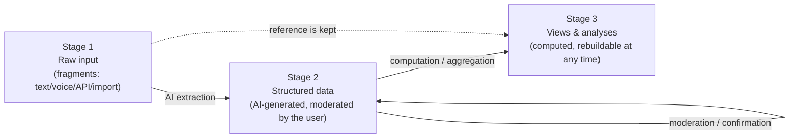
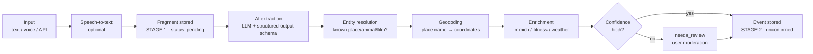
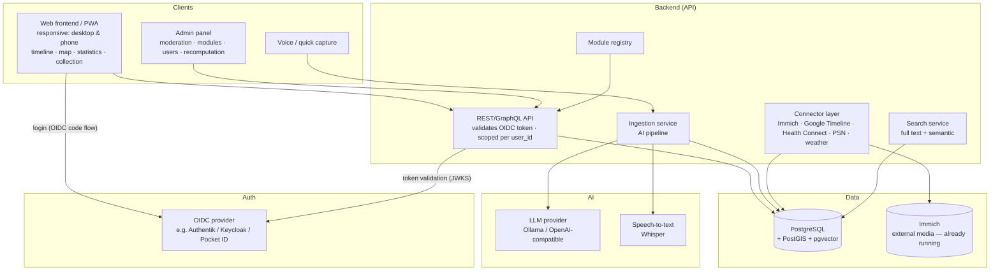

# Life-Dash — concept & MVP

> **Status:** In operation — P0 & P1 done, D1 live on the server, P2.2–P2.7 implemented (see ch. 14)
> **Document type:** architecture & product concept
> **Target environment:** self-hosted (Docker-based)
> **Last updated:** 2026-07-20

---

## 1. Vision

**Life-Dash is a searchable, analysable and visually explorable database about your own life.**

The goal is to bring scattered life data (memories, places, photos, fitness data, events) together into one central, structured database and make it tangible through several views: a timeline, a map, statistics and a collection.

The decisive difference to classic journaling apps: **capture is low-friction, via free text or voice. An AI structures, locates, dates and links the fragments automatically.**

### Guiding principles

| Principle | Meaning |
|---|---|
| **Capture first, structure later** | Entering data must be frictionless. Structure comes from the AI, not from mandatory forms. |
| **Three-stage model** | Raw input (stage 1) → moderated structure (stage 2) → computed views (stage 3). Every stage is derived reproducibly from the previous one. |
| **Raw data is the truth** | Everything always refers back to the unchanged raw input. Structure and views can be recomputed at any time (e.g. with better models). |
| **Everything configurable** | An admin panel allows adjusting modules, prompts, models, enrichment sources and views — without code changes. |
| **Modular and extensible** | New trackable categories (e.g. “concerts”, “books”, “illnesses”) without rebuilding code. |
| **Self-hosted & data sovereignty** | All data stays on your own machine. External AI only optionally and interchangeably. |
| **Confirmed vs. unconfirmed** | Concrete dates are preferred. AI-derived values are marked “unconfirmed” until the user moderates them. |
| **One data model, many views** | Timeline, map, statistics and collection are only computed projections (stage 3) of the same data. |
| **Mobile first** | Capture happens on the go. The UI is a responsive PWA; quick capture, timeline and map are built for a phone just as much as for a desktop. |
| **Multi-user from the start** | Every row in stages 1–3 belongs to a user (`user_id`). Sign-in via **OIDC** (SSO). Retrofitting auth is expensive — so it is anchored in the data model from P0 on. |

### How this software was built (note 52)

**The entire implementation of Life-Dash was written by Anthropic's Claude models — Fable and Opus — working from this concept under the author's direction.** The author sets the direction, decides the architecture, reviews the result and runs it in daily use; the code itself is machine-written. This is stated openly rather than buried, because anyone hosting a database of their own life deserves to know how the thing was made. Two consequences worth naming: the concept document is unusually detailed *because* it is the primary instruction to the machine, and every decision in chapter 15 is recorded with its reasoning so that neither the author nor a later model has to guess.

### 1.1 Where Life-Dash sits (market position, note 53)

The self-hosted field splits into five camps, and all five leave out the same thing:

| Camp | Representatives | What they do well | What is missing |
|---|---|---|---|
| Location history | **Dawarich**, **Reitti**, Traccar, OwnTracks | mature, live tracking, imports everything | places only — no life around them |
| Photos | **Immich**, PhotoPrism | media with time and geo | the timeline is a file list, not a record of events |
| Journals | **Memos**, **Journiv**, Standard Notes, Day One | text, mood, fast capture | text stays text: no structure, no map, no statistics |
| Quantified self | **Heedy**, qs_ledger, Grafana + InfluxDB, Exist.io (SaaS) | metrics and dashboards | numbers without a narrative, no free-text entry point |
| Unified timelines | **Timelinize**, **HPI/Promnesia**, **Dogsheep/Datasette** | conceptually the closest relatives | Timelinize has been “not release-worthy” for years; HPI and Dogsheep are Python libraries for developers — no product, no moderation, no interface |

**The gap Life-Dash actually fills, in four points — the last one is the strongest:**

1. **Free text and speech become structured events via an LLM.** Nothing in the self-hosted space does this. Journals store text; aggregators import APIs. The pipeline *fragment → proposal → confirmed*, with a moderation queue in between, is the genuinely new part.
2. **A human-curated layer of truth.** Timelinize, HPI and Dogsheep pour machine data into one pot. The invariant “machines never change what is confirmed, enrichment is additive only” (ch. 3.1) exists nowhere else.
3. **Retroactive enrichment of manual memories** — weather attached to a holiday from 2002. Aggregators can only enrich what they imported themselves.
4. **Life-Dash covers the pre-digital life.** Every competing product begins where the data exports begin, roughly 2012. Here, “summer 2002, holiday in France” is a first-class record with `season` precision. This is the one property that cannot be copied without adopting the whole architecture, and it is the headline claim: *your memories, including the ones from before the smartphone — as a searchable database.*

**Honest weaknesses.** Against Dawarich and Reitti the map cannot win — the answer is to import from them, not to compete (P2.11). And the LLM dependency is the barrier to entry: unless the local/Ollama path is first-class and clearly documented, the very audience that takes “self-hosted” seriously will bounce.

---

## 2. Glossary & core concepts

| Term | Definition |
|---|---|
| **Event** | The central entity. Something that happened at a point or span of time in a place. “Holiday in France”, “saw an eagle in Detmold”. |
| **Entity (collection item)** | A recurring “thing” in your life: an animal, a film, a country, a game. Events reference entities. |
| **Fragment** | Raw, unstructured input (text/voice/API) before the AI has processed it. **Stage 1 — the immutable source of truth.** |
| **Trackable / module** | A registered type you can track (e.g. `movie`, `animal`, `trip`). Defines schema, icons, statistics. |
| **Fuzzy date** | A date with a precision level (`exact`, `day`, `month`, `season`, `year`, `decade`) plus a time span. Concrete times are preferred; vagueness is the exception. |
| **Confirmed status** | Marks whether a structured value has been moderated/confirmed by the user (`confirmed`) or is AI-derived (`unconfirmed`). |
| **Source** | Where a record came from: `manual`, `ai`, `immich`, `google_timeline`, `health_connect`, `psn`, `weather`, `api`. |
| **Track (route)** | A recorded movement path (LineString) from Google Timeline or fitness workouts. Stage-3 data, drawn on the map as a line layer. |
| **User** | A signed-in user (OIDC identity). All fragments, events, entities and enrichments are user-scoped. |
| **Enrichment** | Automatic augmentation of an event with photos, fitness data, weather etc. based on time and place — also **retroactively** (re-enrichment). |
| **Admin panel** | The central configuration surface: modules, AI prompts/models, enrichment sources, view rules, recomputation. |

---

## 3. Three-stage architecture (core principle)

The whole system is built as a **pipeline of three clearly separated stages**. Every stage is derived **reproducibly** from the previous one. Nothing “computed” is ever the source of truth — it can be discarded and regenerated at any time (e.g. with a better AI model).



### Stage 1 — raw input (immutable)
- Every input is stored **losslessly and unchanged** as a `Fragment` (original text, audio, imported raw data).
- It is **never overwritten**. All later stages keep a back-reference to their originating fragment.
- Consequence: the entire system can be rebuilt “from zero” out of the raw data at any time.

### Stage 2 — structured database (moderated)
- From stage 1 the AI generates structured `Event` and `Entity` records (date, place, category, linked items).
- Every derived value carries a **`confirmed` status**: `unconfirmed` (AI proposal) or `confirmed` (moderated by the user).
- The user moderates in the review/admin panel: confirm, correct, discard, merge.
- Manual corrections are “sticky”: repeated AI processing must **not** overwrite confirmed values.

### Stage 3 — views & analyses (computed, rebuildable)
- Timeline, map, statistics and collection are **computed projections** of stage 2.
- They additionally contain AI enrichments (photos, fitness, weather) and aggregations (statistics widgets).
- **Fully recomputable** — at the push of a button in the admin panel, e.g. after a model change, new enrichment sources or module updates.

### Why this separation?
| Benefit | Explanation |
|---|---|
| **Reproducibility** | Better models → simply recompute stages 2/3, the raw data stays. |
| **Trust** | A clear separation between “what I said” (S1), “what the AI made of it” (S2) and “how it is presented” (S3). |
| **Safety** | No silent data corruption: raw input is always the fallback. |
| **Moderation** | The user has full control over stage 2 without losing the raw data. |

### 3.1 Refinement: four layers (decision 2026-07-15)

“Stage 2” conceptually mixes two things that must be thought of separately. Conceptually the system consists of **four layers** (over the same tables — the `confirmed` status is the dividing line, no DB rebuild needed):

| Layer | What | Lifetime |
|---|---|---|
| **1 · Inbox** | Raw fragments (text, voice, import summaries). | Immutable, permanent. An evidence archive. |
| **2 · Proposal space** | Unconfirmed AI derivations (`confirmed = unconfirmed`). *Claims, not truth.* | Disposable — discarded and regenerated on recomputation. |
| **3 · Life database** | Confirmed events/entities/locations (`confirmed`) **plus factual enrichments**: weather, media references, tracks. Facts do not change — once fetched, true forever. | **Fixed.** The actual goal of the system. |
| **4 · Derived** | Views, statistics, aggregations, **embeddings** (model-dependent). | Disposable and recomputable at any time; no backup needed. |

**The hard invariant:** *confirmed data is never changed by machines, only extended additively (metrics, media references).* Recomputation touches layers 2 and 4 exclusively. Confirming is the transition 2 → 3 (same row, the status flips); `field_overrides` additionally protects individual manually corrected fields.
*Documented exception:* “resolve place names” replaces generated coordinate titles (“Visit: place (53.49…)”) even on confirmed imported visits — that is a user-initiated data improvement, not an AI re-evaluation; manually renamed titles stay protected.

**Linking & deletability:** every layer-2/3 row references its inbox fragment (`origin_fragment_id`, n:1 — one fragment can produce several events). The proposal space cleans itself up (confirming converts, discarding deletes). The **inbox is deliberately not deleted**, even when everything is confirmed: it costs almost nothing (text), is the provenance record of the life database and the only source for later re-extraction or comparison. At most a manual cleanup of *orphaned* fragments (all events discarded) is legitimate — never automatic.

---

## 4. User scenarios (user stories)

### Capture
- *As a user* I open Life-Dash on my **phone** (installed PWA), type two sentences into quick capture while out and about, and I am done — I moderate later on the desktop.
- *As a user* I type “12/07/2026 was in Detmold and saw an eagle”, so that the AI creates an event with a date, a place (Detmold) and an animal sighting (eagle).
- *As a user* I dictate “summer 2002 holiday in France”, so that an event appears with a date (summer 2002, marked `unconfirmed`), a place (France) and the category “trip”.
- *As a user* I moderate AI proposals: I see which values are `unconfirmed` and confirm or correct them before they count as fact.
- *As a user* I want a follow-up question or preview for ambiguous input before the record is accepted.
- *As a user* I write a **formatted journal entry** (Markdown) for a travel day — as a daily summary above the individual events, so that Life-Dash also works as a travel diary in my own voice (→ package F1). The AI never touches this text.
- *As a user* I type “just saw a kingfisher” while out and **optionally take my phone location** as the place at the push of a button — without typing, but never automatically (→ package F2).

### Views
- *As a user* I zoom the timeline from decade level down to day level to see event density and detail.
- *As a user* I see all the places I have been on a map, filtered by time range.
- *As a user* I open the statistics tab and see “how many countries have I been to?”, “how many km did I run in 2025?”, “which animals have I seen?”.
- *As a user* I open the animal “eagle” in the collection and see all sightings, photos and places linked to it.

### Enrichment & import
- *As a user* the system automatically links Immich photos from 12/07/2026 to the Detmold event (Immich already runs as a service).
- *As a user* I import my **Google Timeline export** from my phone and see visited places as events and my **routes** as lines on the map.
- *As a user* I import my **Health Connect data** (steps, heart rate, workouts) and see steps and heart rate for a hike.
- *As a user* I import my **PSN game history** (games played, trophies, play time) and see under “games” in the collection when I played what.
- *As a user* I see the **weather** for that day and place on every located event (enriched automatically).
- *As a user* I enrich **retroactively**: if I import new photos, fitness or weather data later, existing events are updated automatically (re-enrichment).

### Account & access
- *As a user* I sign in via **SSO (OIDC)** — the same sign-in as for my other services.
- *As a user* I see only my own data; other users (e.g. family members) keep their own, separate life database.

### Search
- *As a user* I search “all the times I was by the sea” and get semantically matching events, not just full-text hits.

---

## 5. Feature areas (views)

### 5.1 Timeline
The central view. A horizontal or vertical line with continuous zoom.

- **Zoom levels:** day → week → month → year → decade.
- **Aggregation:** at high levels events are condensed into “heat” clusters (event density, category colours).
- **Vague events** (e.g. “summer 2002”) are drawn as bars/spans rather than points, and marked `unconfirmed`.
- **Filters:** by category, place, source, day, confirmed status.
- **Interaction:** click an event → detail panel with photos, place, weather, linked entities.

### 5.2 Map
- All located events as markers / clusters / heatmap.
- **Time slider**, synchronised with the timeline.
- Layers: **routes (tracks)** from Google Timeline and workouts as a line layer, trips, individual places, homes, “special moments”.
- Data sources: manual places, Google Timeline import (visits **and** routes), geo tags from Immich photos, GPS tracks from fitness workouts.

### 5.3 Statistics
A configurable dashboard of “widgets”. Every module can contribute its own statistics. The widgets are **computed stage-3 projections** and recomputable at any time.

- Examples: country counter, travel kilometres, animal species seen, films per year, fitness trends, “years of life in numbers”.
- Time-range filter, comparison between years.

### 5.4 Collection
Structured collections of entities, grouped by type.

- Tabs/categories: **animals, films, games, countries, places, books, …** (module-driven).
- A detail page per entity: description, metadata, linked events, mini timeline view, photos.
- Example: “eagle” → all sightings, a map of the sighting locations.

### 5.5 Data capture (ingestion)
- Free-text field, voice recording (speech-to-text), API endpoint.
- Every input is first stored losslessly as a **stage-1 fragment**.
- **AI preview:** shows how the AI interpreted the fragment (date, place, entities, category) → the user confirms or corrects (→ stage 2).
- Batch import (e.g. an old diary, chat logs).

### 5.6 Admin panel & moderation
The central control surface for the whole system.

> **Planned split (A14):** “Settings” (every user — moderation, jobs,
> export/import, tracking choice) and “Admin” (admin role only — user
> management, system, raw DB view, logs), each with tabs.

- **Moderation queue:** review, confirm, correct, discard and merge all `unconfirmed` stage-2 records.
- **Module management:** activate/define trackables, schemas, icons, statistics widgets.
- **AI configuration:** choose provider/model, adjust prompts, set confidence thresholds.
- **Enrichment sources:** configure Immich, Google Timeline, fitness, weather and define linking rules.
- **Recomputation:** recompute stage 2 and/or stage 3 selectively or completely (e.g. after a model change) — confirmed values are kept.
- **Raw data inspection:** navigate from any event back to its originating fragment (stage 1).
- **User management:** OIDC provider configuration, user list, roles (`admin` | `user`). Import configuration (Immich API key, PSN token) is stored **per user**.

### 5.7 Mobile use (phone)

The UI is designed **responsive** from the start — not as an afterthought. The most important mobile use case is **capturing on the go**; analysis and moderation happen more on the desktop but must work on mobile too.

- **PWA:** installable on the home screen, app manifest, offline queue for quick capture (fragments are buffered locally and synchronised when a connection returns — matching the stage-1 principle “capture first”).
- **Layout:** desktop = sidebar navigation; mobile = **bottom navigation** (timeline · map · ➕ capture · statistics · collection) with quick capture as the central, prominent button.
- **Timeline on mobile:** scrolls vertically instead of horizontally; the detail panel is a bottom sheet instead of a side panel.
- **Map on mobile:** fullscreen with a time filter that can be shown or hidden; touch gestures (pinch zoom).
- **Voice input** is the most natural channel on mobile (phase 2, Whisper server-side).
- **Share target (later):** share text/photos from other apps directly to Life-Dash → becomes a fragment.

---

## 6. Data model (core)

The heart of the system. Deliberately lean and generic so that modules can dock on without schema migrations.

### 6.1 Entities (conceptual)

```
User                     (identity — via OIDC)
  id
  oidc_subject         (stable `sub` claim from the OIDC token)
  email
  display_name
  role                 (admin | user)
  settings             (JSON: e.g. Immich API key, PSN token, import preferences)
  created_at

Fragment                 (STAGE 1 — immutable)
  id
  user_id              (FK → User; applies equally to Event, Entity,
                        MediaRef, Metric, Track — not repeated there)
  raw_text
  audio_ref            (optional)
  source               (manual | voice | api | import)
  status               (pending | processed | needs_review | discarded)
  created_at
  processed_event_ids  (result of the AI processing)

Event                    (STAGE 2 — structured, moderated)
  id
  title                (AI- or user-generated)
  description
  date_start           (timestamp)
  date_end             (timestamp, optional)
  date_precision       (exact | day | month | season | year | decade)
  location_id          (FK → Location, optional)
  category             (trackable key, e.g. "trip", "sighting")
  confidence           (0..1, how sure the AI is)
  confirmed            (unconfirmed | confirmed)  ← moderated by the user?
  field_overrides      (JSON: which fields were manually confirmed/corrected
                        → protected from re-processing)
  source               (manual | ai | immich | google_timeline | fitness | weather)
  origin_fragment_id   (FK → Fragment, stage-1 back-reference)
  embedding            (vector for semantic search)
  created_at / updated_at

Entity            (collection item, STAGE 2)
  id
  type              (animal | movie | game | country | place | book | ...)
  name
  attributes        (JSON, schema depends on the module)
  confirmed         (unconfirmed | confirmed)
  embedding
  created_at

EventEntityLink   (n:m between Event and Entity)
  event_id
  entity_id
  role              (subject | location | mentioned)

Location
  id
  name
  geo               (PostGIS point/polygon)
  type              (city | country | poi | home)
  external_ref      (e.g. OSM ID)

MediaRef          (STAGE 3 — enrichment; a reference to external media, NOT a copy)
  id
  event_id
  provider          (immich | local | url)
  external_id       (e.g. Immich asset ID)
  captured_at
  geo               (optional, for automatic linking)

Metric            (STAGE 3 — enrichment; generic figures: fitness, weather)
  id
  event_id
  key               (steps | heart_rate_avg | distance_km |
                     temperature_c | weather_condition |
                     play_minutes | trophies_earned | ...)
  value
  unit
  source            (health_connect | weather | psn | ...)
  enriched_at       (when enriched → enables re-enrichment)

Track             (STAGE 3 — route; from Google Timeline / workouts)
  id
  date_start / date_end
  geo               (PostGIS LineString, simplified/compressed
                     e.g. via Douglas-Peucker)
  activity_type     (walk | drive | cycle | run | transit | unknown)
  distance_m
  source            (google_timeline | health_connect)
  event_id          (optional, FK → Event — e.g. a hike)
  origin_fragment_id (FK → Fragment, raw import back-reference)
```

### 6.2 Design decisions

- **Three-stage provenance anchored in the model:** `Fragment` = stage 1, `Event`/`Entity` = stage 2, `MediaRef`/`Metric` = stage 3. Every stage-2/3 row references back to stage 1.
- **`confirmed` + `field_overrides`:** separating an AI proposal (`unconfirmed`) from a moderated fact (`confirmed`). `field_overrides` protects individual, manually corrected fields from being overwritten during recomputation.
- **Concrete dates preferred:** `date_precision` allows vagueness (“summer 2002” → `season`), but vague or derived dates stay `unconfirmed` until the user confirms them. The goal is to hold dates that are as concrete and confirmed as possible.
- **Event ↔ Entity as n:m:** one event can reference several animals/items; one entity appears in many events. This is the basis for the collection **and** the statistics. (People are deliberately left out for now — see ch. 8.3.)
- **`attributes` as JSON:** module-specific fields (e.g. film rating, animal species) live in a flexible JSON field with a schema defined by the module (JSON-Schema validation). No DB rebuild for new modules.
- **Embeddings for semantic search:** events and entities get vector embeddings (pgvector) → “all the times by the sea” also finds “beach day in Italy”.
- **Media and metrics are stage 3:** referenced, not copied (Immich stays the single source of truth). `enriched_at` enables **retroactive re-enrichment** without changing stage 2.
- **`user_id` everywhere, strict tenant separation:** every stage-1/2/3 row belongs to exactly one user. The API **always** filters by the signed-in user — there are no shared events/entities (deliberately kept simple; “sharing” would be a later feature). Locations are user-scoped too for now.
- **Tracks separate from events:** a route is not an event (not an “experience”) but context. Raw timeline/GPS data is kept as a fragment (S1); `Track` is the computed, simplified geometry (S3) — regenerable with better simplification algorithms.

---

## 7. AI pipeline (ingestion)

The path from fragment (stage 1) to moderated event (stage 2) to enriched view (stage 3).



### 7.1 Steps in detail

1. **Capture (stage 1):** the fragment is stored raw immediately (never lose data, works offline too).
2. **Speech-to-text** (optional): e.g. `whisper` locally.
3. **Structured extraction (stage 2):** the LLM receives the fragment plus a **structured output schema** (function calling / JSON schema). Output: title, date (span) + precision, places, recognised entities with type, category, confidence. All values are `unconfirmed` at first.
4. **Entity resolution:** matching recognised names against existing entities (“eagle” → existing animal entity? “France” → country?). Fuzzy matching plus embedding similarity. New entities are created as candidates.
5. **Geocoding:** place names → coordinates (a local Nominatim/OSM service, no external dependency needed).
6. **Enrichment (stage 3):** based on time and place, Immich photos, fitness metrics and **weather data** are linked. Also runs **retroactively** as a re-enrichment job when new source data arrives.
7. **Review gate:** on low confidence or ambiguity → `needs_review`. The user moderates and sets values to `confirmed`.
8. **Recomputation:** stages 2 and 3 are reproducible from stage 1 at any time (e.g. with a new model) — `confirmed` values stay protected.

### 7.2 Interchangeable AI provider

The AI is encapsulated behind a **provider interface**:

```
LLMProvider (interface)
  extract_structured(fragment, schema) -> StructuredResult
  embed(text) -> vector

Implementations:
  - OllamaProvider   (local, e.g. Llama/Mistral)
  - OpenAIProvider   (any OpenAI-compatible endpoint)
  - AnthropicProvider
```

This keeps data sovereignty intact and lets you pick different models per task (extraction vs. embedding).

---

## 8. Modularity / extensibility

The central non-functional goal: **track something new without touching the core.**

### 8.1 Module concept (“trackable”)

A module registers a new type declaratively:

```yaml
# module: animals
key: animal
label: Animals
icon: paw
entity_schema:            # JSON schema for Entity.attributes
  species: string
  wild: boolean
  first_seen: date
event_categories:
  - sighting              # "saw an eagle"
statistics:
  - id: species_count
    label: "Species observed"
    type: count_distinct
    field: entity.species
  - id: sightings_per_year
    label: "Sightings per year"
    type: timeseries
compendium_view:
  group_by: species
  detail_map: true        # shows sighting locations on a map
```

### 8.2 What a module can contribute

| Area | The module's contribution |
|---|---|
| **Data model** | JSON schema for `Entity.attributes` (validated, but no DB migration). |
| **Ingestion** | Hints/prompts for how the AI recognises this type. |
| **Statistics** | Declarative widgets (count, timeseries, distinct, sum). |
| **Collection** | Grouping, detail view, map option. |
| **UI** | Icon, label, colour. |
| **Achievements** | Metric plus four thresholds (bronze/silver/gold/platinum), see F6. |

### 8.3 Example modules (starter set)

**Implemented:** `trip` · `animal` · `country` · `artist` (artists/concerts) · `food` (meals) · `milestone` (weddings, births, moving, graduation …) · `movie` · `game` · `book`.
**Planned:** `place` · `sport_activity` · `health_event`.

> Lesson from implementation: a new category touches **three places** — the module YAML (backend), rules/examples in the AI prompt and the frontend (label, colour, collection tab, form options). The declarative goal of “YAML only” is not fully reached yet (see ch. 15, question 3).

> **People deliberately left out (for now):** a `person` module is conceptually appealing but too complex to maintain (duplicates, relationships, third-party privacy, constant assignment decisions). The focus is first on **concrete, confirmable facts** (time, place, item). The n:m data model stays laid out so that people can be added later as another module without a rebuild.

---

## 9. Integrations

| Source | Purpose | Approach |
|---|---|---|
| **Immich** | Photos & videos, geo tags, timestamps | **Already running as a service** → the first integration to implement. Immich API (`/api/search/metadata`: query assets by time range/geo), auth via API key (per user in `User.settings`). Linked via `MediaRef` — **references only, no copies**; thumbnails are passed through from Immich by a backend proxy. |
| **Google Timeline** | Visited places **and routes** | ⚠️ Since 2024 the timeline lives **on the device only** (Takeout “Semantic Location History” is gone). Import via the **device export**: Android → Settings → Location → Timeline → “Export timeline” (JSON, `semanticSegments`). File upload in the UI → stored raw as a fragment (S1) → `visit` segments become events/locations, `activity`/`timelinePath` segments become `Track`s (S3). No live access possible, so a recurring manual upload. |
| **Google Health / Health Connect** | Steps, distance, HR, workouts (incl. GPS) | ⚠️ The Google Fit REST API was shut down (2025); its successor **Health Connect** stores **on-device only**, without a cloud API. Import therefore happens by file: a Health Connect export (ZIP) or a sync app, alternatively a direct Garmin/Fitbit export. Daily values and workouts → `Metric` on events; workout GPS → `Track`. |
| **PSN (PlayStation Network)** | Games played, trophies, play time | No official public API. Approach: an unofficial API via an **NPSSO token** (e.g. the Python library `psnawp`) — a token per user in `User.settings`. Periodic sync: titles → `game` entities, sessions/“last played” → events, trophies and play time → `Metric`. Fallback: the pure trophy history (a timestamp per trophy) as an event source. Risk: an unofficial API can break → keep the connector isolated and store sync results as fragments (S1). |
| **Weather** | Context enrichment (temperature, conditions) | A historical weather API (Open-Meteo daily archive) based on time and place. Attached as a `Metric` to located events — retroactively too. |
| **Geocoding** | Place name ↔ coordinates | Nominatim (OSM) or any compatible service, self-hostable. |

**Integration principle:** every source is a **connector** with a uniform interface (`fetch`, `map_to_events`, `enrich`). New sources dock on without core changes. All connector results are **stage-3 enrichments** and recomputable at any time.

**Two kinds of connector:**
- **Pull connectors** (Immich, PSN, weather): the backend queries the source actively/periodically.
- **Upload connectors** (Google Timeline, Health Connect): the user uploads export files — a mobile-friendly upload flow in the UI (shareable directly from a phone). Raw files are archived as fragments (S1) so that re-processing stays possible.

**Duplicate protection on re-import:** imports are **idempotent** — every imported record carries a stable `external_id` key (Immich asset ID, timeline segment hash, PSN trophy ID), so repeated uploads/syncs create no duplicates.

---

## 10. Technical architecture



### Layers

- **Frontend:** views as stage-3 projections of the same API. State sync between timeline and map through a shared time-range filter. A **responsive PWA** — one codebase for desktop and phone (sidebar ↔ bottom navigation, panels ↔ bottom sheets).
- **Auth:** OIDC authorization code flow (PKCE) in the frontend; the backend validates tokens against the provider's JWKS endpoint and creates the `User` record automatically on first login (JIT provisioning via the `sub` claim).
- **Admin panel:** its own surface for moderation (stage 2), module/AI configuration, user management and recomputation.
- **API:** thin, authorising, delegating to services. Every query is scoped by `user_id`.
- **Ingestion service:** orchestrates the AI pipeline (ch. 7). Asynchronous (queue) for batch imports and re-enrichment.
- **Module registry:** loads module definitions, provides schemas and statistics.
- **Connector layer:** encapsulates external sources (including weather).
- **Storage:** one PostgreSQL with PostGIS (geo) and pgvector (embeddings) covers relational, geographic and semantic needs in **one** database — ideal for self-hosting.

---

## 11. Recommended tech stack

| Layer | Recommendation | Rationale |
|---|---|---|
| **Backend** | Python + **FastAPI** | Fits the existing Python environment; excellent for AI integration; async. |
| **DB** | **PostgreSQL** + **PostGIS** + **pgvector** | One database for relational, geo and semantic. Fewer moving parts. |
| **ORM/migration** | SQLAlchemy + Alembic | Established, migration-safe. |
| **Queue** | Redis / RQ (or DB-based to start) | Asynchronous ingestion and batch import. |
| **AI (LLM)** | Any **OpenAI-compatible endpoint**, provider-abstracted | Data sovereignty when run locally; interchangeable with cloud vendors. |
| **STT** | **Whisper** (local) | Voice input without the cloud. |
| **Geocoding** | **Nominatim** (public or self-hosted) | No mandatory external dependency. |
| **Auth** | **OIDC** — any standards-compliant provider (Authentik, Keycloak, Pocket ID, Zitadel …); backend: `python-jose`/`authlib` for token validation | SSO across all your services; Life-Dash manages no passwords. |
| **Frontend** | A **responsive PWA** + map library (MapLibre/Leaflet) + timeline rendering | A rich interactive UI; one codebase for desktop and phone; installable, offline capture. |
| **PSN connector** | `psnawp` (Python, NPSSO token) | The most established unofficial PSN library; isolated in the connector layer. |
| **Deployment** | **Docker Compose** | The self-hosting standard; reproducible. Immich runs separately — only a URL and API key are needed. |

> Deliberately **one** database rather than a separate vector store or geo store, to keep operational complexity low.

---

## 12. Security & privacy

- **Self-hosted only:** no data leaves by default. External AI providers are opt-in and clearly marked.
- **Auth: multi-user via OIDC from the start.** Life-Dash stores no passwords; sign-in goes through your OIDC provider (SSO). Every user has a strictly separate data set (`user_id` scoping in every query); roles: `admin` (system configuration) and `user`.
- **User secrets:** per-user connection data (Immich API key, PSN NPSSO token) is stored encrypted in `User.settings` and never delivered to the frontend.
- **Sensitive data:** life data is highly sensitive → encrypted backups, the DB never publicly exposed (only via a reverse proxy/VPN). Movement profiles (tracks) and health data (metrics) are the most sensitive categories — export and deletion must cover them completely.
- **AI transparency:** AI-derived statements are recognisable as such through `confidence`, `source` and `confirmed`; the moderation/review gate prevents silently wrong data.
- **Raw data as a fallback:** because stage 1 is immutable, faulty AI processing can be discarded and recomputed safely at any time.
- **Data control:** a full export (raw plus structured) and deletion are possible at any time.

---

## 13. MVP definition

The goal of the MVP: **the core loop across all three stages works** — enter a fragment (S1) → the AI structures it and the user moderates (S2) → see it on the timeline and map and search it (S3).

### 13.1 MVP scope (in)

| Area | MVP scope |
|---|---|
| **Three-stage foundation** | `Fragment` (S1) immutable → `Event`/`Entity` (S2) with a `confirmed` status → views (S3) recomputable. |
| **Data capture** | Free-text input plus an AI preview with confirmation/correction. (Voice: phase 2.) |
| **AI pipeline** | Extraction (date + precision, place, category, simple entities), geocoding, confidence plus review gate. |
| **Data model** | `Fragment`, `Event`, `Entity`, `EventEntityLink`, `Location` including `confirmed`/`field_overrides`. |
| **Moderation / admin** | A simple moderation panel: review, confirm and correct `unconfirmed` records; trigger recomputation. |
| **Timeline** | Zoom year → month → day; events as points/spans; click for detail; `unconfirmed` visibly marked. |
| **Map** | Located events as markers plus a time-range filter. |
| **Search** | Full text plus semantic search (embeddings). |
| **Collection** | The **animals** type as proof of modularity. |
| **Modules** | A module registry with 2–3 fixed modules (`trip`, `animal`, `country`). |
| **Auth & multi-user** | OIDC login plus `user_id` in all tables plus JIT provisioning. No user management UI in the MVP — users appear by logging in. |
| **Responsive base layout** | A mobile-capable layout (bottom navigation, quick capture) from the start; PWA manifest. Offline queue: phase 2. |
| **Deployment** | Docker Compose (app + Postgres + AI endpoint). |

### 13.2 Deliberately NOT in the MVP (out)

- Voice input / Whisper, offline capture queue (though the PWA foundation is laid)
- Immich, Google Timeline, Health Connect, PSN and weather integration (though the data model and stage-3 concept are prepared)
- Statistics dashboard (only rudimentary counters)
- A people module (deliberately left out)
- A complete module set, decade aggregation
- User management UI, sharing between users (OIDC login and data separation *are* in the MVP)

### 13.3 Definition of done (MVP)

1. I type “12/07/2026 was in Detmold and saw an eagle” → see an AI preview (stage 2, `unconfirmed`) → confirm it (→ `confirmed`).
2. The event appears correctly dated on the timeline **and** as a marker in Detmold on the map.
3. “Summer 2002 holiday in France” is stored as a span (summer 2002, `season`, `unconfirmed`) with the place France.
4. “Eagle” (animal) appears in the collection together with the sighting.
5. I can search for “France” and find the event (full text plus semantic).
6. In the admin panel I can delete the stage-2/3 data and **recompute it from the raw data** — confirmed values are kept.
7. I sign in via OIDC; a second user signs in and sees **none** of my data.
8. On a phone I can capture a fragment via the bottom navigation and read the timeline without scrolling horizontally.

---

## 14. Roadmap & implementation status

### 14.1 What already works

**P0 + P1 complete, D1 (deployment) live**, plus P2.2–P2.7:

| Area | Implemented |
|---|---|
| **Foundation** | Three-stage data model with `user_id`, `confirmed`, `field_overrides`; fragment→event pipeline; mini migration (`migrate.py`). |
| **Deployment (D1, live)** | Running in production: ARM64 single-board server, multi-arch image from GHCR (GitHub Actions), a reverse proxy in front, OIDC live (`AUTH_MODE=oidc`), PostgreSQL 18 as the Compose default, all data as bind mounts next to the Compose file (`./db`, `./data`), runbook in docs/DEPLOY.md. |
| **Auth** | OIDC (code flow + PKCE), JIT provisioning, first user = admin plus legacy data adoption, dev mode for local development. Runs live behind the reverse proxy. |
| **AI** | Provider abstraction (mock / OpenAI-compatible); a worked-out prompt with few-shot examples; retry with backoff; quota protection (a batch stops cleanly, capture-first fallback on single ingest). |
| **Views** | Timeline (zoom day→decade, category filter); map (modes day→all, category filter, calendar jump, daily routes); statistics (12 tiles including age/moves/hottest/coldest day, 4 charts); collection (counters, detail page with map and **Wikipedia description** via a Wikidata concept lookup). |
| **Capture & moderation** | AI preview with correction; **manual capture** (form, confirmed immediately); an **edit dialog** on every event card (including place→geocoding down to house number, comment field); moderation queue; confirming pulls linked entities along. |
| **Stage 3** | Weather enrichment (Open-Meteo, on demand + force); embeddings plus hybrid search (full text + semantic); admin actions with descriptions. |
| **Data control** | **Export/import** (JSON, idempotent, per user) = backup/restore/migration; “delete all data” with a double confirmation. |
| **Life-database tools** | **P2.5** bulk confirm with filters (category/source/confidence/time range) plus a mandatory preview; **P2.6** invariant tests “confirmed data is untouchable” (`backend/tests/`, pytest, offline); **P2.7** confirmation provenance `confirmed_at`/`confirmed_by` (manual/bulk/import) including a migration for existing data, visible in the edit dialog; **P2.4** automatic weather right after capture/AI analysis, weather follow-up when the user corrects time or place. |
| **UX & operations (A1–A3, v0.6.0)** | Toasts plus a confirmation modal in the app's own style instead of native browser popups (all ~20 places, including a typed confirmation for the data wipe); progress bars for timeline/JSON import (staged import, idempotent, `auto_resolve` parameter); version number from `backend/app/version.py` in the sidebar, `/health` and OpenAPI. |
| **Use & operations (v0.7.0)** | **A8** export feedback (a toast with content/size/filename); **A9** central logging (`lifedash.*`, `LOG_LEVEL`, log rotation in Compose, admin/import/geocoding/weather logs); **A10** place-name language fallback plus `namedetails` plus the admin action “transliterate foreign-script names” (`scope=nonlatin`); **A13** times visible for `exact` (“12/07/2026, 14:30–16:05”) plus time fields in the edit dialog (fix: a silent `exact`→`day` downgrade); **A5 map part** marker clustering — all points instead of a 300 cap (the numbered route up to 300 stops remains). |
| **Location, weather & countries (v0.14.0)** | **F2** a 📍 button in AI analysis (coordinates into the fragment, a place suggestion only when the text names no place) and in manual capture (address into the place field, `/api/ingest/reverse-location`). **F3** *(user decision: pure daily values)*: `temp_min_c`/`temp_max_c`, `sunshine_h`, `rain_mm`, `snow_cm`, `wind_max_kmh` plus the daily condition; the UI bundles it all into one line; statistics tiles for sunniest/wettest/windiest/snowiest day, hot/cold uses the real max/min; existing data stays untouched. **F4** country from addressdetails → `Location.country` plus a `country` entity linked to all events at that place (idempotent), applied during place resolution, forward geocoding and location capture; retroactively via the resolution runs. |
| **Modules, tracking & background jobs (v0.13.0)** | **A7** modules fully declarative: label/colour/emoji/collection/forms/AI rules from the YAML (`/api/modules` + `prompt_rules` → a dynamic system prompt); the new modules movie/game/book as proof (one file each). **A15** tracking choice: an onboarding modal on first start plus a setting in the admin area; hides UI and filters the AI prompt (`tracked_modules`). **A22** server jobs: worker threads for weather/embeddings/place names/recomputation (running without an open browser), a stop button plus a 4-second auto refresh in the jobs tab, a nightly schedule per type and user (`job_schedule`, a minute ticker in main.py). **This completes group A.** |
| **Polish & mobile (v0.12.0; 0.11.0 skipped)** | **A20** mobile fixes: the map tab showed nothing on a phone (a CSS flex collapse to height 0), search failed silently (now a local text-search fallback plus a hint). **A19** the “searched address” label was abolished (new imports stay unnamed → a plain address; a startup migration cleans up existing names/titles). **A21** export selection (“without Google Timeline data”, `exclude_source`). **A23** plain language in the UI: raw inbox/proposals/life database/views instead of “stage 1/2/3”. From here on the changelog is written in product language without package codes (note 39); the AGPL-3.0 license took effect with this release. |
| **Admin & logs (v0.10.0)** | **A14** “Settings” with tabs: moderation / my data / jobs (all users) plus system / users / database / logs (admin only) — implemented as one page with role-gated tabs rather than two separate areas (this meets the goal: users see only their own tools). **A17** log view: an admin tab “logs” with a ring buffer (the last 500 lines, level filter, `GET /api/admin/logs`). |
| **Operations & robustness (v0.9.0)** | **A11** jobs with a lock: long runners (weather, recomputation, embeddings, place names, imports) registered as jobs (`/api/jobs`), one lock per type (409 “already running” instead of a double run), a jobs table in the admin area, stale cleanup after 3 minutes without a heartbeat; DB-side duplicate protection for weather (a partial unique index plus cleanup). **A4** raw view with guard rails: enum/JSON/time validation, follow-up recomputations (title→embedding reset, time/place→weather follow-up) visible in the toast, fragment/user deletion blocked, deleting cleans up dependent rows. **A18** cluster threshold configurable (10–300, default 50, `map_cluster_min`). **A16** (fix) `month` counts as a vague date. API error details now reach the UI. |
| **Use & operations (v0.8.0)** | **A5 remainder** visit condensation: from month view up, the map bundles repeated visits to the same place (“59× home — …”, toggle “🔁 merge places”); the timeline groups identical Google visits within a time group into expandable collective cards. **A12** semantic places (“home”/“work”/“searched address”) are reverse geocoded, the label stays as a prefix (“home — Example Street 1”); existing data via “resolve place names”; an optional import filter for minimum location certainty (`min_probability`). **A6** user management in the admin panel (change roles, delete users including their data; last-admin and self-deletion protection). **Compact place names:** display names are built from selectable building blocks (street/district/city/country, per user via `/api/auth/me/settings`) rather than the full Nominatim chain; POI proper names stay in front; the action “shorten addresses” (`scope=verbose`) reformats existing data. Offline tests for A12/A6/place-name formatting. |
| **World & achievements (v0.18.0)** | **F5** a “world” tab: a choropleth world map (Leaflet plus a bundled GeoJSON, Natural Earth 110m, public domain) plus a per-continent checklist with an expandable list of what is missing; country reference data (`backend/app/data/countries.py`, name → ISO → continent) connects the name-only `country` entities to the map shapes and merges aliases. **F6** an “achievements” tab: bronze/silver/gold/platinum, declared in the module YAMLs (metric plus four thresholds), a pure layer-4 derivation counting only confirmed data and respecting the tracked modules. |
| **Print & portability (v0.19.0)** | **F8** a print dialog with a date range, presets and content switches; printing builds a dedicated page containing every event in the range instead of the on-screen view. **A27** the generality audit: `.env.example` is the complete setup reference, Compose no longer forces an AI key or hardwires vendor defaults, README/backend README/DEPLOY rewritten for portability. |
| **Bilingual (v0.20.0)** | **F10** the interface can be switched between German and English (a catalog mechanism where German stays the source of truth), the language is stored per device and on the account, and place-name lookups follow it (`Accept-Language`, the remainder of A25). Documentation switched to English. |
| **Modules** | trip, animal, country, artist (concerts), food (meals), milestone (life events), movie, game, book. |

### 14.2 Roadmap

**Principle:** two groups — **A: necessary/sensible for general use** (operations, usability, data safety) and **B: new features**. **The focus is on group A**; features from B come afterwards or as a deliberate exception in between.

Effort: S = hours · M = ~1 day · L = several days. No package blocks another except where noted.

**Already done** (details in 14.1): D1 deployment · P2.2 timeline import · P2.3 vague-date review · P2.4 auto enrichment · P2.5 bulk confirm · P2.6 invariant test · P2.7 confirmation provenance · **A1–A3 (v0.6.0)** · **A8/A9/A10/A13 plus the A5 map part (v0.7.0)** · **A5 remainder/A12/A6 (v0.8.0)** · **A4/A11/A16/A18 (v0.9.0)** · **A14/A17 (v0.10.0)** · **A19–A21/A23 (v0.12.0)** · **A7/A15/A22 (v0.13.0)** · **F2–F4 (v0.14.0)** · **F1/F7/F9 (v0.15.0)** · **A24–A26 (v0.16.0)** · **F8 first stage (v0.17.0)** · **F5/F6 (v0.18.0)** · **F8 selection dialog/A27 (v0.19.0)** · **F10 (v0.20.0)** · **A28/F14 (v0.21.0)** · **F13 (v0.22.0)** · **F11/F12 (v0.23.0)**.

#### Group A — necessary & sensible for everyday use

**Group A was complete with v0.20.0; the feedback round of 2026-07-20 added
A28.** All other packages are implemented; the detailed record
of what each one changed lives in 14.1 and in [CHANGELOG.md](../CHANGELOG.md),
so the table below keeps one line per package rather than repeating it.

| No. | Package | Done in | Content |
|---|---|---|---|
| **A1–A3** | UI dialogs/toasts instead of browser popups · progress bars for large imports · version number in sidebar and `/health` | v0.6.0 | — |
| **A4** | Guard rails for the raw DB view: enum/JSON/time validation, visible follow-up recomputations, protected fragments/users | v0.9.0 | — |
| **A5** | Decade aggregation & visit condensation (map and timeline), marker clustering instead of a 300 cap | v0.7.0/v0.8.0 | — |
| **A6** | User management UI (roles, deletion, last-admin and self-deletion protection) | v0.8.0 | — |
| **A7** | Full module build-out: label/colour/emoji/forms/AI rules from the module YAML | v0.13.0 | — |
| **A8** | Export feedback (toast with content, size, filename) | v0.7.0 | — |
| **A9** | Central logging (`lifedash.*`, `LOG_LEVEL`, log rotation) | v0.7.0 | — |
| **A10** | Place-name language fallback plus foreign-script resolution | v0.7.0 | — |
| **A11** | Jobs with a lock (`/api/jobs`), one lock per type, stale cleanup | v0.9.0 | — |
| **A12** | Timeline import: semantic places → real addresses, label kept as a prefix | v0.8.0 | — |
| **A13** | Times visible and editable for `exact` precision | v0.7.0 | — |
| **A14** | Admin split into role-gated tabs (moderation/my data/jobs vs. system/users/DB/logs) | v0.10.0 | — |
| **A15** | Tracking choice by the user (onboarding modal plus setting) | v0.13.0 | — |
| **A16** | Fix: month precision counts as a vague date | v0.9.0 | — |
| **A17** | Log view in the UI (ring buffer, level filter) | v0.10.0 | — |
| **A18** | Map clustering only above a configurable threshold (10–300) | v0.9.0 | — |
| **A19** | “Searched address” label abolished, existing data cleaned by migration | v0.12.0 | — |
| **A20** | Mobile fixes: map tab and search | v0.12.0 | — |
| **A21** | Export with a selection (`exclude_source`) | v0.12.0 | — |
| **A22** | Server-side background jobs plus a nightly schedule per type and user | v0.13.0 | — |
| **A23** | Plain language in the UI instead of “stage 1/2/3” | v0.12.0 | — |
| **A24** | Map height coupled to the viewport plus a fullscreen toggle | v0.16.0 | Closed in v0.19.0: “improve generally” held no decision and is no longer kept open. |
| **A25** | One place-name run with a scope selection instead of three buttons | v0.16.0 | The F10 part (`Accept-Language` follows the app language) landed in v0.20.0. |
| **A26** | “My data” tab regrouped into clear blocks | v0.16.0 | — |
| **A27** | Generality audit: `.env.example` as the complete setup reference, no vendor defaults hardwired, portable docs | v0.16.0/v0.19.0 | — |

**Open in group A:**

| No. | Package | Effort | Content | Benefit |
|---|---|---|---|---|
| **A28** | ✅ **One place-name run instead of a scope selection** *(note 50; done v0.21.0)* | S | The scope selection is gone from the UI: one run covers the **deduplicated union** of all three candidate sets, `unnamed` first, and the three scope-specific progress checks became one condition (`_name_defect`). Every place is geocoded **at most once** instead of up to three times. `scope` survives as an optional API parameter so existing job entries and scripts keep working. | — |
| **A29** | **Complete backup including media** *(note 58)* | M | Once F15 exists, the JSON export is no longer a full backup — binary files do not fit in it. This package restores the property that one action saves everything: a **ZIP export** containing the existing JSON plus the media directory in a defined layout (`export.json` + `media/<id>.<ext>`), and — the half that is easy to forget — an **import side that round-trips it**: the archive is read back, files land in `MEDIA_DIR`, `MediaRef` rows are relinked by their stable IDs, and re-importing the same archive changes nothing (idempotent, as with all imports). The plain JSON export **stays** as a second option: fast, small, readable, diffable, and the right choice for anyone who backs up their media folder by other means. The selective export (`exclude_source`, A21) applies unchanged. Written as a **stream**, never assembled in memory — a life's worth of photos is gigabytes, not megabytes. | One button restores everything, on a new machine too. Without it, “self-hosted data sovereignty” has a hole exactly where the irreplaceable data sits. |

#### Group B — new features (order: features first, new import sources LAST — decision 2026-07-19)

| No. | Package | Effort | Content | Benefit |
|---|---|---|---|---|
| **F1** | ✅ **Travel journal (formatted text)** *(done v0.15.0 — a journal category with a day header, Markdown rendered with hand-written sanitising; an AI-suggested daily summary is still open)* | M–L | Expanding the comment idea (the `note` field exists and is never touched by the AI) into real diary entries: **formatted text (Markdown)** instead of a one-line note, longer texts per event; plus a **day level** — one journal entry per day (its own `journal` category with `date_precision=day`, which fits the event model without a schema rebuild), rendered in the timeline as a day header above the individual events. Markdown is rendered sanitised. | The fact collection becomes a real travel diary — memories in your own voice instead of only structured data. |
| **F2** | ✅ **Take the phone location when capturing (optional)** *(done v0.14.0)* | S–M | Offer the current device location via the geolocation API during quick capture (both AI analysis **and** manual entry): a “📍 use my location” button — **never automatic** (location is sensitive, and entries often concern the past or other places). Coordinates → reverse geocoding → a place suggestion in the preview/form field, overwritable by the user; if the text names a place itself, the text wins. The raw coordinates travel into the fragment (S1) so re-processing knows them. Requires HTTPS. | On the go, typing the place is unnecessary — the most common capture case becomes a two-tap entry. |
| **F3** | ✅ **Refine the weather logic** *(done v0.14.0)* | S–M | Previously: `temperature_c` = the mean of the daily max/min, `weather` = the most significant weather code of the day (one hour of morning rain would mask a sunny day). New: `temp_min_c`/`temp_max_c` as their own metrics, the condition derived from hourly data (the dominant weather during the day), optionally precipitation totals/hours. Existing data can be extended additively by re-enrichment. | The weather shown matches how the day felt; more precise statistics. |
| **F4** | ✅ **Imports feed the collection (countries)** *(done v0.14.0)* | M | The timeline import used to create only events and locations — no entities or links, so the country collection and country statistics stayed untouched by imports. New: take the country from the `addressdetails` during (reverse) geocoding, store it on the `Location` and create/link a `country` entity per visited country — as part of place resolution, retroactively via “resolve place names”. | “How many countries have I been to?” is finally correct — fed from real movement data. |
| **F5** | ✅ **World tab: country map & continent checklist** *(note 27; done v0.18.0)* | M | A tab of its own: a **world map with visited countries shaded** (choropleth over Leaflet plus a bundled country GeoJSON, fed from the `country` entities) and **checklists**: continents (7/7?), countries per continent, “most recently new”. Country reference data (`backend/app/data/countries.py`, ISO/German/English/alias → continent) connects the name-only entities to the map shapes and merges aliases; names that match nothing are surfaced instead of silently dropped. | “Where have I been?” at a glance — and it motivates filling the gaps. |
| **F6** | ✅ **Achievements (bronze/silver/gold/platinum)** *(note 28; done v0.18.0)* | M | A tab with achievements in four tiers, **declared in the module YAMLs**: one metric plus thresholds per achievement, e.g. “animal collector” (5/25/100/500 species seen), “globetrotter” (countries), “concert goer”, “gourmet”. Computed from layer 2 (a layer-4 derivation, recomputable at any time, holding no data of its own). Displayed with a progress bar toward the next tier, which measures from the tier reached rather than from zero. Counts confirmed data only and respects the tracked modules (A15). | A playful incentive to record experiences — it makes the life database rewarding. |
| **F7** | ✅ **Multi-day events with day sub-events** *(note 37, decided: “both”; done v0.15.0)* | M–L | A multi-day event (“Mallorca 05–12 July”) stays ONE trip event but gains **linked day events** (parent–child). **The data-model consequence is small:** one new column `Event.parent_event_id` (self FK, nullable) — no new table type. The work is in the behaviour: day children are created for the span at the push of a button (“Mallorca — day 3”, `day` precision, inheriting place and confirmation); **enrichment (weather, later photos) hangs on the children** = per day; the parent shows the day bar aggregated; the timeline shows children collapsed under the parent (day zoom shows them individually); deleting the parent asks whether the children go too; export/import and recomputation protection (`confirmed`) apply unchanged — children are normal life-database events, only with a provenance link. | Every holiday day carries its own weather, photos and notes — without flooding the timeline with duplicates. |
| **F8** | ⏸️ **Print view for selected days** *(note 38; first stage done v0.17.0, selection dialog done v0.19.0)* | M | Pick a range → a print-friendly page (light layout, no navigation): events chronologically with place, weather, notes, later photos; the browser print dialog (PDF). Implemented: a dialog with from/to plus presets, switches for descriptions/notes/imported visits/proposals and a live count; printing builds a dedicated `#print-area` instead of the on-screen view, so collapsed groups no longer matter. **Remainder blocked:** “printing with photos” requires P2.1 (Immich) and waits for that package. | Memories physically: print holiday days or share them as a PDF. |
| **F9** | ✅ **Light mode** *(note 41; done v0.15.0)* | S–M | The app used to be dark only; the colours already live in CSS variables. New: a light theme plus a switch (auto following the system setting, manually overridable, stored per device). The map switches tile style with it. | Readability in daylight; the basis for the print view (F8). |
| **F10** | ✅ **Bilingual: app de/en, docs in English** *(note 42, decided; done v0.20.0)* | M–L | The **app UI** has a German/English switch (a string catalog instead of hard-coded text — the actual work, since all text lives inline; AI prompts are unaffected). German stays the source of truth in the markup, the `I18N_EN` catalog holds English only, and a missing key falls back to German so no label can ever be empty. The language is stored per device and on the account, and drives `Accept-Language` for place-name lookups (this also completes A25). The **docs (README, CHANGELOG, KONZEPT) are switched to English**: a one-off translation, maintained in English from then on. Discussion and input may stay in any language — translation happens when writing. | Reachability for the international self-hosting community (AGPL + English docs = the GitHub standard). |
| **F11** | ✅ **Get more out of the weather already stored** *(note 49; done v0.23.0)* | S–M | Since v0.14.0 every enriched event carries seven daily values (min/max temperature, sunshine hours, rain, snow, max wind, condition) — but only one statistics block reads them. This package is a **pure layer-4 derivation: no API call, no re-enrichment, nothing new stored.** (a) **Aggregations:** rain days per year, total sunshine hours, “warmest trip”, average temperature per country — the latter fits straight into the world tab (F5). (b) **Weather achievements** on the existing F6 infrastructure: “sun worshipper”, “bad-weather defier”, “frostbite” — one new metric function plus YAML thresholds, no new data. (c) **Patterns:** “you almost only run in sunshine”, “your June 2024 had 12 rainy days”. **Delivered:** the aggregations (a weather-record block plus rainy days per year), six achievements in a dedicated `weather.yaml` module with two new declarative metrics (`weather_event_count`, `weather_sum`), and the average temperature per country in the world tab. **Deliberately dropped:** the free-text “patterns” — a sentence like “you almost only run in sunshine” asserts a correlation that a handful of enriched days cannot support, which is the same overclaiming ch. 3.1 forbids elsewhere. The concrete numbers say it without pretending. | The most valuable weather feature costs nothing: the data is already there and is currently used once. |
| **F12** | ✅ **Additional weather values** *(note 49; done v0.23.0)* | S–M | Fetch fields Open-Meteo already offers but that are discarded today (`services/weather.py` requests seven): **`apparent_temperature_max/min`** (the “feels like” temperature — 5 °C with wind is a different memory than 5 °C without), **`precipitation_hours`** (how *long* it rained, not just how much — already noted as optional in F3), **`sunrise`/`sunset`/`daylight_duration`** (was it dark? interesting for trips to the far north), optionally `windgusts_10m_max` and `uv_index_max`. Added **additively** as new metrics via a re-enrichment run, exactly like the F3 daily values in v0.15.1 — existing values are never overwritten. **Deliberately not part of this:** hourly data for the weather at the event's exact time. That was in the F3 plan and was decided against in favour of pure daily values; reopening it needs a new decision. **Implementation note (0.23.0):** the additive top-up could no longer be decided by asking “which fields are present?”. Open-Meteo does not return every field for every place and date — `uv_index_max` is `null` for older archive years — so an event missing such a field would have been re-fetched on **every** run, forever. Events therefore carry a `weather_rev` metric recording which generation of weather data they hold; a future field addition just bumps `WEATHER_REVISION`. This also retro-fixes the same latent flaw in the 0.15.1 F3 backfill. | Richer memories, and honest ones — “felt like −8 °C” says more about a day than the thermometer does. |
| **F13** | ✅ **Selectable background maps** *(note 51; done v0.22.0)* | S–M | A Leaflet control on every map with a bundled set — theme-following (Carto light/dark), OSM standard, OpenTopoMap, satellite (Esri World Imagery) — **plus a freely configurable tile URL** in the settings, so no provider is hardwired (A27). Attribution and `maxZoom` belong to the layer (OpenTopoMap really does end at 17), which is why a switch rebuilds the layer instead of calling `setUrl`. The choice is stored per device and applies to all maps at once; the light/dark automatism became the *default* rather than a rule — only the “matching the theme” option still follows it. Two guard rails: a custom URL without `{z}/{x}/{y}` is rejected, and “custom” without a stored URL falls back to the default instead of showing a blank map. | Satellite imagery is what people actually want on a holiday map, topographic layers are what they want on a hike — and the custom template means the project never has to pick a favourite provider. |
| **F14** | ✅ **“On this day”** *(note 53; done v0.21.0)* | S | A block above the timeline: events from this calendar day 1, 5, 20 … years ago. A pure layer-4 derivation (`/api/events/on-this-day`), stores nothing, recomputed on every call. Also matches multi-day events that **span** the day rather than starting on it, and prefers an F7 day child over its parent so the same memory never appears twice. Hidden while a search or filter is active, dismissible per device. **Refinement during implementation:** only `exact` and `day` precision qualify — the package text originally included `month`, but with an unknown day “on this day” would assert a precision the data does not have, which contradicts ch. 3.1. An honest “in this month” block can add that later. | The largest emotional payoff per line of code in the whole roadmap: the database stops being an archive and starts talking back. |
| **F15** | **Attach photos by hand** *(note 57)* | M–L | Upload images directly onto an event or a day — no external service required. **This is the photo feature that works for everybody**, whereas P2.1 only works for people already running Immich. Content: an upload button on the event card and in the day view (drag & drop on the desktop, the camera roll or the camera itself on a phone), several images per event, a thumbnail generated server-side, a lightbox in the detail view, a caption per image, ordering, and deletion. **EXIF is read on upload:** capture time and GPS become a suggestion — for a new event they pre-fill date and place, for an existing one they are only offered, never silently applied (the confirmed-data invariant, ch. 3.1). Storage on disk in a configurable media directory (`MEDIA_DIR`, its own Docker volume), original plus thumbnail, with a size limit and an allow-list of formats. Closes the remainder of **F8** — printing with photos no longer waits for Immich. | Photos are the single strongest carrier of memory in the whole product, and this is the version of it that has no prerequisites. |
| **R1** | **Ready for publication** *(notes 54/55; new prefix R = release readiness)* | L | The gate before any promotion. Six parts, in order: (a) a **demo mode** — a seeded, entirely fictional dataset behind one flag, because nobody evaluates a life database using their own life, and without it there are no screenshots; (b) **screenshots and a short GIF in the README** plus the “why not X” comparison table from ch. 1.1; (c) a genuine **one-command start** (`docker compose up`) with versioned images on ghcr instead of a local build; (d) **hardening**: `AUTH_MODE=dev` must be impossible to start accidentally in a production-shaped environment, no secrets in logs, Dependabot, pinned base images, `SECURITY.md`; (e) **project files**: `CONTRIBUTING.md` stating that this is a single-author project not currently accepting pull requests (note 55), issue templates, questions to Discussions, and a short “what this project deliberately does not do”; (f) a **tested upgrade path** from an older database, since migrations become promises the moment strangers run this. | A stranger has to reach a working, populated instance in ten minutes. Everything else in the roadmap is worthless to the outside world until that is true. |
| **P3.1** | **Declarative statistics widgets** | M | Render widgets generically from the module YAML (`count`, `count_distinct`, `timeseries`) instead of hard-coding them. Builds sensibly on A7. | New modules bring their statistics along automatically. |
| **P5.1** | **Offline capture + share target** | M | PWA: buffer fragments offline and synchronise them; sharing from other apps → a fragment. | Capturing on the go without a network. |
| **P5.2** | **Whisper voice input** | M | Server-side speech-to-text (instead of the browser API), also for voice memos as a file. | Better dictation quality, independent of the browser. |
| | *— New import sources (deliberately last, once the rest is done):* | | | |
| **P2.1** | **Immich connector** | M | An Immich URL/API key per user (settings), linking assets to events by time and geo (`MediaRef`), a thumbnail proxy, photos in the event card and detail, a re-enrichment button. **Stage 2 (note 30): Immich as an event SOURCE,** not only enrichment — (a) condense photo clusters by date and place into event **proposals** (“34 photos on 12 July in Detmold” → a proposal in the proposal space, `unconfirmed`); (b) **analyse albums**: album name + time span + places of the contained photos → a trip/event proposal (album “Denmark 2024” → `trip`). Duplicate protection via asset/album IDs as `external_id`; nothing is confirmed automatically. | Photos appear automatically next to memories — the biggest “wow” effect among the import sources. |
| **P4.1** | **Health Connect import** | M | Upload of the Health Connect export, steps/HR/workouts → `Metric`, workout GPS → `Track`. | Fitness context on events. |
| **P4.2** | **PSN connector** | M | An NPSSO token per user, sync via `psnawp`: games → `game` entities, trophies/play time → metrics. | Gaming history in the collection (the `game` module exists since v0.13.0). |
| **P2.8** | **Live location via OwnTracks/Overland** *(note 43, decided 2026-07-19)* | M | An OwnTracks/Overland-compatible receiving endpoint (a token per user): phone apps push the location continuously, and from that visits and tracks are built as in the timeline import (the same condensation and duplicate rules) — the manual Google export ritual eventually disappears. **Dawarich is deliberately NOT run alongside** (no second service, no duplicated data); it serves as a format/API reference (AGPL-compatible; Ruby → no direct code reuse). | Location history flows in automatically — without Google, without exports. |
| **P2.10** | **Media consumption via Trakt as a hub** *(note 56)* | M | Films, series and games watched or played, as events in the life database. **Decision: one connector against the Trakt API instead of six brittle ones.** Netflix, Prime Video, Disney+ and WOW have no public APIs — but established tools already push their exports into Trakt (`Netflix-to-Trakt-Import` reads the `NetflixViewingHistory.csv`), and Jellyfin, Plex and Emby synchronise there anyway (Trakt plugin, WatchState, JellyPlex-Watched). So Life-Dash talks to **one** documented API and inherits the whole ecosystem. Watched entries become events (`media` category, `exact` precision from the Trakt timestamp), titles become entities → the collection and achievements (F6) work at once; `external_id` = the Trakt history ID keeps it idempotent. **Escape hatch:** a direct CSV upload for a Netflix history, for anyone who does not want a Trakt account. **Steam** stays separate and comes with P4.2 — its official Web API (`IPlayerService/GetOwnedGames`, `playtime_forever`) is stable and needs no hub, and the `game` module already exists. | Media consumption is a large, completely unrecorded part of life — and via the hub it costs one connector instead of six that break. |
| **P2.11** | **Import from Dawarich, Reitti and GPX** *(note 53)* | S–M | The dedicated location trackers are far ahead of the Life-Dash map and will stay there. Instead of competing: read their exports — Dawarich and Reitti both export GeoJSON/GPX, and a plain **GPX import** additionally covers watches, Komoot, Strava and every hiking app. It runs through the existing timeline-import path (visit condensation, place resolution, duplicate protection) rather than a second pipeline. | Meets the market where it already is, and turns the strongest competitors into data sources. |
| **P2.9** | **Import automation** *(note 44 — “think it through, implement later”)* | M | Once connectors exist: recurring imports without manual work — scheduled pulls (Immich, PSN) via the job schedule (A22), a watch folder/upload target for file exports (Health Connect), live push via P2.8. Rule from now on: for every new connector, automatability is **considered up front** (the prerequisite of idempotent imports already exists). | The life database fills itself instead of relying on a reminder to export. |

---

### 14.3 Release plan to 1.0 (decided 2026-07-20)

**What 1.0 means here.** Not “feature complete” — it is a *promise*: the data
model is stable, the upgrade path from any 0.2x database is tested, semantic
versioning applies from then on, and a stranger can go from zero to a populated,
working instance in ten minutes. 1.0 is therefore the **publication version**
(note 54: no promotion before it). Everything that does not serve that promise
is deliberately pushed to 1.x.

**Ordering principle:** features first, while the data model is still cheap to
change — then the demo dataset, which freezes what the features look like — then
hardening, packaging and the project surface. The demo data comes *after* the
features on purpose: seeded from an unfinished feature set, it would have to be
rebuilt with every release.

| Version | Theme | Contains | Effort |
|---|---|---|---|
| **0.21.0** ✅ | **Everyday polish** *(released 2026-07-20)* | **A28** (one place-name run instead of a scope selection) · **F14** (“on this day”). Two small packages with immediate daily payoff; F14 is pulled ahead of the weather packages because it costs the least and changes the feel of the app the most. | S + S |
| **0.22.0** ✅ | **Maps** *(released 2026-07-20)* | **F13**: layer switcher on all maps (OSM, light/dark, OpenTopoMap, satellite) plus a configurable tile URL template, attribution per layer, choice stored per device. | S–M |
| **0.23.0** ✅ | **Weather** *(released 2026-07-20)* | **F11** (aggregations, weather achievements, average temperature per country in the world tab — no API call) and **F12** (feels-like temperature, precipitation hours, sunrise/sunset via re-enrichment). Shipped together so users run **one** re-enrichment pass, not two. | S–M + S–M |
| **0.24.0** | **Photos by hand** | **F15**: upload onto events and days, thumbnails, lightbox, captions, EXIF as a suggestion, `MEDIA_DIR` as its own volume — plus the three decisions from note 57 (uploaded media belong to the life database and survive recomputation; the media directory is backed up separately from the JSON export; `MediaRef.user_id` closed). **Closes the remainder of F8** — printing with photos. | M–L |
| **0.25.0** | **Immich** | **P2.1**: URL and API key per user, assets linked to events by time and geo, a thumbnail proxy, a re-enrichment button. Second stage (note 30) — photo clusters and albums as event **proposals** — may split off into 0.25.1 if it grows. Deliberately after F15: the same display surface is reused, and F15 has already proven it. | M |
| **0.26.0** | **Complete backup** | **A29**: ZIP export containing JSON plus the media directory, a round-tripping import that relinks `MediaRef` rows, streamed rather than assembled in memory; the plain JSON export stays as the fast option. Deliberately straight after the two photo releases — the moment irreplaceable files exist, the backup story has to be whole again. | M |
| **0.27.0** | **Statistics** | **P3.1**: statistics widgets rendered generically from the module YAML (`count`, `count_distinct`, `timeseries`), building on A7. Placed here because it pays off twice — new modules bring their own statistics, and the demo dataset in 0.28.0 then fills a complete statistics tab without a single hand-written widget. | M |
| **0.28.0** | **Demo mode** (R1a) | A seeded, entirely fictional dataset behind one flag: a plausible life with trips, places across several continents, sightings, concerts, journal entries, weather and achievements — **including a handful of freely licensed images**, so the screenshots show the product as it actually looks now that photos exist. **This is the release that unblocks everything public.** | M–L |
| **0.29.0** | **Hardening & operations** (R1c/d/f) | `AUTH_MODE=dev` unstartable in a production-shaped environment · no secrets in logs · pinned base images · Dependabot · `SECURITY.md` · versioned ghcr images and a genuine `docker compose up` · **the upgrade path from an older database tested end to end** · backup and restore documented, media directory included. | M–L |
| **0.30.0** | **Project surface** (R1b/e) | README with screenshots and a short GIF · the “why not X” comparison table from ch. 1.1 · `CONTRIBUTING.md` (single-author project, issues yes, pull requests not yet — note 55) · issue templates · questions routed to Discussions · a short “what this project deliberately does not do”. | S–M |
| **0.31.0** | **Freeze & fresh-install pass** | No new features. Walk the stranger's path from an empty machine, fix what that turns up, tidy the docs, verify every `.env.example` key is real and every documented command works. Bug fixes only from here. | S–M |
| **1.0.0** | **Publication** | The promise above, kept. Then promotion in the order set out in note 54: selfh.st → r/selfhosted → awesome-selfhosted → Show HN → Fediverse/Lemmy/r/quantifiedself. | — |

**Deliberately after 1.0 (the 1.x line).** Only the remaining import sources, per
the decision of 2026-07-19 that they come last: **P2.10** (Trakt), **P2.11**
(Dawarich/Reitti/GPX), **P2.8** (OwnTracks), **P2.9** (import automation),
**P4.1** (Health Connect), **P4.2** (PSN and Steam), plus **P5.1** (offline
capture) and **P5.2** (Whisper).

This defines 1.0 by exclusion: a complete tool for **capturing and exploring a
life by hand — with pictures, complete backups and statistics that follow the
modules** — with the Google Timeline import and Immich as the bulk sources. Every
further connector widens the intake, not the concept.

**Pace (decided 2026-07-20, note 58).** There is no deadline, and the plan is
written accordingly: nothing that belongs in a 1.0 is deferred to make a date. Two
packages that an earlier draft pushed into 1.x — P3.1 and the media-inclusive
export — were pulled back in, because a tool that loses photos on restore, or whose
statistics have to be hand-coded per module, is not a 1.0 whatever the label says.

**Risk to watch.** Seven releases now sit ahead of the demo mode, which is the gate
for everything public — the price of an unhurried plan is a long runway before any
outside feedback arrives. Should that become uncomfortable, the order of retreat is:
**0.23.0** (weather refinements) first, then the **second stage of 0.25.0** (Immich
as an event source — the plain photo linking is the part that matters). F15, A29 and
the demo mode are not negotiable: they are, respectively, what a stranger sees, what
protects their data, and what lets them look before installing.

---

## 15. Open questions & decisions to sharpen

**Already decided (from the concept phase):**
- ✅ **Three-stage architecture:** raw input (S1, immutable) → moderated structure (S2, `confirmed`) → computed views (S3, rebuildable).
- ✅ **Retroactive enrichment:** yes — re-enrichment jobs enrich existing events afterwards (Immich, fitness, weather).
- ✅ **Weather:** enriched onto located events as a `Metric`.
- ✅ **People:** left out for now (too complex/maintenance-heavy); the focus is on concrete, confirmable facts. Can be added later as a module.
- ✅ **Conflict resolution:** `field_overrides` protects manually confirmed fields from being overwritten during recomputation.

**Decided 2026-07-14:**
- ✅ **Mobile first:** a responsive PWA from the start (bottom navigation, bottom sheets, quick capture); no retrofitted mobile rebuild.
- ✅ **Multi-user via OIDC from P0:** `user_id` in all tables, OIDC login with JIT provisioning, strict data separation per user. A user management UI and sharing come later.
- ✅ **Immich first:** Immich already runs as a service → the first connector to implement (P2), references only, thumbnails via a backend proxy.
- ✅ **Google Timeline including routes:** import via the device export (JSON); visits → events, routes → the new `Track` entity with its own map layer.
- ✅ **Fitness via Health Connect (file import):** the Google Fit API is discontinued; Health Connect is on-device → an upload connector instead of a live API.
- ✅ **PSN import:** via the unofficial API (NPSSO token, `psnawp`); as an isolated, optional connector because it may break.
- ✅ **OIDC provider:** any standards-compliant provider. Life-Dash uses the authorization code flow with PKCE (a public client is possible); redirect URI: `<PUBLIC_BASE_URL>/api/auth/callback`.

**Answered 2026-07-15:**
0. ✅ **Four-layer refinement** (see ch. 3.1): inbox → proposal space → **life database (fixed, including factual enrichment such as weather)** → derived (disposable, including embeddings).
1. ✅ **Date granularity:** the levels `exact/day/month/season/year/decade` **are enough**. Statements like “early nineties” are stored as `decade` with a hint that the time is not exact.
2. ✅ **Entity duplicates:** **no automatic merging.** Duplicates (“sea eagle”/“eagle”) are resolved manually through the existing editing tools.
5. ✅ **UI for uncertainty:** the implemented badges are enough — “⚠ unconfirmed · XX %” (orange) vs. “✓ confirmed” (green).
7. ✅ **Versioning stage-2 results:** **no** for now — the JSON export/import covers backup and restore; anyone wanting model comparisons exports before recomputing.
9. ✅ **Timeline import routine:** **a manual upload is enough** for now (no sync-folder automation).
10. ✅ **Health Connect path:** **a direct export upload, manual** (no intermediate layer).
11. ✅ **Track storage:** **no simplification at all** — routes are stored at full point density; this is only revisited if performance suffers.
12. ✅ **PSN sync:** “last played” plus trophy timestamps **are enough** as an event source.

**Answered 2026-07-16 (recommendations accepted):**
3. ✅ **Module definition (YAML vs. Python plugin):** **staged — YAML stays the standard.** Schema, keywords and statistics belong there. What was still missing (category label/colour/emoji from the module) was delivered by A7.
4. ✅ **Frontend framework:** **vanilla JS stays** as long as it carries — no build step, one file, the PWA works, deliberately few moving parts. A framework rewrite only pays off later.

**Feedback round 2026-07-16 (from live use):**
13. ✅ **Export without feedback:** the export works but gives no feedback (a silent file download). → package **A8**.
14. ✅ **Map limit:** yes, there was one — a maximum of **300 markers** per displayed range (DOM protection after large timeline imports). Decision: clustering instead of a cap → **A5/A18**.
15. ✅ **Too few logs:** the backend only logged selectively (AI, ingestion, timeline import). → package **A9**.
16. ✅ **Place names in local scripts (e.g. Greek):** geocoding already requested a specific language; if no name exists in it, Nominatim falls back to the local name. → package **A10**, made language-neutral by **F10**.
17. ✅ **Two instances of the same user at once** (e.g. “add weather” twice): admin actions ran synchronously in the request without a lock — two parallel runs could grab the same candidates. → package **A11**.
18. ✅ **Weather logic (documented):** the source is the Open-Meteo **daily archive**. Refined by **F3**.

**Feedback round 2026-07-16 — Google Timeline import (questions 19–22):**
19. ✅ **“Home” instead of an address:** the device export contains no place names — only `semanticType` (home/work/…), which the import translated into labels. → package **A12**.
20. ✅ **“Searched address” — what is that?** Not a search history: the import creates events exclusively from `visit` segments, i.e. **real stays according to the device**. → packages **A12/A19**.
21. ✅ **Collection/countries stay empty:** correct — the import created only events and locations, no entities/links. Decision: take the country during (reverse) geocoding and create `country` entities → package **F4**.
22. ✅ **Times:** yes, the export delivers exact start/end times; they are stored as local wall-clock time with `date_precision=exact` — but were displayed nowhere. → package **A13**.

**Feedback round 2026-07-16 — notes from use (23–30):**
23. ✅ **Admin page cluttered → split it:** decision: separate **“Settings”** (every user: moderation, jobs/enrichment, export/import, place names, tracking choice) and **“Admin”** (admin role only: users, system, raw DB view, logs), both with tabs → package **A14**. A refinement on the note “settings … should also adjust the DB”: the **raw** DB view stays an admin matter (it spans users and bypasses the invariant guard rails, ch. 3.1/A4); normal users change their data through the edit dialog, moderation and bulk actions — which covers the same need in a user-scoped way.
24. ✅ **The user decides what is tracked:** an onboarding question on first start plus a setting in the admin area, choosing from the module registry; deselecting hides (never deletes data) → package **A15** (builds on A7).
25. ✅ **“June holiday Denmark” missing from the vague dates:** storage was correct (`month`, 01–30 June, `unconfirmed`) — but the vague-date list (P2.3) filtered only `season`/`year`/`decade`/no date and missed `month`. Bug fix → package **A16**.
26. ✅ **Map clustering too aggressive:** only enable clusters once the range holds more than ~50 points; below that, individual markers → package **A18**.
27. ✅ **Make visited continents/countries visible:** a new world tab with a shaded country map and a continent/country checklist → package **F5** (needs F4 so imports deliver country entities).
28. ✅ **Achievements:** bronze/silver/gold/platinum (“animal collector”: 5/25/100/500 species …), declared in the module YAML, its own tab, a pure layer-4 derivation → package **F6**.
29. ✅ **Logs in the UI — should we?** Yes: as an admin tab with a ring buffer (the last ~500 lines, level/logger filter) it is real value when self-hosting (no SSH needed) and cheap to build; `docker logs` remains the complete source. Admins only, since logs span users → package **A17**.
30. ✅ **Immich expansion:** beyond pure photo enrichment (P2.1), date and place from images should produce **event proposals** and **albums** should be analysed as trip/event proposals (name, time span, places). Important: this lands as `unconfirmed` in the proposal space, never confirmed automatically.

**License & monetisation (note 31, 2026-07-16 — ✅ decided: AGPL-3.0):**
31. **The repo had no LICENSE file** — legally that meant “all rights reserved”: publicly visible, but nobody may legally use, fork or redistribute the code. For a self-hosted tool whose value rests on trust and community, that is the worst option. **Decision: AGPL-3.0.**
    - **AGPL-3.0:** copyleft that also applies to *network use* — anyone hosting Life-Dash as a service (even modified) must publish the source. This prevents third parties from building commercial hosting on the project without giving back. The **rights holder** stays free: dual licensing, an own managed service or hosting partnerships remain possible as long as all contributions come from the author (no CLA needed while it is a solo project; consider a CLA/DCO once there are external contributors).
    - *Alternatives, deliberately not chosen:* **MIT/Apache-2.0** = maximum reach, but any host may commercialise without giving back; **BSL/“fair source”** = commercial protection, but not open source in the OSI sense — which costs exactly the community trust adoption depends on.
    - *Implementation:* a `LICENSE` file (full AGPL-3.0 text) in the repo, a license note in the README and `pyproject`/Docker labels; effective from the commit that added it (earlier states remain “all rights reserved”).

**Feedback round 2026-07-19 — notes from use (32–42):**
32. ✅ **“Searched address” still appears:** the label is abolished — after resolution only the address remains; unresolvable label visits are filtered/cleaned up → package **A19**.
33. ✅ **Phone: search does not filter** (it only jumps to the timeline) → bug fix, package **A20**.
34. ✅ **Phone: the map tab shows no map** (the collection map works — suspicion: size calculation when shown) → bug fix, package **A20**.
35. ✅ **Export selection** (e.g. without the Google import) → package **A21**.
36. ✅ **Jobs should run without an open page:** server-side background jobs plus a stop button in the jobs tab plus an optional nightly schedule per job type (user-switchable) → package **A22** (builds on A11).
37. ✅ **Enrich multi-day events per day:** decision **“both”** — one trip event plus day sub-events (`parent_event_id`, one column, no rebuild); enrichment hangs on the day children → package **F7**.
38. ✅ **Print view for selected days** → package **F8**.
39. ✅ **Nobody understands the CHANGELOG (A1/P2.5 …):** a process rule from now on — changelog entries in understandable product language without package codes; the codes live only here in the concept (matched by date).
40. ✅ **The UI talks about “stage 1/2/3”:** plain terms in the UI (raw inbox / proposals / life database / views) → package **A23**.
41. ✅ **Light mode** (plus a switch, auto following the system) → package **F9**.
42. ✅ **Languages:** the app UI switchable de/en; README/CHANGELOG/KONZEPT switched to English **once** and maintained in English afterwards. German input stays explicitly fine (translated when writing) — no complication, the price is only the one-off concept translation and a glossary of terms → package **F10**.

**Feedback round 2026-07-19, evening — second round (43–48):**
43. ✅ **Use Dawarich?** Decided: **do not run it alongside**, but adopt the good idea — Life-Dash gets its own OwnTracks/Overland-compatible live endpoint; Dawarich (AGPL, Ruby) stays a pure format/API reference → package **P2.8**.
44. ✅ **Automate imports:** for now only keep it in mind (idempotent imports already exist as the basis); implementation follows once the connectors are in place → package **P2.9** (deliberately last, like all import topics).
45. ✅ **Map too small on large screens** (plus “improve generally”) → package **A24**. Closed with v0.19.0: the “improve generally” collection held no decision and is no longer kept open; concrete map wishes will come as a new package.
46. ✅ **Merge resolve place names / shorten addresses / transliterate foreign scripts:** server-side this was already one job with three scopes, and the UI follows; with F10 (de/en) “transliterate” had to become language-neutral → package **A25** (completed with F10 in v0.20.0).
47. ✅ **Sort “my data” under settings better** → package **A26**.
48. ✅ **Check generality:** UI texts, docs and defaults must not hardwire anything instance-specific (e.g. a provider name on the login screen) — other people should be able to deploy the project cleanly → package **A27**.

**Feedback round 2026-07-20 — third round (49–50):**
49. ✅ **What else can the weather data give us?** Split into two packages,
    because one costs nothing and the other costs a run over all events:
    **F11** squeezes more out of what is *already stored* (aggregations,
    weather achievements on the F6 infrastructure, average temperature per
    country in the world tab) — a pure layer-4 derivation without a single API
    call. **F12** adds fields Open-Meteo already offers but that are currently
    discarded (feels-like temperature, precipitation hours, sunrise/sunset),
    added additively by re-enrichment. *Explicitly kept closed:* hourly data
    for the weather at the event's exact time — that was part of the original
    F3 plan and was decided against in favour of pure daily values.
50. ✅ **Three geocoding runs → one:** clarification first — there are not
    three jobs. Server-side it has been *one* job type (`resolve_names`) with
    three scopes since A25; what remained was having to start it three times.
    Decision: **drop the scope selection entirely** — one run covers the
    deduplicated union of all three candidate sets → package **A28**. The
    argument is not only convenience: a place can belong to several sets (a
    Greek address is usually over-long too) and is therefore geocoded up to
    three times today. At Nominatim's 1.2 s throttle that matters.

**Feedback round 2026-07-20 — fifth round (57):**
57. ✅ **Pull Immich forward, with manual photo upload as the entry step:** decided — both move ahead of 1.0 (**F15** then **P2.1**, see ch. 14.3). Photos enrich the whole product too much to be held behind the publication. **Refinement: F15 is the more important of the two for 1.0, not the warm-up act** — P2.1 only pays off for people already running Immich, while an uploaded photo works for every visitor on their first day. Three consequences that had to be decided along with it:
    - **Layer assignment (important).** `MediaRef` is declared stage 3 in ch. 6.1 — *derived, disposable, rebuildable*. That is correct for Immich references (the asset lives in Immich; the link can be recomputed). It is **wrong for uploaded files**: a hand-uploaded photo is primary data that exists nowhere else, and a rebuild of the derived layer would destroy it. Decision: **uploaded media belong to the life database (layer 3 of ch. 3.1), Immich references stay derived (layer 4).** Concretely, `provider='local'` rows are never touched by a recomputation, `provider='immich'` rows may be dropped and rebuilt at will. This has to be enforced in the code that clears derivations, not merely documented.
    - **Backup stops being “the JSON export”.** Until now the export was the complete backup. Binary files do not fit in it. Decision: the export keeps carrying the **metadata** (filename, caption, capture time, event link), the media directory is backed up **separately and is documented as such** in DEPLOY, and the export dialog says so plainly. A bundled ZIP export including the files is a sensible 1.x addition, not a 1.0 requirement — but a user must never be able to believe a JSON export saved their photos.
    - **`MediaRef` lacks `user_id`.** Ch. 6.1 states that `user_id` applies to `MediaRef` as well; the model does not implement it. Harmless while media are only reachable through an event, but it must be closed before user-uploaded files exist — it is exactly the kind of gap that turns into a cross-user data leak. To be fixed as part of F15.

**Feedback round 2026-07-20 — sixth round (58):**
58. ✅ **No hurry to release; pull the ZIP export and the statistics widgets forward:** decided — both move ahead of 1.0. The ZIP export becomes package **A29** (group A, not B: a backup that silently omits the irreplaceable half of the data is an operational defect, not a missing feature), **P3.1** returns to the pre-1.0 line, and the release plan grows to 0.31.0. *Reasoning recorded because it will be tempting to reverse later:* with no deadline there is no reason to ship a 1.0 that has to apologise for itself. The two candidates for deferral in note 57 were only ever candidates *because* of an assumed hurry; once that is gone, the argument goes with it. What stays outside 1.0 is what was excluded on merit — the import connectors — not what was excluded for time.

**Feedback round 2026-07-20 — fourth round (51–56):**
51. ✅ **Several background maps, selectable:** decided — a small bundled set (OSM standard, light/dark, OpenTopoMap, satellite via Esri World Imagery) **plus a freely configurable tile URL template**, attribution per layer, the choice stored per device → package **F13**. The custom template is the A27-conforming part: the bundled set is convenience, not a hardwired preference, and anyone with their own tile server or an API key is not locked out.
52. ✅ **Record that the implementation is machine-written:** yes, and prominently rather than in a footnote — see ch. 1 (“How this software was built”). The whole implementation was written by Claude (Fable and Opus) from this concept, with the author directing, deciding the architecture and reviewing. The same note belongs in the README before publication (R1). *Reasoning:* some readers react badly to AI-written code, but finding it out later is far worse than being told up front, and for a tool that hosts someone's life data, provenance is part of the trust argument.
53. ✅ **Does the tool fill a gap? — market analysis:** carried out 2026-07-20, result in the new **ch. 1.1**. Short version: five camps (location, photos, journals, quantified self, unified timelines) and all five miss the same thing — free text becoming structure, a human-curated layer of truth, retroactive enrichment, and above all **the pre-digital life**, since every competitor starts where the data exports start. Weaknesses recorded honestly: the map cannot beat Dawarich/Reitti (answer: import from them → **P2.11**), and the LLM dependency is the entry barrier (answer: the local/Ollama path must be first-class in the docs → part of **R1**). Two features came directly out of the analysis: **F14** (“on this day” — every journal app has it, Life-Dash does not) and the demo mode inside **R1**.
54. ✅ **When and where to promote it:** decided — **not yet, and by way of a package.** The prerequisite is that a stranger reaches a working, populated instance in ten minutes; that is package **R1**. Only afterwards, in order of expected return: **selfh.st** (newsletter and weekly roundup — the single most effective channel in this niche), **r/selfhosted** (largest reach, read the self-promotion rules first), an **awesome-selfhosted** pull request (slow, durable, demands clean docs), **Show HN** (Tue–Thu morning US Eastern, one shot, the title is everything), then Lemmy `c/selfhosted`, the Fediverse under `#selfhosted`, and `r/quantifiedself`. **The hook:** Google removed the Maps timeline, and XDA and Android Authority have covered alternatives ever since — an open door, provided the timeline import is visible up front. **The message** is not “life database with AI” but *“your memories, including the ones from before the smartphone — as a searchable database.”*
55. ✅ **What changes when more people use it and read the code:** decided in five points, implemented by **R1**. (a) **Contributions:** for now **none** — the README declares a single-author project, pull requests are not accepted, issues are. No CLA and no DCO is created, so the licensing question (dual licensing, a possible managed service) stays open instead of being foreclosed by the first outside patch; revisit when there is an actual reason to. (b) **Security:** `AUTH_MODE=dev` must not be startable by accident in a production-shaped environment — today that is exactly the finding that would generate a thread. (c) **Migrations become promises:** the path from an old database to a new version has to be tested end to end, not just statement by statement. (d) **No telemetry, stated explicitly** — in this audience that is a selling point, not a disclaimer. (e) **This document becomes the marketing material**; hence ch. 1.1, which answers “why does this exist and how is it different” in thirty seconds.
56. ✅ **Further imports (Netflix, Prime, Disney+, WOW, HBO, Jellyfin, Plex, Steam):** decided — **Trakt as the hub** rather than six individual connectors → package **P2.10**. The streaming services have no public APIs; existing tools already feed their exports into Trakt, and Jellyfin/Plex/Emby synchronise there anyway, so one documented API inherits the whole ecosystem. A Netflix CSV upload remains as an escape hatch for anyone without a Trakt account. **Steam is the exception** and stays with **P4.2**: its official Web API is stable and needs no hub. Like all import topics, both come after the features.

**Still open / to be decided:**
6. **Recomputation granularity & cost:** stays open — it depends on the final model (local = runtime, API = quota/cost). The quota protection (stopping while keeping what was already computed) covers the acute case.

---

## Appendix A — example: fragment → structured event

**Input:**
> “12/07/2026 was in Detmold and saw an eagle”

**AI result (structured):**

```json
{
  "title": "Saw an eagle in Detmold",
  "date_start": "2026-07-12",
  "date_end": "2026-07-12",
  "date_precision": "day",
  "category": "sighting",
  "location": { "name": "Detmold", "type": "city" },
  "entities": [
    { "type": "animal", "name": "Eagle", "attributes": { "species": "Eagle", "wild": true } }
  ],
  "confidence": 0.94,
  "source": "ai",
  "confirmed": "unconfirmed"
}
```

**Second example:**
> “Summer 2002 holiday in France”

```json
{
  "title": "Holiday in France",
  "date_start": "2002-06-01",
  "date_end": "2002-08-31",
  "date_precision": "season",
  "category": "trip",
  "location": { "name": "France", "type": "country" },
  "entities": [
    { "type": "country", "name": "France" }
  ],
  "confidence": 0.72,
  "source": "ai",
  "confirmed": "unconfirmed",
  "status": "needs_review"
}
```
