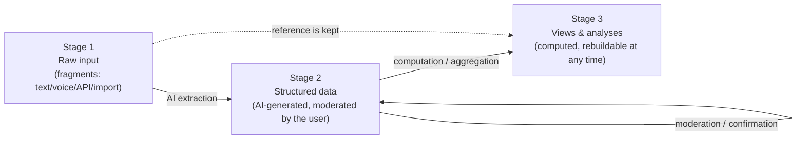
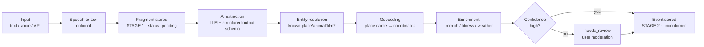
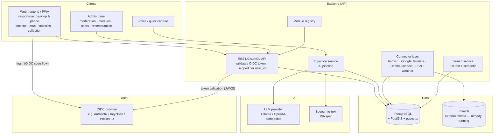

# Life-Dash — concept & MVP

> **Status:** In operation — P0 & P1 done, D1 live on the server, P2.2–P2.7 implemented (see ch. 14)
> **Document type:** architecture & product concept
> **Target environment:** self-hosted (Docker-based)
> **Last updated:** 2026-07-20

---

## 1. Vision

**Life-Dash is a searchable, analysable and visually explorable database about your own life.**

The goal is to bring scattered life data (memories, places, photos, fitness data, events) together into one central, structured database and make it tangible through several views: a timeline, a map, statistics and a collection.

The decisive difference to classic journaling apps: **capture is low-friction, via free text or voice. An AI structures, locates, dates and links the fragments automatically.**

### Guiding principles

| Principle | Meaning |
|---|---|
| **Capture first, structure later** | Entering data must be frictionless. Structure comes from the AI, not from mandatory forms. |
| **Three-stage model** | Raw input (stage 1) → moderated structure (stage 2) → computed views (stage 3). Every stage is derived reproducibly from the previous one. |
| **Raw data is the truth** | Everything always refers back to the unchanged raw input. Structure and views can be recomputed at any time (e.g. with better models). |
| **Everything configurable** | An admin panel allows adjusting modules, prompts, models, enrichment sources and views — without code changes. |
| **Modular and extensible** | New trackable categories (e.g. “concerts”, “books”, “illnesses”) without rebuilding code. |
| **Self-hosted & data sovereignty** | All data stays on your own machine. External AI only optionally and interchangeably. |
| **Confirmed vs. unconfirmed** | Concrete dates are preferred. AI-derived values are marked “unconfirmed” until the user moderates them. |
| **One data model, many views** | Timeline, map, statistics and collection are only computed projections (stage 3) of the same data. |
| **Mobile first** | Capture happens on the go. The UI is a responsive PWA; quick capture, timeline and map are built for a phone just as much as for a desktop. |
| **Multi-user from the start** | Every row in stages 1–3 belongs to a user (`user_id`). Sign-in via **OIDC** (SSO). Retrofitting auth is expensive — so it is anchored in the data model from P0 on. |

### How this software was built (note 52)

**The entire implementation of Life-Dash was written by Anthropic's Claude models — Fable and Opus — working from this concept under the author's direction.** The author sets the direction, decides the architecture, reviews the result and runs it in daily use; the code itself is machine-written. This is stated openly rather than buried, because anyone hosting a database of their own life deserves to know how the thing was made. Two consequences worth naming: the concept document is unusually detailed *because* it is the primary instruction to the machine, and every decision in chapter 15 is recorded with its reasoning so that neither the author nor a later model has to guess.

### 1.1 Where Life-Dash sits (market position, note 53)

The self-hosted field splits into five camps, and all five leave out the same thing:

| Camp | Representatives | What they do well | What is missing |
|---|---|---|---|
| Location history | **Dawarich**, **Reitti**, Traccar, OwnTracks | mature, live tracking, imports everything | places only — no life around them |
| Photos | **Immich**, PhotoPrism | media with time and geo | the timeline is a file list, not a record of events |
| Journals | **Memos**, **Journiv**, Standard Notes, Day One | text, mood, fast capture | text stays text: no structure, no map, no statistics |
| Quantified self | **Heedy**, qs_ledger, Grafana + InfluxDB, Exist.io (SaaS) | metrics and dashboards | numbers without a narrative, no free-text entry point |
| Unified timelines | **Timelinize**, **HPI/Promnesia**, **Dogsheep/Datasette** | conceptually the closest relatives | Timelinize has been “not release-worthy” for years; HPI and Dogsheep are Python libraries for developers — no product, no moderation, no interface |

**The gap Life-Dash actually fills, in four points — the last one is the strongest:**

1. **Free text and speech become structured events via an LLM.** Nothing in the self-hosted space does this. Journals store text; aggregators import APIs. The pipeline *fragment → proposal → confirmed*, with a moderation queue in between, is the genuinely new part.
2. **A human-curated layer of truth.** Timelinize, HPI and Dogsheep pour machine data into one pot. The invariant “machines never change what is confirmed, enrichment is additive only” (ch. 3.1) exists nowhere else.
3. **Retroactive enrichment of manual memories** — weather attached to a holiday from 2002. Aggregators can only enrich what they imported themselves.
4. **Life-Dash covers the pre-digital life.** Every competing product begins where the data exports begin, roughly 2012. Here, “summer 2002, holiday in France” is a first-class record with `season` precision. This is the one property that cannot be copied without adopting the whole architecture, and it is the headline claim: *your memories, including the ones from before the smartphone — as a searchable database.*

**Honest weaknesses.** Against Dawarich and Reitti the map cannot win — the answer is to import from them, not to compete (P2.11). And the LLM dependency is the barrier to entry: unless the local/Ollama path is first-class and clearly documented, the very audience that takes “self-hosted” seriously will bounce.

---

## 2. Glossary & core concepts

| Term | Definition |
|---|---|
| **Event** | The central entity. Something that happened at a point or span of time in a place. “Holiday in France”, “saw an eagle in Detmold”. |
| **Entity (collection item)** | A recurring “thing” in your life: an animal, a film, a country, a game. Events reference entities. |
| **Fragment** | Raw, unstructured input (text/voice/API) before the AI has processed it. **Stage 1 — the immutable source of truth.** |
| **Trackable / module** | A registered type you can track (e.g. `movie`, `animal`, `trip`). Defines schema, icons, statistics. |
| **Fuzzy date** | A date with a precision level (`exact`, `day`, `month`, `season`, `year`, `decade`) plus a time span. Concrete times are preferred; vagueness is the exception. |
| **Confirmed status** | Marks whether a structured value has been moderated/confirmed by the user (`confirmed`) or is AI-derived (`unconfirmed`). |
| **Source** | Where a record came from: `manual`, `ai`, `immich`, `google_timeline`, `health_connect`, `psn`, `weather`, `api`. |
| **Track (route)** | A recorded movement path (LineString) from Google Timeline or fitness workouts. Stage-3 data, drawn on the map as a line layer. |
| **User** | A signed-in user (OIDC identity). All fragments, events, entities and enrichments are user-scoped. |
| **Enrichment** | Automatic augmentation of an event with photos, fitness data, weather etc. based on time and place — also **retroactively** (re-enrichment). |
| **Admin panel** | The central configuration surface: modules, AI prompts/models, enrichment sources, view rules, recomputation. |

---

## 3. Three-stage architecture (core principle)

The whole system is built as a **pipeline of three clearly separated stages**. Every stage is derived **reproducibly** from the previous one. Nothing “computed” is ever the source of truth — it can be discarded and regenerated at any time (e.g. with a better AI model).



### Stage 1 — raw input (immutable)
- Every input is stored **losslessly and unchanged** as a `Fragment` (original text, audio, imported raw data).
- It is **never overwritten**. All later stages keep a back-reference to their originating fragment.
- Consequence: the entire system can be rebuilt “from zero” out of the raw data at any time.

### Stage 2 — structured database (moderated)
- From stage 1 the AI generates structured `Event` and `Entity` records (date, place, category, linked items).
- Every derived value carries a **`confirmed` status**: `unconfirmed` (AI proposal) or `confirmed` (moderated by the user).
- The user moderates in the review/admin panel: confirm, correct, discard, merge.
- Manual corrections are “sticky”: repeated AI processing must **not** overwrite confirmed values.

### Stage 3 — views & analyses (computed, rebuildable)
- Timeline, map, statistics and collection are **computed projections** of stage 2.
- They additionally contain AI enrichments (photos, fitness, weather) and aggregations (statistics widgets).
- **Fully recomputable** — at the push of a button in the admin panel, e.g. after a model change, new enrichment sources or module updates.

### Why this separation?
| Benefit | Explanation |
|---|---|
| **Reproducibility** | Better models → simply recompute stages 2/3, the raw data stays. |
| **Trust** | A clear separation between “what I said” (S1), “what the AI made of it” (S2) and “how it is presented” (S3). |
| **Safety** | No silent data corruption: raw input is always the fallback. |
| **Moderation** | The user has full control over stage 2 without losing the raw data. |

### 3.1 Refinement: four layers (decision 2026-07-15)

“Stage 2” conceptually mixes two things that must be thought of separately. Conceptually the system consists of **four layers** (over the same tables — the `confirmed` status is the dividing line, no DB rebuild needed):

| Layer | What | Lifetime |
|---|---|---|
| **1 · Inbox** | Raw fragments (text, voice, import summaries). | Immutable, permanent. An evidence archive. |
| **2 · Proposal space** | Unconfirmed AI derivations (`confirmed = unconfirmed`). *Claims, not truth.* | Disposable — discarded and regenerated on recomputation. |
| **3 · Life database** | Confirmed events/entities/locations (`confirmed`) **plus factual enrichments**: weather, media references, tracks. Facts do not change — once fetched, true forever. | **Fixed.** The actual goal of the system. |
| **4 · Derived** | Views, statistics, aggregations, **embeddings** (model-dependent). | Disposable and recomputable at any time; no backup needed. |

**The hard invariant:** *confirmed data is never changed by machines, only extended additively (metrics, media references).* Recomputation touches layers 2 and 4 exclusively. Confirming is the transition 2 → 3 (same row, the status flips); `field_overrides` additionally protects individual manually corrected fields.
*Documented exception:* “resolve place names” replaces generated coordinate titles (“Visit: place (53.49…)”) even on confirmed imported visits — that is a user-initiated data improvement, not an AI re-evaluation; manually renamed titles stay protected.

**Linking & deletability:** every layer-2/3 row references its inbox fragment (`origin_fragment_id`, n:1 — one fragment can produce several events). The proposal space cleans itself up (confirming converts, discarding deletes). The **inbox is deliberately not deleted**, even when everything is confirmed: it costs almost nothing (text), is the provenance record of the life database and the only source for later re-extraction or comparison. At most a manual cleanup of *orphaned* fragments (all events discarded) is legitimate — never automatic.

---

## 4. User scenarios (user stories)

### Capture
- *As a user* I open Life-Dash on my **phone** (installed PWA), type two sentences into quick capture while out and about, and I am done — I moderate later on the desktop.
- *As a user* I type “12/07/2026 was in Detmold and saw an eagle”, so that the AI creates an event with a date, a place (Detmold) and an animal sighting (eagle).
- *As a user* I dictate “summer 2002 holiday in France”, so that an event appears with a date (summer 2002, marked `unconfirmed`), a place (France) and the category “trip”.
- *As a user* I moderate AI proposals: I see which values are `unconfirmed` and confirm or correct them before they count as fact.
- *As a user* I want a follow-up question or preview for ambiguous input before the record is accepted.
- *As a user* I write a **formatted journal entry** (Markdown) for a travel day — as a daily summary above the individual events, so that Life-Dash also works as a travel diary in my own voice (→ package F1). The AI never touches this text.
- *As a user* I type “just saw a kingfisher” while out and **optionally take my phone location** as the place at the push of a button — without typing, but never automatically (→ package F2).

### Views
- *As a user* I zoom the timeline from decade level down to day level to see event density and detail.
- *As a user* I see all the places I have been on a map, filtered by time range.
- *As a user* I open the statistics tab and see “how many countries have I been to?”, “how many km did I run in 2025?”, “which animals have I seen?”.
- *As a user* I open the animal “eagle” in the collection and see all sightings, photos and places linked to it.

### Enrichment & import
- *As a user* the system automatically links Immich photos from 12/07/2026 to the Detmold event (Immich already runs as a service).
- *As a user* I import my **Google Timeline export** from my phone and see visited places as events and my **routes** as lines on the map.
- *As a user* I import my **Health Connect data** (steps, heart rate, workouts) and see steps and heart rate for a hike.
- *As a user* I import my **PSN game history** (games played, trophies, play time) and see under “games” in the collection when I played what.
- *As a user* I see the **weather** for that day and place on every located event (enriched automatically).
- *As a user* I enrich **retroactively**: if I import new photos, fitness or weather data later, existing events are updated automatically (re-enrichment).

### Account & access
- *As a user* I sign in via **SSO (OIDC)** — the same sign-in as for my other services.
- *As a user* I see only my own data; other users (e.g. family members) keep their own, separate life database.

### Search
- *As a user* I search “all the times I was by the sea” and get semantically matching events, not just full-text hits.

---

## 5. Feature areas (views)

### 5.1 Timeline
The central view. A horizontal or vertical line with continuous zoom.

- **Zoom levels:** day → week → month → year → decade.
- **Aggregation:** at high levels events are condensed into “heat” clusters (event density, category colours).
- **Vague events** (e.g. “summer 2002”) are drawn as bars/spans rather than points, and marked `unconfirmed`.
- **Filters:** by category, place, source, day, confirmed status.
- **Interaction:** click an event → detail panel with photos, place, weather, linked entities.

### 5.2 Map
- All located events as markers / clusters / heatmap.
- **Time slider**, synchronised with the timeline.
- Layers: **routes (tracks)** from Google Timeline and workouts as a line layer, trips, individual places, homes, “special moments”.
- Data sources: manual places, Google Timeline import (visits **and** routes), geo tags from Immich photos, GPS tracks from fitness workouts.

### 5.3 Statistics
A configurable dashboard of “widgets”. Every module can contribute its own statistics. The widgets are **computed stage-3 projections** and recomputable at any time.

- Examples: country counter, travel kilometres, animal species seen, films per year, fitness trends, “years of life in numbers”.
- Time-range filter, comparison between years.

### 5.4 Collection
Structured collections of entities, grouped by type.

- Tabs/categories: **animals, films, games, countries, places, books, …** (module-driven).
- A detail page per entity: description, metadata, linked events, mini timeline view, photos.
- Example: “eagle” → all sightings, a map of the sighting locations.

### 5.5 Data capture (ingestion)
- Free-text field, voice recording (speech-to-text), API endpoint.
- Every input is first stored losslessly as a **stage-1 fragment**.
- **AI preview:** shows how the AI interpreted the fragment (date, place, entities, category) → the user confirms or corrects (→ stage 2).
- Batch import (e.g. an old diary, chat logs).

### 5.6 Admin panel & moderation
The central control surface for the whole system.

> **Planned split (A14):** “Settings” (every user — moderation, jobs,
> export/import, tracking choice) and “Admin” (admin role only — user
> management, system, raw DB view, logs), each with tabs.

- **Moderation queue:** review, confirm, correct, discard and merge all `unconfirmed` stage-2 records.
- **Module management:** activate/define trackables, schemas, icons, statistics widgets.
- **AI configuration:** choose provider/model, adjust prompts, set confidence thresholds.
- **Enrichment sources:** configure Immich, Google Timeline, fitness, weather and define linking rules.
- **Recomputation:** recompute stage 2 and/or stage 3 selectively or completely (e.g. after a model change) — confirmed values are kept.
- **Raw data inspection:** navigate from any event back to its originating fragment (stage 1).
- **User management:** OIDC provider configuration, user list, roles (`admin` | `user`). Import configuration (Immich API key, PSN token) is stored **per user**.

### 5.7 Mobile use (phone)

The UI is designed **responsive** from the start — not as an afterthought. The most important mobile use case is **capturing on the go**; analysis and moderation happen more on the desktop but must work on mobile too.

- **PWA:** installable on the home screen, app manifest, offline queue for quick capture (fragments are buffered locally and synchronised when a connection returns — matching the stage-1 principle “capture first”).
- **Layout:** desktop = sidebar navigation; mobile = **bottom navigation** (timeline · map · ➕ capture · statistics · collection) with quick capture as the central, prominent button.
- **Timeline on mobile:** scrolls vertically instead of horizontally; the detail panel is a bottom sheet instead of a side panel.
- **Map on mobile:** fullscreen with a time filter that can be shown or hidden; touch gestures (pinch zoom).
- **Voice input** is the most natural channel on mobile (phase 2, Whisper server-side).
- **Share target (later):** share text/photos from other apps directly to Life-Dash → becomes a fragment.

**Status 2026-07-21 (note 82).** Of the above, the bottom navigation and the vertical timeline exist; the **bottom sheet** and the **full-screen map with a foldable time filter** do not, and the phone layout as a whole is two `@media` blocks. Package **A38** closes the gap — this section is a specification, not a description, until it ships.

---

## 6. Data model (core)

The heart of the system. Deliberately lean and generic so that modules can dock on without schema migrations.

### 6.1 Entities (conceptual)

```
User                     (identity — via OIDC)
  id
  oidc_subject         (stable `sub` claim from the OIDC token)
  email
  display_name
  role                 (admin | user)
  settings             (JSON: e.g. Immich API key, PSN token, import preferences)
  created_at

Fragment                 (STAGE 1 — immutable)
  id
  user_id              (FK → User; applies equally to Event, Entity,
                        MediaRef, Metric, Track — not repeated there)
  raw_text
  audio_ref            (optional)
  source               (manual | voice | api | import)
  status               (pending | processed | needs_review | discarded)
  created_at
  processed_event_ids  (result of the AI processing)

Event                    (STAGE 2 — structured, moderated)
  id
  title                (AI- or user-generated)
  description
  date_start           (timestamp)
  date_end             (timestamp, optional)
  date_precision       (exact | day | month | season | year | decade)
  location_id          (FK → Location, optional)
  category             (trackable key, e.g. "trip", "sighting")
  confidence           (0..1, how sure the AI is)
  confirmed            (unconfirmed | confirmed)  ← moderated by the user?
  field_overrides      (JSON: which fields were manually confirmed/corrected
                        → protected from re-processing)
  source               (manual | ai | immich | google_timeline | fitness | weather)
  origin_fragment_id   (FK → Fragment, stage-1 back-reference)
  embedding            (vector for semantic search)
  created_at / updated_at

Entity            (collection item, STAGE 2)
  id
  type              (animal | movie | game | country | place | book | ...)
  name
  attributes        (JSON, schema depends on the module)
  confirmed         (unconfirmed | confirmed)
  embedding
  created_at

EventEntityLink   (n:m between Event and Entity)
  event_id
  entity_id
  role              (subject | location | mentioned)

Location
  id
  name
  geo               (PostGIS point/polygon)
  type              (city | country | poi | home)
  external_ref      (e.g. OSM ID)

MediaRef          (STAGE 3 — enrichment; a reference to external media, NOT a copy)
  id
  event_id
  provider          (immich | local | url)
  external_id       (e.g. Immich asset ID)
  captured_at
  geo               (optional, for automatic linking)

Metric            (STAGE 3 — enrichment; generic figures: fitness, weather)
  id
  event_id
  key               (steps | heart_rate_avg | distance_km |
                     temperature_c | weather_condition |
                     play_minutes | trophies_earned | ...)
  value
  unit
  source            (health_connect | weather | psn | ...)
  enriched_at       (when enriched → enables re-enrichment)

Track             (STAGE 3 — route; from Google Timeline / workouts)
  id
  date_start / date_end
  geo               (PostGIS LineString, simplified/compressed
                     e.g. via Douglas-Peucker)
  activity_type     (walk | drive | cycle | run | transit | unknown)
  distance_m
  source            (google_timeline | health_connect)
  event_id          (optional, FK → Event — e.g. a hike)
  origin_fragment_id (FK → Fragment, raw import back-reference)
```

### 6.2 Design decisions

- **Three-stage provenance anchored in the model:** `Fragment` = stage 1, `Event`/`Entity` = stage 2, `MediaRef`/`Metric` = stage 3. Every stage-2/3 row references back to stage 1.
- **`confirmed` + `field_overrides`:** separating an AI proposal (`unconfirmed`) from a moderated fact (`confirmed`). `field_overrides` protects individual, manually corrected fields from being overwritten during recomputation.
- **Concrete dates preferred:** `date_precision` allows vagueness (“summer 2002” → `season`), but vague or derived dates stay `unconfirmed` until the user confirms them. The goal is to hold dates that are as concrete and confirmed as possible.
- **Event ↔ Entity as n:m:** one event can reference several animals/items; one entity appears in many events. This is the basis for the collection **and** the statistics. (People are deliberately left out for now — see ch. 8.3.)
- **`attributes` as JSON:** module-specific fields (e.g. film rating, animal species) live in a flexible JSON field with a schema defined by the module (JSON-Schema validation). No DB rebuild for new modules.
- **Embeddings for semantic search:** events and entities get vector embeddings (pgvector) → “all the times by the sea” also finds “beach day in Italy”.
- **Media and metrics are stage 3:** referenced, not copied (Immich stays the single source of truth). `enriched_at` enables **retroactive re-enrichment** without changing stage 2.
- **`user_id` everywhere, strict tenant separation:** every stage-1/2/3 row belongs to exactly one user. The API **always** filters by the signed-in user — there are no shared events/entities (deliberately kept simple; “sharing” would be a later feature). Locations are user-scoped too for now.
- **Tracks separate from events:** a route is not an event (not an “experience”) but context. Raw timeline/GPS data is kept as a fragment (S1); `Track` is the computed, simplified geometry (S3) — regenerable with better simplification algorithms.

---

## 7. AI pipeline (ingestion)

The path from fragment (stage 1) to moderated event (stage 2) to enriched view (stage 3).



### 7.1 Steps in detail

1. **Capture (stage 1):** the fragment is stored raw immediately (never lose data, works offline too).
2. **Speech-to-text** (optional): e.g. `whisper` locally.
3. **Structured extraction (stage 2):** the LLM receives the fragment plus a **structured output schema** (function calling / JSON schema). Output: title, date (span) + precision, places, recognised entities with type, category, confidence. All values are `unconfirmed` at first.
4. **Entity resolution:** matching recognised names against existing entities (“eagle” → existing animal entity? “France” → country?). Fuzzy matching plus embedding similarity. New entities are created as candidates.
5. **Geocoding:** place names → coordinates (a local Nominatim/OSM service, no external dependency needed).
6. **Enrichment (stage 3):** based on time and place, Immich photos, fitness metrics and **weather data** are linked. Also runs **retroactively** as a re-enrichment job when new source data arrives.
7. **Review gate:** on low confidence or ambiguity → `needs_review`. The user moderates and sets values to `confirmed`.
8. **Recomputation:** stages 2 and 3 are reproducible from stage 1 at any time (e.g. with a new model) — `confirmed` values stay protected.

### 7.2 Interchangeable AI provider

The AI is encapsulated behind a **provider interface**:

```
LLMProvider (interface)
  extract_structured(fragment, schema) -> StructuredResult
  embed(text) -> vector

Implementations:
  - OllamaProvider   (local, e.g. Llama/Mistral)
  - OpenAIProvider   (any OpenAI-compatible endpoint)
  - AnthropicProvider
```

This keeps data sovereignty intact and lets you pick different models per task (extraction vs. embedding).

---

## 8. Modularity / extensibility

The central non-functional goal: **track something new without touching the core.**

### 8.1 Module concept (“trackable”)

A module registers a new type declaratively:

```yaml
# module: animals
key: animal
label: Animals
icon: paw
entity_schema:            # JSON schema for Entity.attributes
  species: string
  wild: boolean
  first_seen: date
event_categories:
  - sighting              # "saw an eagle"
statistics:
  - id: species_count
    label: "Species observed"
    type: count_distinct
    field: entity.species
  - id: sightings_per_year
    label: "Sightings per year"
    type: timeseries
compendium_view:
  group_by: species
  detail_map: true        # shows sighting locations on a map
```

### 8.2 What a module can contribute

| Area | The module's contribution |
|---|---|
| **Data model** | JSON schema for `Entity.attributes` (validated, but no DB migration). |
| **Ingestion** | Hints/prompts for how the AI recognises this type. |
| **Statistics** | Declarative widgets (count, timeseries, distinct, sum). |
| **Collection** | Grouping, detail view, map option. |
| **UI** | Icon, label, colour. |
| **Achievements** | Metric plus four thresholds (bronze/silver/gold/platinum), see F6. |

### 8.3 Example modules (starter set)

**Implemented:** `trip` · `animal` · `country` · `artist` (artists/concerts) · `food` (meals) · `milestone` (weddings, births, moving, graduation …) · `movie` · `game` · `book`.
**Planned:** `place` · `sport_activity` · `health_event`.

> Lesson from implementation: a new category touches **three places** — the module YAML (backend), rules/examples in the AI prompt and the frontend (label, colour, collection tab, form options). The declarative goal of “YAML only” is not fully reached yet (see ch. 15, question 3).

> **People deliberately left out (for now):** a `person` module is conceptually appealing but too complex to maintain (duplicates, relationships, third-party privacy, constant assignment decisions). The focus is first on **concrete, confirmable facts** (time, place, item). The n:m data model stays laid out so that people can be added later as another module without a rebuild.

---

## 9. Integrations

| Source | Purpose | Approach |
|---|---|---|
| **Immich** | Photos & videos, geo tags, timestamps | **Already running as a service** → the first integration to implement. Immich API (`/api/search/metadata`: query assets by time range/geo), auth via API key (per user in `User.settings`). Linked via `MediaRef` — **references only, no copies**; thumbnails are passed through from Immich by a backend proxy. |
| **Google Timeline** | Visited places **and routes** | ⚠️ Since 2024 the timeline lives **on the device only** (Takeout “Semantic Location History” is gone). Import via the **device export**: Android → Settings → Location → Timeline → “Export timeline” (JSON, `semanticSegments`). File upload in the UI → stored raw as a fragment (S1) → `visit` segments become events/locations, `activity`/`timelinePath` segments become `Track`s (S3). No live access possible, so a recurring manual upload. |
| **Google Health / Health Connect** | Steps, distance, HR, workouts (incl. GPS) | ⚠️ The Google Fit REST API was shut down (2025); its successor **Health Connect** stores **on-device only**, without a cloud API. Import therefore happens by file: a Health Connect export (ZIP) or a sync app, alternatively a direct Garmin/Fitbit export. Daily values and workouts → `Metric` on events; workout GPS → `Track`. |
| **PSN (PlayStation Network)** | Games played, trophies, play time | No official public API. Approach: an unofficial API via an **NPSSO token** (e.g. the Python library `psnawp`) — a token per user in `User.settings`. Periodic sync: titles → `game` entities, sessions/“last played” → events, trophies and play time → `Metric`. Fallback: the pure trophy history (a timestamp per trophy) as an event source. Risk: an unofficial API can break → keep the connector isolated and store sync results as fragments (S1). |
| **Weather** | Context enrichment (temperature, conditions) | A historical weather API (Open-Meteo daily archive) based on time and place. Attached as a `Metric` to located events — retroactively too. |
| **Geocoding** | Place name ↔ coordinates | Nominatim (OSM) or any compatible service, self-hostable. |

**Integration principle:** every source is a **connector** with a uniform interface (`fetch`, `map_to_events`, `enrich`). New sources dock on without core changes. All connector results are **stage-3 enrichments** and recomputable at any time.

**Two kinds of connector:**
- **Pull connectors** (Immich, PSN, weather): the backend queries the source actively/periodically.
- **Upload connectors** (Google Timeline, Health Connect): the user uploads export files — a mobile-friendly upload flow in the UI (shareable directly from a phone). Raw files are archived as fragments (S1) so that re-processing stays possible.

**Duplicate protection on re-import:** imports are **idempotent** — every imported record carries a stable `external_id` key (Immich asset ID, timeline segment hash, PSN trophy ID), so repeated uploads/syncs create no duplicates.

---

## 10. Technical architecture



### Layers

- **Frontend:** views as stage-3 projections of the same API. State sync between timeline and map through a shared time-range filter. A **responsive PWA** — one codebase for desktop and phone (sidebar ↔ bottom navigation, panels ↔ bottom sheets).
- **Auth:** OIDC authorization code flow (PKCE) in the frontend; the backend validates tokens against the provider's JWKS endpoint and creates the `User` record automatically on first login (JIT provisioning via the `sub` claim).
- **Admin panel:** its own surface for moderation (stage 2), module/AI configuration, user management and recomputation.
- **API:** thin, authorising, delegating to services. Every query is scoped by `user_id`.
- **Ingestion service:** orchestrates the AI pipeline (ch. 7). Asynchronous (queue) for batch imports and re-enrichment.
- **Module registry:** loads module definitions, provides schemas and statistics.
- **Connector layer:** encapsulates external sources (including weather).
- **Storage:** one PostgreSQL with PostGIS (geo) and pgvector (embeddings) covers relational, geographic and semantic needs in **one** database — ideal for self-hosting.

---

## 11. Recommended tech stack

| Layer | Recommendation | Rationale |
|---|---|---|
| **Backend** | Python + **FastAPI** | Fits the existing Python environment; excellent for AI integration; async. |
| **DB** | **PostgreSQL** + **PostGIS** + **pgvector** | One database for relational, geo and semantic. Fewer moving parts. |
| **ORM/migration** | SQLAlchemy + Alembic | Established, migration-safe. |
| **Queue** | Redis / RQ (or DB-based to start) | Asynchronous ingestion and batch import. |
| **AI (LLM)** | Any **OpenAI-compatible endpoint**, provider-abstracted | Data sovereignty when run locally; interchangeable with cloud vendors. |
| **STT** | **Whisper** (local) | Voice input without the cloud. |
| **Geocoding** | **Nominatim** (public or self-hosted) | No mandatory external dependency. |
| **Auth** | **OIDC** — any standards-compliant provider (Authentik, Keycloak, Pocket ID, Zitadel …); backend: `python-jose`/`authlib` for token validation | SSO across all your services; Life-Dash manages no passwords. |
| **Frontend** | A **responsive PWA** + map library (MapLibre/Leaflet) + timeline rendering | A rich interactive UI; one codebase for desktop and phone; installable, offline capture. |
| **PSN connector** | `psnawp` (Python, NPSSO token) | The most established unofficial PSN library; isolated in the connector layer. |
| **Deployment** | **Docker Compose** | The self-hosting standard; reproducible. Immich runs separately — only a URL and API key are needed. |

> Deliberately **one** database rather than a separate vector store or geo store, to keep operational complexity low.

---

## 12. Security & privacy

- **Self-hosted only:** no data leaves by default. External AI providers are opt-in and clearly marked.
- **Auth: multi-user via OIDC from the start.** Life-Dash stores no passwords; sign-in goes through your OIDC provider (SSO). Every user has a strictly separate data set (`user_id` scoping in every query); roles: `admin` (system configuration) and `user`.
- **User secrets:** per-user connection data (Immich API key, PSN NPSSO token) is stored encrypted in `User.settings` and never delivered to the frontend.
- **Sensitive data:** life data is highly sensitive → encrypted backups, the DB never publicly exposed (only via a reverse proxy/VPN). Movement profiles (tracks) and health data (metrics) are the most sensitive categories — export and deletion must cover them completely.
- **AI transparency:** AI-derived statements are recognisable as such through `confidence`, `source` and `confirmed`; the moderation/review gate prevents silently wrong data.
- **Raw data as a fallback:** because stage 1 is immutable, faulty AI processing can be discarded and recomputed safely at any time.
- **Data control:** a full export (raw plus structured) and deletion are possible at any time.

---

## 13. MVP definition

The goal of the MVP: **the core loop across all three stages works** — enter a fragment (S1) → the AI structures it and the user moderates (S2) → see it on the timeline and map and search it (S3).

### 13.1 MVP scope (in)

| Area | MVP scope |
|---|---|
| **Three-stage foundation** | `Fragment` (S1) immutable → `Event`/`Entity` (S2) with a `confirmed` status → views (S3) recomputable. |
| **Data capture** | Free-text input plus an AI preview with confirmation/correction. (Voice: phase 2.) |
| **AI pipeline** | Extraction (date + precision, place, category, simple entities), geocoding, confidence plus review gate. |
| **Data model** | `Fragment`, `Event`, `Entity`, `EventEntityLink`, `Location` including `confirmed`/`field_overrides`. |
| **Moderation / admin** | A simple moderation panel: review, confirm and correct `unconfirmed` records; trigger recomputation. |
| **Timeline** | Zoom year → month → day; events as points/spans; click for detail; `unconfirmed` visibly marked. |
| **Map** | Located events as markers plus a time-range filter. |
| **Search** | Full text plus semantic search (embeddings). |
| **Collection** | The **animals** type as proof of modularity. |
| **Modules** | A module registry with 2–3 fixed modules (`trip`, `animal`, `country`). |
| **Auth & multi-user** | OIDC login plus `user_id` in all tables plus JIT provisioning. No user management UI in the MVP — users appear by logging in. |
| **Responsive base layout** | A mobile-capable layout (bottom navigation, quick capture) from the start; PWA manifest. Offline queue: phase 2. |
| **Deployment** | Docker Compose (app + Postgres + AI endpoint). |

### 13.2 Deliberately NOT in the MVP (out)

- Voice input / Whisper, offline capture queue (though the PWA foundation is laid)
- Immich, Google Timeline, Health Connect, PSN and weather integration (though the data model and stage-3 concept are prepared)
- Statistics dashboard (only rudimentary counters)
- A people module (deliberately left out)
- A complete module set, decade aggregation
- User management UI, sharing between users (OIDC login and data separation *are* in the MVP)

### 13.3 Definition of done (MVP)

1. I type “12/07/2026 was in Detmold and saw an eagle” → see an AI preview (stage 2, `unconfirmed`) → confirm it (→ `confirmed`).
2. The event appears correctly dated on the timeline **and** as a marker in Detmold on the map.
3. “Summer 2002 holiday in France” is stored as a span (summer 2002, `season`, `unconfirmed`) with the place France.
4. “Eagle” (animal) appears in the collection together with the sighting.
5. I can search for “France” and find the event (full text plus semantic).
6. In the admin panel I can delete the stage-2/3 data and **recompute it from the raw data** — confirmed values are kept.
7. I sign in via OIDC; a second user signs in and sees **none** of my data.
8. On a phone I can capture a fragment via the bottom navigation and read the timeline without scrolling horizontally.

---

## 14. Roadmap & implementation status

### 14.1 What already works

**P0 + P1 complete, D1 (deployment) live**, plus P2.2–P2.7:

| Area | Implemented |
|---|---|
| **Foundation** | Three-stage data model with `user_id`, `confirmed`, `field_overrides`; fragment→event pipeline; mini migration (`migrate.py`). |
| **Deployment (D1, live)** | Running in production: ARM64 single-board server, multi-arch image from GHCR (GitHub Actions), a reverse proxy in front, OIDC live (`AUTH_MODE=oidc`), PostgreSQL 18 as the Compose default, all data as bind mounts next to the Compose file (`./db`, `./data`), runbook in docs/DEPLOY.md. |
| **Auth** | OIDC (code flow + PKCE), JIT provisioning, first user = admin plus legacy data adoption, dev mode for local development. Runs live behind the reverse proxy. |
| **AI** | Provider abstraction (mock / OpenAI-compatible); a worked-out prompt with few-shot examples; retry with backoff; quota protection (a batch stops cleanly, capture-first fallback on single ingest). |
| **Views** | Timeline (zoom day→decade, category filter); map (modes day→all, category filter, calendar jump, daily routes); statistics (12 tiles including age/moves/hottest/coldest day, 4 charts); collection (counters, detail page with map and **Wikipedia description** via a Wikidata concept lookup). |
| **Capture & moderation** | AI preview with correction; **manual capture** (form, confirmed immediately); an **edit dialog** on every event card (including place→geocoding down to house number, comment field); moderation queue; confirming pulls linked entities along. |
| **Stage 3** | Weather enrichment (Open-Meteo, on demand + force); embeddings plus hybrid search (full text + semantic); admin actions with descriptions. |
| **Data control** | **Export/import** (JSON, idempotent, per user) = backup/restore/migration; “delete all data” with a double confirmation. |
| **Life-database tools** | **P2.5** bulk confirm with filters (category/source/confidence/time range) plus a mandatory preview; **P2.6** invariant tests “confirmed data is untouchable” (`backend/tests/`, pytest, offline); **P2.7** confirmation provenance `confirmed_at`/`confirmed_by` (manual/bulk/import) including a migration for existing data, visible in the edit dialog; **P2.4** automatic weather right after capture/AI analysis, weather follow-up when the user corrects time or place. |
| **UX & operations (A1–A3, v0.6.0)** | Toasts plus a confirmation modal in the app's own style instead of native browser popups (all ~20 places, including a typed confirmation for the data wipe); progress bars for timeline/JSON import (staged import, idempotent, `auto_resolve` parameter); version number from `backend/app/version.py` in the sidebar, `/health` and OpenAPI. |
| **Use & operations (v0.7.0)** | **A8** export feedback (a toast with content/size/filename); **A9** central logging (`lifedash.*`, `LOG_LEVEL`, log rotation in Compose, admin/import/geocoding/weather logs); **A10** place-name language fallback plus `namedetails` plus the admin action “transliterate foreign-script names” (`scope=nonlatin`); **A13** times visible for `exact` (“12/07/2026, 14:30–16:05”) plus time fields in the edit dialog (fix: a silent `exact`→`day` downgrade); **A5 map part** marker clustering — all points instead of a 300 cap (the numbered route up to 300 stops remains). |
| **Location, weather & countries (v0.14.0)** | **F2** a 📍 button in AI analysis (coordinates into the fragment, a place suggestion only when the text names no place) and in manual capture (address into the place field, `/api/ingest/reverse-location`). **F3** *(user decision: pure daily values)*: `temp_min_c`/`temp_max_c`, `sunshine_h`, `rain_mm`, `snow_cm`, `wind_max_kmh` plus the daily condition; the UI bundles it all into one line; statistics tiles for sunniest/wettest/windiest/snowiest day, hot/cold uses the real max/min; existing data stays untouched. **F4** country from addressdetails → `Location.country` plus a `country` entity linked to all events at that place (idempotent), applied during place resolution, forward geocoding and location capture; retroactively via the resolution runs. |
| **Modules, tracking & background jobs (v0.13.0)** | **A7** modules fully declarative: label/colour/emoji/collection/forms/AI rules from the YAML (`/api/modules` + `prompt_rules` → a dynamic system prompt); the new modules movie/game/book as proof (one file each). **A15** tracking choice: an onboarding modal on first start plus a setting in the admin area; hides UI and filters the AI prompt (`tracked_modules`). **A22** server jobs: worker threads for weather/embeddings/place names/recomputation (running without an open browser), a stop button plus a 4-second auto refresh in the jobs tab, a nightly schedule per type and user (`job_schedule`, a minute ticker in main.py). **This completes group A.** |
| **Polish & mobile (v0.12.0; 0.11.0 skipped)** | **A20** mobile fixes: the map tab showed nothing on a phone (a CSS flex collapse to height 0), search failed silently (now a local text-search fallback plus a hint). **A19** the “searched address” label was abolished (new imports stay unnamed → a plain address; a startup migration cleans up existing names/titles). **A21** export selection (“without Google Timeline data”, `exclude_source`). **A23** plain language in the UI: raw inbox/proposals/life database/views instead of “stage 1/2/3”. From here on the changelog is written in product language without package codes (note 39); the AGPL-3.0 license took effect with this release. |
| **Admin & logs (v0.10.0)** | **A14** “Settings” with tabs: moderation / my data / jobs (all users) plus system / users / database / logs (admin only) — implemented as one page with role-gated tabs rather than two separate areas (this meets the goal: users see only their own tools). **A17** log view: an admin tab “logs” with a ring buffer (the last 500 lines, level filter, `GET /api/admin/logs`). |
| **Operations & robustness (v0.9.0)** | **A11** jobs with a lock: long runners (weather, recomputation, embeddings, place names, imports) registered as jobs (`/api/jobs`), one lock per type (409 “already running” instead of a double run), a jobs table in the admin area, stale cleanup after 3 minutes without a heartbeat; DB-side duplicate protection for weather (a partial unique index plus cleanup). **A4** raw view with guard rails: enum/JSON/time validation, follow-up recomputations (title→embedding reset, time/place→weather follow-up) visible in the toast, fragment/user deletion blocked, deleting cleans up dependent rows. **A18** cluster threshold configurable (10–300, default 50, `map_cluster_min`). **A16** (fix) `month` counts as a vague date. API error details now reach the UI. |
| **Use & operations (v0.8.0)** | **A5 remainder** visit condensation: from month view up, the map bundles repeated visits to the same place (“59× home — …”, toggle “🔁 merge places”); the timeline groups identical Google visits within a time group into expandable collective cards. **A12** semantic places (“home”/“work”/“searched address”) are reverse geocoded, the label stays as a prefix (“home — Example Street 1”); existing data via “resolve place names”; an optional import filter for minimum location certainty (`min_probability`). **A6** user management in the admin panel (change roles, delete users including their data; last-admin and self-deletion protection). **Compact place names:** display names are built from selectable building blocks (street/district/city/country, per user via `/api/auth/me/settings`) rather than the full Nominatim chain; POI proper names stay in front; the action “shorten addresses” (`scope=verbose`) reformats existing data. Offline tests for A12/A6/place-name formatting. |
| **World & achievements (v0.18.0)** | **F5** a “world” tab: a choropleth world map (Leaflet plus a bundled GeoJSON, Natural Earth 110m, public domain) plus a per-continent checklist with an expandable list of what is missing; country reference data (`backend/app/data/countries.py`, name → ISO → continent) connects the name-only `country` entities to the map shapes and merges aliases. **F6** an “achievements” tab: bronze/silver/gold/platinum, declared in the module YAMLs (metric plus four thresholds), a pure layer-4 derivation counting only confirmed data and respecting the tracked modules. |
| **Print & portability (v0.19.0)** | **F8** a print dialog with a date range, presets and content switches; printing builds a dedicated page containing every event in the range instead of the on-screen view. **A27** the generality audit: `.env.example` is the complete setup reference, Compose no longer forces an AI key or hardwires vendor defaults, README/backend README/DEPLOY rewritten for portability. |
| **Bilingual (v0.20.0)** | **F10** the interface can be switched between German and English (a catalog mechanism where German stays the source of truth), the language is stored per device and on the account, and place-name lookups follow it (`Accept-Language`, the remainder of A25). Documentation switched to English. |
| **Modules** | trip, animal, country, artist (concerts), food (meals), milestone (life events), movie, game, book. |

### 14.2 Roadmap

**Principle:** two groups — **A: necessary/sensible for general use** (operations, usability, data safety) and **B: new features**. **The focus is on group A**; features from B come afterwards or as a deliberate exception in between.

Effort: S = hours · M = ~1 day · L = several days. No package blocks another except where noted.

**Already done** (details in 14.1): D1 deployment · P2.2 timeline import · P2.3 vague-date review · P2.4 auto enrichment · P2.5 bulk confirm · P2.6 invariant test · P2.7 confirmation provenance · **A1–A3 (v0.6.0)** · **A8/A9/A10/A13 plus the A5 map part (v0.7.0)** · **A5 remainder/A12/A6 (v0.8.0)** · **A4/A11/A16/A18 (v0.9.0)** · **A14/A17 (v0.10.0)** · **A19–A21/A23 (v0.12.0)** · **A7/A15/A22 (v0.13.0)** · **F2–F4 (v0.14.0)** · **F1/F7/F9 (v0.15.0)** · **A24–A26 (v0.16.0)** · **F8 first stage (v0.17.0)** · **F5/F6 (v0.18.0)** · **F8 selection dialog/A27 (v0.19.0)** · **F10 (v0.20.0)** · **A28/F14 (v0.21.0)** · **F13 (v0.22.0)** · **F11/F12 (v0.23.0)** · **F15/F8 (v0.24.0)** · **P2.1 stage 1 (v0.25.0)** · **A29 (v0.26.0)** · **A30/A31/A32 (v0.27.0)** · **F16/A33/A34 (v0.28.0)** · **fixes (v0.28.1)** · **A35 (v0.29.0)** · **P3.1 (v0.30.0)** · **fixes (v0.30.1)** · **A36/F17 (v0.31.0)** · **A37 (v0.32.0)** · **A38/A40 (v0.33.0)** · **A39/F18/A41 (v0.34.0)** · **F19/A42 (v0.35.0)**.

#### Group A — necessary & sensible for everyday use

**Group A was complete with v0.20.0; the feedback rounds since have added A28–A42**
— each one an observation from actually using the thing, which is the channel note 86
called the most productive one this project has. **All of them are implemented**, the last
(A42) in v0.35.0 — group A is complete again. The detailed record
of what each package changed lives in 14.1 and in [CHANGELOG.md](../CHANGELOG.md),
so the table below keeps one line per package rather than repeating it.

| No. | Package | Done in | Content |
|---|---|---|---|
| **A1–A3** | UI dialogs/toasts instead of browser popups · progress bars for large imports · version number in sidebar and `/health` | v0.6.0 | — |
| **A4** | Guard rails for the raw DB view: enum/JSON/time validation, visible follow-up recomputations, protected fragments/users | v0.9.0 | — |
| **A5** | Decade aggregation & visit condensation (map and timeline), marker clustering instead of a 300 cap | v0.7.0/v0.8.0 | — |
| **A6** | User management UI (roles, deletion, last-admin and self-deletion protection) | v0.8.0 | — |
| **A7** | Full module build-out: label/colour/emoji/forms/AI rules from the module YAML | v0.13.0 | — |
| **A8** | Export feedback (toast with content, size, filename) | v0.7.0 | — |
| **A9** | Central logging (`lifedash.*`, `LOG_LEVEL`, log rotation) | v0.7.0 | — |
| **A10** | Place-name language fallback plus foreign-script resolution | v0.7.0 | — |
| **A11** | Jobs with a lock (`/api/jobs`), one lock per type, stale cleanup | v0.9.0 | — |
| **A12** | Timeline import: semantic places → real addresses, label kept as a prefix | v0.8.0 | — |
| **A13** | Times visible and editable for `exact` precision | v0.7.0 | — |
| **A14** | Admin split into role-gated tabs (moderation/my data/jobs vs. system/users/DB/logs) | v0.10.0 | — |
| **A15** | Tracking choice by the user (onboarding modal plus setting) | v0.13.0 | — |
| **A16** | Fix: month precision counts as a vague date | v0.9.0 | — |
| **A17** | Log view in the UI (ring buffer, level filter) | v0.10.0 | — |
| **A18** | Map clustering only above a configurable threshold (10–300) | v0.9.0 | — |
| **A19** | “Searched address” label abolished, existing data cleaned by migration | v0.12.0 | — |
| **A20** | Mobile fixes: map tab and search | v0.12.0 | — |
| **A21** | Export with a selection (`exclude_source`) | v0.12.0 | — |
| **A22** | Server-side background jobs plus a nightly schedule per type and user | v0.13.0 | — |
| **A23** | Plain language in the UI instead of “stage 1/2/3” | v0.12.0 | — |
| **A24** | Map height coupled to the viewport plus a fullscreen toggle | v0.16.0 | Closed in v0.19.0: “improve generally” held no decision and is no longer kept open. |
| **A25** | One place-name run with a scope selection instead of three buttons | v0.16.0 | The F10 part (`Accept-Language` follows the app language) landed in v0.20.0. |
| **A26** | “My data” tab regrouped into clear blocks | v0.16.0 | — |
| **A27** | Generality audit: `.env.example` as the complete setup reference, no vendor defaults hardwired, portable docs | v0.16.0/v0.19.0 | — |

**Open in group A:**

| No. | Package | Effort | Content | Benefit |
|---|---|---|---|---|
| **A30** | ✅ **Show that something is happening** *(note 61; done v0.27.0)* | S | Opening the app can take seconds on a large database, and until then the screen simply sits there — indistinguishable from a hang. A loading bar plus skeleton placeholders while the first request runs, and the same treatment wherever a view fetches. **This treats the symptom on purpose** (see note 61): the cause is the payload, and A36 is the cure. Cheap, immediate, and honest as long as nobody claims otherwise. | The difference between “slow” and “broken” is whether anything moves. |
| **A31** | ✅ **Weather record counts days, not entries** *(note 64; fixed v0.27.0)* | S | The F11 aggregations count **events**, but weather is a property of a **day**. After a timeline import a single day holds dozens of visits that all share one weather record, so “rainy days per year” can exceed 365, total sunshine hours are multiplied by the number of entries per day, and “warmest trip” averages over entries instead of days. Fix: collapse to one weather record per calendar day before aggregating, and say so in the panel. | Numbers that are wrong by a factor of ten are worse than no numbers. |
| **A32** | ✅ **One direction for the backup options** *(note 65; done v0.27.0)* | S | The export dialog mixes polarities: “without Google timeline data” excludes, “with photos” includes. Two ticks that mean opposite things sit two lines apart. Fix: everything reads as **include** (“include imported visits”, “include photos”), with photos ticked by default so the complete backup is the default path. | A backup dialog is the last place to make someone think twice about what a tick means. |
| **A33** | ✅ **Delete my own data** *(note 66; done v0.28.0)* | S–M | “Delete all data” exists only for admins and clears the whole instance. Every user needs the same for **their own** data — the counterpart to export, and in a multi-person setup the only honest answer to “get rid of my stuff”. Same rules as the admin version: names of the image files collected first, rows deleted, then the files; typed confirmation; fragments included (they are the user's raw material, not shared evidence). | Data sovereignty means being able to leave, not only to look. |
| **A34** | ✅ **Progress on long-running actions** *(note 67; done v0.28.0)* | S–M | Large export, large import and “delete data” run without any sign of life — not even in the log. Fix: report progress for all three (the archive export streams anyway, so it can count files as it goes), and log start, progress and result the way the jobs do. | Without it, a ten-minute export is indistinguishable from a crashed one. |
| **A35** | ✅ **Sign in without OIDC** *(note 62; done v0.29.0)* | L | `AUTH_MODE=local` as a full alternative: email and password, hashed properly, the first account becomes admin, further accounts created through the existing user management, password change, and sessions as they already work. OIDC stays equal beside it, `dev` mode stays for local development only. **This is a prerequisite for R1**: requiring a running identity provider costs most first-time visitors before they ever see the app. Needs care — it is the first password Life-Dash stores, so: a modern hashing algorithm, no user enumeration through error messages, rate limiting on failed attempts. **Plus a first-run form (note 73):** the sign-up flow offers to enter a few facts straight away — birth date, home town, maybe a milestone or two — which become the first **confirmed** entries (including the birth event that F17 reads), turning an empty app into a populated one. **Delivered in v0.29.0:** scrypt hashing (stdlib, no compiled dependency) with a per-password salt; identical response for wrong password and unknown email, with a dummy hash equalising the timing; per-account lockout after repeated failures; first account becomes admin, further accounts by an admin; a startup warning if SESSION_SECRET is still the placeholder. The first-run form landed as a skippable card on the empty “Today” view (creating a “Geburt” milestone, which F17 will read). Scope note: no password-reset flow and the lockout is per-process (documented in DEPLOY); both are acceptable for a self-hosted tool and revisited only if needed. | Whoever wants to try Life-Dash should not have to install Authentik first. |
| **A36** | ✅ **Slim event list** *(note 61; done v0.31.0)* | M | The timeline loads **every** event with all metrics, media and entities in one request. Measured on 2026-07-20: 2.0 kB per event, so 20,000 events mean **38 MB** in one response — and 74 % of that is detail the list never shows. F12 roughly doubled it by adding weather fields. Fix: a slim list (title, date, place, category, counts) with details fetched when a card is opened. **Decided 2026-07-20: not now** — A30 makes the wait visible first; this package waits until the wait itself becomes the problem. | Three quarters of the transfer is data nobody is looking at. **Delivered in v0.31.0**, but by a smaller cut than the package first imagined: rather than a truly minimal list, only the raw weather metric rows are dropped (they are ~67 % of the payload — 16 rows per entry) and replaced by one compact `weather` object; entities, media and location stay, so the timeline card renders unchanged. `/api/events?slim=1` is used by the timeline, Today and map; the statistics view keeps the full list (it needs the raw figures) and loads it only when opened. Measured 60 % smaller (~19→8 MB at 12k). The heavier, behaviour-changing options (server-side paging) stayed off the table. |
| **A37** | ✅ **Server-side time window** *(note 81; done v0.32.0)* | M–L | Even after A36 the list endpoint sends **every** entry in one response; note 80 measured where the seconds go and named this the next lever. The timeline asks for a **date window** (the current year) and loads more as it scrolls; `/api/events` gains `from`/`to`/`limit`/`offset` and an index of counts per year, so the year headings and the scroll extent are right without loading anything. The three remaining readers of the full list move with it — and *that*, not the paging itself, is the substance of the package: the **map** gets its own thin geo endpoint (id, lat/lon, date, category — roughly 50 instead of 700 bytes per entry, windowed and optionally bounded by the visible area); the **statistics** stop being a client-side reduce over every entry and become **SQL aggregates** (today `loadStats` counts places, categories, milestones, moves, concerts and unconfirmed entries in the browser — under a window those tiles would be quietly wrong, and as aggregates they also get faster); the smaller full-list readers (vague dates, the journal's day lookup, the print range) get server-side filters instead. **Trap to plan for:** F17 derives age from the birth milestone found in the loaded list — outside the window it vanishes, so it needs its own small lookup. Composite index on (`user_id`, `date_start`). **Delivered in v0.32.0**, measured over HTTP at 12,000 entries: the opening request fell from **12.7 MB / 1.49 s to 0.31 MB / 0.08 s** (one page of 300 plus a year index of 474 bytes), and the statistics tab from 26 MB / 5.5 s to **2 kB / 0.39 s**. Everything the plan named was moved: map (own endpoint), statistics, vague dates, journal day, print range, and the F17 birth milestone, which now travels in the year index. Two things the plan did not foresee and the work did: the **F7 child count** had the same defect as the age chip (children can sit on an unloaded page, so the server counts them), and **clicking a statistics tile** had always silently done nothing when the entry was not in memory — with paging that would have been the normal case, so single entries are now fetchable. | Whether the database holds 12,000 or 200,000 entries stops mattering. This is the last hard ceiling on size. |
| **A38** | ✅ **Mobile layout pass** *(note 82; done v0.33.0)* | S–M | Ch. 5.7 promises more than was ever built: the whole phone layout is **two** `@media` blocks. Audited 2026-07-21, in order of how much it costs daily: **nine** navigation items share one bottom bar — about 40 px each on a 360 px screen, below the 44 px touch target, with 10 px labels; the settings page keeps thirteen inline `min-width:215px` label columns that the mobile block never overrides, so its rows squeeze or overflow sideways; the edit dialog is capped at `90vh` while the rest of the app correctly uses `dvh`, so with the browser's address bar showing, its lower edge — the save button — sits off-screen; the raw-data tables are `nowrap` inside a horizontal scroller, which is honest but barely usable. Then the two unfulfilled promises from ch. 5.7: the detail view as a **bottom sheet** instead of a side panel, and the map **full screen** with a time filter that can be folded away. **Delivered in v0.33.0.** The bottom bar carries **four** destinations plus a “More” sheet whose rows are 48 px tall and spell the name out; the sheet is *cloned* from the sidebar rather than written twice, so a future navigation entry cannot exist in one menu and not the other, and the unconfirmed-entries badge is mirrored onto “More”. The promised bottom sheet turned out to be the **edit dialog** — there is no separate detail view; clicking a card opens the editor — so that one dialog satisfies both open promises at once. Two things the audit had not seen, both found by writing the guard rather than by reading the code: the `vh` fault was **not** limited to the edit dialog (the photo lightbox and the log view had it too, and any `max-height` in `vh` has it by construction), and the inline-width fault existed at **four** further places beyond the settings columns (the map's period label, the raw-table inputs, the job names). `tools/check-a38-mobile.js` now enforces both as *rules* — no inline `min-width`, no `max-height` in `vh` — rather than as a list of the places that happened to be wrong. | Capture happens on the phone — “mobile first” is a guiding principle, and the gap between it and the code is now measured. |
| **A40** | ✅ **The map's display controls** *(note 92; done v0.33.0)* | S | Four controls under “Display” that the author could no longer explain — which turned out to be a fair reaction rather than a memory problem, because two of them routinely did nothing while looking switched on. Three defects, in order of how misleading they were: **(a) “Connect route” drew nothing whenever clustering was active** (`!clustered && mp.showRoute`) and gave no sign of it; **(b) “Merge places” did nothing in day and week view**, likewise silently; **(c) two unrelated things were both called a “route”** — the *measured* paths from the timeline import and a *drawn* line through the period's places in chronological order. On top of that, “cluster above N points” put a performance guard in the position of a preference, next to a third, entirely invisible cap (300 markers). Resolved to **two layer switches and one condensing switch**: “Paths travelled” (measured), “Connect in order” (drawn, and **visibly struck through with a reason** when condensing makes an order meaningless), “Merge points” (one switch; whether it merges per place or by proximity follows the zoom level, which is a technical matter and no longer the user's). The threshold moved to the settings. `tools/check-a40-map-controls.js` guards the property that actually mattered: no control may be silently inoperative. | A control that looks switched on and does nothing teaches you to distrust the whole panel. |
| **A39** | ✅ **The city as its own field — and the timeline condensed by it** *(note 88; done in 0.34.0)* | M | After a timeline import a single day holds dozens of visits, each its own line, each named down to the street (“Kaiserstraße, Bilk, Düsseldorf”). Two halves, one prerequisite. **(a) The field:** `Location` carries `country` (F4) but no `city` — the town exists only as a *text fragment inside the assembled name* (`PLACE_NAME_PARTS = road, suburb, city, country`, chosen per user), and the raw `addressdetails` are not stored. So the city cannot be derived from what is already in the database: it needs re-geocoding — but **not a new mechanism**, because the place-name run (A28) already walks the places with backoff, progress and a lock. `city` becomes one more field written by that run, and is filled at import time for new places. **(b) The condensation:** consecutive entries sharing a city collapse into one timeline row (“Düsseldorf · 12 visits · 08:14–19:30”), expandable. Done **server-side** — with A37's paging a client-side collapse would turn a page of 300 into twenty visible rows and make the scroll auto-fill misbehave, the same defect note 85 already had to fix once for the visit filter. **The map is explicitly not touched:** movements are `Track` rows, not events, and are drawn from `/api/tracks` — all lines stay, at full point density (decision 11). One field, three payoffs: “cities visited” as a real statistic, a stable grouping key for the timeline, and both of them independent of which name format the user has chosen. **Delivered in 0.34.0.** Two decisions the plan did not contain and the work forced. **(a) “No city” had to become a stored answer.** A place in the woods genuinely has none, and `NULL` alone cannot tell “never looked” from “looked, there is none” — so the backfill would have re-queried every cityless place on every run, forever. That is precisely the endless-retry trap F12 had to remove with `weather_rev`; here an empty string carries the distinction, and `test_a39_city.py` pins it. **(b) The condensation had to happen *before* the paging, not after.** Grouping a finished page would let a page boundary cut a group in half, and both halves would show a count that is too low — silently. So the *set* is reduced first (one representative per day and city, chosen by `min(id)` because a representative must above all be stable across identical calls) and the paging runs over the representatives; count and time span come from a separate aggregate. One consequence worth stating: a condensed card is **not** an event, so clicking it opens the group rather than the editor — editing an arbitrary one of twelve represented visits is exactly the kind of silent wrongness note 92 named. | The timeline stops being a street-by-street log and goes back to being a timeline — and the collection finally answers “which cities have I been to?”, which today it can only guess from name strings. |
| **A41** | ✅ **Cities you can open — filter, tile and a collection tab** *(notes 94/95; done v0.34.0)* | S–M | A39 delivered `Location.city` as a field, a statistic and a timeline condensation, and left it impossible to *select* on. Three consequences of that one gap, fixed together. **(a) A server-side `city` filter** on the list endpoint — per A37 a selection over the whole holding belongs to the server, not to the loaded window. **(b) The dead ends get destinations:** the “cities visited” tile and every bar of “most-visited cities” (which had no click handler at all) lead into the timeline filtered to that city. **(c) A “Cities” tab in the collection**, beside countries: name, number of visits, first and last time there, leading into the same filtered view. The places, all 800-plus of them, deliberately get **no** tab — note 95 draws the line at whether a set has a horizon; an unbounded coordinate index is what the map is for. **Delivered in v0.34.0**, all three parts — and the tab left one asymmetry behind that only became visible once it existed: a city card is a *tile with a destination*, not a **collection entry**. Every other type in that view opens a detail page (Wikipedia summary with a picture, a map of the linked places, the entries themselves); cities skip straight to the filtered timeline. That is not an oversight but a consequence of the correct decision underneath: cities are deliberately no `Entity` (note 95), and the entire detail path hangs off an entity id. Picked up as **A42**. | “87 cities” is only worth showing if you can then ask which ones — and a bar that looks clickable and is not teaches distrust of the whole page. |
| **A42** | ✅ **The cities become a real collection** *(note 102; done v0.35.0)* | S–M | A41 gave the cities a tab; this gives them a **page**. Today a city card jumps into the filtered timeline, while every other collection type opens a detail view — description, picture, a map of the places it holds, the entries below it. The gap is structural, not forgotten: `openEntityDetail` is built entirely on an entity id (`/api/entities/{id}/events`, `/api/entities/{id}/describe`, which parks the text in `Entity.attributes`), and a city is deliberately **not** an `Entity` — `Location.city` is the single truth, and a mirrored entity row would drift apart at the next place-name run (note 95). So the city needs its own two halves: an **events-by-city endpoint** (the filter from A41 already exists, this only aggregates it) and **somewhere to cache a description**. The latter is the reason for the schedule: a small `city_info` table keyed by name, country and language — a pure layer-4 derivation, discardable at any time, but a **schema addition**, and per ch. 14.3 those are cheap before the demo dataset and expensive after it. Two traps to plan for: **ambiguous names** (Springfield, Frankfurt) mean the country from `CityRead` must go into the Wikidata lookup or the app will confidently describe the wrong city; and `services/wikipedia.py` asks **`de.wikipedia.org` hardcoded**, which since F10 means a German text under an English interface — a pre-existing wart shared with animals and countries that this package would make more visible, so it is fixed here for all of them. **Delivered in v0.35.0**, and both planned traps were real: with the country in the query Wikidata returns Frankfurt *am Main* and a Springfield that exists, without it a disambiguation page. Two things the plan did not contain. **(a) A failed lookup had to become a stored answer** — a place with no article is normal, and without a marker every opening of the page would ask Wikipedia again; this is the third appearance of the same trap (F12's `weather_rev`, A39's empty-string city), so it was written down as a pattern this time rather than as a fix. **(b) The tab was not there at all.** `rebuildCompTabs()` replaces the whole tab bar from the module list the moment `/api/modules` answers, and the cities tab — belonging to no module — was hand-written in the markup beside it. It existed until the first response, which in a real session means never. `check-a41-cities.js` had asserted its existence since the day it shipped and passed, because it read the page *before* the modules loaded: **a guard that checks a state nobody is ever in.** It now drives `applyModules()` first. | A collection answers “which ones do I have?”; a number with a link answers “where were you?”. Cities are the only entry in that view that still answers the second question. |
| **A28** | ✅ **One place-name run instead of a scope selection** *(note 50; done v0.21.0)* | S | The scope selection is gone from the UI: one run covers the **deduplicated union** of all three candidate sets, `unnamed` first, and the three scope-specific progress checks became one condition (`_name_defect`). Every place is geocoded **at most once** instead of up to three times. `scope` survives as an optional API parameter so existing job entries and scripts keep working. | — |
| **A29** | ✅ **Complete backup including media** *(note 58; done v0.26.0)* | M | Once F15 exists, the JSON export is no longer a full backup — binary files do not fit in it. This package restores the property that one action saves everything: a **ZIP export** containing the existing JSON plus the media directory in a defined layout (`export.json` + `media/<id>.<ext>`), and — the half that is easy to forget — an **import side that round-trips it**: the archive is read back, files land in `MEDIA_DIR`, `MediaRef` rows are relinked by their stable IDs, and re-importing the same archive changes nothing (idempotent, as with all imports). The plain JSON export **stays** as a second option: fast, small, readable, diffable, and the right choice for anyone who backs up their media folder by other means. The selective export (`exclude_source`, A21) applies unchanged. Written as a **stream**, never assembled in memory — a life's worth of photos is gigabytes, not megabytes. **Implementation notes:** thumbnails are deliberately left out of the archive (derivable) and regenerated on import; Immich references are exported but their files are not (they belong to another system). Archives are treated as foreign data exactly like uploads: entries outside `media/` or carrying any path component are refused (zip slip), and every file is verified to be a real image before being written. Two pre-existing defects surfaced only because this package forced a genuine backup-and-restore run — see note 59. | One button restores everything, on a new machine too. Without it, “self-hosted data sovereignty” has a hole exactly where the irreplaceable data sits. |

| **A45** | ✅ **A point per geotagged photo** *(note 116; done v0.39.0)* | M | Reported from use: Immich left behind “London, 1200 pictures” as a single entry and therefore a single dot on the map, although each of those 1200 pictures knows for itself where it was taken. The coordinates were never written down. **Its own table, not columns on `MediaRef`**: that one is capped at twelve pictures per day on purpose (`immich_link.MAX_PER_EVENT`), because it answers “which pictures stand next to this entry?” and a strip of 1200 thumbnails is not an answer. Here the question is “where were photos taken?”, and every omission is a hole in the map. Two questions, two caps — in one table they would be two meanings in the same row (note 106). `photo_points` is a pure layer-4 derivation: everything in it also exists in Immich, and one button discards the lot. The place comes from `exifInfo` rather than Nominatim (note 109), so the run costs no third-party request beyond the asset scan it does anyway. **No events.** A photo is not an entry but evidence that somebody was somewhere; making rows out of it is exactly what note 87 rejected for the day container. It is a switchable layer instead — off by default, on the map and in the timeline, where it arrives condensed per day and place. Delivered with three things the plan did not have: the map's period picker had to learn about photo days (the years before the smartphone have photos and no visits, so 2004 could not be steered to at all); the day strip has to drop its Immich pictures when the layer is on but **keep the uploaded ones**, because a derivation must not hide the life database (note 57); and the two map notices had to be stacked, since a second box on the same coordinate would have hidden the first — the very silence both are built against. | A single dot for a fortnight in London is not a map, it is a label. |
| **A46** | ✅ **Imports stop producing multi-day events** *(note 116; done v0.39.0)* | S–M | Google reports the start and the end of a stay; the import took both over as they came, so every night in one's own bed became a **two-day** event. At a home address that is not an edge case but almost every night — reported as over two thousand of them. The damage is not the row but what hangs off it: a multi-day entry appears in every day of its span, counts twice in “on this day”, and is the only candidate the bulk day-split run would then turn into child rows. A span is a *statement* — “this lasted several days” — and nobody wants to make it about a night's sleep. **Multi-day now only ever comes from a human.** New visits are cut at the day boundary with the timestamps kept to the second; the existing stock is caught up by a run with a preview that names the number of rows *afterwards*, because “2,000 visits” sounds like tidying up and “4,000 rows” is the number that makes someone pause. The run touches confirmed data, which is why every one of its limits exists: a human starts it, never the nightly schedule, and only `google_timeline` — `date_end` was never a statement there but an artefact of the hand-over. The expensive part was idempotency: rows from before A46 carry the bare hash, so a re-import that only knew the new suffixed keys would have added every night a second time, *beside* the old one. | A promise about the shape of the data is worth more than a filter that hides its consequences. |
| **A47** | ✅ **Choose how coarsely the timeline condenses** *(note 116; done v0.39.0)* | S–M | A39 condensed imported visits by `(day, city)`, hardcoded. That is a good default and a poor rule: “which countries was I in during 2019?” and “which parts of Berlin?” are both fair questions, and which one applies is known only to whoever is looking. Four levels — country, city, district, exact point — as a dropdown rather than a slider, because four named steps are a choice and an unlabelled slider would have to be tried instead of read. **Condensed on the server**, since the timeline pages (A37) and grouping after paging cuts a group at the page boundary, leaving both halves with a number that is too small. The district comes out of `Location.address`, the raw geocoder parts kept since note 110, through a fallback chain — Nominatim names that level `suburb`, `city_district`, `neighbourhood` or `quarter` depending on the country, so a query on `suburb` alone would find nothing across half of Europe and look like “there is no district”. Two findings while building. **(a) JSON columns store Python `None` as JSON `null`, not as SQL NULL** — `address IS NULL` did not match those rows, so the backfill would have skipped them forever while the counter claimed nothing was outstanding. **(b) The place-name run's termination now depends on `_apply_resolved_name` leaving a marker on every path**, and both of its early exits did not; the test suite ran endlessly, which is the same loop notes 77 and 96 describe in two other shapes. | The condensation was answering one question well and three others not at all. |
| **A48** | ✅ **Vector maps as a background map** *(note 116; done v0.39.0)* | S–M | Asked for “Immich's nicer map”. Checking rather than guessing settled it in ten minutes: Immich's style is `"type": "vector"`, specification version 8, served from its own tile endpoint — and it is not an API endpoint at all but an admin setting pointing at a style document. Leaflet cannot draw that; it needs MapLibre plus a Leaflet bridge. Added from the CDN like Leaflet and markercluster themselves, versions pinned, and **no provider preset** (A27) — the help text only says where to look up the one your own Immich uses. The interesting part is the failure mode: a vector map can fail for three reasons — no style URL, no library, no WebGL — and **all three look identical on screen: grey**. So the choice is not offered when it cannot work, and the reason is a sentence in the settings, where it can be acted on. That is A40 one level down. | The map is the view people look at longest; “it is grey” is the least useful thing it can say. |
#### Group B — new features (order: features first, new import sources LAST — decision 2026-07-19)

| No. | Package | Effort | Content | Benefit |
|---|---|---|---|---|
| **F1** | ✅ **Travel journal (formatted text)** *(done v0.15.0 + v0.36.0 — a journal category with a day header, Markdown rendered with hand-written sanitising; the **AI-suggested daily summary** completed it, note 108)* | M–L | Expanding the comment idea (the `note` field exists and is never touched by the AI) into real diary entries: **formatted text (Markdown)** instead of a one-line note, longer texts per event; plus a **day level** — one journal entry per day (its own `journal` category with `date_precision=day`, which fits the event model without a schema rebuild), rendered in the timeline as a day header above the individual events. Markdown is rendered sanitised. | The fact collection becomes a real travel diary — memories in your own voice instead of only structured data. |
| **F2** | ✅ **Take the phone location when capturing (optional)** *(done v0.14.0)* | S–M | Offer the current device location via the geolocation API during quick capture (both AI analysis **and** manual entry): a “📍 use my location” button — **never automatic** (location is sensitive, and entries often concern the past or other places). Coordinates → reverse geocoding → a place suggestion in the preview/form field, overwritable by the user; if the text names a place itself, the text wins. The raw coordinates travel into the fragment (S1) so re-processing knows them. Requires HTTPS. | On the go, typing the place is unnecessary — the most common capture case becomes a two-tap entry. |
| **F3** | ✅ **Refine the weather logic** *(done v0.14.0)* | S–M | Previously: `temperature_c` = the mean of the daily max/min, `weather` = the most significant weather code of the day (one hour of morning rain would mask a sunny day). New: `temp_min_c`/`temp_max_c` as their own metrics, the condition derived from hourly data (the dominant weather during the day), optionally precipitation totals/hours. Existing data can be extended additively by re-enrichment. | The weather shown matches how the day felt; more precise statistics. |
| **F4** | ✅ **Imports feed the collection (countries)** *(done v0.14.0)* | M | The timeline import used to create only events and locations — no entities or links, so the country collection and country statistics stayed untouched by imports. New: take the country from the `addressdetails` during (reverse) geocoding, store it on the `Location` and create/link a `country` entity per visited country — as part of place resolution, retroactively via “resolve place names”. | “How many countries have I been to?” is finally correct — fed from real movement data. |
| **F5** | ✅ **World tab: country map & continent checklist** *(note 27; done v0.18.0)* | M | A tab of its own: a **world map with visited countries shaded** (choropleth over Leaflet plus a bundled country GeoJSON, fed from the `country` entities) and **checklists**: continents (7/7?), countries per continent, “most recently new”. Country reference data (`backend/app/data/countries.py`, ISO/German/English/alias → continent) connects the name-only entities to the map shapes and merges aliases; names that match nothing are surfaced instead of silently dropped. | “Where have I been?” at a glance — and it motivates filling the gaps. |
| **F6** | ✅ **Achievements (bronze/silver/gold/platinum)** *(note 28; done v0.18.0)* | M | A tab with achievements in four tiers, **declared in the module YAMLs**: one metric plus thresholds per achievement, e.g. “animal collector” (5/25/100/500 species seen), “globetrotter” (countries), “concert goer”, “gourmet”. Computed from layer 2 (a layer-4 derivation, recomputable at any time, holding no data of its own). Displayed with a progress bar toward the next tier, which measures from the tier reached rather than from zero. Counts confirmed data only and respects the tracked modules (A15). | A playful incentive to record experiences — it makes the life database rewarding. |
| **F7** | ✅ **Multi-day events with day sub-events** *(note 37, decided: “both”; done v0.15.0)* | M–L | A multi-day event (“Mallorca 05–12 July”) stays ONE trip event but gains **linked day events** (parent–child). **The data-model consequence is small:** one new column `Event.parent_event_id` (self FK, nullable) — no new table type. The work is in the behaviour: day children are created for the span at the push of a button (“Mallorca — day 3”, `day` precision, inheriting place and confirmation); **enrichment (weather, later photos) hangs on the children** = per day; the parent shows the day bar aggregated; the timeline shows children collapsed under the parent (day zoom shows them individually); deleting the parent asks whether the children go too; export/import and recomputation protection (`confirmed`) apply unchanged — children are normal life-database events, only with a provenance link. | Every holiday day carries its own weather, photos and notes — without flooding the timeline with duplicates. |
| **F8** | ✅ **Print view for selected days** *(note 38; first stage done v0.17.0, selection dialog done v0.19.0)* | M | Pick a range → a print-friendly page (light layout, no navigation): events chronologically with place, weather, notes, later photos; the browser print dialog (PDF). Implemented: a dialog with from/to plus presets, switches for descriptions/notes/imported visits/proposals and a live count; printing builds a dedicated `#print-area` instead of the on-screen view, so collapsed groups no longer matter. **Completed in v0.24.0:** “printing with photos” landed with F15 — it never needed Immich, only *some* source of pictures. Prints the preview version, not the original: a page of full-resolution images stalls the print dialog and looks identical at print size. | Memories physically: print holiday days or share them as a PDF. |
| **F9** | ✅ **Light mode** *(note 41; done v0.15.0)* | S–M | The app used to be dark only; the colours already live in CSS variables. New: a light theme plus a switch (auto following the system setting, manually overridable, stored per device). The map switches tile style with it. | Readability in daylight; the basis for the print view (F8). |
| **F10** | ✅ **Bilingual: app de/en, docs in English** *(note 42, decided; done v0.20.0)* | M–L | The **app UI** has a German/English switch (a string catalog instead of hard-coded text — the actual work, since all text lives inline; AI prompts are unaffected). German stays the source of truth in the markup, the `I18N_EN` catalog holds English only, and a missing key falls back to German so no label can ever be empty. The language is stored per device and on the account, and drives `Accept-Language` for place-name lookups (this also completes A25). The **docs (README, CHANGELOG, KONZEPT) are switched to English**: a one-off translation, maintained in English from then on. Discussion and input may stay in any language — translation happens when writing. | Reachability for the international self-hosting community (AGPL + English docs = the GitHub standard). |
| **F11** | ✅ **Get more out of the weather already stored** *(note 49; done v0.23.0)* | S–M | Since v0.14.0 every enriched event carries seven daily values (min/max temperature, sunshine hours, rain, snow, max wind, condition) — but only one statistics block reads them. This package is a **pure layer-4 derivation: no API call, no re-enrichment, nothing new stored.** (a) **Aggregations:** rain days per year, total sunshine hours, “warmest trip”, average temperature per country — the latter fits straight into the world tab (F5). (b) **Weather achievements** on the existing F6 infrastructure: “sun worshipper”, “bad-weather defier”, “frostbite” — one new metric function plus YAML thresholds, no new data. (c) **Patterns:** “you almost only run in sunshine”, “your June 2024 had 12 rainy days”. **Delivered:** the aggregations (a weather-record block plus rainy days per year), six achievements in a dedicated `weather.yaml` module with two new declarative metrics (`weather_event_count`, `weather_sum`), and the average temperature per country in the world tab. **Deliberately dropped:** the free-text “patterns” — a sentence like “you almost only run in sunshine” asserts a correlation that a handful of enriched days cannot support, which is the same overclaiming ch. 3.1 forbids elsewhere. The concrete numbers say it without pretending. | The most valuable weather feature costs nothing: the data is already there and is currently used once. |
| **F12** | ✅ **Additional weather values** *(note 49; done v0.23.0)* | S–M | Fetch fields Open-Meteo already offers but that are discarded today (`services/weather.py` requests seven): **`apparent_temperature_max/min`** (the “feels like” temperature — 5 °C with wind is a different memory than 5 °C without), **`precipitation_hours`** (how *long* it rained, not just how much — already noted as optional in F3), **`sunrise`/`sunset`/`daylight_duration`** (was it dark? interesting for trips to the far north), optionally `windgusts_10m_max` and `uv_index_max`. Added **additively** as new metrics via a re-enrichment run, exactly like the F3 daily values in v0.15.1 — existing values are never overwritten. **Deliberately not part of this:** hourly data for the weather at the event's exact time. That was in the F3 plan and was decided against in favour of pure daily values; reopening it needs a new decision. **Implementation note (0.23.0):** the additive top-up could no longer be decided by asking “which fields are present?”. Open-Meteo does not return every field for every place and date — `uv_index_max` is `null` for older archive years — so an event missing such a field would have been re-fetched on **every** run, forever. Events therefore carry a `weather_rev` metric recording which generation of weather data they hold; a future field addition just bumps `WEATHER_REVISION`. This also retro-fixes the same latent flaw in the 0.15.1 F3 backfill. | Richer memories, and honest ones — “felt like −8 °C” says more about a day than the thermometer does. |
| **F13** | ✅ **Selectable background maps** *(note 51; done v0.22.0)* | S–M | A Leaflet control on every map with a bundled set — theme-following (Carto light/dark), OSM standard, OpenTopoMap, satellite (Esri World Imagery) — **plus a freely configurable tile URL** in the settings, so no provider is hardwired (A27). Attribution and `maxZoom` belong to the layer (OpenTopoMap really does end at 17), which is why a switch rebuilds the layer instead of calling `setUrl`. The choice is stored per device and applies to all maps at once; the light/dark automatism became the *default* rather than a rule — only the “matching the theme” option still follows it. Two guard rails: a custom URL without `{z}/{x}/{y}` is rejected, and “custom” without a stored URL falls back to the default instead of showing a blank map. | Satellite imagery is what people actually want on a holiday map, topographic layers are what they want on a hike — and the custom template means the project never has to pick a favourite provider. |
| **F14** | ✅ **“On this day”** *(note 53; done v0.21.0)* | S | A block above the timeline: events from this calendar day 1, 5, 20 … years ago. A pure layer-4 derivation (`/api/events/on-this-day`), stores nothing, recomputed on every call. Also matches multi-day events that **span** the day rather than starting on it, and prefers an F7 day child over its parent so the same memory never appears twice. Hidden while a search or filter is active, dismissible per device. **Refinement during implementation:** only `exact` and `day` precision qualify — the package text originally included `month`, but with an unknown day “on this day” would assert a precision the data does not have, which contradicts ch. 3.1. An honest “in this month” block can add that later. | The largest emotional payoff per line of code in the whole roadmap: the database stops being an archive and starts talking back. |
| **F15** | ✅ **Attach photos by hand** *(note 57; done v0.24.0)* | M–L | Upload images directly onto an event or a day — no external service required. **This is the photo feature that works for everybody**, whereas P2.1 only works for people already running Immich. Content: an upload button on the event card and in the day view (drag & drop on the desktop, the camera roll or the camera itself on a phone), several images per event, a thumbnail generated server-side, a lightbox in the detail view, a caption per image, ordering, and deletion. **EXIF is read on upload:** capture time and GPS become a suggestion — for a new event they pre-fill date and place, for an existing one they are only offered, never silently applied (the confirmed-data invariant, ch. 3.1). Storage on disk in a configurable media directory (`MEDIA_DIR`, its own Docker volume), original plus thumbnail, with a size limit and an allow-list of formats. Closes the remainder of **F8** — printing with photos no longer waits for Immich. **Implementation notes:** the file type is decided by *opening* the file with Pillow, never from its name or the client's claimed content type; SVG is refused outright (it can carry script); stored names are generated, so a submitted name never reaches the filesystem; files are served through an authenticated endpoint with `nosniff`, never as static files. The invariant of note 57 needed one more guard than expected: `reset_reprocess` deletes unconfirmed events, which would have taken their photos with them — an event carrying an upload is now as untouchable as a confirmed one. Every delete path (picture, entry, account, wipe) removes the files too; without that, each deletion left an orphan on disk. | Photos are the single strongest carrier of memory in the whole product, and this is the version of it that has no prerequisites. |
| **F16** | ✅ **“Today” view with the look-back** *(note 60; done v0.28.0)* | S–M | “On this day” (F14) sits above the timeline and, after a timeline import, buries it: a day five years ago can hold thirty visits. Decision: **its own small “Today” view** — the look-back, plus room to grow (a quick-capture field, what is still unconfirmed). Capped at **3 entries per year**, imported location visits excluded, so it stays a look-back rather than a list. The timeline goes back to being a timeline. **Delivered in v0.28.0** with the cap and the exclusion enforced server-side (so the payload stays small), an honest “+N more” instead of silently truncating, and “Today” as the view the app opens on — a look-back nobody visits is worthless, which was the argument against putting it in the statistics tab. | The feature was right, the place was wrong. |
| **F18** | ✅ **Photos belong to a day, not only to an entry** *(note 87; done v0.34.0)* | S–M | Note 79 named the conceptual gap while fixing a symptom: “the right conceptual home for a photo is a day/moment, not each visit — with flat timeline visits there is no day container”. This package supplies the container **without creating an object for it**: the day is not a new event, it is the date. `MediaRef` already carries a nullable `captured_at`; the change is that **`event_id` becomes nullable** and a media row may be anchored to a date instead. The timeline's day header renders the pictures of that date; attaching to a specific entry stays possible and stays the default when the upload happens from an entry. A media row without an event needs a guaranteed date — from EXIF on upload (F15 already reads it), otherwise entered by the user. The note-57 invariant is untouched: `provider` alone decides life database vs. derivation, regardless of what the picture hangs on. Every delete path has to learn the new case (a date-anchored picture is not reached by deleting an entry), and export/import must round-trip an event-less media row — A29 relinks by stable IDs, so the missing FK is the only new branch. **Delivered in v0.34.0**, and the small feature had a large shadow. **The migration is the first here that CHANGES a column instead of adding one** — PostgreSQL can `DROP NOT NULL`, SQLite cannot and needs the table rebuilt, in one transaction, with the new shape taken from the model rather than hand-written DDL. Writing the test for it found a second defect the package had not foreseen: columns that arrived in old databases via `ADD COLUMN` (`sort_order`, `created_at`) hold NULL for pre-existing rows, while the model now forbids NULL — so the rebuild would have failed on the OLDEST photos, the ones that have been irreplaceable the longest. And the three paths that looked up media *through their event* all had to learn the new case: account deletion, file purging and **the export**, where the failure would have been worst — a backup that silently omits day photos looks complete and is not. | The one place a photo obviously belongs — “that day” — was the one place it could not be attached. |
| **F19** | ✅ **Badges that do not end at platinum** *(note 99; done v0.35.0)* | S–M | Two faults with one cure. The thresholds were set for hand-typed data and are now filled by bulk import — the `event_count` badges and the entire weather set arrive pre-earned after a Google timeline import. And platinum is a **terminal** state, so a database spanning a whole life saturates any fixed ceiling sooner or later; raising the numbers once only moves the date. The four tiers keep their names and meanings, and **past platinum the badge keeps counting** against a rule-generated next mark (“1,240 — next mark 2,500”), so the number never stops saying something; the obviously-too-cheap thresholds are lifted in the same pass. Counting only hand-entered entries was considered and rejected: a confirmed imported visit is as true as a typed one, and the four-layer model has no notion of “earned”. Scheduled **before** the demo dataset, which renders this tab and would otherwise present a fictional life that is instantly platinum in everything. **Delivered in v0.35.0**, and the work found the cause the note had guessed at. Note 99 blamed the thresholds and named "the `event_count` badges" as pre-earned; checking the code showed they are not — imported visits carry the category `event`, and the `event_count` badges ask for `trip`, `concert` and `milestone`. **The whole effect came from the weather set, and it was a counting error, not a threshold:** `weather_event_count` counted *entries* where every description said *days*, so an imported day of thirty visits counted thirty times and collected sunshine hours were multiplied by the entries per day — A31's defect (note 64), fixed for the statistics in 0.27.0 and still alive in the badges, which live in another file. See note 103. The ladder itself gained one qualification that the plan did not have: it applies only to metrics that **can** keep counting. There are seven continents; "next mark: 10" would be a rounding rule with a straight face, delivered to the one person who has finished the collection. | A collection you have finished stops being a reason to come back — and a badge that has stopped moving is a number with nothing left to say. |
| **R1** | **Ready for publication** *(notes 54/55; new prefix R = release readiness)* | L | The gate before any promotion. Six parts, in order: (a) a **demo mode** — a seeded, entirely fictional dataset behind one flag, because nobody evaluates a life database using their own life, and without it there are no screenshots; (b) **screenshots and a short GIF in the README** plus the “why not X” comparison table from ch. 1.1; (c) a genuine **one-command start** (`docker compose up`) with versioned images on ghcr instead of a local build; (d) **hardening**: `AUTH_MODE=dev` must be impossible to start accidentally in a production-shaped environment, no secrets in logs, Dependabot, pinned base images, `SECURITY.md`; (e) **project files**: `CONTRIBUTING.md` stating that this is a single-author project not currently accepting pull requests (note 55), issue templates, questions to Discussions, and a short “what this project deliberately does not do”; (f) a **tested upgrade path** from an older database, since migrations become promises the moment strangers run this; (g) a discreet **donation link** in the README (note 63) — GitHub Sponsors or Ko-fi, deliberately **not** in the app interface, and deliberately not before there is something worth funding. | A stranger has to reach a working, populated instance in ten minutes. Everything else in the roadmap is worthless to the outside world until that is true. |
| **R2** | **A documentation site** *(note 121)* | M | The README has quietly become the only entry point and is now doing three jobs at once: the pitch, the installation, and — since note 115 — a step-by-step guide in a deliberate order. That is one page too many jobs, and it is the page a stranger judges the project by. So: a proper documentation site, in the shape of `docs.immich.app` (overview · install · features · guides · administration · development), built from Markdown in this repository. **No web space is needed for it:** GitHub Pages serves it from the same repository under `<account>.github.io/life-dash/`, built by a third workflow beside the two Docker ones; a custom domain can be put in front later without moving anything. The repository has to be public for that, which it will be at 1.0 anyway (note 54). **MkDocs Material, not Docusaurus** — Immich's site is a Node/React build with a four-figure dependency count, while this project has no build step and no npm in the application at all (note 4), and its only Node is the guard scripts in `tools/`. MkDocs Material is one Python package in a toolchain that already exists, emits static HTML with offline search built in, and renders the Markdown that is already here. What Docusaurus adds beyond it — versioned docs, i18n, React components in pages — is precisely what this project does not need before 1.0. **The real risk is not writing the pages, it is the second copy.** `.env.example` is the setup reference (A27), the README carries the sensible order (note 115), the CHANGELOG carries what changed, the module YAMLs carry the categories: a site that repeats any of them creates a second place the same fact can be wrong in, and documentation drift is silent — which is this project's recurring defect, not brokenness (note 92). The rule is therefore **move or generate, never copy**: `DEPLOY.md` dissolves into the install section rather than being mirrored by it, the settings page is checked against `.env.example` **in both directions** by a guard in the shape of `check-i18n-coverage.js` and `check-job-labels.js` (an undocumented key and an invented key are both defects), and the job catalogue comes out of `JOB_TYPES` rather than out of a hand-written table. `KONZEPT.md` stays out of the navigation and is linked from a “design decisions” page instead — it is the working document, and publishing it as documentation would turn every note in it into a promise. **The screenshots come last, after the demo mode (0.41), for the same reason the README's do:** taken from an unfinished feature set they would be redone with every release — and taken by hand they age without saying so, which is an argument for generating them from the browser harness if that exists by then. Scaffold, structure and text can all start before that. Belongs to stage (ii) of 1.0.0 and runs on `main` **without a version of its own** (note 89): a documentation site is the definition of something no user notices on upgrade. | The one part of the project a stranger reads *before* deciding whether to install it — and today it is a README doing three jobs. |
| **P3.1** | ✅ **Declarative statistics widgets** *(done v0.30.0)* | M | Render widgets generically from the module YAML (`count`, `count_distinct`, `timeseries`) instead of hard-coding them. Builds sensibly on A7. | New modules bring their statistics along automatically. **Delivered in v0.30.0:** a `/api/stats/widgets` endpoint computes every declared widget of the tracked modules (`count`/`count_distinct`/`timeseries`), the stats view renders numbers as tiles and time series as small charts, empty widgets are omitted, and games/films/books gained a `statistics:` block — proving the point that a new module needs no frontend change. `count_distinct` resolves `entity.name` in SQL and `entity.<attr>` in Python (JSON access is not portable across SQLite/Postgres). |
| **P5.1** | ✅ **Offline capture + share target** *(done v0.36.0, note 108)* | M | PWA: buffer fragments offline and synchronise them; sharing from other apps → a fragment. **Not an import source** — it is the capture path itself, which is why note 101 moves it ahead of the demo mode rather than into 1.x with the connectors. | Capturing on the go without a network. |
| **P5.2** | **Whisper voice input** *(stays in 1.x — note 101)* | M | Server-side speech-to-text (instead of the browser API), also for voice memos as a file. **The one package kept behind 1.0 despite not being an import:** it is the only remaining item that adds a heavy new runtime dependency (a model on the machine that today runs a Raspberry Pi), the browser API works meanwhile, and the demo dataset does not render it. | Better dictation quality, independent of the browser. |
| | *— New import sources (deliberately last, once the rest is done):* | | | |
| **P2.1** | ✅ **Immich connector** *(stage 1 done v0.25.0, stage 2 done v0.37.0 — note 109; stage 3 done v0.39.0 — note 116)* | M | An Immich URL/API key per user (settings), linking assets to events by time and geo (`MediaRef`), a thumbnail proxy, photos in the event card and detail, a re-enrichment button. **Stage 2 (note 30): Immich as an event SOURCE,** not only enrichment — (a) condense photo clusters by date and place into event **proposals** (“34 photos on 12 July in Detmold” → a proposal in the proposal space, `unconfirmed`); (b) **analyse albums**: album name + time span + places of the contained photos → a trip/event proposal (album “Denmark 2024” → `trip`). Duplicate protection via asset/album IDs as `external_id`; nothing is confirmed automatically. **Stage 1 shipped in v0.25.0:** URL/API key per user with a connection test, linking by time and geo, a thumbnail proxy, a background job and a “discard links” action. Three decisions worth keeping: entries with a **vague date get no photos at all** (a wrong picture is worse than none), at most 12 pictures per entry, and the API key is never returned to the browser — the settings view reports only whether one is stored. One trap found by checking Immich's OpenAPI spec rather than trusting a mock: `takenAfter`/`takenBefore` are validated against a pattern that **requires a timezone**, so naive timestamps are rejected with 400; Life-Dash sends local time, because `Z` would shift the window by the UTC offset and pick up the neighbouring day's photos. **Stage 2 shipped in v0.37.0** (note 109); **note 107 specifies it in full** (what is created, the slot as identity, the seven cases where an entry already exists, year-wise runs with a preview) and establishes that it needs no schema change. **Corrected in 0.35.0 (note 106):** photos of a day made of imported visits now hang on the **date** (the F18 container) instead of on whichever visit the database handed over first — the ±6-hour window, the 25-km place check and an unordered query had made that choice arbitrary, and A39's condensed card then showed a *different* arbitrary visit, so the photos were usually invisible. **Stage 3 in v0.39.0 (note 116): albums only on request.** An album became *one* multi-day proposal with a single point on the map, and the twin of the trip entered by hand — `covering_event` only catches that twin if the trip is already there, which in a nightly run is luck. The direction is reversed: the human creates the trip, the photos attach themselves (which is what stage 1 does). Albums stay reachable behind an explicit tick, preview obligation intact, and the proposals already in the queue can be discarded in one go — unconfirmed ones only, tombstone fragments left in place. | Photos appear automatically next to memories — the biggest “wow” effect among the import sources. |
| **P4.1** | **Health Connect import** | M | Upload of the Health Connect export, steps/HR/workouts → `Metric`, workout GPS → `Track`. | Fitness context on events. |
| **P4.2** | **PSN connector** | M | An NPSSO token per user, sync via `psnawp`: games → `game` entities, trophies/play time → metrics. | Gaming history in the collection (the `game` module exists since v0.13.0). |
| **P2.8** | **Live location via OwnTracks/Overland** *(note 43, decided 2026-07-19)* | M | An OwnTracks/Overland-compatible receiving endpoint (a token per user): phone apps push the location continuously, and from that visits and tracks are built as in the timeline import (the same condensation and duplicate rules) — the manual Google export ritual eventually disappears. **Dawarich is deliberately NOT run alongside** (no second service, no duplicated data); it serves as a format/API reference (AGPL-compatible; Ruby → no direct code reuse). | Location history flows in automatically — without Google, without exports. |
| **P2.10** | **Media consumption via Trakt as a hub** *(note 56)* | M | Films, series and games watched or played, as events in the life database. **Decision: one connector against the Trakt API instead of six brittle ones.** Netflix, Prime Video, Disney+ and WOW have no public APIs — but established tools already push their exports into Trakt (`Netflix-to-Trakt-Import` reads the `NetflixViewingHistory.csv`), and Jellyfin, Plex and Emby synchronise there anyway (Trakt plugin, WatchState, JellyPlex-Watched). So Life-Dash talks to **one** documented API and inherits the whole ecosystem. Watched entries become events (`media` category, `exact` precision from the Trakt timestamp), titles become entities → the collection and achievements (F6) work at once; `external_id` = the Trakt history ID keeps it idempotent. **Escape hatch:** a direct CSV upload for a Netflix history, for anyone who does not want a Trakt account. **Steam** stays separate and comes with P4.2 — its official Web API (`IPlayerService/GetOwnedGames`, `playtime_forever`) is stable and needs no hub, and the `game` module already exists. | Media consumption is a large, completely unrecorded part of life — and via the hub it costs one connector instead of six that break. |
| **P2.11** | **Import from Dawarich, Reitti and GPX** *(note 53)* | S–M | The dedicated location trackers are far ahead of the Life-Dash map and will stay there. Instead of competing: read their exports — Dawarich and Reitti both export GeoJSON/GPX, and a plain **GPX import** additionally covers watches, Komoot, Strava and every hiking app. It runs through the existing timeline-import path (visit condensation, place resolution, duplicate protection) rather than a second pipeline. | Meets the market where it already is, and turns the strongest competitors into data sources. |
| **P2.9** | **Import automation** *(note 44 — “think it through, implement later”)* | M | Once connectors exist: recurring imports without manual work — scheduled pulls (Immich, PSN) via the job schedule (A22), a watch folder/upload target for file exports (Health Connect), live push via P2.8. Rule from now on: for every new connector, automatability is **considered up front** (the prerequisite of idempotent imports already exists). | The life database fills itself instead of relying on a reminder to export. |

---

### 14.3 Release plan to 1.0 (decided 2026-07-20)

**What 1.0 means here.** Not “feature complete” — it is a *promise*: the data
model is stable, the upgrade path from any 0.2x database is tested, semantic
versioning applies from then on, and a stranger can go from zero to a populated,
working instance in ten minutes. 1.0 is therefore the **publication version**
(note 54: no promotion before it). Everything that does not serve that promise
is deliberately pushed to 1.x.

**Ordering principle:** features first, while the data model is still cheap to
change — then the demo dataset, which freezes what the features look like — then
hardening, packaging and the project surface. **Since 0.39.0 the cut between
“features” and “demo” is a decision, not a plan entry:** work accumulates on
`main` until the author calls the demo, and what has gathered becomes the
release before it. The demo data comes *after* the
features on purpose: seeded from an unfinished feature set, it would have to be
rebuilt with every release.

| Version | Theme | Contains | Effort |
|---|---|---|---|
| **0.21.0** ✅ | **Everyday polish** *(released 2026-07-20)* | **A28** (one place-name run instead of a scope selection) · **F14** (“on this day”). Two small packages with immediate daily payoff; F14 is pulled ahead of the weather packages because it costs the least and changes the feel of the app the most. | S + S |
| **0.22.0** ✅ | **Maps** *(released 2026-07-20)* | **F13**: layer switcher on all maps (OSM, light/dark, OpenTopoMap, satellite) plus a configurable tile URL template, attribution per layer, choice stored per device. | S–M |
| **0.23.0** ✅ | **Weather** *(released 2026-07-20)* | **F11** (aggregations, weather achievements, average temperature per country in the world tab — no API call) and **F12** (feels-like temperature, precipitation hours, sunrise/sunset via re-enrichment). Shipped together so users run **one** re-enrichment pass, not two. | S–M + S–M |
| **0.24.0** ✅ | **Photos by hand** *(released 2026-07-20)* | **F15**: upload onto events and days, thumbnails, lightbox, captions, EXIF as a suggestion, `MEDIA_DIR` as its own volume — plus the three decisions from note 57 (uploaded media belong to the life database and survive recomputation; the media directory is backed up separately from the JSON export; `MediaRef.user_id` closed). **Closes the remainder of F8** — printing with photos. | M–L |
| **0.25.0** ✅ | **Immich** *(released 2026-07-20; stage 2 deferred)* | **P2.1**: URL and API key per user, assets linked to events by time and geo, a thumbnail proxy, a re-enrichment button. Second stage (note 30) — photo clusters and albums as event **proposals** — may split off into 0.25.1 if it grows. Deliberately after F15: the same display surface is reused, and F15 has already proven it. | M |
| **0.26.0** ✅ | **Complete backup** *(released 2026-07-20)* | **A29**: ZIP export containing JSON plus the media directory, a round-tripping import that relinks `MediaRef` rows, streamed rather than assembled in memory; the plain JSON export stays as the fast option. Deliberately straight after the two photo releases — the moment irreplaceable files exist, the backup story has to be whole again. | M |
| **0.27.0** ✅ | **Feedback round & fixes** *(released 2026-07-20)* | **A31** (weather record counts days, not entries — wrong by a factor of ten today) · **A32** (backup options all read as “include”) · **A30** (loading bar and skeletons) · the Immich permissions from note 68 documented in the settings hint. Bugs first: numbers that are wrong are worse than features that are missing. | S ×3 |
| **0.28.0** ✅ | **“Today” & data control** *(released 2026-07-20)* | **F16** (“Today” view with the look-back, capped) · **A33** (every user can delete their own data) · **A34** (progress and logging for export, import and deletion). | S–M ×3 |
| **0.29.0** ✅ | **Sign in without OIDC** *(released 2026-07-20)* | **A35**: `AUTH_MODE=local` with email and password as a full alternative. Its own release — it is the first password Life-Dash stores, and the security duties (hashing, no user enumeration, rate limiting) deserve undivided attention. **Prerequisite for the demo mode and for R1.** | L |
| **0.30.0** ✅ | **Statistics** *(released 2026-07-20)* | **P3.1**: statistics widgets rendered generically from the module YAML, building on A7 — so the demo dataset fills a complete statistics tab without a hand-written widget. | M |
| **0.31.0** ✅ | **Slim list & age** *(released 2026-07-21)* | **A36** (the list endpoint drops the raw metric rows and carries a compact `weather` object instead — 60 % less on the wire, and in slim mode the metrics are no longer loaded as ORM objects at all) · **F17** (age at every entry, derived from the birth milestone). Pulled ahead of the demo mode at the author's request (note 78): the mobile “Failed to fetch” had turned the wait into a blocker rather than a slowness. | M + S |
| **0.32.0** ✅ | **Speed** *(released 2026-07-21)* | **A37** (server-side time window — the timeline loads a date range and grows as it scrolls, the map gets a thin geo endpoint, and the statistics become SQL aggregates instead of a client-side reduce). Planned as “speed **and** phone” together with A38, and tagged before A38 existed — see note 91. A37 is the last release that may reshape the **API** freely; the schema still has one release of slack after it (0.34.0), and from the demo mode onwards both hold still. | M–L |
| **0.33.0** ✅ | **Phone & clarity** *(released 2026-07-22)* | **A38** (the mobile layout pass ch. 5.7 has been owed since the beginning: four destinations plus a “More” sheet instead of nine 40-px targets, the edit dialog as a bottom sheet that keeps **Save** on screen, settings rows that fit, a foldable map filter, wrapping raw tables) · **A40** (the map's display controls, note 92 — two of them had been silently inoperative) · plus the **development build now identifies itself** in the sidebar (`0.33.0-dev`, note 90). Its own version rather than a patch on 0.32.0, because it carries new behaviour, not only fixes. | S–M + S |
| **0.34.0** ✅ | **Cities & day photos** *(released 2026-07-22, notes 87/88/94–97)* | **A39** (`Location.city` as a real field, filled by the existing place-name run; the timeline condenses consecutive visits of one city into a single expandable row, server-side; “cities visited” becomes a statistic) · **F18** (`MediaRef.event_id` becomes nullable, so a picture can hang on a **date** — the day header renders the day's photos, and no day object has to be invented) · **A41**, added after the feedback round on the unreleased build (note 94): A39's city was countable and not *selectable*, so the tile and the “most-visited cities” bars led nowhere — a server-side `city` filter, both of them leading into the filtered timeline, and a **“Cities” tab in the collection** (places deliberately get none, note 95) · plus **two defects the same round exposed in the runs A39 touched**: the place-name job re-asked its failures in every batch and would have walled itself in at 25 of them (note 96), and the weather job rescanned the entire event table before every batch of 25 (note 97). A39 and F18 are **schema changes, which is precisely why they come before the demo mode**: the seeded dataset and the tested upgrade path start holding the model still from 0.35 onwards. A41 has no schema consequence and rides along because it completes A39 rather than following it — a statistic whose subject cannot be opened is half a feature. Two complaints from the same import: after a Google timeline import the timeline is a street-by-street log, and the photos have nowhere to go but onto individual visits (note 79). | M + S–M + S–M |
| **0.35.0** ✅ | **The collection** *(released 2026-07-22, notes 99/101–104)* | **F19** (note 99): the tier ladder stops ending at platinum and keeps counting against a generated next mark; the thresholds that bulk import made trivial are lifted once · **A42** (note 101): the cities get a detail page like every other collection type — an events-by-city endpoint, a cached description, and the hardcoded `de.wikipedia.org` fixed for all types while it is being touched. Both land in the same view, and both are **deliberately before the demo dataset**: 0.38 renders this tab, and a fictional life that is instantly platinum in everything — with cities that lead nowhere — would misrepresent two features to exactly the audience the demo exists for. A42 carries the last planned schema addition (`city_info`, a discardable cache), which is the other reason it goes here rather than after. | S–M ×2 |
| **0.36.0** ✅ | **Capture** *(released 2026-07-22, note 108)* | **P5.1**: the PWA buffers fragments while offline and synchronises them by itself, other apps can share into Life-Dash → a fragment, and starting **without** a connection now opens the capture page instead of an unusable login screen — the branch that made offline and signed-out look alike was the actual hole (note 108) · **the remaining half of F1**: the AI-suggested daily summary, which appears *beside* the journal text and is saved by the human, so the promise from 0.15.0 holds unchanged. Neither is an import source — both are the capture path, which is why note 101 moves them ahead of 1.0 while the connectors stay behind it. | M + S–M |
| **0.37.0** ✅ | **Immich as a source** *(released 2026-07-22; specified in note 107, built in note 109)* | **P2.1 stage 2** (note 30): photo clusters condensed by date and place, and albums, become event **proposals** in the proposal space — never confirmed automatically, and identified by their *slot* (`immich:day:<date>:<place>`, `immich:album:<id>`) rather than by their contents. **Run year by year with a preview before anything is created** (P2.5's pattern), because a twenty-year library otherwise fills a queue built for dozens. Clusters need own, geotagged assets; shared albums feed the album branch, where a human-named container is the evidence. A rejected proposal stays rejected — its `Fragment` is the tombstone, which is why the whole package needs **no schema change**. Its own version on purpose: it is the designated first item of the retreat order below, and a whole row is easier to drop than a package tangled into someone else's release. | M |
| **0.38.0** ✅ | **Feedback round from real use** *(released 2026-07-22, note 110)* | Eight observations from daily use, and the two most expensive were both **silence**: the map dropped every point past the first 300 without saying so, and a fast scroll exhausted the connection pool because the thumbnail proxy held its database connection while waiting on Immich — after which nothing worked, and the timeline looked as though it were loading forever. Plus: address parts are kept, so reformatting place names no longer needs a geocoding run · a second backlog counter (“vaguely dated”) in the Today view · a switch for imported visits in “on this day” · photo strips follow the zoom (week merged, month a labelled selection of twelve). Inserted per note 89's bar — a schema consequence (`Location.address`) **and** observed complaints. | S–M |
| **0.39.0** ✅ | **Photos on the map, a timeline you can zoom out of, and clean visit days** *(released 2026-07-23, note 116)* | **A45** (a point per geotagged photo, as its own layer on map and timeline) · **A46** (imports stop producing multi-day events, plus a clean-up run for the two thousand already there) · **A47** (condense by country, city, district or exact point) · **A48** (MapLibre vector maps as a selectable background) · **P2.1 stage 3** (albums only on request). Inserted per note 89's bar — a schema consequence (`photo_points`) **and** observed complaints. Per note 101 none of these is a 1.x candidate: they improve *exploring*, and 1.0 is defined by exclusion as the complete tool for capturing and exploring by hand. | M–L |
| **0.40.0** | **Whatever daily use turns up** *(open, accumulating on `main` — decided 2026-07-23)* | No planned content. Everything built from here on lands on `main` and is tested from the `:main` image; the release is cut when the author says the demo dataset is next, and whatever has gathered by then becomes 0.40.0. Expected to be **mostly fixes**. This is note 86's two-track model used the way it was meant to be: a version number exists so that a *user* can tell two states apart, and until publication there is exactly one operator, who is testing continuously and does not need a number for that. It also removes the pressure that produced the note 91 defect twice — a bump set as a starting gun rather than a finish line. | ? |
| **0.41.0** | **Demo mode** (R1a) | A seeded, entirely fictional dataset behind one flag: a plausible life with trips, places across several continents, sightings, concerts, journal entries, weather, achievements and a handful of freely licensed images. **This is the release that unblocks everything public.** | M–L |
| **1.0.0** | **Publication** *(three stages on `main`, one tag — note 89)* | The promise above, kept. Reached in three named stages that are **worked on the `main` track without a version number of their own**, because none of them is something a user notices on upgrade: **(i) hardening and operations** (R1c/d/f) — `AUTH_MODE=dev` unstartable in a production-shaped environment · no secrets in logs · pinned base images · Dependabot · `SECURITY.md` · versioned ghcr images and a genuine `docker compose up` · **the upgrade path from 0.41 tested end to end** · backup and restore documented, media folder included; **(ii) project surface** (R1b/e/g **and R2**) — README with screenshots and a short GIF · **the documentation site on GitHub Pages (R2, note 121), which is what the README stops having to be** · the “why not X” comparison table from ch. 1.1 · `CONTRIBUTING.md` · issue templates · questions to Discussions · “what this project deliberately does not do” · the donation link (note 63); **(iii) freeze and fresh-install pass** — no new features, walk the stranger's path from an empty machine, fix what it turns up, verify every `.env.example` key is real and every documented command works. Then promotion in the order set out in note 54: selfh.st → r/selfhosted → awesome-selfhosted → Show HN → Fediverse/Lemmy/r/quantifiedself. | L (i) + S–M (ii) + S–M (iii) |

**Deliberately after 1.0 (the 1.x line)** *(narrowed 2026-07-22, note 101)*. Only
**new import sources**, per the decision of 2026-07-19 that they come last:
**P2.10** (Trakt), **P2.11** (Dawarich/Reitti/GPX), **P2.8** (OwnTracks),
**P2.9** (import automation), **P4.1** (Health Connect), **P4.2** (PSN and
Steam) — plus the single exception **P5.2** (Whisper), which is not an import
but is the only remaining package that adds a heavy runtime dependency. Everything
else that was parked here has moved ahead of 1.0: P5.1 and the rest of F1 into
0.36.0, the second stage of P2.1 into 0.37.0.

This defines 1.0 by exclusion: a complete tool for **capturing and exploring a
life by hand — with pictures, complete backups and statistics that follow the
modules** — with the Google Timeline import and Immich as the bulk sources. Every
further connector widens the intake, not the concept.

**Grown by the feedback round of 2026-07-20 (notes 60–68).** Three releases were inserted: fixes and quick wins (0.27.0), the “Today” view plus data control (0.28.0), and local accounts (0.29.0). The last of these is not a nice-to-have — a tool that demands a running identity provider before it shows anything cannot be handed to strangers, which makes A35 a prerequisite for both the demo mode and R1.

**Pace (decided 2026-07-20, note 58).** There is no deadline, and the plan is
written accordingly: nothing that belongs in a 1.0 is deferred to make a date. Two
packages that an earlier draft pushed into 1.x — P3.1 and the media-inclusive
export — were pulled back in, because a tool that loses photos on restore, or whose
statistics have to be hand-coded per module, is not a 1.0 whatever the label says.

**Risk to watch** *(rewritten 2026-07-22 evening, note 101)*. The runway grew by
**three** releases at once, and this time not by the old bar. Until now an inserted
release had to clear *a schema consequence plus an observed complaint* — that is what
let 0.33.0 and 0.34.0 in, and by that bar A42 still qualifies (a cache table) while
P5.1, the rest of F1 and P2.1 stage 2 plainly do not. They were pulled forward by a
**deliberate change of the rule**, recorded in note 101: what is deferred past 1.0 is
now decided by *kind* — new import connectors, and nothing else — rather than by
urgency. So the honest statement of the risk is no longer “watch for insertions” but
this: **the demo mode now sits three releases further away than the plan of 2026-07-20
put it, and each of those three is a release the author will want to live with for a
day or two** (note 86). That is the cost, it was accepted knowingly, and the thing to
watch is whether the runway keeps growing *after* this decision — because the reason it
could grow this time was a rule change, and a rule can only be changed once before it
stops being one. Should it need shortening, the order of retreat is unchanged in spirit
and now explicit in the table: **0.37.0** first (Immich as an event source — a whole
row, cleanly removable), then the **F1 half of 0.36.0** (the AI daily summary is an
addition to a feature that already works, unlike P5.1 which closes a hole in capture),
then **A42's description half** (the detail page and its map are the substance; the
Wikipedia text is the decoration, and dropping it also drops the schema addition). The
demo mode itself is not negotiable — it decides whether anyone gets to look before
installing.

---

## 15. Open questions & decisions to sharpen

**Feedback round 2026-07-24 — from use, collecting on `main` for 0.40 (notes 121–136).**
*Handled in two passes on 2026-07-24: everything below except note 135 is now
implemented on `main`. **Note 135 is the one open item** — before the demo mode,
map and timeline get one deliberate, shared display model, because the author is
not yet satisfied with how imported (Google), photo (Immich) and hand-entered
material appear side by side. Demo mode does not start until that is settled,
however long it takes (no deadline, note 58). The 597-test suite and all 27
guardians are green.*

**Done in this round (small, direct):**
121. ✅ **Semantic search removed — “server search unavailable” was a fragility defect, not a concept problem.** `/api/search` did full text (title, description, place, entity — the part in daily use) and then called the embedding provider. When that provider was unavailable, the call raised and took the whole response down (500), discarding the full-text hits that were already computed — exactly the reported message. It was also the only path that did not scale: it loaded **every** embedded event into the process and computed cosine in pure Python (tens of millions of float multiplications per query at 20k events — see note 136 on the “Postgres is slow” question, whose real answer this is). Decision: **drop semantic search, keep server-side full text** (fast, no AI dependency, covers the used case). If it ever returns it belongs in the database as a layer-4 derivation with a vector index (**pgvector**), not in the app process. New `tests/test_search.py` locks the text behaviour (finds across all four fields, scoped to user, needs no provider, newest first).
122. ✅ **Achievements sort: platinum *with* marks now ranks above platinum *without*.** Both share `tier_index = 4`; the secondary key was `-progress`, so a maxed-out plain platinum (progress 1.0, “top tier reached”) sorted above a platinum that is counting toward its next mark (progress < 1.0). The marks are the real rank above platinum, so they now come before progress: `(-tier_index, -marks_passed, -progress, label)`.
124. ✅ **Timeline photo strips capped at twelve on every zoom level.** Until now only month-and-up selected twelve; day and week rendered *all* photos (week was a deliberate “all images” call, notes 110/114). A photo-heavy day or week drew hundreds of thumbnails and the timeline stuttered (“es hakt”). Now every strip is at most twelve, spread across its span (`spreadPick`), with the total named in the label when truncated (A40 — a selection must say it is one). **This reverses the notes 110/114 “week = all” decision;** `tools/check-photo-strips.js` was updated to the new rule (twelve rendered, spread across the week, viewer browses those twelve).
125. ✅ **“Zum Zeitstrahl” tile removed from Today** — a navigation shortcut masquerading as a stat card; the bottom nav already goes there.
126. ✅ **“Delete all my data” now has a visible danger-tinted background + border** instead of a transparent ghost button — it read as an ordinary link.

**Implemented 2026-07-24 (on `main`, for 0.40) — observation and resolution:**
123. ✅ **“Strongest sun” (UV) never fills — an Open-Meteo data limit, not a bug.** Verified against the live API: the **Archive API (ERA5)** the enrichment uses returns `uv_index_max: null` for *every* historical date (unit “undefined”), while `sunshine_h`, `rain`, `temp` etc. fill normally. UV is only available from the **historical-forecast API**, and only from ~2022 onward (2024 → 5.95, 2020/2018 → null). **→ Done:** the UV tile (“Strongest sun”) was removed — it could never fill for a life spanning decades, and a tile that cannot fill is the silence A40 fights. “Sunniest day” (sunshine hours, *in* the archive) stays and covers “sun”. The `uv` extreme is gone from `stats_overview`; test updated. If recent-years UV is ever wanted, it needs the historical-forecast endpoint (a package, own failure modes) — recorded, not built.
127. ✅ **Today view — a dynamic greeting.** **→ Done:** a one-line greeting by time of day (morning/afternoon/evening) with the account name and today’s date, above the “on this day” block; deliberately short. On the fuzzy-dates card: it is *not* missing — `#today-fuzzy-card` shows only when the count is > 0 (a standing zero is not a task, note 110); with no vaguely-dated entries it is correctly hidden.
128. ✅ **Moderation — fuzzy dates appeared as two blocks.** **→ Done:** the bold heading plus a separate bordered hint box were merged into one header (heading with a plain sub-line, no box).
129. ✅ **“In the timeline” button on *every* compendium entry, not only cities.** The city detail page had an “In the timeline” button; entity pages (country, animal, artist) did not. **→ Done:** the button is now on entity detail too. Cities have a real timeline filter; entities have none, so it routes through the (text) search, which already searches linked entity names.
130. ✅ **World map — finer country polygons.** The bundled GeoJSON was Natural Earth 110m (172 kB, 175 countries). **→ Done:** replaced with a trimmed Natural Earth **50m** set (properties reduced to `{iso, name}`, ISO2 from `ISO_A2_EH` so France/Norway/Kosovo resolve, coordinates rounded to 3 decimals). It is 1.66 MB but **lazy-loaded** only when the World tab opens. Bonus: the backend knew **204** countries but the old map drew only 175 — 29 were grey even when visited; the new file covers all 204. The existing coverage test passes unchanged.
131. ✅ **System tab (admin) — trimmed and given links.** **→ Done:** the “build embeddings” action was removed (with semantic search gone, note 121, it had no consumer — the backend job stays for a possible pgvector future). Added a **Diagnostics & links** block with **`/docs`** (OpenAPI UI) and **`/health`**. Recompute and the instance wipe stay (they genuinely act instance-wide). The layer text no longer claims “search embeddings”. *(Deeper diagnostics — version, pending migrations, DB dialect, job locks — remain a possible later addition, recorded not built.)*
132. ✅ **Logs — refresh and verbosity clarified.** **→ Done:** the manual “refresh” button was removed (the view already follows every few seconds). The hint now spells out the two knobs: the selector filters only the **display** (hides lines below the level), while `LOG_LEVEL` in `.env` decides **what the server records at all** (on `INFO` there are no `DEBUG` lines for the selector to show).
133. ✅ **“My data” — the Immich effect-badges applied to every section.** The sections were already numbered; what the Immich cards had and the others lacked were the coloured “what this does to your data” badges. **→ Done:** every section now carries one — *setting* (tracking, basemap), *creates proposals* (imports), *enriches* (place names, weather), *changes confirmed data* (day-split), *read only* / *writes* (export / restore), *deletes for good* (wipe). Two new badge colours (`write` = danger, `read` = accent). Badges sit beside the title, never inside a `data-i18n` container (note 71).
134. ✅ **Bug: the city visit-collective card wouldn’t expand.** Confirmed the hypothesis: the group value is stored in a field named `city`, but for the **district** level (A47) it holds a district (“HafenCity”), while the expand handler always refetched by `city=` (→ `Location.city` = “Hamburg”), so it filtered to nothing and inserted an empty container. **→ Done:** the group now carries its `level`; the endpoint gained a level-aware `place` filter (`_level_column(group) == place`); the handler refetches by `place` + `group`, not `city`. Tests in `test_a47_levels.py` (district expand returns its visits; the old `city=` way returns nothing); the A39 guardian updated.

**The main topic — to discuss, then decide:**
135. **Map & timeline: one deliberate model for what shows, how, and when — per source.** The author is not satisfied with the current mix; hand-entered material is clear, imported (Google) and photo (Immich) material are not, and the two views disagree. This note records the **current state** as the shared basis; the decision follows in a later round.

    *Current behaviour, by source:*

    | Source | Timeline (default) | Timeline (shown) | Map |
    |---|---|---|---|
    | **Manual** event | always visible, one card | — | marker if located; always shown |
    | **Google** visit (`google_timeline`) | **hidden**; “🛰️ Besuche” toggle | condensed per (day, city) into one “City · N Besuche” card (server, A39); expandable (note 134) | **always visible** as markers; grouping toggle “Punkte zusammenfassen” |
    | **Google** route | — (not in the timeline) | — | own `Track` layer; two path modes (measured vs. connect-order, A40) |
    | **Immich** photo | **hidden**; “📷 Fotos” toggle (needs prior locating) | photo strip per (day, place), capped 12, spread (note 124) | separate `photo_points` layer (A45), toggleable |
    | **Immich** day/album proposal (P2.1 st. 2/3) | appears as `unconfirmed` event once generated | as an event card | as an event marker |

    *The tensions the author is reacting to (open questions for the discussion):*
    - **Defaults disagree with the map.** Google visits and Immich photos are *off* by default in the timeline but *on* by default (visits) / a separate layer (photos) on the map. Is “hidden in the timeline, visible on the map” the right split, or should each source have one consistent presence?
    - **What a “N Fotos in Hamburg” entry promises.** Reported: an entry reading “5 Fotos in Hamburg” signals that photos are shown there when they are not (and should not be). Either it shows the photos or it should not look like a photo entry — decide which, per zoom level.
    - **Condensation rules differ by source and view.** Google visits condense per (day, city) in the timeline but stay individual on the map; photos condense per (day, place) capped at 12; manual events never condense. Is there one condensation model, or are three justified? (Note 134’s expand bug lives here.)
    - **Sorting under year/decade zoom** feels wrong and “bites with grouping/clustering” (author). Define the intended order at each zoom level and how it interacts with condensation.
    - **Clickability.** A condensed card is not an event and must not open the editor (A39); a photo strip opens the viewer; a manual card opens the editor. Confirm this is the intended, teachable rule across all three sources.

    *Constraints that stay fixed regardless of the outcome* (so the discussion does not reopen settled invariants): confirmed manual data is the life database and is never rewritten by machines; imported visits/photos are additive; a photo is never promoted to an event on its own (note 87); condensation happens **before** paging, server-side (A37/A39); a control that can do nothing must say so (A40).

**Answer to a general question (note 136):**
136. **“Why doesn’t Postgres perform better at ~20k entries, and where is the bottleneck?”** Postgres is not the bottleneck. Timeline, map and statistics have been server-side windowed since A37 and carry 20k+ comfortably (measured start 12.7 MB/1.49 s → 0.31 MB/0.08 s at 12k). The one path that did **not** scale was semantic search — it pulled every embedded event into the app process and computed cosine in pure Python — which is why note 121 removes it; that also removes the bottleneck. The other felt slowdown was the uncapped photo strips (note 124). What is genuinely missing for the future, and only if semantic search returns, is a vector index (**pgvector**) so similarity is computed in the database, not the process. For plain growth, the next things to add when the row count climbs are ordinary B-tree indexes on the hot filters (`Event.user_id, date_start`, `Metric.event_id`) — cheap, and unrelated to the engine choice.

**Already decided (from the concept phase):**
- ✅ **Three-stage architecture:** raw input (S1, immutable) → moderated structure (S2, `confirmed`) → computed views (S3, rebuildable).
- ✅ **Retroactive enrichment:** yes — re-enrichment jobs enrich existing events afterwards (Immich, fitness, weather).
- ✅ **Weather:** enriched onto located events as a `Metric`.
- ✅ **People:** left out for now (too complex/maintenance-heavy); the focus is on concrete, confirmable facts. Can be added later as a module.
- ✅ **Conflict resolution:** `field_overrides` protects manually confirmed fields from being overwritten during recomputation.

**Decided 2026-07-14:**
- ✅ **Mobile first:** a responsive PWA from the start (bottom navigation, bottom sheets, quick capture); no retrofitted mobile rebuild.
- ✅ **Multi-user via OIDC from P0:** `user_id` in all tables, OIDC login with JIT provisioning, strict data separation per user. A user management UI and sharing come later.
- ✅ **Immich first:** Immich already runs as a service → the first connector to implement (P2), references only, thumbnails via a backend proxy.
- ✅ **Google Timeline including routes:** import via the device export (JSON); visits → events, routes → the new `Track` entity with its own map layer.
- ✅ **Fitness via Health Connect (file import):** the Google Fit API is discontinued; Health Connect is on-device → an upload connector instead of a live API.
- ✅ **PSN import:** via the unofficial API (NPSSO token, `psnawp`); as an isolated, optional connector because it may break.
- ✅ **OIDC provider:** any standards-compliant provider. Life-Dash uses the authorization code flow with PKCE (a public client is possible); redirect URI: `<PUBLIC_BASE_URL>/api/auth/callback`.

**Answered 2026-07-15:**
0. ✅ **Four-layer refinement** (see ch. 3.1): inbox → proposal space → **life database (fixed, including factual enrichment such as weather)** → derived (disposable, including embeddings).
1. ✅ **Date granularity:** the levels `exact/day/month/season/year/decade` **are enough**. Statements like “early nineties” are stored as `decade` with a hint that the time is not exact.
2. ✅ **Entity duplicates:** **no automatic merging.** Duplicates (“sea eagle”/“eagle”) are resolved manually through the existing editing tools.
5. ✅ **UI for uncertainty:** the implemented badges are enough — “⚠ unconfirmed · XX %” (orange) vs. “✓ confirmed” (green).
7. ✅ **Versioning stage-2 results:** **no** for now — the JSON export/import covers backup and restore; anyone wanting model comparisons exports before recomputing.
9. ✅ **Timeline import routine:** **a manual upload is enough** for now (no sync-folder automation).
10. ✅ **Health Connect path:** **a direct export upload, manual** (no intermediate layer).
11. ✅ **Track storage:** **no simplification at all** — routes are stored at full point density; this is only revisited if performance suffers.
12. ✅ **PSN sync:** “last played” plus trophy timestamps **are enough** as an event source.

**Answered 2026-07-16 (recommendations accepted):**
3. ✅ **Module definition (YAML vs. Python plugin):** **staged — YAML stays the standard.** Schema, keywords and statistics belong there. What was still missing (category label/colour/emoji from the module) was delivered by A7.
4. ✅ **Frontend framework:** **vanilla JS stays** as long as it carries — no build step, one file, the PWA works, deliberately few moving parts. A framework rewrite only pays off later.

**Feedback round 2026-07-16 (from live use):**
13. ✅ **Export without feedback:** the export works but gives no feedback (a silent file download). → package **A8**.
14. ✅ **Map limit:** yes, there was one — a maximum of **300 markers** per displayed range (DOM protection after large timeline imports). Decision: clustering instead of a cap → **A5/A18**.
15. ✅ **Too few logs:** the backend only logged selectively (AI, ingestion, timeline import). → package **A9**.
16. ✅ **Place names in local scripts (e.g. Greek):** geocoding already requested a specific language; if no name exists in it, Nominatim falls back to the local name. → package **A10**, made language-neutral by **F10**.
17. ✅ **Two instances of the same user at once** (e.g. “add weather” twice): admin actions ran synchronously in the request without a lock — two parallel runs could grab the same candidates. → package **A11**.
18. ✅ **Weather logic (documented):** the source is the Open-Meteo **daily archive**. Refined by **F3**.

**Feedback round 2026-07-16 — Google Timeline import (questions 19–22):**
19. ✅ **“Home” instead of an address:** the device export contains no place names — only `semanticType` (home/work/…), which the import translated into labels. → package **A12**.
20. ✅ **“Searched address” — what is that?** Not a search history: the import creates events exclusively from `visit` segments, i.e. **real stays according to the device**. → packages **A12/A19**.
21. ✅ **Collection/countries stay empty:** correct — the import created only events and locations, no entities/links. Decision: take the country during (reverse) geocoding and create `country` entities → package **F4**.
22. ✅ **Times:** yes, the export delivers exact start/end times; they are stored as local wall-clock time with `date_precision=exact` — but were displayed nowhere. → package **A13**.

**Feedback round 2026-07-16 — notes from use (23–30):**
23. ✅ **Admin page cluttered → split it:** decision: separate **“Settings”** (every user: moderation, jobs/enrichment, export/import, place names, tracking choice) and **“Admin”** (admin role only: users, system, raw DB view, logs), both with tabs → package **A14**. A refinement on the note “settings … should also adjust the DB”: the **raw** DB view stays an admin matter (it spans users and bypasses the invariant guard rails, ch. 3.1/A4); normal users change their data through the edit dialog, moderation and bulk actions — which covers the same need in a user-scoped way.
24. ✅ **The user decides what is tracked:** an onboarding question on first start plus a setting in the admin area, choosing from the module registry; deselecting hides (never deletes data) → package **A15** (builds on A7).
25. ✅ **“June holiday Denmark” missing from the vague dates:** storage was correct (`month`, 01–30 June, `unconfirmed`) — but the vague-date list (P2.3) filtered only `season`/`year`/`decade`/no date and missed `month`. Bug fix → package **A16**.
26. ✅ **Map clustering too aggressive:** only enable clusters once the range holds more than ~50 points; below that, individual markers → package **A18**.
27. ✅ **Make visited continents/countries visible:** a new world tab with a shaded country map and a continent/country checklist → package **F5** (needs F4 so imports deliver country entities).
28. ✅ **Achievements:** bronze/silver/gold/platinum (“animal collector”: 5/25/100/500 species …), declared in the module YAML, its own tab, a pure layer-4 derivation → package **F6**.
29. ✅ **Logs in the UI — should we?** Yes: as an admin tab with a ring buffer (the last ~500 lines, level/logger filter) it is real value when self-hosting (no SSH needed) and cheap to build; `docker logs` remains the complete source. Admins only, since logs span users → package **A17**.
30. ✅ **Immich expansion:** beyond pure photo enrichment (P2.1), date and place from images should produce **event proposals** and **albums** should be analysed as trip/event proposals (name, time span, places). Important: this lands as `unconfirmed` in the proposal space, never confirmed automatically.

**License & monetisation (note 31, 2026-07-16 — ✅ decided: AGPL-3.0):**
31. **The repo had no LICENSE file** — legally that meant “all rights reserved”: publicly visible, but nobody may legally use, fork or redistribute the code. For a self-hosted tool whose value rests on trust and community, that is the worst option. **Decision: AGPL-3.0.**
    - **AGPL-3.0:** copyleft that also applies to *network use* — anyone hosting Life-Dash as a service (even modified) must publish the source. This prevents third parties from building commercial hosting on the project without giving back. The **rights holder** stays free: dual licensing, an own managed service or hosting partnerships remain possible as long as all contributions come from the author (no CLA needed while it is a solo project; consider a CLA/DCO once there are external contributors).
    - *Alternatives, deliberately not chosen:* **MIT/Apache-2.0** = maximum reach, but any host may commercialise without giving back; **BSL/“fair source”** = commercial protection, but not open source in the OSI sense — which costs exactly the community trust adoption depends on.
    - *Implementation:* a `LICENSE` file (full AGPL-3.0 text) in the repo, a license note in the README and `pyproject`/Docker labels; effective from the commit that added it (earlier states remain “all rights reserved”).

**Feedback round 2026-07-19 — notes from use (32–42):**
32. ✅ **“Searched address” still appears:** the label is abolished — after resolution only the address remains; unresolvable label visits are filtered/cleaned up → package **A19**.
33. ✅ **Phone: search does not filter** (it only jumps to the timeline) → bug fix, package **A20**.
34. ✅ **Phone: the map tab shows no map** (the collection map works — suspicion: size calculation when shown) → bug fix, package **A20**.
35. ✅ **Export selection** (e.g. without the Google import) → package **A21**.
36. ✅ **Jobs should run without an open page:** server-side background jobs plus a stop button in the jobs tab plus an optional nightly schedule per job type (user-switchable) → package **A22** (builds on A11).
37. ✅ **Enrich multi-day events per day:** decision **“both”** — one trip event plus day sub-events (`parent_event_id`, one column, no rebuild); enrichment hangs on the day children → package **F7**.
38. ✅ **Print view for selected days** → package **F8**.
39. ✅ **Nobody understands the CHANGELOG (A1/P2.5 …):** a process rule from now on — changelog entries in understandable product language without package codes; the codes live only here in the concept (matched by date).
40. ✅ **The UI talks about “stage 1/2/3”:** plain terms in the UI (raw inbox / proposals / life database / views) → package **A23**.
41. ✅ **Light mode** (plus a switch, auto following the system) → package **F9**.
42. ✅ **Languages:** the app UI switchable de/en; README/CHANGELOG/KONZEPT switched to English **once** and maintained in English afterwards. German input stays explicitly fine (translated when writing) — no complication, the price is only the one-off concept translation and a glossary of terms → package **F10**.

**Feedback round 2026-07-19, evening — second round (43–48):**
43. ✅ **Use Dawarich?** Decided: **do not run it alongside**, but adopt the good idea — Life-Dash gets its own OwnTracks/Overland-compatible live endpoint; Dawarich (AGPL, Ruby) stays a pure format/API reference → package **P2.8**.
44. ✅ **Automate imports:** for now only keep it in mind (idempotent imports already exist as the basis); implementation follows once the connectors are in place → package **P2.9** (deliberately last, like all import topics).
45. ✅ **Map too small on large screens** (plus “improve generally”) → package **A24**. Closed with v0.19.0: the “improve generally” collection held no decision and is no longer kept open; concrete map wishes will come as a new package.
46. ✅ **Merge resolve place names / shorten addresses / transliterate foreign scripts:** server-side this was already one job with three scopes, and the UI follows; with F10 (de/en) “transliterate” had to become language-neutral → package **A25** (completed with F10 in v0.20.0).
47. ✅ **Sort “my data” under settings better** → package **A26**.
48. ✅ **Check generality:** UI texts, docs and defaults must not hardwire anything instance-specific (e.g. a provider name on the login screen) — other people should be able to deploy the project cleanly → package **A27**.

**Feedback round 2026-07-20 — third round (49–50):**
49. ✅ **What else can the weather data give us?** Split into two packages,
    because one costs nothing and the other costs a run over all events:
    **F11** squeezes more out of what is *already stored* (aggregations,
    weather achievements on the F6 infrastructure, average temperature per
    country in the world tab) — a pure layer-4 derivation without a single API
    call. **F12** adds fields Open-Meteo already offers but that are currently
    discarded (feels-like temperature, precipitation hours, sunrise/sunset),
    added additively by re-enrichment. *Explicitly kept closed:* hourly data
    for the weather at the event's exact time — that was part of the original
    F3 plan and was decided against in favour of pure daily values.
50. ✅ **Three geocoding runs → one:** clarification first — there are not
    three jobs. Server-side it has been *one* job type (`resolve_names`) with
    three scopes since A25; what remained was having to start it three times.
    Decision: **drop the scope selection entirely** — one run covers the
    deduplicated union of all three candidate sets → package **A28**. The
    argument is not only convenience: a place can belong to several sets (a
    Greek address is usually over-long too) and is therefore geocoded up to
    three times today. At Nominatim's 1.2 s throttle that matters.

**Feedback round 2026-07-20 — fifth round (57):**
57. ✅ **Pull Immich forward, with manual photo upload as the entry step:** decided — both move ahead of 1.0 (**F15** then **P2.1**, see ch. 14.3). Photos enrich the whole product too much to be held behind the publication. **Refinement: F15 is the more important of the two for 1.0, not the warm-up act** — P2.1 only pays off for people already running Immich, while an uploaded photo works for every visitor on their first day. Three consequences that had to be decided along with it:
    - **Layer assignment (important).** `MediaRef` is declared stage 3 in ch. 6.1 — *derived, disposable, rebuildable*. That is correct for Immich references (the asset lives in Immich; the link can be recomputed). It is **wrong for uploaded files**: a hand-uploaded photo is primary data that exists nowhere else, and a rebuild of the derived layer would destroy it. Decision: **uploaded media belong to the life database (layer 3 of ch. 3.1), Immich references stay derived (layer 4).** Concretely, `provider='local'` rows are never touched by a recomputation, `provider='immich'` rows may be dropped and rebuilt at will. This has to be enforced in the code that clears derivations, not merely documented.
    - **Backup stops being “the JSON export”.** Until now the export was the complete backup. Binary files do not fit in it. Decision: the export keeps carrying the **metadata** (filename, caption, capture time, event link), the media directory is backed up **separately and is documented as such** in DEPLOY, and the export dialog says so plainly. A bundled ZIP export including the files is a sensible 1.x addition, not a 1.0 requirement — but a user must never be able to believe a JSON export saved their photos.
    - **`MediaRef` lacks `user_id`.** Ch. 6.1 states that `user_id` applies to `MediaRef` as well; the model does not implement it. Harmless while media are only reachable through an event, but it must be closed before user-uploaded files exist — it is exactly the kind of gap that turns into a cross-user data leak. To be fixed as part of F15.

**Found during 0.29.0 (76):**
76. ✅ **Two ways tests could touch the real database — caught while building A35.** (a) A `TestClient`-based HTTP test entered the app lifespan, which runs `create_all`/`ensure_schema` on the **real** engine (`DATABASE_URL`); (b) more subtly, `create_local_user` calls `adopt_orphan_rows(engine, …)` against the module-level real engine even when the session under test is in-memory — so every unit test that registered the first account opened a write transaction on the production DB. No data was harmed (the adoption's `WHERE user_id IS NULL` matched nothing, and it only added the new nullable column), but it violated the rule that tests never touch the real DB (CLAUDE.md). Fixed: the HTTP test was replaced by a DB-free OpenAPI-schema assertion (which still catches the original bug — a body model left unresolved by a missing import degrades to a query parameter), and the auth test fixture neutralises `adopt_orphan_rows`. *Lesson:* a function that reaches for a module-level engine will bypass a dependency-injected test session — the smoke run against a scratch DB is what surfaced it, not the unit tests.

**Immich as an event source, played through before building it (107):**
107. ✅ **What P2.1 stage 2 may create, and what it must do when the entry already exists.** Worked through on paper (2026-07-22) rather than in code, because the expensive half of this package is not the clustering — it is every case where Life-Dash already knows something about that day. Recorded as the specification for 0.37.0.

**“The preview does nothing” — a dead end made of swallowed errors (112):**
112. ✅ **Reported from real use: the Immich preview button did nothing at all — no reaction, and no line in the server log.** “No log line” was the useful half of the report: it means no request was ever made, so the fault was in the page, before the network. Reproduced in two steps, and it turned out there were **two** independent triggers with one shared shape.
    The year picker was filled **only** from the server, and that call hung off `loadPlaceFormat()` — a function that fills three unrelated parts of the settings page inside **one** `try` with a silent `catch (_) {}`. So *any* failure in the first part (a field the settings response did not carry, an element not in the DOM) silently skipped the other two, including the one that loads the years. The other trigger needs nothing to go wrong upstream at all: if `/api/immich/years` itself fails, `loadImmichYears` swallows that too and leaves the picker empty. Either way the user then clicks a button that says **“please pick a year first” over a list with no years** — and sends nothing. Three swallowed errors in a row, ending in a control that refuses without explaining.
    **The fix is not a fourth guard, it is a changed dependency:** the years from Immich are a *recommendation* (“which year is worth a run?”), never a precondition. The picker now fills itself with the current year and the five before it, without any server, before anything else runs; the server list only enriches it. A failed lookup now says so instead of leaving a blank; and `loadPlaceFormat` runs each of its three parts under its own guard and **logs** what fails, the same shape `redrawForLang()` already used for exactly this reason.
    **The part worth keeping is about the guard, not the bug.** `check-p21-preview.js` was green throughout — it called `loadImmichYears()` **itself** before clicking, so it verified the button given a filled picker and never asked whether the app ever fills it. That is the `check-a41` defect for the third time, now in a guard written *while quoting* that lesson: **a check that arranges its own preconditions tests the half that was never in doubt.** It now walks the human path (open Verwaltung → “Meine Daten”) and, more importantly, runs two scenarios where the *preconditions fail* — because the feature worked fine on the happy path both before and after the fix. Only the failure cases separate the two versions, and those are the ones a user reports.

**Three more from real use, all of them silence (113):**
113. ✅ **Reported: “the preview button does nothing, no log, no feedback”, “I can only pick years that are already in Life-Dash”, and “the switch for imported visits does nothing either”.** Three reports, one disease, and note 112's fix had already removed the *page-side* dead end — so this round is about what the **server** swallows.
    - **A parameter name is a seam, and nothing checks it.** “On this day” got its switch in 0.38.0. The endpoint has known the parameter since F16 and calls it `include_imported`; the page sent `include_visits`. FastAPI drops unknown query parameters **silently**, so the box ticked, remembered its state across restarts, and did nothing — no error, no log, nothing to notice. The existing test called `on_this_day(..., include_imported=True)` *as a function* and was green: it tested the rule and never the address. Between `index.html` and `routers/` there is no compiler, so there is now a guard: every `?name=` near an `/api/` path in the page must exist as a query parameter in the OpenAPI schema. Run against the broken state it names `include_visits` — which is the only thing that makes it a guard rather than a decoration.
    - **The year picker's fallback did not admit to being one.** `/api/immich/years` asks Immich and, if that fails, answers **200** with Life-Dash's own years — and threw the reason away in an `except`. So the picker showed exactly the list this package exists to replace (the years before the smartphone are the valuable ones, note 107) with no way to tell a recommendation from a consolation prize. The fallback is right; the silence was the defect. It now carries `reason`, logs a warning, and the page says which of the two lists it is showing.
    - **Why it failed at all: `/timeline/buckets` moved its own goalposts.** `size=MONTH` was **required** up to Immich 1.133 and **forbidden** from 1.134 (removed deliberately, absent from the changelog); `visibility` and `withCoordinates` are likewise newer than the servers people run. Immich validates strictly, so a parameter its version does not know is a **400**, not a warning — one call, one 400, and the whole recommendation was gone. The call is now a ladder from the newest form downwards, and a 400 means “this version does not know that — next rung”, while a 401 or an unreachable host stops immediately: guessing three times would only be slower at being wrong. `ImmichError` carries `status` for exactly that distinction, which is P5.1's `err.status` rule (note 108) one layer down: *a status means the server answered.*
    - **And the preview really can take minutes.** Every album touching the year was downloaded in full on **every** run — including the ones long since confirmed and the ones already rejected — only to be discarded at the end by a filter that ran last. The own-data lookup now runs **first** and decides which network calls are needed at all; from the second run on, the expensive half is skipped entirely. Two things about the report survive the fix: an access log line is written when the response is *finished*, so a slow request looks exactly like a request that never happened — the preview now logs its start, and the button counts the seconds. *A running process that cannot be seen is indistinguishable from a broken one, and both get reported as “does nothing”.*
    - **Then the reporter sent the actual answer: a Cloudflare 502.** Which settles what “no feedback” meant — the request was made and **the origin never produced a response in time**. That is a different class of bug from everything above, and the fix cannot be “make it faster”: between browser and app sits a reverse proxy with a fixed patience (nginx waits 60 s by default, Cloudflare 100 s), and when it runs out there is no late answer, there is **no answer at all**. Any endpoint whose duration is set by a foreign service and a user's library size will eventually cross that line. So the preview now carries a **time budget** (25 s) and answers with what it has seen, naming how many albums it did not get to; the **run** keeps no budget, because it is a background job with a heartbeat and nobody waiting on it. *The general form, and it generalises past Immich: a request that a foreign service's size can stretch without bound does not belong in a synchronous endpoint — either bound it and be honest about the bound, or make it a job. **A half preview is useful; a half run would not be**, which is exactly why only one of the two gets the budget.*
    - **Then the network tab settled it, and it was none of the above: 502 in 205 ms.** Two hundred milliseconds is not a timeout — a timeout was the obvious reading of “502” and it was wrong, which is the whole reason the request's own numbers had to be looked at. What the response actually says: `content-type: text/html`, 6.5 kB, `server: cloudflare`, and Cloudflare's page wording — *“the web server reported a bad gateway error”* — attributes the 502 to the **origin**. The origin is us: `source_preview` raised `HTTPException(502, "Immich lehnt den API-Schlüssel ab …")`. Semantically defensible, operationally fatal — **the reverse proxy replaces the body of a 502 with its own error page**, so the one sentence that says what is actually wrong is discarded in transit and the page receives HTML where it expects JSON. Three layers of careful error text (`_request` names the status, `ImmichError` carries it, the endpoint passes it on) all landed in the same bin.
      **A status code belongs to your own application; news about a foreign service belongs in the payload**, where no intermediary touches it. The preview now answers 200 with an `error` field — exactly what `/api/immich/years` already does with `reason`, so the two endpoints finally follow one rule. Notably `POST /me/settings/immich/test` used **400** for the same condition all along and would have shown the real reason the whole time: the diagnostic that worked was sitting next to the feature that did not.
      **And the timing is a diagnosis in itself.** An unreachable host cannot fail in 205 ms — `_request` retries twice with 1.5 s in between, so “not reachable” takes at least three seconds. Only an immediate HTTP answer (401/403/404/400) is that fast. So Immich *was* reached and rejected the request, which also explains the year picker falling back on the very same instance: one cause, two symptoms, and both of them mute.
    - **And the rejection was our own fault, in the documentation.** With the reason finally reaching the log — `WARNING lifedash.immich: Immich lehnt den API-Schlüssel ab (401/403)` — the last step was to ask which endpoint. Checked against Immich's controllers rather than from memory: `/albums` requires **`album.read`**, `/users/me` requires **`user.read`**. Both were added by stage 2; the settings hint still said “**exactly three**: `asset.read`, `asset.view`, `server.about`”. So a key created by carefully following our own instructions **cannot run the feature**, and Life-Dash answered that with “Immich rejects the API key” — which sends the user off to replace a key that is perfectly fine and missing one tick.
      **Note 68 had already written the answer down** — “stage 2 of P2.1 will additionally need `album.read`” — and stage 2 was built without acting on it (and missed `user.read` besides). *A decision recorded in the concept document is not a decision applied; the packages that consume it have to be the ones to close the loop.* The list therefore no longer lives in prose: `immich.PERMISSIONS` maps path → permission → purpose, `_denied()` builds the error text from it (**401 and 403 are now two different sentences**: “I do not know this key” versus “I know it, it lacks `album.read`”), and the connection test **walks the same table**, probing every right the connector actually uses — including `asset.view`, by fetching a thumbnail of a real asset. *The test button reported green the whole time, which is its own lesson: **a connection test that checks less than the feature uses is not reassurance, it is false reassurance.*** A missing `album.read` also no longer kills the run — photo days still work, and the run says which right it is doing without.
    - **The eighth case, which note 107 does not have: an album that is already an entry.** Reported with a screenshot — “Mallorca_2005 · 140 photos from Immich” sitting directly above “Urlaub auf Mallorca, 23.07.–05.08.2005”. The same trip twice in the life database. Note 107 played the collisions through **from the side of the days**, because that is where the imported visits are; an album collides with something else, namely the trip somebody typed in by hand, and there was no case for it. The check is now **mutual coverage**: album and entry must each cover at least half of the other. Mallorca covers Mallorca 100 %/100 % — same trip, no proposal. A three-day album inside a year-long “Auslandsjahr” covers 100 % one way and 0.8 % the other — different things, proposal stands. *A one-sided “is inside” test would have swallowed exactly the second case, which is the more valuable one.* Skipping leaves **no tombstone**, deliberately: skipped is not rejected, and if the covering entry is deleted the album must come back — the opposite of a discarded proposal, whose fragment stays forever.
    - **And the place, when the photos have none.** Same screenshot: the album proposal had **no place at all**, while the place is in its name. Of course it is — 140 photos from **2005**, and no camera had a GPS receiver then, so `exifInfo` carries nothing and Immich's reverse geocoding has nothing to work with. This is precisely the era the package exists for. The name is now read, and **the geocoder is the judge, not a word list**: “Mallorca” comes back as an island and is accepted; “Beste Bilder” either finds nothing or finds something that is not a place, and is dropped. A blocklist of words like “Urlaub”, “Fotos”, “Album” would have been German-only, incomplete, and maintained forever. Own places are consulted before the network — that keeps your own spelling and saves a request (and note 100 is satisfied either way: an album name is a stored fact of yours). **Measured and guessed do not get to look alike:** `place_source` distinguishes them, the preview writes “(from the name)”, the description says the photos have no coordinates, and the `Location` keeps the geocoder's type (`island`) instead of claiming `poi`.
    - **A feature that only exists because the connector worked: splitting every multi-day event at once.** Once Immich proposes albums, multi-day entries arrive in series, and F7's per-event “create day entries” button — right for one event — *is* the work for twenty. So a bulk button, with the rules the single one never needed: **only confirmed** entries (children inherit confirmation, so splitting proposals would multiply the moderation queue instead of clearing it), **only day-precise** ones (“summer 2002” carries a span across months; 92 day entries out of it would claim a precision the entry itself denies — the same rule as F14 and F1), and **a span limit**, 31 days by default and adjustable. That limit is note 87 in a new place: one “year abroad” is 365 rows that every aggregation must filter out forever, and a bulk button without a ceiling is exactly the automatic day object that note rejected, just triggered by hand. What is skipped is **named, with the reason** — otherwise somebody looks for their year in the list and finds nothing. Preview first, the P2.5 pattern, because this action writes to the life database *multiplied*: twelve entries can be two hundred rows. Selection lives in one function that both the preview and the run call — two selections would be two rules, and the preview would then show something other than what the button does. And no weather inline: hundreds of Open-Meteo calls in one request is the 502 above, rebuilt. **The guard earned its keep immediately:** `check-f7-bulk-days.js` found that `finally { btn.disabled = false }` ran *after* the lock was restored, so the button stood open again after a run — and it also re-taught note 108's lesson, that jsdom reports `en-US` and the app therefore starts in English, so an assertion against the German source string tests the wrong direction.
    - **A smaller one found while answering “are the photos' exact coordinates used?”** They are — a cluster's point is the mean of its photos, to six decimals, and it becomes a `Location`, which is what puts it on the map. But for **albums** the mean was taken over *all* the photos while the *name* came from the most frequent place. An album spanning two regions therefore drew a point in between, where nobody ever was, and wrote the name of one of the regions next to it. The point now belongs to the name: it is the mean of the photos taken at that place.

**A documentation site, and the second copy it threatens to create (121):**
121. 🔲 **Asked 2026-07-23: “we need documentation like `docs.immich.app` — not only the quick start but a comprehensive set — but I have no website for it.”** Recorded as package **R2**, scheduled into stage (ii) of 1.0.0, on `main` without a version of its own. Three things were decided with it.
    - **The missing website is not a problem, it is a decision that has already been made elsewhere.** GitHub Pages serves a static site from this repository for nothing, under `<account>.github.io/life-dash/`, and a domain can be put in front of it later without moving a file. The only prerequisite is a public repository — which note 54 already schedules for 1.0, since there is no promotion before it. So the question “where do we host it?” resolves into a question that was already answered, and no new service, account or bill enters the project.
    - **Immich's tooling does not follow from Immich's site.** Docusaurus is a Node/React build; this project has no build step in the application at all (note 4), and the only npm in the repository is the guard scripts. MkDocs Material is one Python package in the environment that already runs the tests, produces static HTML with offline search, and reads the Markdown that is already here. The abilities it lacks — versioned documentation, translations, React inside pages — are all things that would be maintained from the first day and read from none.
    - **The expensive part is the one that looks free: documentation is a second copy.** Every fact this site wants is already written down somewhere — the settings in `.env.example` (the setup reference per A27), the order of first steps in the README (note 115), what changed in the CHANGELOG, the job names in `JOB_TYPES`, the categories in the module YAMLs. Repeating any of them creates a place where the same fact can be wrong, and this is exactly the failure this project keeps meeting: not brokenness, but **silence** — a wrong sentence in the documentation reports nothing, ever. So the rule for R2 is **move or generate, never copy** (`DEPLOY.md` is dissolved into the install section rather than mirrored), and where a copy is unavoidable a guard checks it **in both directions**, the shape that `check-i18n-coverage.js` and `check-job-labels.js` already have here: an undocumented setting and a documented setting that does not exist are the same class of defect, and only the second one is ever noticed by hand.
    - **And one thing stays out: `KONZEPT.md` is not documentation.** It is the working document — decisions, notes, the reasoning behind rejected options. Published under a navigation entry, every note in it reads as a promise to a stranger. A “design decisions” page linking to it says the same thing without making the commitment.

**Seven observations about running the app, and what they had in common (120):**
120. ✅ **Reported from use, as a list: the “check” button gives no feedback; photo dots are too small and vanish under the pins; suggesting and locating photos year by year is exhausting because every start jumps to the Jobs tab; finished jobs push running ones out of sight; one job shows up as `photo_points`; and — asked separately — “if a place is now called ‘Nordschleswiger Straße, Dulsberg, Hamburg’, did its coordinates move to the middle of that street?”** Six of the seven are the same defect wearing different clothes: **the app did the work and did not say so.** On `main`, no version bump (note 89: no new field).
    - **The last question first, because it needed an answer and not a change.** No. `reverse_geocode` returns `name`, `type`, `address`, `poi` — no coordinates — and across the whole backend there is exactly one assignment to `Location.lat`, in a proposal that has not been saved yet. Resolving a name is a *label* operation; the pin stays on the visit's own coordinate. Worth writing down because the opposite would be invisible: nothing in the interface would look different if a place quietly drifted to a street's midpoint, and the map is a record of where somebody was.
    - **“Check” wrote its answer into the other half of the screen.** The result box sat at the end of the description column — on a wide display literally the far side, behind ten lines of explanation — and while the request ran, the button only greyed out. Between “loading” and “does nothing” there were zero pixels of difference. The boxes are now full-width rows directly beneath the button that produced them, the button says it is working, and the summary also comes as a toast, since somebody who scrolled away during a run has otherwise no way to tell it finished. *This is note 110's rule turned around: a view that cannot show something has to say so — and a view that **can** show something has to put it where the eye is.*
    - **Every job start changed tabs, and that was the whole feedback.** `startServerJob` ended in `showAdminTab('jobs')` — reasonable for one run, punishing for twenty: each start carried the user away from the button they need next. “My data” now has one live strip at the top showing what is running, with its progress and a stop button, **and the last finished run stays there with its result** — otherwise the sentence the run exists for (“12,400 photos read, 3,100 without coordinates”) is the one nobody ever sees.
    - **The Jobs tab answered “what happened?” where the question was “what is happening?”.** Twelve rows by start time meant an hour-long run sank below everything that finished since and eventually fell off the list — the one job the tab exists for. **Completed work is a chronicle, a running job is a state, and a state is not truncated:** the endpoint returns all active jobs first and applies the limit only to the history.
    - **`photo_points` in the table was a two-line omission with an unpleasant property.** The backend knew the label all along; the interface had no entry and fell back on the raw key. **A fallback that looks like a display hides its own gap** — nothing breaks, nobody notices, and the next new job type does it again. `tools/check-job-labels.js` now compares the backend's `JOB_TYPES` against both the German table and the English catalogue, in both directions (an orphaned label means a type was renamed).
    - **“All years” was allowed once the question was asked properly.** The year-by-year split (note 107) is right for a *request* — the preview has a 25-second budget, drawn from how long reverse proxies wait — and was never right for a background job, which waits for nobody, ticks off each year separately and can be stopped. So the run takes a list of years. The **preview** over all years is deliberately many requests rather than one: a single request over twenty years would answer with a fragment, and a fragment does not lift the lock — “preview before create” would become “see a twentieth, create everything”. Year by year, each year gets the full budget. The run is then handed **the years the preview actually covered**, not the ones in the picker: for a single year those are the same, for “all years” they are two statements about one thing, and those drift apart (note 106). Cancelling mid-way leaves the lock closed and says how far it got.
    - **The photo dots were 4 px with a 1 px outline, at every zoom level.** They now grow with the zoom and carry a heavier white ring. What deliberately did **not** change is the stacking order: photos stay underneath the event pins, because events are the life database and points are a derivation — what lies on top is a statement about what counts.
    - **Two guards were worth more than the fixes.** The Leaflet test double was a catch-all proxy returning itself for every property, so `getZoom()` handed back an object and any `z >= 14` comparison threw. Twenty guard files carried the same copy of it. *A double that answers a field differently from the original is not a simplification, it is a different function* (note 116) — it now returns a number, and in the photo-layer guard a settable one, so the dot size can actually be asserted. All new assertions were run against the pre-change state (note 108): eight in the Immich preview guard, two on the dot size, two on the job labels, and two backend tests against the old list ordering.

**Four answers to “what was the weather that day?” (119):**
119. ✅ **Asked while discussing a day-centred model: “can a day still have several places and therefore several sets of weather? And if the first place occurs four times, where does the weather show up in the timeline?”** Reconstructing the answer rather than reading it out of the code produced something worse than expected. Weather is a property of **(day, place)** and is stored **per entry** — and every place that had to turn that into a statement about a *day* had quietly invented its own rule. On `main`, no version bump (note 89: no new field).
    - **The four rules.** The timeline showed the weather of the A39 condensation representative — `min(id)`, and ids are UUIDs, so *an arbitrary one of five visits*. The client-side bundle card (`visitGroupCard`) showed **none at all**, because it never calls `eventChips` — so the weather vanished exactly where the most is summarised. The achievements took `min` per calendar day (note 103). The statistics balance took the **first entry of the day that has weather** (A31). Each defensible alone; together, three different numbers for one question, and only one of them written down anywhere. *Note 106 in its usual form: a rule that lives in several places disagrees with itself, silently.*
    - **The rule, now in one file** (`services/weather_day.py`, layer 4, nothing stored). Numbers: **the minimum over the day's entries** — not because the minimum is truer, but because it is the *cautious* one; on a day with two weather regions the weaker value counts, which can delay a badge and never triggers one early (the direction note 103 exists for). Texts (condition, sunrise/sunset): **only when the day agrees**, since an alphabetically smallest weather condition is a sort order, not an answer. And `regions`, the count of 0.1° weather cells the day touches, travels **next to the value**: it is the reason the day can be ambiguous at all, and a view that cannot show everything has to say so where people look (A40/note 110).
    - **Two questions that deliberately keep different answers.** Whether a day *counts* (an achievement threshold) still asks whether **any** entry reached it: a day on which the sun shone eleven hours somewhere the user was *was* a sunny day, and revoking that because they drove on in the evening suppresses a fact — `test_f19_badges.py` has said so since 0.35. What the day *contributes* is always the cautious value. Writing the threshold as a pre-filter conflates the two: it selects the day **and** throws away the entries that would have made the value cautious (11 h and 3 h with `min: 10` yields 11, not 3). No metric currently both thresholds and sums, so nothing was wrong — but that is exactly the shape of trap this project keeps setting itself: two meanings in one expression, harmless until the next module file. `having` now separates them.
    - **The same question was also being *asked* several times.** `fetch_weather` had no cache, so five visits on one day meant five Open-Meteo requests and five identical answers — and 17 `Metric` rows each. The cache key is (day, coordinates rounded to two decimals ≈ 1.1 km), and **the request is sent with the rounded coordinates too**, otherwise the key would hold an answer fetched for a different point. Deliberately no coarser: 0.1° would merge a whole city and save more, but it is *at* the resolution of the source (ERA5 runs on a 9–25 km grid), so it could hand one place another's weather — a cache may sit below the resolution of its source, never above it. **Failures are deliberately not remembered**: this is a process cache, not a persisted marker, and the opposite direction from the endless-fetch trap — a single network hiccup must not poison a place for the lifetime of the server.
    - **Two things the work found on its own.** `round(x, 1)` exists in PostgreSQL **only for `numeric`**, not for `double precision`, so the region count would have died on the author's own installation and never in the test suite (`sqlutil.weather_cell`, guarded in `test_a37_postgres_dialect.py`). And the endpoint's first span limit — 4000 days, “a page never covers more than a few years” — would have hit every page reaching from 1994 to today in a thinly filled database, and the timeline would have dropped the day weather in silence. The answer carries one row per day *that has weather*, so it is bounded by the page's 300 entries no matter how wide the span: **a limit drawn for the wrong reason turns into a silent omission.**
    - **Checked against the defect, five times over** (note 108): the guard `tools/check-day-weather.js` and the new tests were each run against an injected version of the old behaviour — head reading the card instead of the day, the region note removed, the zoom check dropped, the bundle card without its day boundary, the cache removed, regions counted by `Location` row, the statistics back on the first entry of the day. One assertion was green for the wrong reason at first (a week header has no day entry to find, so leaving out the zoom check changed nothing); it now seeds a value under the week key so that omitting it really shows.

**Photo points that were there and could not be seen (118):**
118. ✅ **Reported from use: 8120 located photos in the database, Immich's own map full of pictures from a trip to Mallorca, and not one photo dot on that island in Life-Dash — with every year ticked as scanned.** Three defects, and the first one is why the other two took a second round to find. On `main`, no version bump (note 89: a version needs a schema consequence *and* a complaint — there is no new field here).
    - **The run's own report was the reason the question could not be answered.** “2015: 2016 photos read, 17 newly located” leaves open exactly what the reader asks — what happened to the other 1999? The two possible answers, “my library carries no GPS” and “the API key points at somebody else's account”, demand completely different steps and looked identical. Worse, “17 new” is ambiguous on a *second* run: the points already there were not in the sentence at all, so a repeat run read like a failed first one. The result line now breaks the difference down by reason and names the unchanged count. **The three filters from note 107 had to be split out of one `or` to do it** — or-ed together, it can no longer be said which of them fired, and that is the whole question.
    - **The photo layer asked for the time window of the *entries* of the shown period, not of the period.** A year therefore ended on the day of its last imported visit; a decade (`2010`) covered the single year 2010, because the regex read four digits and stopped. The layer answers “where did I take pictures in this period?”; bounding it by the entries answers “where did I take pictures while I already had something recorded” — and **precisely the years this package exists for have photos and no visits** (before the smartphone there is no timeline). The window now comes from `keyRange`, which already existed for the route layer: the same question had two answers, and the second one knew neither weeks nor decades. Note 106, again, and again silently.
    - **Above the cap, the map kept the oldest points.** `ORDER BY taken_at LIMIT 5000` over a library spanning 2009 to today means everything after roughly 2016 is dropped — a trip in the middle of a life disappears completely while the map still looks full. **The rule against this was already written forty lines further down in the same file**: `GROUP_THUMBS` reaches evenly across a group rather than cutting from the front, because otherwise a holiday shows six pictures of the morning (note 111). It was stated once and applied once. Points are now sampled evenly across the window, and the note on the map says “spread evenly” instead of only naming two numbers.
    - **And then the cap itself turned out to be the wrong answer — asked as “why this limit?”, at 4060 of 8120 shown.** Two things, one on top of the other. **An even *step* does not use the budget**: `ceil(8120/5000)` is 2, so every second point, 4060 shown and 940 places wasted — the reader sees an arithmetic result where a limit was announced and starts looking for the fault in themselves. Selection now runs on a carried counter (keep the row where `rn · limit / total` crosses the next integer), which yields exactly `limit` rows for any ratio. **And the limit was in the wrong place to begin with:** an ordinary collection of 8120 photos already ran into it, so the map condensed in everyday use while nothing was tight. **A limit that fires in the normal case teaches people to overlook its message** — and then it is unread on the day it says something that matters. What made 5000 necessary was *drawing*, not data: Leaflet gives every circle its own SVG node, and ten thousand nodes are ten thousand things to touch on every pan. On a canvas renderer that threshold moves by an order of magnitude, so the ceiling is now a safety net at 50 000 and the sampling below it is machinery for a case that should not occur. **The general form: before capping a view, ask what actually hurts.** Here it was the renderer, and the cap had been sitting on the data.
    - **What the guard could not see, and now can.** `check-photo-layer.js` verified that a request went out and that the cap was mentioned; it never looked at the *window* in that request. A wrong window is the perfect silent defect: the request goes out, the answer comes back, the map looks served. Checked against the state before the fix, where the year view asks for a single day — the day of the only entry — and all three new assertions fall over (note 108).

**Tagging caught up, and the version number put back in its place (117):**
117. ✅ **Noticed while catching up on tags: v0.37.0 was the last one, so 0.38.0 and 0.39.0 both needed setting after the fact — and doing it exposed note 91 a second time, in mirror image.** The rule from then on: work accumulates on `main` without a version number until the demo dataset is called.
    - **The bump to 0.38.0 sat eleven commits before the end of 0.38.0.** `version.py` was raised, and then notes 111, 112 and 113 were built on top — all of them described in the 0.38.0 section of the changelog. Note 91 recorded the opposite mistake (a tag set before the last package was in); this is the same misconception one layer down: **the bump is a finish line, not a starting gun.** The tag therefore goes on the commit where the section is complete, not on the one that raised the number.
    - **The test for it is mechanical and worth stating: at the commit you are tagging, `[Unreleased]` must be empty.** That single question decides the target every time, without reading the diff — and it would have caught this one on the day it happened.
    - **The version number exists so that a *user* can tell two states apart** (note 86). Until publication there is exactly one operator, who runs the app daily from the `:main` image and does not need a number to know what is installed. Raising it per package therefore bought nothing and cost the risk above, twice. From 0.40 on, `version.py` moves only when a release is actually cut; everything in between is `0.39.0-dev`, which is precisely what the channel marker was built to say.
    - **The consequence for the plan: 0.40.0 has no planned content.** It is whatever daily use turns up — expected to be mostly fixes — and it is cut when the author says the demo dataset is next. The demo moves to 0.41.0. That is not a delay: the cut between “features” and “demo” was always a judgement about when the feature set has stopped moving, and writing it into the table as a fixed row only pretended otherwise.

**Photos on the map, a timeline you can zoom out of, and clean visit days (116):**
116. ✅ **Three observations from daily use, and each one turned out to be a question about the model rather than about the display.** Asked as: Immich leaves a lump entry (“London, 1200 pictures”) that is one dot on the map; the timeline can only condense by city; and the Google import has produced over two thousand two-day events. Built as 0.39.0 — a schema consequence *and* observed complaints, which is note 89's bar.
    - **The first question answered itself once the cap was found: `MediaRef` holds at most twelve pictures per day** (`immich_link.MAX_PER_EVENT`), and that is correct — it answers “which pictures stand next to this entry?”, and a strip of 1200 thumbnails is not an answer to anything. The plan had said “add lat/lng columns to `MediaRef`”; that would have produced a map with twelve dots per day and looked like it worked. **Two questions with two different caps do not share a table** — in one row they would be two meanings in the same column, which is note 106 in its most expensive form. Hence `photo_points`: one row per geotagged photo, layer 4, discardable, everything in it also in Immich.
    - **A photo still does not become an event.** Note 87 rejected an automatic day object because thousands of container rows have to be filtered out again by every aggregation afterwards. A row per photo would be the same mistake at ten times the scale. The points are a *layer* — switchable, off by default, and the timeline shows them condensed per day and place rather than as thousands of cards.
    - **Turning albums off was not a preference, it was a correction of direction.** An album became *one* proposal, multi-day, with one point on the map — and the twin of the trip the user enters by hand. `covering_event` catches that twin, but only if the trip is already there; in a nightly run that is luck. The right way round is the one stage 1 already implements: the human creates the trip, the photos attach themselves. Albums stay reachable behind an explicit tick, with the preview obligation intact.
    - **The two-day events were one line and a lot of consequences.** `date_start`/`date_end` taken over raw from a Google visit. A span is a statement — “this lasted several days” — and it was being made about a night's sleep, in the timeline, in “on this day”, and as the only input the bulk day-split run would act on. **Multi-day now only ever comes from a human.** The clean-up run for the existing stock touches confirmed data, and every limit on it follows from that: started by a person, never by the schedule, only `google_timeline`, and a preview that names the rows *afterwards* (4,000, not 2,000) because that is the number that makes someone stop and think.
    - **Idempotency was the expensive half.** Rows from before this package carry the bare segment hash. A re-import that only looked for the new suffixed keys would have found nothing familiar and added every night a second time, *beside* the old one — the stock would have been worse than before the fix. The import therefore checks both shapes, and a test drives the seam: clean up first, then import the same export again.
    - **The endless-fetch trap turned up twice more, at seven and eight.** The list so far: F12's `weather_rev`, A39's empty-string city, A42's “no article”, P2.1's tombstone fragment, note 114's `_name_defect`. Now: **(g)** the years searched for photos have to be remembered, or “no photos in 2004” is indistinguishable from “never looked”; **(h)** `Location.address` needs a marker on a failed lookup, or the district backfill returns to the same places on every pass. The second one is the harder kind, because the marker sits on the *early exits* — the paths one does not think of as writing anything.
    - **And it bit for real, in the shape it always takes: a loop that never ends.** After the district backfill was hooked into the place-name run, the test suite stopped finishing. Not a new bug — the same one, exposed: the run's termination now depends on `_apply_resolved_name` leaving a marker on *every* path, and its two early exits did not. What made it visible was a test double that faithfully copied the old behaviour. **A double that omits a field is not a simplification; it is a different function.**
    - **A JSON column does not store `None` the way one assumes.** `address IS NULL` did not match rows written through the ORM with `address=None`, because SQLAlchemy renders that as JSON `null` — a *value*. The backfill would have skipped exactly those rows forever, and the counter in the index would have reported that nothing was outstanding. `none_as_null=True` restores the three states the design needs: never asked, asked and empty-handed, filled.
    - **“Immich's nicer map” was a factual question with a ten-minute answer.** Its style is `"type": "vector"`, specification version 8 — and it is not an API endpoint but an admin setting pointing at a style document, which is why the OpenAPI spec knows nothing about it. Leaflet cannot draw that. The interesting part is not adding MapLibre but the failure mode: a vector map fails for three reasons — no style URL, no library, no WebGL — and **all three look identical: grey**. So the choice is not offered when it cannot work, and the reason is a sentence in the settings, where it can be acted upon. That is A40 one level down, and it is the third package in a row where the real work was making a failure *say* something.
    - **Two habits confirmed themselves.** Every new guard was run against a deliberately broken copy before being trusted (note 108) — and two of them were worthless on the first attempt: one asserted on the digit `4`, which also occurs in the date `2026-07-04`, and another patched the German source text while the page under jsdom runs in **English**, so the defect never reached the assertion. And the HTTP double for Immich (note 109) earned its place again: 1,200 assets across the real DTOs proved the paging, the ownership filter, the midnight case from note 111 and the district derivation in one run, none of which unit tests can reach because they replace the client wholesale.

**“Where do I start?” — the order of the runs, written down and then built (115):**
115. ✅ **Asked for a short getting-started guide in the README: Google import, then the Immich proposals, then photos, then weather, then geocoding — is that the right order?** Almost. Two corrections, and both of them are properties of the runs rather than preferences.
    - **Place names belong right after the import, not at the end.** Geocoding is the only run that is *throttled by somebody else* (Nominatim, one request per second, with a 429 backoff), so it is the one that wants the longest lead. It also makes the imported material readable — until it runs, the timeline is a list of “Place (53.49, 10.00)”, and every judgement about the Immich proposals underneath is made against that list. Weather does not need names, only coordinates, so nothing is lost by moving it back.
    - **Weather goes last, and for a reason that generalises: a run that asks about each row exactly once should run when the rows exist.** The revision marker means an entry is fetched once and kept forever (F12), so running weather before the imports and proposals means running it twice for no gain. The day-split belongs in front of it for the same reason — each day entry wants its own weather, and the split button deliberately does not fetch any.
    - **The resulting order feeds itself, which is why it is worth stating:** modules (they decide what the AI looks for) → Google timeline (dates and coordinates for everything after) → place names → Immich (connect → propose → confirm → link photos, in that order: linking pictures to entries that do not exist yet is work done twice) → split multi-day entries → weather → backup. It now exists **twice, deliberately**: as the README guide and as the order of the sections in *My data*, numbered. The sections had been in the order they were built in — backup first, module selection last — which is a changelog, not an instruction.
    - **And the question hiding in the question: should weather move out of *System* and into *My data*?** Yes, and the move exposed why it mattered. The *System* tab is `admin-only`, so an ordinary account had no button at all — and the endpoint behind it was never admin-guarded, so this was a UI-only restriction over an instance-wide action: whoever pressed it enriched **everybody's** entries. Weather is a fact about *my* entries (layer 3, additive), not a system chore, so the run now filters on the account that started it, and the two runs that really are instance-wide — recomputing proposals, rebuilding embeddings — stay behind in *System*. **The lock stays global on purpose:** it does not protect the data, it protects the quota at Open-Meteo/Nominatim/Immich, and that hangs on the instance, not on the account.
    - **The defect that fell out of it was in the nightly schedule, and it was silent.** “Has this type already run today?” was asked without asking *for whom*. With one account that is the same question; from the second account onwards the first user consumes the slot for everyone, every night, and the others' entries stay without weather, without place names and without photos — with no error anywhere, because nothing failed. This had been true for `resolve_names`, `immich` and `immich_source` since they became per-account runs; weather would have joined them. There is now one list, `USER_SCOPED_TYPES`, and the schedule reads it — *the same shape as note 111's `MACHINE_SOURCES`: a rule that is spelled out per type in more than one place will disagree with itself as soon as a type is added.*

**Six more from real use — a regression, a habit, and a language that was only half there (114):**
114. ✅ **Reported: “the map is gone on mobile”, missing translations everywhere, photos at the bottom of the day, “Home” places from the Google import, the address format, and “the weather fetches more values now — where are the records?”** Six items, and the pattern is that three of them are the same defect a second time.
    - **The map was invisible on phones — the same collapse as note 34, one level up.** Note 34 fixed it once: in the mobile layout `.map-layout` becomes a column, so a `flex: 1` inside it means `flex-basis: 0` in the **height** and the map falls to nothing. The fix was a fixed height on `#map`, and it held for years. Then note 110 gave the map a notice of its own (“1,703 points hidden”), the notice needed a positioned frame, and that frame was given `flex: 1` — the very property this block exists to undo, on an element note 34 could not have known about. *A wrapper inherits the bug of the thing it wraps.* The guard therefore does not check the one frame that broke: it walks the **whole chain** between `.map-layout` and `#map` and requires every link to be taken out of the flex growth. A guard that knows only its own trigger is a guard for the past — and this defect has now arrived twice by exactly that route.
    - **Photos sat at the bottom of their day, which is where the day gets cut off.** A time group renders `TL_GROUP_CAP` rows and hides the rest behind “show N more”. The photo strip was appended, so on any busy day it landed behind that button — and busy days are the days one takes photographs. The comment above the code said “at the top, like the diary header”; the code appended and then relied on a sort whose comparator returns 0 across different days. **A comment read against its code is worth more than a comment read with it** (note 108 said the same about `await flushOutbox()`). The strip is now *inserted* at the head of its day, and the rank keeps it there; the period strip (week/month) goes to the head of the whole group, because it represents the group and not its earliest day. The guard reproduces the report: forty entries on one day, and it fails on the old code with “not visible at all”.
    - **“Home” and “Work” were never names of places.** Google's `semanticType` says *how it recognised a stay*; A19 had already struck “searched address” for exactly that reason and left the rest standing. So “Zuhause” went into the place name, from there into every visit title, onto the map, into the collection — and after resolution it stayed as a prefix, “Zuhause — Musterstraße 1”. The fact itself is not lost: it moves to `Location.type`, where it belongs, and it now comes **from `semanticType` directly** instead of from a string comparison against the display name — a fact that hangs on a label disappears when the label does. Two consequences that only appear when the label goes: the type needs its own protection (the label used to shield it from the geocoder's `type`, which describes the *building*), and legacy names get a **third repair path** that costs nothing — “Zuhause — <address>” is a cut, not a lookup, so it runs before the stored-parts path and before the network.
    - **Named places counted as “too long” forever — the endless-fetch trap, fifth edition.** The test for “this name does not match the chosen format” was counting commas: more than `len(parts) - 1` meant too long. But `short_name` puts a POI's own name **in front** of the parts, so “Café Central, Kaiserstr. 1, Mitte, Detmold, Deutschland” has one comma too many by construction. Every named place was therefore a permanent candidate: looked up on every run, returned unchanged, counted as a failure, left in the open pile. Same shape as F12's `weather_rev`, A39's empty string, A42's stored failed attempt and P2.1's tombstone. The cure is the same one note 110 already paid for: with `Location.address` stored, the question stops being “how many commas are allowed?” and becomes “does the name equal what the format produces?” — and that has an exact answer. *Where a count is a stand-in for a computation, store what the computation needs.*
    - **The place-name format showed four empty boxes and meant all four.** `sanitize_parts` reads an empty selection as “all” — the server has always done that. The page rendered `parts.includes(...)` over an empty array and unticked everything, so it displayed the opposite of what applied; and because a change saves the **complete** state, anyone ticking “street” to switch it on switched the other three off. From a wrong display came a wrong setting, and then place names that nobody had chosen. *A default has to be the same at both ends, or the display is a trap.* Two smaller things from the same look: places created from a device location or from an AI-analysed entry threw their raw address parts away (note 110 stored them only for the import path — one rule, three places), and the fallback when `short_name` yields nothing was Nominatim's `display_name`, i.e. the full administrative chain with the postcode that the whole function exists to avoid.
    - **The interface was only half translatable, and nothing said so.** Around two hundred texts are built in JavaScript and were therefore out of `data-i18n`'s reach: the moderation queue, bulk confirmation, user management, the database view, the jobs table, achievements, the world checklist, import and export, months, seasons, the timeline cards. **A missing key throws nothing** — `t()` falls back to the German source text, which is exactly right as a fallback and exactly wrong as a state, and it is only visible to somebody actually using the app in English. That is why this accumulated for three years. Numbers and dates were part of it: `'de-DE'` was hard-coded in thirteen places, and “1.703” read as English is a different number, which is worse than an untranslated word. And `redrawForLang()` did not redraw “Today” or the map, so switching left half the screen in the old language — which does not look like a gap, it looks like a fault. **The guard is the actual deliverable here:** every key the interface uses must exist in the catalogue, no catalogue entry may be orphaned (that catches typos), and no English entry may still be German (a copied German string is worse than a missing key, because the fallback no longer reaches it). It reads the composed keys — `t('job.' + type, …)` — out of the **loaded** page rather than guessing them, per note 111's lesson about guards that read the source instead of establishing the state. **And then a seventh source of German text, reported right after:** the achievements and the module figures (“Sonnenstunden-Sammler”, “Tage mit mindestens 10 Sonnenstunden erlebt”, “Sichtungen pro Jahr”). Their text lives in `backend/modules/*.yaml` and reaches the page through the API — it is interface, but it arrives from a different direction, which is exactly why every earlier pass over `index.html` missed it. Translated in the catalogue nonetheless, under its own `mod.` prefix: the module files stay German because they are the **source**, not the display, and a second place for English would be a second truth. *The guard reads the YAML files rather than the page*, which is the only version of it that helps — the cause of this gap is that somebody writes a module file and nobody thinks about the English catalogue while doing it. Adding a probe achievement to `trip.yaml` makes it fail by name; that is the test that mattered, not the one against the old page.
    - **And the six new weather records were free.** F12 has been fetching UV index, gusts, apparent temperature and daylight duration since 0.22 — same Open-Meteo call, no extra traffic — and they went nowhere but a single entry's detail view. *Stored data that is never summarised is ballast; a record is what an extreme value is for.* The one decision worth writing down is when a zero counts: for rain and snow it must not (the driest day is not the wettest), for daylight it must — a polar night with 0 h **is** the shortest day, and it is the most interesting value on the tile. The same question as note 104, and the answer is again that a rule does not travel just because it was right somewhere. The six older tiles were two separate hand-written blocks; with six more they became one table, before note 106 could happen to them.

**Reviewing the Immich connector as a whole, after stage 2 (111):**
111. ✅ **Two defects at two seams, and 404 tests noticed neither.** Asked for a look over the whole connector once both stages existed. The endpoints and parameters all held up against the specification (`/server/about`, `/search/metadata`, `/assets/{id}/thumbnail?size=preview`, `size ≤ 1000` — stage 1's assumptions were sound). What did not hold up sat at the two **seams**: between Life-Dash and the foreign API, and between the connector's own two halves.
    - **The wrong timestamp, and the specification says so out loud.** `AssetResponseDto` carries both `fileCreatedAt` (“the actual **UTC** timestamp”) and `localDateTime` (“the local date and time … **timezone-agnostic** … used for timeline grouping by *local* days”). Life-Dash read `dateTimeOriginal` or `fileCreatedAt` and then did `.replace(tzinfo=None)` — dropping the offset instead of applying it, which yields UTC wall time. A photo taken 13 May at 01:30 in Berlin arrives as `2024-05-12T23:30:00Z` and was filed on the **12th**. Not an hour off: **a day off**, and the day is precisely what a photo hangs on since F18 — and what a proposal's slot is made of (`immich:day:<date>:<place>`). In central Europe this affected every photo after roughly 22:00. *The general form: when an API offers two timestamps, one of them is an answer to a different question, and “strip the timezone” is never the same as “convert to local”.*
    - **The two stages disagreed about who owns a day's photos.** Stage 2 creates unconfirmed proposals out of a day's pictures; stage 1's `candidates()` excluded `google_timeline` but knew nothing of `immich`, so it saw an ordinary entry and would attach those same pictures to it. Note 107 (case 6) had promised the opposite — *a proposal displays the photos, it owns them only after a human confirms* — which is also what makes rejection free of consequences. **This is note 106's lesson recurring in the code that quotes it:** the rule “machine-made entries get their photos through the day” lived as a literal `google_timeline` in two places, and when a second machine source appeared, the two places stopped agreeing. There is now one list, `MACHINE_SOURCES`, that both `candidates()` and `day_candidates()` read — and the days of proposals became photo targets in the same move, because a photo proposal for a year without location data would otherwise have had **no picture next to it at all**, and judging it by its photos is the entire point.
    - Two smaller ones from the same pass: a day's twelve pictures were the twelve **newest** (Immich answers newest first), so a holiday showed the evening and nothing else — now spread evenly, deterministically, the same lesson as note 110's photo strip one layer down; and `Proposal.asset_ids` was filled and never read, carrying thousands of strings through a year scan for nothing.
    
    **What the review cost and what it bought:** the API checks were minutes, because the specification was still on disk from note 109. The two real findings came from reading the two halves *against each other* rather than each on its own — and neither was reachable by the existing tests, because both sit exactly where one component's assumption meets another's. **Worth repeating as a habit whenever a package gets a second stage: read the older half with the newer one's rules in hand.** *Also recorded for R1:* the Immich URL is user-supplied and fetched by the server, so a signed-in user can probe the host network through error messages. Blocking private address ranges is not the fix — a homelab Immich *is* on a private address — so this stays a known property of a user-configurable connector, to be stated in the security notes rather than papered over.

**Feedback round from real use, 2026-07-22 (110):**
110. ✅ **Eight observations from using the app, and the two most expensive were both about silence.** Collected while the releases 0.36/0.37 were being built, so none of them is about those; they are what daily use turns up. Recorded here per note 83, fixed in **0.38.0**.
    - **(1) The map dropped points without saying so.** Reported as “occasional visits in America are not shown any more”. Reproducing it with 2000 visits at 250 places plus three in the USA gave a clear answer — and the opposite of the report's assumption: with “merge points” **on**, all 253 markers are drawn; with it **off** the map draws `all.slice(0, 300)`, the first three hundred *chronologically*, and everything from mid-month on is gone. A lone visit is guaranteed to be among them. The cap itself is defensible — thousands of numbered markers are unusable — **its silence was not**: the only hint lived in the list *beside* the map, and someone looking at the map does not read that. The map now states how many points it is hiding and offers the one click that brings them back. *The general form is A40's rule one step further: a control that cannot act must show it — and a **view** that cannot show everything must say so, in the place where the looking happens.*
    - **(8) Fast scrolling took the whole app down.** `QueuePool limit of size 5 overflow 10 reached` — and after that every request failed, including the timeline's, which is why it looked like endless loading. The cause is not the number of requests but their **duration**: `/media/{id}/thumb` fetches the picture from Immich (15 s timeout, more with retries) while holding the connection `Depends(get_db)` gave it. Behind HTTP/2 a browser issues dozens of image requests at once; after fifteen the pool is empty and stays empty for as long as the foreign service takes. The connection is now returned **before** the network call, which means everything needed afterwards has to be read out of the ORM object first — after `close()` any attribute access would fetch exactly the connection just released. Plus a semaphore, because forty waiting fetches would starve the thread pool instead, one layer up. *Worth keeping: a proxy endpoint is not a database endpoint, and the resource it holds longest is the one nobody was watching.*
    - **(2) Reformatting place names required a full geocoding run** — asked as “that's only a display, surely?”. It was not, and the reason was a small omission with a large price: `short_name()` assembled the Nominatim parts into a string and the **parts were then discarded**, so a different format meant asking about every place again at 1.2 s each. `Location.address` now keeps them; for stored places a format change is arithmetic, with no network and no throttle — the existing run simply skips the request. A schema addition, which note 89's bar allows (a schema consequence *and* an observed complaint).
    - **(3) “Vaguely dated” did not appear in the Today view.** Correct as built — that counter counts *unconfirmed* — but the vague-date backlog then lived only in an admin tab where nobody looks. It gets its own tile, deliberately not merged into the other number: “is this right?” and “when was this?” are different questions.
    - **(6) “On this day” ignored imported visits.** The default is right (F16: otherwise a day five years ago is thirty visits and the look-back becomes a list) — but the parameter had existed since F16 and the interface **never sent it**, so a deliberate default was an irreversible one. Now a switch. *A default that cannot be changed is not a default, it is a decision taken on someone's behalf without telling them.*
    - **(7) Photo strips stacked up at week and month zoom.** One rule (“a strip per day”) met a view that shows thirty days. Decided: merge per week, and from month view show **twelve pictures as an explicit selection** — “12 of 340”, because a selection that does not admit to being one is a claim of completeness. Building it introduced a bug worth recording: the viewer looked its pictures up **by date**, which was correct while a strip was exactly one day and silently wrong the moment it covered a week — the first day's set, and the clicked index not even in it.
    - **(4) French Guiana — is it really France?** Yes: an overseas department, part of France and of the EU, and that is what the geocoder returns. Decided to **leave it**, knowing the cost: a trip to Cayenne or Réunion counts towards Europe on the world map. Splitting political country from geographic continent would mean an exception list for the ~10 overseas territories of five nations, and it buys precision in a corner while the rest of the world map follows the geocoder. Recorded so the question does not come back as new — and so the answer, if it ever is picked up, starts from “continent is a separate lookup, not a property of the country”.
    - **Four findings from reviewing this diff.** The map fix needed a **view**-level counterpart to A40's control rule, and three smaller ones came from asking what each change costs elsewhere: the bigger connection pool is not free on **SQLite**, where without WAL one writer locks out every reader — “pool exhausted” would simply have become “database is locked”, so WAL and a `busy_timeout` come with it; the new “vaguely dated” tile led to the admin view but not to *its* list, which is note 94's complaint in miniature (a number that leads somewhere general answers nothing), so it scrolls to the section; and the month selection took the **first** twelve pictures, which for a month means twelve shots of one afternoon presented as “from this period” — it now spreads across the range, deterministically, because a strip that reshuffles on every reload costs more than the variety is worth. The photo work also produced its own bug on the way, recorded above under (7).

    - **(5) “Why does the compendium fetch from Wikipedia when we rejected celebrity birthdays?”** No contradiction, but the rule was not written anywhere findable — which is why it had to be asked. Note 100's own reasoning is sharper than “no external calls”: **an outgoing request must serve a fact the user's own data already holds.** Coordinates become a place name, a place and a date become weather, a city you have been to gets a paragraph. A birthday “of the day” serves the calendar, and the calendar is nobody's stored fact. Stated as a rule here because it also answers the next case before it is built: the birth date of an artist whose concert you recorded *would* be allowed — it hangs off your entry — while the same fact on a daily facts panel would not.

**Built during 0.37.0 (109):**
109. ✅ **The specification answered note 107's open question — and answered it differently for the two branches.** Note 107 ended with one item to check *against the specification, not against a mock*: how Immich distinguishes own from shared assets and albums. Downloading `open-api/immich-openapi-specs.json` and reading it took ten minutes and moved three decisions:
    - **Albums: the server filters.** `GET /albums?isOwned=true|false` exists and is documented as “true = only owned, false = only shared-with-me”.
    - **Assets: it does not.** `MetadataSearchDto` has **42 fields and not one of them is about ownership** — no `isOwned`, no `ownerId`, no `withPartners`. The filter has to happen on the *response*, where `AssetResponseDto.ownerId` is a required field, compared against `GET /users/me`. A hand-written mock would have accepted an `isOwned` on the search and the whole shared-album safeguard would have been decorative. This is the second time this connector's assumptions died on contact with the spec (stage 1: `takenAfter` needs a timezone), and the second time the cost of checking was minutes.
    - **`exifInfo` already carries `city`/`state`/`country`.** Immich reverse-geocodes on ingest, so a cluster's place costs **no** Nominatim call. That killed the design that was on the table — grouping by a rounded coordinate cell — which had a defect the spec made moot: a grid boundary can run through a city and propose the same day twice. Grouping by Immich's own place name is stable *and* boundary-free. The place name is also what makes the slot readable: `immich:day:2024-07-12:Detmold` is a key a human can debug.
    - **`visibility` (archive|timeline|hidden|locked) exists**, and reading it was not in the plan at all. Proposing an event out of someone's *locked folder* would have been a breach of trust that no test would have caught, because no test would have thought to look. Filtering happens on the response rather than the request, so an older Immich that lacks the field simply behaves as before instead of rejecting the call.
    
    **What the smoke run found that the unit tests could not.** Driving the real endpoints against a small HTTP double that obeys the real DTOs turned up two things: an album whose pictures all came from one hour **kept the times and claimed `day` precision** beside them — an assertion that contradicts itself, now snapped to day bounds; and, worse, **the year picker was built from Life-Dash's own data**, so a fresh instance offered only the current year. Note 107 names the years *without* own data as the most valuable ones (“the memories from before the smartphone”) — the picker was hiding exactly the half of the feature the note argues for. `GET /timeline/buckets` fixes it properly: month counters rather than assets, so “which years are worth a run?” costs one call, and the list now reads “2004 · 412 photos”. A list that recommends beats a list that enumerates.
    
    **Five findings from reviewing the diff against itself**, and the pattern among them is worth more than the list: *every one lives at a boundary the unit tests could not reach, because the tests replace the Immich client wholesale.*
    - **A New Year's album lost half of itself.** Album assets were fetched inside the *run's year*, so a trip from 28 Dec to 3 Jan became a three-day proposal — and since the slot is the same in both years, the other year's run would have skipped it silently rather than completing it. The year decides **whether** an album is offered, never what is in it.
    - **A long scan starved the job's heartbeat.** `scan_year` ran to completion before the first `_tick`, and a job without a sign of life is reaped after `STALE_SECONDS` (180 s). The library this package exists for pages for longer than three minutes — the run would have done all the work and then reported “stopped”. The heartbeat is now threaded through the paging, and it may abort: a half-loaded album span would look exactly like a complete one and end up as a date on a proposal.
    - **Then the wide album window broke a five-release-old function.** Asking without a time filter means asking from 1900, and `datetime.astimezone()` raises `OSError` on Windows for anything before the epoch. `_stamp` had simply never seen such a date. **Only the smoke run could find this** — the unit tests stub `search_assets_paged` and never reach `_stamp` at all.
    - **Two Springfields would have become one place.** The new location key was the bare place name. Note 105 had already named the correct key — `(city, country)` — and deliberately left it alone for *existing* cities; this code was minting the key fresh, so it got the right one. Inheriting an ambiguity and creating one are different acts.
    - **A truncated year looked like a small year.** The 20 000-asset guard cut silently; it now says so in the log.
    
    *The lesson is not “write more tests”.* Four of the five sit exactly where the test double ends and the real client begins, and the double is the thing that makes the other twenty tests fast and offline. That is a good trade, but it has a known blind spot, and the way to cover it is the one this project already uses: **drive the real endpoints against a small HTTP double that obeys the real DTOs.** It cost twenty lines and found three defects, including one that no amount of unit testing could have reached.

    **The tombstone worked out cheaper than feared and is now proven end to end:** reject a proposal over HTTP, the event row is gone, the `Fragment` remains, and the next preview returns zero. No schema change, exactly as note 107 predicted.

**Built during 0.36.0 (108):**
108. ✅ **The hole in offline capture was not the missing queue — it was the front door.** P5.1 read like “buffer the fragment, send it later”, and that part took an afternoon. The part that decided whether any of it would ever be *reached* was somewhere else entirely: `init()` had **one branch for two different failures**. `/api/auth/me` throwing meant “not signed in”, and a `fetch` that never left the phone threw the same way — so opening the app without network put you in front of a **login screen that cannot be used without network**. A queue behind that door would have been perfect and invisible. The fix is a single distinction (`err.status` present = the server answered; absent = it did not), and it is the same distinction the queue itself needs, three times over:
    - **When capturing:** no status → keep the text; a real answer → show the error. Buffering a `422` would only be a quieter way of losing it, because no number of retries will make the server accept it.
    - **When flushing:** a rejected entry stops being retried, keeps its reason on screen and offers a way out. **`401` is the exception among answers** — the server did not reject the capture, it does not currently know us, and after signing in the very same entry goes through. Stamping it as failed would be the one irreversible mistake in a mechanism whose whole purpose is that nothing is irreversible.
    - **When the app starts offline:** show the capture page and say plainly what needs the server, rather than an empty timeline that is indistinguishable from an empty database.
    
    **Retrying means accepting duplicates, and the direction of that error was chosen on purpose.** If the connection dies *after* the server stored the fragment and *before* the answer arrives, the client cannot know, and it will send again. The guard is an in-memory memory of the `client_id` the queue sends along — deliberately **not** a column: the repetition happens within minutes, the schema holds still from 0.35 on (ch. 14.3), and a restart inside that window costs at most one duplicate *proposal*, which is visible in the moderation queue and one click away from gone. A lost capture is final. Without a `client_id` nothing dedupes at all — two identical sentences typed by hand are two captures, and silently swallowing the second would be the same class of defect this project keeps finding: **stillness**.
    **And a queue is worth exactly what it shows.** An invisible one is indistinguishable from data loss, so it sits on the capture page with its full text, a counter on the nav item, and the reason it is waiting. The manual entry form gets no queue at all — it writes *confirmed* rows, and a confirmed row created without a server is a second truth — so it is marked inoperative instead, reusing A40's `inert` rule (note 92): a control that cannot work right now must **say so** rather than fail at the end.
    **Four findings from reviewing this diff against itself**, all of the same family — each one is a rule the project had already written down somewhere else and that this package did not apply:
    - **Vague dates leaked into a day's draft.** “Summer 2002” is stored with `date_start = 2002-06-01`, so the draft for the 1st of June listed a trip to France and the model would have written a first-person sentence about *that day*. F14 had already met this and recorded the reasoning (`_ON_THIS_DAY_PRECISIONS`: below day precision the day is unknown) — the same sentence held here and was not applied. An invented journal line is the most expensive way to overstate precision, because it reads like a memory.
    - **The queue's “no draft” message could name the wrong reason.** With `used_events > 0` but no text — a provider that cannot summarise — the UI said “nothing is recorded for this day” while the day was full. Saying *something* is not the rule; saying the **true** thing is.
    - **The expiry loop in the duplicate memory had no lock.** Two request threads could both see “expired” and both call `popitem`, the second on an emptied dict: `KeyError`, HTTP 500 — and a 500 is an *answer*, so the queue's own rule would stamp that capture as rejected and never retry it. A microsecond race would have sidelined a capture permanently.
    - **`await flushOutbox(); location.reload()` did not wait.** The busy check returned a resolved promise, so the reload after coming back online fired mid-send. Harmless only by accident (the `client_id` covers the resend) — but the comment above it claimed the opposite of what the code did, which is worse than either.
    
    *The point worth keeping is not the four bugs.* Three of them were found by asking the question note 103 ended with — **where else does this sentence hold?** — and the fourth by reading a comment against its code. The tests for two of them were **wrong on the first attempt in the instructive way**: the thread test passed without the lock (the race window is a few bytecodes wide, so hammering never hit it) and the language test asserted a switch that jsdom made run backwards. A test that cannot fail is the `check-a41` defect in miniature, and it is apparently not a thing one learns once — both were only caught by deliberately breaking the fix and checking that the test noticed.
    
    **F1's remaining half turned out to be a boundary question, not a text-generation one.** The journal dialog has promised since 0.15.0 that *the AI never touches this text*, and the obvious build — a button that fills the textarea — would have broken it in the friendliest possible way. The draft therefore appears **beside** the field, in the same “unconfirmed” dress the AI preview wears everywhere else; taking it over appends (never overwrites what a human wrote), and only the human saves. The endpoint is a `GET` and writes nothing, which is the machine-checkable half of the same promise. Two smaller decisions came from asking *where else does this rule hold?* (note 103): **unconfirmed events stay out of the draft and are counted instead** — a journal must not turn a guess into a memory, and saying “3 unconfirmed skipped” is why the user is not left wondering — and **the journal entry itself is excluded from its own material**, or the second press would summarise the first draft and the text would eat itself.

    **What is created.** Two branches, both `unconfirmed`, never confirmed automatically (note 30). *Photo clusters:* geotagged assets grouped by day and place become one proposal per group (“34 photos on 12 July in Detmold”), `exact` precision for a few hours and `day` otherwise, place by reverse geocoding, `source=immich` — a value the enum has carried unused since the beginning. *Albums:* name, span and the places within become a `trip` proposal.

    **Identity is the slot, not the contents.** `external_id` gets `immich:day:<date>:<place>` or `immich:album:<id>` — never a hash over the asset ids. Add one photo to a day and a content hash makes it a *different* cluster, so the same day is proposed a second time. Same reasoning as A39's representative: stable beats clever.

    **The seven cases where something already exists.** *(1)* A real event already owns those photos → no proposal; it is not about visits, it is about the photos already having a home. *(2)* The proposal was **rejected** → it must not come back. `discard_event` deletes the row, so there is no memory — the fourth appearance of the retry trap (F12 `weather_rev`, A39's empty string, A42's “no article”, note 96). **The tombstone already exists and costs no schema change:** every proposal is born from a `Fragment` carrying the slot key, fragments are never deleted automatically, `FragmentStatus.discarded` exists, and `_TEXT_SOURCES = (manual, ai, api)` already keeps `immich` fragments out of AI re-processing. The run asks the fragments, not the events: *have I ever proposed this slot?* *(3)* Confirmed and then renamed or re-dated → recognised by `external_id`, and untouchable thereafter. *(4)* The album grew → same slot, so no second proposal; while unconfirmed it may be updated, once confirmed only the photos may be added (additive enrichment is allowed, ch. 3.1). *(5)* A cluster inside an album's span → the album wins; it is the larger context. *(6)* Photos already anchored to the **date** (note 106) → a proposal *displays* the photos of its window but does not own them; only confirmation moves the Immich references onto the event, and **uploads never move**. Rejection therefore has nothing to undo. *(7)* The day already holds imported Google visits → see below.

    **Case (7) was going to be a suppression rule, and the author overturned it — correctly.** The draft said: no cluster proposal for days the timeline import already covers, on the grounds that it merely re-describes a known day. The objection: *photo GPS is evidence, a Google visit is inference.* The import snaps to POIs with a probability; a photo's EXIF coordinates are where the shutter was pressed, and that somebody pressed it says something about significance that no movement trace says. So the proposal is not a duplicate, it is the more precise line. A39 helps here by accident: a cluster carries `source=immich` and is therefore **not** swept into the visit condensation — the day shows one collapsed “Düsseldorf · 10 visits” card *plus* one photo event, which is two rows, not eleven.

    **What the dropped rule was silently also covering, now regulated on its own.** *(a) Only geotagged photos form clusters* — which disposes of the forwarded-image worry by itself: WhatsApp images, screenshots and downloads carry no EXIF GPS, so they cannot invent a place, and they stay what they are today, enrichment on the day. *(b) Clusters use **own** assets only.* The real exposure was never WhatsApp but **shared albums**: other people's holiday photos do carry GPS, and a foreign one would silently invent a day. *(c) Shared albums are nevertheless fine — in the **album** branch.* An album is a human-named, bounded container, so the album itself is the evidence, and the proposal is confirmed by hand anyway; the author's shared albums are joint holidays, exactly the trips that belong in the life database. The two branches thus complement each other precisely where each is strong, and the cost of excluding shared assets from clustering is near zero because those trips have an album. A proposal from a shared album **says so on the card** — should someone ever share a trip the user was not on, that is then an informed decision rather than a silent one.

    **Runs are year-wise, with a mandatory preview.** Without case (7) as a filter, a twenty-year library produces proposals in the thousands into a queue built for dozens. A year is the natural unit — one run, stoppable, with progress — and the preview follows the P2.5 pattern: “2004: 38 proposals from 412 photos on 23 days” *before* anything is created. The years that pay best are the ones with no timeline data at all: before the smartphone there are no visits, and that is precisely the promise of note 54 (“your memories, including the ones from before the smartphone”).

    **To verify against the specification, not against a mock:** whether and how Immich's API distinguishes own from shared assets and albums. Stage 1 learned this the hard way — `takenAfter`/`takenBefore` are validated against a pattern requiring a timezone, and a mock would have said yes.

**Where a day's photos belong (106):**
106. ✅ **„An welchen Besuch werden die Immich-Bilder gelegt?" — an einen beliebigen, und der war meistens unsichtbar.** Asked about a real day: 25 May, ten imported visits, three places. Reconstructing it rather than reading the code produced a worse answer than expected. **Three mechanisms, none of which decides what it looks like it decides.** *(a)* An imported visit carries `exact` precision, so `window_for` gives it **±6 hours** — the 08:00 visit's window runs to 14:45 and covers half the day's photos. *(b)* The place check allows **25 km**, and three places in one city are all inside it, so the photo's own GPS never chooses *which* visit; it only rules out photos from far away. *(c)* "First matching visit" is the order of `candidates()`, a query with **no `ORDER BY`** — SQLite returns insertion order, PostgreSQL returns whatever the plan produces. So the answer to the question was: the first visit the database happened to hand over whose six-hour window reached the photo. **And then almost nobody sees it**, because A39 condenses the day into one card whose representative is `min(id)` — and ids are UUIDs, so that is a *different* arbitrary visit. Measured: four photos linked, **zero visible** without expanding the group. *Two independent "firsts" that only agree by accident, and with UUIDs they never do.* **The fix was already built and not connected.** F18 made `MediaRef.event_id` nullable so a picture can hang on a **date** (note 87: the container is the date, not an object) — but only uploads used it. Now the Immich run has two kinds of target: real events first (a self-recorded entry is a statement about what that day *was*, and its window is narrower), then **days made of imported visits**. Three decisions worth keeping. **The day deliberately does not filter by place** — it is a container of the *time* axis, and a place filter on something that explicitly is not about place is incoherent; someone who has morning visits in Düsseldorf and photographs in Munich at night has a photo *of that day*, and the alternative is that it has no home at all. **A photo without a timestamp gets no day**, because the container *is* the date. **And existing links are detached** from imported visits at the start of a run: without that, `seen` would report exactly the affected photos as already assigned and the correction would never reach existing data — allowed because references are a derivation (note 57), the files live in Immich. *The general form, and the reason this is a note and not just a fix:* the question "where does this belong?" had **three** answers spread across two files — `candidates()`, the job loop and `link_batch()`, the last of which was test-only and had quietly lost the deduplication set. They now share one `targets()`. A rule that lives in more than one place is a rule that will disagree with itself, and here it did so in the only direction nobody checks: silently, and in favour of showing nothing.

**Found while building 0.35.0 (103–105):**

103. ✅ **The badges were not too generous — they were counting the wrong thing.** Note 99 reported platinum arriving too early and named two causes: thresholds set for hand-typed data, and a ladder that ends. Building F19 confirmed the ladder and refuted the rest. **The `event_count` badges were never affected**: an imported visit carries the category `event`, and those badges ask for `trip`, `concert` and `milestone` — so the import never touched them, and the note's first diagnosis was a plausible guess that a two-minute look at the module files would have corrected. **All of the effect came from the weather set, and it was A31 again.** `weather_event_count` counted *entries*; every description in `weather.yaml` says *days*. Weather is a property of a day, one imported day carries dozens of visits sharing one weather record, so "days with at least 10 hours of sunshine" counted visits, and "collected sunshine hours" multiplied the day's hours by the number of entries on it. That is exactly the defect note 64 removed from the statistics balance in 0.27.0 — it survived here because the achievements live in a different file and nothing connected the two. Fixed by grouping per calendar day before counting or summing (`min(value)` as the day's representative — every entry of a day carries the same value, so the choice only has to be *stable*, the same reasoning as A39's `min(id)`). The thresholds were lifted too, but only the ones that were absurd on their own terms — bronze at 1, "frozen once". *Two things worth keeping.* **The tests said "days" and made entries:** `test_weather_achievements_count_matching_days` created three events on the helper's default date, so it asserted the wrong behaviour in the same words as the code. A test written from the same misunderstanding as the code does not check it, it ratifies it. **And a fix has a radius that nobody records:** A31 was applied where the symptom was reported and nowhere else, though the sentence that describes it — "weather belongs to a day, not to an entry" — is obviously not about one function. Worth asking, whenever an invariant is repaired: *where else is this same sentence true?*
104. ✅ **An endless ladder is wrong for a set that ends — seven continents stay seven.** Found by a test that F19 broke: "continent hopper" holds platinum at 7 of 7, and the new rule promptly offered a next mark of 10. The bug is small and the lesson is not. Note 99's argument — "a database covering a whole life saturates any fixed ceiling" — is true of things one *accumulates* (entries, species, sunshine hours) and false of things one *completes* (continents: 7; countries: about 195). Applying the fix to both is how a good rule becomes a wrong answer, and it would have been delivered to precisely the person who had finished the collection, which is the worst possible audience for a nonsense number. Resolved by making boundedness a property of the **metric** (`_BOUNDED_METRICS`, overridable per achievement via `open_ended`), not of the individual badge — a YAML author should not have to know, and would eventually get it wrong. *The general form, since this project keeps meeting it: before generalising a fix, name the set it is true of.* Note 99 already contained the qualification — "a database that covers a whole life" — and the implementation dropped it.
105. 🔵 **Two cities of the same name in different countries are one city here — recorded, not fixed.** Found while reviewing A42: `/api/cities` groups by `Location.city` **alone**, so a person with London (UK) and London (Ontario) sees one row whose country is whichever sorts first, whose place map spans two continents, and — new with A42 — whose Wikipedia paragraph confidently describes one of them. The city filter (`/api/events?city=`) and the timeline condensation share the same key, so all three agree with each other and are wrong together. **Why it is not being fixed now:** the honest repair is to make the key `(city, country)` everywhere — list, filter, condensation, cache — and the filter is the piece A41 shipped a release ago and A39's condensation depends on; touching all four to serve a case that needs the *same city name in two countries in one person's data* is a poor trade in the release before the demo dataset. **What was fixed instead** is the inconsistency the review actually found *inside* the new code: the list picked the country with `min(country)` and the detail page picked "the first place that has one", so the two could name different countries for the same city — and the description would then be filed under a key nobody looks up, making the cache miss on every open. Both now use one rule, pinned by a test. *Recorded because the next person to meet this will be someone who moved between two same-named towns, and they will report it as "the description is about the wrong place" — the answer is here, and it is a key, not a lookup bug.*

**Plan decision 2026-07-22 — what waits for 1.x, decided by kind (101):**
101. ✅ **“Pull everything ahead of the demo mode except genuinely new imports.”** Asked after a full re-read of the concept, and it is a change of rule, not a change of order — which is why it is written down rather than only applied to the table. **What it replaces:** the plan deferred a package past 1.0 when it was *not urgent* (P5.1, P5.2, the rest of F1, the second stage of P2.1 all sat in 1.x for that reason), and note 89 had added a bar for the opposite direction — an inserted release needs *a schema consequence plus an observed complaint*. Two tests pointing different ways, both about timing. **What it becomes:** what waits for 1.x is decided by **kind** — *a new import connector waits, everything else does not.* The reason that line is the right one is the one already given in ch. 14.3: 1.0 is defined by exclusion as “a complete tool for capturing and exploring a life by hand”, and every further connector widens the *intake*, not the concept. A package that improves capturing or exploring is therefore not a 1.x candidate at all, whatever its urgency. **Consequences taken:** P5.1 and the remaining half of F1 form **0.36.0**, P2.1 stage 2 becomes **0.37.0**, F19 and the new A42 form **0.35.0**, and the demo mode moves to **0.38.0**; the upgrade-path test of R1f now runs **0.39 → 1.0** rather than the 0.34 → 1.0 that note 89 recorded, which that note's reasoning survives unchanged (test the jump a stranger will actually make). **The one exception, and why it is not a hole in the rule:** **P5.2** (Whisper) is not an import and stays in 1.x anyway, because it is the only remaining package that puts a **new heavy runtime dependency** on the machine — a speech model on what is today a Raspberry Pi — while the browser's own speech API already works. That is a different kind of cost from “not urgent”, and naming it as an exception is cheaper than bending the rule to cover it. **The price, stated plainly:** three more releases before anything public can happen, each of which wants a day or two of use (note 86). It was accepted knowingly; ch. 14.3's risk paragraph now says so, and names the retreat order if it turns out to have been too much.

102. ✅ **The cities got a tab but not a page — a collection entry is more than a tile with a link.** Asked in the same session (“what about the city compendium?”), and checking it turned an impression into a precise gap. A41 delivered the tab: `/api/cities` aggregates `Location.city` and the grid renders name, entries, year span and country. But the click calls `tlFilterCity()` — it leaves the collection. Every other type there calls `openEntityDetail()` and **stays**: a Wikipedia summary with a picture, a Leaflet map of the linked places, the events below it. So “Düsseldorf” is a number with a destination while “fox” and “Denmark” are entries you can open, in the one view whose entire premise is that these things are comparable. **The cause is structural and traces back to a decision that was right:** cities are deliberately not `Entity` rows (note 95 — `Location.city` is the single truth, and a mirrored entity would drift at the next place-name run), while the whole detail path is built on an entity id: `/api/entities/{id}/events` fetches the events and `/api/entities/{id}/describe` parks the text in `Entity.attributes`. A city has neither the id nor anywhere to keep a description. → package **A42**, and the missing storage is what dates it: a `city_info` cache is a schema addition, and ch. 14.3 makes those cheap before the demo dataset and expensive after. *Two findings from checking rather than assuming, both of which would otherwise have been discovered during implementation:* city names are **ambiguous** in a way species and countries are not (Springfield, Frankfurt), so the country must travel into the Wikidata lookup or the app will describe the wrong place with full confidence — and `services/wikipedia.py` asks **`de.wikipedia.org` hardcoded**, which since F10 means a German paragraph under an English interface. The second one is not new and not about cities; it is a wart shared with animals and countries that nobody noticed because nobody had reason to read that file again. *Worth keeping as a pattern: the package that touches an old file is the cheapest moment to fix what is wrong in it, and the only moment anyone is looking.*

**Feedback round 2026-07-22 — after 0.34.0, before the tag (94–100):**
94. ✅ **A number you cannot open is half a feature — the cities of A39 had nowhere to go.** Reported as “the cities and places tiles only lead to an unfiltered view”. Checking it turned one complaint into two: the tiles carry `data-go="map"`, so “87 cities visited” lands on the whole map, and the “most-visited cities” bar chart was rendered **without** a click handler at all — the bars looked interactive and were dead. The deeper cause is that A39 shipped a **field**, a **statistic** and a **condensation**, but no **filter**: `Location.city` could be counted and displayed and not selected on. Resolved as package **A41**: a server-side `city` filter on the list endpoint (per A37 — a selection over the whole holding is the server's job), the tile and every bar leading into the filtered timeline, and a **“Cities” tab in the collection** beside countries. *Recorded as a rule because it is the third variant of note 92's silence:* a statistic states that something exists; if the thing it counts cannot then be opened, the statistic is a dead end, and a dead end that looks clickable is worse than a plain number.
95. ✅ **Cities into the collection, places not — the dividing line is “can this ever be full?”** The same round asked whether the 800-plus places deserve a collection tab too. Decided **no**, and the reason is worth keeping because the question will return with every new entity type. A collection answers *“which ones do I have?”*, which presupposes a **bounded, named set that a life can plausibly exhaust a part of**: ~200 countries, a few hundred species, a few hundred artists. Places are neither bounded nor named in that sense — they are a coordinate index that grows by hundreds with every timeline import and whose entries are “Kaiserstraße, Bilk”, not things one collects. The right view for an unbounded coordinate set is the **map**, which already exists and does it better. **Cities pass the test**: a life holds perhaps 100–300, they have real names, and “I have been to 87 cities” is a collector's sentence. *The general form: before adding a collection tab, ask whether the set has a horizon. If it does not, what is being asked for is a search or a map, not a collection.* **Addendum from building A42:** the tab this note argued about was not visible at all. It was hand-written into the markup, and `rebuildCompTabs()` replaces that bar wholesale from the module list as soon as `/api/modules` answers — a city belongs to no module, so it survived until the first response and no longer. The guard written for A41 asserted its presence and passed, because it inspected the page before the modules had loaded. *Two states, one of which nobody is ever in, and the test chose that one.*
96. ✅ **The place-name run re-asked its failures in every batch — and would eventually wall itself in.** Observed in the log: two consecutive batches reported “24 resolved, 1 failed, 1184 open” and “24 resolved, 1 failed, 1160 open” — the open count fell by exactly the resolved ones, so the failure was clearly not being retired. It was not hitting a lock; it was being **re-tried every round**. `remaining = len(_candidates()) - failed` subtracts the failures **cosmetically only**: `_candidates()` is recomputed from scratch each batch and still contains them, and because the sort is stable a failed place keeps its rank and rises to the front as the resolvable ones ahead of it drain. At one failure per batch that is a wasted geocoder second per round. **The consequence that matters is worse than the waste:** the runner stops on `resolved == 0`, so once 25 permanently unresolvable places have collected at the head of the queue, one whole batch is failures, the job reports “not resolvable” and quits — leaving several hundred *resolvable* places untouched, with a message that says the opposite. This is note 77's shape for the third time (*a loop whose termination depends on state that only some iterations change*), and note 92's silence for the fourth: the run does not break, it stops early and sounds finished. Fixed by having the runner carry the set of places already attempted in this run and excluding them from the next batch, so every candidate is visited exactly once per run — the same cure note 77 applied to Immich. Deliberately **per run, not persisted**: a place that OSM does not know today may be known next month, and a new run is the user's way of saying “try again”. A column marking permanent failure was considered and rejected as the heavier answer to a lighter problem — unlike `Location.city` (note 88), the information here is not a fact about the place, only about one attempt.
97. ✅ **The weather run's most expensive step was finding the work, not doing it.** `_weather_candidates` loads **every** event with `db.query(Event).all()` and then filters in Python — including a lazy load of `location` and `metrics` per event — and it does so **before every batch of 25**. At the author's 12,000 entries that scan dominates a run whose actual work is an HTTP call to Open-Meteo. It is the same assumption note 85 named as the real defect behind A37 — *code that quietly assumes the whole database fits in memory* — surviving in a corner A37 never touched, because the job is a server-side loop and nothing about it was slow enough on small data to notice. The DEBUG line added by note 93 is what made it measurable rather than suspected. Fixed by moving what SQL can decide into SQL (located, dated, not in the future) and eager-loading the rest, so the Python filter only rules on the weather-revision question it alone can answer. *Kept as a checklist item rather than a one-off:* every remaining `query(Model).all()` in a job path is this bug waiting for a large enough database.
98. ✅ **Flags instead of globes in the collection — right idea, wrong platform, deliberately not built.** Asked for flags on countries and coats of arms on cities. Flags are nearly free: `data/countries.py` already resolves a name to ISO-3166-1 alpha-2, and a flag emoji **is** that code, written as two regional-indicator characters. The reason it is not being done anyway is that **Windows ships no flag emoji font** — Chrome and Edge on Windows render “DE” instead of 🇩🇪 — so the feature would be broken on the one machine this project is developed on and correct everywhere else, which is the worst of the two states to ship. The alternative, bundling an SVG sprite of ~250 flags, works everywhere and conforms to A27 (nothing fetched from outside), but it is a new binary asset and real work for pure decoration in the release before the demo mode. **Decided: neither now**; recorded so that the Windows finding does not have to be rediscovered, and so the SVG route is the known answer if it is ever picked up. **Coats of arms for cities are a different order of problem** and are not on the table: there is no offline source, it means a Wikidata/Commons lookup per city plus per-image licence handling — external calls and legal surface for an icon.
99. ✅ **Platinum arrives too early, and raising the numbers would only postpone the question.** Reported from use. The diagnosis has two halves. **(a) The thresholds predate bulk import.** They were set for hand-entered data; the `event_count` badges and the whole weather set now fill themselves from a Google timeline import that the user did not “achieve”. **(b) The ladder itself is the problem.** Platinum is a terminal state, and a database that covers a *whole life* will saturate any fixed ceiling eventually — so a one-time correction is a patch that becomes wrong again, just later. Decided: **the ladder stays but stops ending** → package **F19**. The four tiers keep their meaning and their names, and beyond platinum the badge keeps counting against a rule-generated next mark (“1,240 — next mark 2,500”), so the number never stops saying something. The obviously-too-cheap thresholds are lifted once in the same pass. *Deliberately not chosen:* counting only hand-entered entries and excluding imports. It is the conceptually cleanest answer and was rejected because the line is not sharp — a confirmed imported visit is as true as a typed one, and the four-layer model has no notion of “earned”. **Scheduled before the demo mode, not after**: the seeded dataset renders the achievements tab, and a fictional life that is instantly platinum in everything would misrepresent the feature to exactly the audience the demo exists for.
100. ✅ **“On this day in history” facts in the Today view — rejected.** The idea was an optional block of general facts beside the personal look-back: famous birthdays, international days, an animal or plant of the day, switchable between national and international. Rejected on two grounds. **(a) It is not this product.** Life-Dash shows *your* life; the Today view's entire point (note 60) is the look-back into your own entries. General knowledge next to it is a different application sharing a screen, and it would compete with the one thing on the page nobody else can show. **(b) It would be the first outgoing connection unrelated to the user's own data.** Everything Life-Dash fetches today serves a stored fact — coordinates become a place name, a place and a date become weather. A daily call to Wikipedia serves the calendar, and it would sit in a product whose selling points include “no telemetry, stated explicitly” (note 55d); an instance running without internet would also grow a permanently empty box. *For the record, since it was checked:* the “official lists” only partly exist — UN international days are a real list, Wikipedia's anniversaries have an API, but “animal/plant of the **year**” is annual and national (in Germany NABU and the Loki Schmidt Foundation) and an official animal *of the day* does not exist. So even the bundled-YAML variant, which would have avoided the network, would have shipped a hand-maintained list of German annual awards. Recorded with its reasoning so the idea does not return as new.

**Jobs that ran without saying so (93):**
93. ✅ **“More signs of life in the log while jobs are running.”** Reported after watching a place-name run: the Immich run reports progress every ten entries, everything else — place names, weather, import, export — wrote one line at the start and one at the end. For a run over a thousand places at roughly one geocoder request per second, that is a quarter of an hour of silence, and silence is indistinguishable from a hang. Three decisions worth keeping. **(a) Throttle by time, not by count.** The Immich run's “every 10 entries” is right for Immich and wrong everywhere else: at weather's five per second it is a flood, at the geocoder's one per second it is barely a signal. One line every ten seconds makes the same promise regardless of the work behind it — and the line carries speed and remaining time, because the real question is not “is it running?” but “is it worth waiting for?”. **(b) One place, not five.** The progress line is emitted in `_tick`, which every job type already calls after each batch — including the client-driven imports, which report through `/api/jobs/{id}/progress`. Copying the Immich pattern into each runner would have meant five chances to forget it. **(c) Per-item lines belong where the pace allows them.** Resolving place names logs every place (old name → new name, city, remaining defect) precisely because the geocoder's throttle caps it at a line per second; weather logs per entry at DEBUG and only names the failures at INFO — those are the reason a run stops with “nothing to enrich”, and that message was previously unexplainable. *Two consequences that had to be taken along with it:* the in-memory log buffer behind the admin view held 500 lines, which one place-name run would flush completely — it now holds 2,000 and the view follows along by itself while the tab is open. A log nobody can read during the run is the same defect one layer further on (compare note 90's addendum). *Generalises as:* progress output is part of a long-running job, not decoration on top of it — and the unit of “long-running” is the user's patience, not the number of rows.

**The map controls nobody could explain (92):**
92. ✅ **“I don't know myself what those actually do” — and the code agreed.** The author said this about the four controls under “Display” on the map, and the investigation turned it from a usability impression into three findings. **Two of the four were regularly inoperative while looking switched on:** “Connect route” is skipped entirely whenever clustering is active, and “Merge places” does nothing in day and week view. Neither said so. **Two unrelated things were both called a “route”:** the paths *measured* by the timeline import and a line *drawn* through the period's places in chronological order — one is evidence, the other is an interpretation, and the naming made them look like two settings of the same thing. **And a performance guard sat in the position of a preference:** “cluster above N points”, next to a third cap of 300 markers that appeared nowhere in the interface at all. Resolved as package **A40** into two layer switches (“Paths travelled”, “Connect in order”) and one condensing switch (“Merge points”), with the threshold moved to the settings; whether condensing merges per place or by proximity now follows the zoom level instead of being asked. **The rule taken from it, which is the part worth keeping:** *a control that cannot act must show that it cannot.* “Connect in order” is now struck through with the reason in its tooltip when points are merged, and its chosen state is preserved for when it can act again — deliberately styled apart from “off”, because the user did not switch it off, the situation forbids it. This is the same class of failure that A37 removed from the statistics tiles (numbers that were quietly wrong rather than visibly missing) and that note 79 removed from the Immich linking: **the recurring defect in this project is not breakage, it is silence.** Worth stating as a design rule rather than rediscovering a fourth time.

**A tag that arrived before its contents (91):**
91. ✅ **`v0.32.0` was tagged with half of 0.32.0 unbuilt — so A38 became 0.33.0.** The release plan defined 0.32.0 as “speed **and** phone” (A37 + A38), and the tag was pushed when A37 was done; A38 had not been started. The tag is public and points at `8411eb4`, so it cannot be moved without breaking the one property a tag has. Consequences taken rather than papered over: A38 shipped as **0.33.0**, the plan's tail moved by one (cities and day photos to 0.34, demo mode to 0.35), and 0.32.0 was renamed in the table from “Speed & phone” to “Speed”, because that is what it contains. **0.33.0 is a MINOR, not a patch on 0.32.0** — a fair question, since A38 is largely fixes — but it carries new behaviour (a navigation that hides five destinations behind a sheet, a dialog that becomes a bottom sheet, a foldable map filter), and the changelog's own rule says new behaviour raises MINOR. *The lesson is narrow and worth stating anyway: a tag is the one thing in this workflow that cannot be revised, so it should be the last step of a release and not the step that starts the last package.* Note 86 fixed the pressure that used to force premature versions — the `:main` track exists precisely so a change can be tried without inventing a number — which makes this a habit left over from before that change rather than a constraint of the process.

**The two tracks made visible in the app (90):**
90. ✅ **A test build now says it is one.** Note 86 split the tracks and added `build` to `/health`; using it revealed the half that was missing — nobody reads `/health` while using the app, so the sidebar still showed `v0.32.0` whether that was the published release or the image built from this afternoon's push. The version number had stopped being an answer and nothing had taken its place *where the question is actually asked*. Fixed by deciding the channel on the server (`release` only when `BUILD_REF` equals `APP_VERSION`, everything else `dev`) and showing `v0.32.0-dev` in amber, with branch and commit in the tooltip. Three choices worth recording. **(a) `version` in `/health` stays plain SemVer** and `channel`/`display_version` are added beside it — a comparison in a script must not have to parse a suffix, and one field serving both machines and people would eventually be parsed wrong by one of them. **(b) The test is equality, not shape.** “Looks like a tag” would call an image built from `v0.31.0` a release of whatever version its code claims; only the tag that matches the declared version is that version. **(c) No CI metadata also means `dev`** — a locally built image is not the published artefact, and claiming otherwise is the exact failure this note is about. *Recorded because it generalises: an observability field is only worth what it is worth at the moment of the question. `build` was correct from the day it shipped and answered nothing, because it lived somewhere nobody was looking.*

    - **And then it was invisible on the phone — the same failure, one layout further on.** Reported in use: nowhere on a phone does the app say which version is running. The marking from this note lives in the sidebar footer, and the phone layout hides that footer (`.sidebar-foot { display: none }`, A38) — so the answer existed and sat in the one place the device never shows. Fixed by mirroring version, account and sign-out into the foot of the “More” sheet, dev colour and build tooltip included; `tools/check-a38-mobile.js` now asserts the mirroring, because a value copied by hand between two footers is exactly the kind of thing a later change drops silently. *Worth appending here rather than numbering separately: this note ends with “an observability field is only worth what it is worth at the moment of the question” — and the fix for it was then placed somewhere half the sessions cannot look. Every answer the app gives has a layout, and the mobile layout hides things without saying so.*

**Plan reconciled with the release rule (89):**
89. ✅ **Three of the planned versions were not releases at all — the plan predated the rule that says so.** Asked whether a plan running to 0.37.0 contradicts note 86 (“raise the version when a *user* would notice a difference”) and the two-track split (work on `main` as `:main`, a tag only for a release). It did, and the reason is dating: ch. 14.3 was written 2026-07-20, note 86 on the 21st/22nd, and the plan was never read back against it. Checked package by package, the answer is uneven and that is the useful part. **0.33.0 and 0.34.0 survive as versions** — cities, day photos and the demo mode are all immediately visible, and each is worth living with for a day or two, which is the second half of note 86. **The last three were not.** The project surface (README, screenshots, `CONTRIBUTING.md`, issue templates, donation link) changes the shipped image not at all; a freeze pass is by definition “no new features”; and hardening is the borderline case that resolves the same way once stated plainly: **before publication there is exactly one operator, and it is the author.** “A user notices a difference” therefore means, until 1.0, *the author notices while using it* — which covers a condensed timeline and a demo dataset, and does not cover a pinned base image. So the three became **stages of 1.0.0**, worked on the `main` track and tagged once, and the plan shrank to **0.32 → 0.33 → 0.34 → 1.0** — shorter than before the 0.33 insertion, not longer. Two things kept deliberately: the stages stay **named** in the table, because note 86 also warns that fewer versions must not mean fewer written decisions, and the upgrade-path test (R1f) now runs **0.34 → 1.0**, which is the honest jump — the one a stranger's first upgrade will resemble, rather than a hop over an intermediate version nobody installed. *The general lesson is about documents, not about versioning: a rule adopted after a plan does not apply itself. This one was found by the author reading the plan against the rule; nothing in the process would have caught it, which is an argument for re-reading ch. 14.3 whenever ch. 15 gains a decision about how work is done, not only about what is built.* **Superseded in part by note 101** (2026-07-22 evening): the runway is again longer than the “0.32 → 0.33 → 0.34 → 1.0” recorded here, this time by an intentional change to what waits for 1.x, and the upgrade-path test consequently runs **0.38 → 1.0**. The reasoning above is untouched — test the jump a stranger will actually make — only the numbers moved. *Which is, gratifyingly, this note's own lesson applied on purpose rather than discovered late.*

**Feedback round 2026-07-22 — day containers, cities and photos (87–88):**
87. ✅ **Should every day with entries get a day object for photos to hang on? — No. The container is the date, not an object.** The proposal was a real hierarchy: trip → day → entry, with pictures attached to the day. It is the right *observation* — note 79 recorded the same gap from the other end (“the right conceptual home for a photo is a day/moment, not each visit; with flat timeline visits there is no day container”) — but the wrong *mechanism*, for three reasons worth keeping, because the idea will recur. **(a) It would require machines to rewrite confirmed data.** Hanging existing imported visits under a day container means setting `parent_event_id` on entries that are already in the life database. A newly assigned parent is not an additive enrichment; it is a retroactive re-sorting of layer 3, and ch. 3.1 does not have an exception for “only the structure”. Once that is permitted once, the invariant is a preference. **(b) Blanket creation buys nothing and costs everywhere.** At the author's 12,000 entries it means roughly 2,000–4,000 containers carrying no information of their own, and every count would have to subtract them again — `/api/events/index`, every statistics tile, `stats_overview.py` (which already groups over `parent_event_id`). A container that every aggregate must filter out is a sign it does not belong in the fact table. **(c) F7 would have to grow a level.** Day children are explicitly forbidden their own children today; trip → day → entry is a model change, not an addition. **Instead:** Life-Dash is time-axis-centred — the date already *is* the grouping key, the timeline already groups by it, and a trip already spans its days through `date_start`/`date_end`. So membership is expressed in time, not through a foreign key, and the only thing genuinely missing was somewhere for a picture to attach → package **F18** (`MediaRef.event_id` nullable, `captured_at` already exists). *The general form of this decision, since it is the second time it has come up: when something needs a container, ask whether the axis the product is built on already provides one before adding a row that has to be maintained, counted and excluded forever.* What stays open by choice: a day object the **user** creates deliberately — a diary-style “this day was…” — is a normal event with content, and F1's journal category already covers it. Automatic creation is what was rejected, not the concept of a day entry.
88. ✅ **Aggregate the timeline on cities; keep every line on the map.** After a Google timeline import a day is dozens of rows named down to the street. Decided → package **A39**, scheduled 0.33.0. Three findings from checking rather than assuming. **(a) The two wishes do not conflict at all.** The import already splits at read time: visits become events, **movements become `Track` rows** — a separate table, drawn from `/api/tracks` as its own layer, and never shown in the timeline. So condensing the timeline cannot touch a single line on the map, and A37 had already separated the endpoints. The lines also stay at full point density (decision 11 stands). **(b) There is a free lever before any code:** the visit title is assembled from `road, suburb, city, country`, and *which parts* is already a per-user setting; dropping road and suburb and re-running the place-name job turns “Kaiserstraße, Bilk, Düsseldorf” into “Düsseldorf” today. Worth trying first — it separates the question “is the *naming* too fine?” from “are the *rows* too many?”, and only the second one needs a package. **(c) The expensive part is the backfill, not the column.** The raw `addressdetails` are not stored, only the assembled name, so `Location.city` cannot be derived from existing data — it needs re-geocoding. The saving grace is that A28's place-name run already does exactly that walk with backoff and a lock, so `city` is one more field in an existing run rather than a new mechanism. *The reason this is worth a package rather than a display tweak:* one field pays three times — “cities visited” becomes an honest statistic instead of a count of name strings, the timeline gets a grouping key, and that key is stable no matter which name format the user picks later.

**Release cadence — 41 versions in six days (86):**
86. ✅ **A version number was the only way to get code onto the server. That was the defect — not the count.** Asked whether 41 versions in six days is normal: no, and the evidence came from the author's own hands. **The git tags stop at `v0.9.0`** while `version.py` says 0.32.0 — 23 versions were declared and never marked, because they were never releases in any meaningful sense. At **1.8 commits per version**, versions were being used as commits. The cause was mechanical, not a matter of taste: the CI built an image **only on a SemVer tag**, so trying a change on the Raspberry Pi required inventing a version, a CHANGELOG entry and a tag. Fixed by splitting the two: a push to `main` now builds `:main` (test track), a SemVer tag builds `:X.Y.Z`/`:X.Y`/`:latest` (release track). `/health` gained a `build` field, because once test images exist between two versions, the version number no longer answers “what is actually running here?”. Documented in DEPLOY (“Two tracks”), which had never described any path that did not go through a version.
    - **What the churn nevertheless bought, recorded so it is not thrown away with the habit:** the per-version discipline is *why* this changelog and this chapter exist in the density they do — and per note 55(e) the document is the marketing material and the instruction to the machine at once. Fewer versions must not mean fewer written decisions.
    - **The real cost was never the numbering — it was soak time.** Notes 69, 71, 77, 79 and 80 were all found by *living with* a release, and each had been broken for several versions. At this pace no version was ever used for more than a few hours, which closes the single most productive discovery channel this project has. Recommendation, not yet a rule: raise the version when a *user* would notice a difference (several packages may share one, as 0.32.0 does), and use each release for a day or two before starting the next. After 1.0 this stops being a preference — every version is then an upgrade a stranger performs and an upgrade path that has to be tested (R1f).

**Found while building A37 (85):**
85. ✅ **Measuring beat guessing twice in one package — in both directions.** (a) *The estimate that was too pessimistic:* the plan called the statistics move “the real work”, and it was, but the payoff was larger than expected — 26 MB and 5.5 s became 2 kB and 0.39 s, because the browser had been receiving every raw weather row of every entry in order to produce four tiles. (b) *The estimate that was too optimistic:* the thin map endpoint was designed on the assumption that dropping description, entities and media would take a point from 2,000 to about 380 bytes. It measured **799** — the compact weather object alone was more than half of what remained. That is why the map now fetches its points without weather and asks for the weather of the *displayed period* separately (356 bytes per point). *The lesson is the one note 80 already recorded, and it generalises past performance work: an estimate about where the bytes or the seconds go is worth exactly nothing next to one measurement, and the cheapest moment to measure is before the design is finished, not after.* Two defects also surfaced that no amount of reasoning about the roadmap would have found — the F7 child count and the dead click on a statistics tile — both of the same shape: *code that quietly assumed the entire database was in memory*. That assumption is what this package really removed; the paging was only the visible half.
    - **The review after the fact found three defects the green test suite had not** — recorded because the pattern repeats: all three sat *between* the pieces that were tested, and each was silent. (1) The print range was sent through `toISOString()`, which converts to **UTC**: “1–30 June” reached the server as “31 May 22:00 – 30 June 21:59”, quietly pulling in the previous evening and dropping the last two hours. Nobody proofreads a printout against the database. (2) Narrowing the category filter only **re-rendered** what was already loaded, so a rare category showed “no entries” although matches existed further back — the exact class of silent wrongness this package was built to remove, reintroduced through the back door in the same release. (3) Two helper queries were scoped by entry id but no longer by `user_id`, weakening A12 for no gain. *The lesson: paging does not only change how much is loaded, it changes the meaning of every piece of code that assumed the whole database was there — and a test suite written alongside the change inherits the same blind spot as the change.* Both fixed defects now have guards that were verified to fail when the bug is put back.

    - **A second test round, on the author's insistence, found the defect the first one could not.** Everything so far ran against *stubbed* responses — proving what the app asks for, not that it copes with what comes back. Driving the real frontend against a real server with 12,000 entries showed the timeline firing **six requests to render seven cards**: after a timeline import almost the whole database is location visits, the timeline hides those by default, and the browser was doing that hiding *after* paging. So the pages were full of invisible entries and the auto-fill kept asking for more. Moved to the server (`visits=0`), it is one request; the switch now also reports the true number of visits instead of the number that happened to be loaded. *Two lessons, both general: a filter that removes most of the data is part of the query, not of the rendering — and a test suite made of mocks cannot see the shape of real data.* The run is now a script (`tools/live-check.js`) that works against an empty database and a large one alike. The **statistics equivalence** is likewise nailed down permanently: `test_a37_stats_equivalence.py` re-implements the old browser rules independently and compares them against the server on deliberately messy data, and a mutation check confirmed it fails when the day-rule (A31) is broken. It surfaced one **deliberate** difference, now recorded rather than hidden: the old statistics tile matched a birth with `geburt|geboren`, while the timeline (F17) also matched `birth` — two rules for one fact in a bilingual app. The server uses one rule for both.

    - **A third round, asked for because the first two had both found real defects, corrected a claim of my own.** The reported figure “start: 0.08 s” covered `/api/events` — and nothing else on the opening view. “On this day” (F14/F16) sits there too, and A37 had not touched it: it still loaded **every dated entry with all its weather rows** and picked the matching days in Python. It measured fast only because the benchmark data was entirely imported visits, which that endpoint filters out. With 3,000 hand-made entries — an ordinary amount after a few years — it took **660 ms**, thirteen times the paged timeline, and growing. Narrowing the calendar day in SQL (single-day entries must match month and day; anything with an end date is still walked, so the selection is provably unchanged) brought it to **12 ms** with a byte-identical response. *The lesson is about measurement, not about SQL: I measured the endpoint I had changed and called it “the start”. A start is every request the first screen makes.* Two permanent consequences: `test_a37_window.py` proves the pre-selection against a brute-force reference, and `test_a37_postgres_dialect.py` now compiles every new query against **PostgreSQL** — the engine the author actually runs, while the test suite runs SQLite, which had left `extract`, `GROUP BY` on an output name, `NULLS LAST` and `ILIKE` entirely unverified.

    - **What is deliberately left:** the map still loads **all** its points (4.0 MB at 12,000 entries) when the tab is opened, because the period slider has to know which periods exist. That is 3× better than before and no longer on the startup path, but it is the remaining ceiling — at 200,000 entries it would need a period index of its own. Recorded rather than fixed: it is not the reported problem, and A38 in the same release has a stronger claim on the time.

**Feedback round 2026-07-21 — after 0.31.2 (81–84):**
81. ✅ **Load only the visible time range — and with it, move the statistics into the server.** Decided: package **A37**, scheduled as **0.32.0**, before the demo mode. This is the lever note 80 pointed at after measuring; the author's own instance (Postgres, Pi with an SSD) is still slow enough to be annoying, which settles it — faster hardware was the last cheap answer and it has been spent. *The part worth recording is not the paging but its consequence, because it is easy to miss and would fail silently:* the statistics are only **half** server-side today. P3.1's widgets come from `/api/stats/widgets`, but the tiles above them (places, categories, milestones, moves, concerts, unconfirmed) are computed in the browser by reducing over **every** entry. Give the client a window and those numbers do not break loudly — they just become wrong, counting the window instead of the life. So A37 is not “add `limit` and `offset`”; it is “stop letting the client be the aggregation engine”, and the same applies to the map (its own thin geo endpoint), to the vague-date list, to the journal's day lookup and to the print range. Everything else the timeline uses — search, “Today”, world, achievements — is already server-side and needs no change. One trap named in advance: F17's age needs the birth milestone, which lies outside every window but the first. *Why now and not in 1.x:* A37 is the last change that may reshape the API freely — after it, the demo dataset and the tested upgrade path start holding things still.
82. ✅ **Rework the phone layout — audited rather than guessed.** Decided: package **A38**, shipped with A37 in 0.32.0 (same complaint, same place). The audit found that ch. 5.7 has been aspirational since the start: the entire mobile layout is **two** `@media` blocks. Concretely, worst first — **nine** navigation items in one bottom bar (≈40 px each on a 360 px screen, under the 44 px touch minimum, 10 px labels); the settings page's thirteen inline `min-width:215px` label columns, which the mobile block never overrides; the edit dialog capped at `90vh` where the rest of the app already uses `dvh`, so the save button hides behind the browser's address bar; raw-data tables set to `nowrap` in a sideways scroller. Plus the two promises ch. 5.7 made and no release kept: the detail view as a **bottom sheet**, the map **full screen** with a foldable time filter. *Recorded as a lesson about the concept, not only the code:* “mobile first” stood in the guiding principles for eleven releases while the phone layout got two media queries — a principle nobody measures is a wish.
83. ✅ **Should we run an issue tracker (Linear.app was the concrete proposal)? — No.** Decided: **this document stays the single place.** Roadmap in ch. 14.2/14.3, observations as numbered notes here. The reasoning generalises beyond the tool that prompted it: the bottleneck in this project has never been *tracking* work, it is *writing decisions down with their reasoning* — which is exactly what ch. 15 does and what a ticket board does badly. A second system would be a second truth, and the one arrangement this way of working cannot survive is two places to look. The real need behind the question — capturing an observation on the phone while using the app — is genuine but small, and GitHub Issues would serve it for free if it ever grows (it is also the channel note 55 already earmarks for after 1.0). A hosted third-party board would additionally sit oddly in a project whose entire premise is self-hosting.
84. ⏳ **Is “Life-Dash” the right name?** Open — under active consideration, and consciously **decided before 1.0 or never**: a rename costs a search-and-replace today and a permanent trail of confusion once the repository, the ghcr image and any outside mention exist. The case against the current name: “Dash” promises a **dashboard** — tiles with numbers — which is the weakest part of the product, while the headline claim of ch. 1.1 (the pre-digital life, searchable) is absent from it; it also invites four spellings and collides with Plotly Dash. The case for keeping it: it is clear, pronounceable, descriptive and already woven through every document. The criteria a replacement has to meet are recorded so the discussion does not restart from zero: one word, sayable in German and English, unique enough to be searchable, free on GitHub/PyPI/npm and as a domain, and — the point of the exercise — evoking **memory and time**, not measurement. The niche names itself in two patterns: invented or borrowed (Immich, Jellyfin, Dawarich, Reitti) versus descriptive (Paperless, Memos); descriptive names win discovery, invented ones win recall.

**Found during use, after 0.31.1 (80):**
80. ✅ **The slow first load was backend work, not just payload — measured, not guessed.** After A36 the payload was 60 % smaller but the load still dragged on a Pi. Timing the endpoint on a fast PC at 12,000 entries: the DB query with eager-loaded metrics was **~3.3 s**, serialization ~2.4 s — total ~6.4 s. The eager-load pulled all 192,000 weather metric rows (16 per entry) into ORM objects merely to build the compact weather; **adding the missing `metrics.event_id` index barely helped (3.97→3.34 s)** because the cost is *loading* every row, not *finding* them. The fix: in slim mode don't load metrics as ORM at all — fetch the weather in one tuple query and attach it. Endpoint dropped to **1.2 s** over HTTP (from ~6 s). Also added the long-missing FK indexes (`metrics.event_id`, `event_entity_links.event_id/entity_id`, `media_refs.event_id/user_id`, `events.date_start`) via a `CREATE INDEX IF NOT EXISTS` migration — they help other paths and new databases. *Lesson: the instinct "add an index" was wrong here; measuring showed the bottleneck was ORM object creation over a full result set, which an index does not touch. The hard ceiling remains "send every entry at once" — server-side windowing is the next lever, and a faster machine / Postgres helps because the work is now genuinely CPU/IO-bound.*

**Found during use, after 0.31.0 (79):**
79. ✅ **Immich linked the same photo to every entry of a day.** `link_event` deduplicated only *within* one entry, and `matches()` returns true for a GPS-less photo against *any* entry in the time window. On a timeline-imported day with a dozen visits (all day-precision, one shared window), a photo without GPS landed on all of them, and a GPS photo on every visit within 25 km — a user's run showed 7,234 links at 1,840 entries, mostly the same pictures repeated. This also fed straight back into note 61/A36: I had kept the media array in the slim list, so the duplicated references re-inflated the very payload 0.31.0 had just shrunk. Fixed in 0.31.1 — a per-run set of already-linked asset IDs (pre-seeded from what is already attached) means each photo is linked once, to the first matching entry, and re-runs never duplicate. *The right conceptual home for a photo is a day/moment, not each visit; with flat timeline visits there is no day container, so "once, at the first match" is the pragmatic stand-in.* Existing duplicates are cleared with "discard links" + re-run (they are derived data).

**Feedback round 2026-07-21 — pulled A36 and F17 forward (78):**
78. ✅ **A36 and F17 moved into 0.31.0, ahead of the demo mode (user request).** A36 because the mobile “Failed to fetch” (note 77) made the wait a real blocker, not merely slow — the trigger A36 had been waiting for. The delivered cut is deliberately conservative: drop only the raw weather rows (two-thirds of the payload), keep everything the card renders, add a compact `weather` object; the timeline is byte-for-byte the same on screen, 60 % smaller on the wire. A parallel `check-weather-line.js` guards that the card's weather line is identical from the slim and the full shapes. F17 shows age per entry as a layer-4 derivation from the birth milestone, with “~” for vague dates — no second source of truth (note 72). The demo mode (0.31 in the old numbering) shifts to 0.32; the release plan's tail moves by one.

**Found during use, after 0.30.0 (77):**
77. ✅ **The Immich job could loop forever without a trace.** `candidates()` only drops entries that already carry an Immich photo; an entry Immich has *no* match for stays a candidate. The old runner called `link_batch` in a loop expecting the candidate set to shrink — it doesn't for photoless entries, so it re-checked the same first 25 endlessly: no progress, no completion, no error. Fixed in 0.30.1 — the runner computes the candidate list once and walks each entry exactly once, ticking progress and logging every ten. Also gave `candidates()` eager loading (it was doing two lazy queries per entry). *This is the same shape as several earlier bugs: a batch loop whose termination depends on state that only some iterations change.*
    - **Mobile “Failed to fetch” (point 3).** Not a backend fault — `/health` succeeds; it is the initial `/api/events` response (the whole event list at once, ~2 kB × N) timing out on a phone. 0.30.1 makes the message honest and offers a retry, but the real cure is **A36** (slim list), still deliberately deferred (note 61). This is the first real-world report of the wait becoming the problem rather than merely being slow — the trigger A36 was waiting for. Worth pulling forward once the demo/publication line allows. **Done: pulled into v0.31.0 together with F17, ahead of the demo mode (user request).**

**Feedback round 2026-07-20 — from use, after 0.28.0 (72–75):**
72. ✅ **Show my age at each event.** Decided: the birth date is a **milestone event** (“Geburt”), not a profile field — one data model, many views, and the statistics already read age from it. A profile field plus an auto-created event would be two truths for one fact; a field-only approach would keep the birth out of the life database entirely. Age-at-event is a layer-4 derivation on every card → package **F17**. The onboarding form the note also floated fits the first-run flow of **A35** (note 73), not a separate package.
73. ✅ **A first-run form that seeds the first entries.** Decided: attach it to **A35** (local accounts, 0.29), where the sign-up flow is built anyway. It asks for a birth date, home town and perhaps a milestone, and creates them as confirmed entries — filling the otherwise empty app and giving the demo mode (0.31) a shape. **Deliberately not now:** the age display (F17) can ship without it.
74. ✅ **Immich linked photos to the trip, not its days; and a 502 aborted the run.** Two defects fixed in 0.28.1. (a) The link candidates included multi-day parents; per F7 the enrichment belongs on the **day children** (like the weather), so parents with children are now excluded and the days receive the photos. A trip without day children still gets them as a whole. Consequence worth stating: the twelve-per-entry cap is now twelve **per day**, which also answers “only twelve?”. (b) A reverse proxy in front of Immich returns 502/503/504 under load or during a restart; a single one killed the whole run. The client now retries transient gateway errors twice before giving up.
75. ✅ **CI warned about Node.js 20.** GitHub is retiring the Node 20 runtime; the release workflow pinned action majors that still declared it. Bumped to checkout v6 and the Docker actions v4/v6/v7, all on Node 24. A harmless warning, but the kind of stale config R1's hardening pass should not leave behind.

**Found during 0.27.0 (71):**
71. ✅ **The English version has never been fully usable.** While fixing the backup options it turned out that `data-i18n` sits on *containers* in five places, and the attribute replaces the element's **entire** content with the translated text. Every control inside disappeared the moment the language was English: the export options, the import threshold for uncertain visits, the address building blocks, the tracking selection and the provider name in user management. Broken since **0.20.0** — the release whose whole point was becoming bilingual. Fixed in 0.27.0 by moving `data-i18n` onto spans that wrap text only. *Why it went unseen for so long:* German is the source language and the default, so every manual check looked right; the automated load check does not switch languages either. `tools/check-i18n-containers.js` now fails if any `data-i18n` element contains a control or a named child, and the frontend checks were collected into `tools/` with a single `npm run check` (see note 69 — this is the second bug of the “only visible at runtime, in one specific state” kind, and the last one to be found by accident).

**Feedback round 2026-07-20 — from use, after 0.26.0 (69–70):**
69. ✅ **The jobs table was empty whenever a job existed** — “link photos” looked like it did nothing, although the job had started and finished. Cause: `loadJobs()` names its table element `t`, which **shadows the translation function `t()`** introduced by F10; every render with at least one row threw `TypeError: t is not a function`, and the caught failure left the table blank. Broken since **0.20.0** and affecting **all** job types — the Immich run only made it visible. Two more functions had the same defect (`loadUsers`, `renderDbTable`), each on a path that only runs on an error or after a deletion, which is why nobody hit them. Fixed in **0.26.1** by renaming the local variables. *Lesson recorded because it generalises:* a syntax check cannot see this, jsdom's load check cannot see it either (the function only runs on demand), and the German-language default hid it further — the failing call was a translation lookup. A guard script (`tools/check-shadowing.js`) now fails if any function shadows `t()` and calls it, and it belongs in the checks R1 will formalise.
70. ✅ **A hint box overlapped the fields around it:** `.hint` is a styled box (border, padding), but two of them were written as `<span>`. Inline elements ignore vertical padding, so the box covered its neighbours. Fixed in 0.26.1; both instances were introduced by F13 and P2.1.

**Feedback round 2026-07-20 — from use, after 0.26.0 (60–68):**
60. ✅ **“On this day” is in the wrong place:** it sits above the timeline and, after a timeline import, drowns it — a day five years ago can hold thirty imported visits. Decided: **its own small “Today” view**, capped at 3 entries per year, imported location visits excluded → package **F16**. The feature was right, the placement was not.
61. ✅ **The app is slow to open, and shows nothing while it is:** measured 2026-07-20 — `/api/events` returns **every** event with all metrics, media and entities: 2.0 kB per event, i.e. **38 MB at 20,000 events**, of which 74 % is detail the list never displays. F12 (0.23.0) roughly doubled this by adding weather fields; the regression is ours. Split in two: **A30** shows a loading bar and skeletons so the wait is visible, **A36** removes the cause with a slim list. **Decided: A30 now, A36 later.** *Reservation recorded on purpose:* A30 does not make anything faster. At 20,000 events the wait stays, it just stops looking like a crash. When that becomes annoying rather than merely slow, A36 is the answer and is already specified.
62. ✅ **Sign-in without OIDC:** decided — **local accounts as a full alternative** (`AUTH_MODE=local`), OIDC stays equal beside it → package **A35**. Rationale: requiring a running identity provider costs most first-time visitors before they see anything, which makes it a blocker for R1 and for note 54's promotion plan. It is also the first password Life-Dash will store, so the package names the duties explicitly (modern hashing, no user enumeration, rate limiting) rather than leaving them to chance.
63. ✅ **Donation button — too early or cheeky?** Neither, but the order matters: **prepare it, show it from 1.0**, and in the **README only, never in the app interface** → part of **R1(g)**. Asking for money before the thing is usable reads as presumptuous; asking once it demonstrably helps someone does not. Inside the interface it would be permanently in the way, which is exactly the kind of thing this audience holds against a project.
64. ✅ **“Rainy days per year” shows more than 600:** correct diagnosis from use — the F11 aggregations count **entries**, but weather belongs to a **day**. After a timeline import one day carries dozens of visits sharing a single weather record, so rainy days can exceed 365, total sunshine hours are multiplied by the entries per day, and “warmest trip” averages entries rather than days → bug fix **A31**. This slipped through because the tests used one entry per day; the fixture never resembled real imported data.
65. ✅ **The backup options contradict each other:** “without Google timeline data” excludes, “with photos” includes — two ticks two lines apart meaning opposite things. Decided: everything reads as **include**, photos ticked by default → package **A32**.
66. ✅ **Every user should be able to delete their own data:** yes → package **A33**. The admin-only wipe clears the entire instance, which is the wrong tool for “remove my stuff”. Same safeguards as the admin path, including the deletion order fixed in note 59.
67. ✅ **No progress and no log on long-running actions:** large export, large import and deleting data run silently — the log stays empty too, which makes diagnosis impossible → package **A34**.
68. ✅ **Which Immich permissions does the API key need?** Answered from Immich's own OpenAPI specification (API 3.0.3), not from memory. Life-Dash currently needs exactly three: **`asset.read`** (finding photos by time), **`asset.view`** (fetching previews) and **`server.about`** (the connection test). Stage 2 of P2.1 will additionally need **`album.read`**. A key with only these cannot delete or upload anything in Immich — worth stating, because “give this app an API key” deserves an answer about scope. To be shown in the settings hint and in the docs. *(Note 113: stage 2 was built and this sentence was not acted on — the hint kept saying “exactly three”, so a key created by following our own instructions could not run the new feature. `user.read` was missed here too. The list now lives in code, in `immich.PERMISSIONS`, and the connection test walks it.)*

**Findings during implementation, 2026-07-20 (59):**
59. ✅ **Building A29 uncovered two defects that no feature test would have found**, because both only appear when
    you actually destroy and restore data. Recorded because the lesson generalises: *the backup path has to be
    exercised end to end, not unit-tested in pieces.*
    - **“Delete all data” had been broken since v0.9.0** — a missing import made it raise a 500 instead of deleting
      anything. It had never had a test. Fixed, covered, and the deletion order was corrected as well: file names
      are collected first, the database rows are removed, and only then are the files deleted. The reverse order
      (introduced with F15) meant a failure halfway through left the worst possible state — pictures gone, data
      still there. Orphaned files are the harmless direction.
    - **A restore onto another instance would have orphaned every photo.** `MediaRef` gained its own `user_id` in
      0.24.0, but the importer still kept the *exporting* account's id, so restored pictures belonged to nobody.
    This is exactly the class of problem package **R1** part (f) is meant to catch for schema upgrades; A29 shows
    the same rigour is needed for the data path itself.

**Feedback round 2026-07-20 — sixth round (58):**
58. ✅ **No hurry to release; pull the ZIP export and the statistics widgets forward:** decided — both move ahead of 1.0. The ZIP export becomes package **A29** (group A, not B: a backup that silently omits the irreplaceable half of the data is an operational defect, not a missing feature), **P3.1** returns to the pre-1.0 line, and the release plan grows to 0.31.0. *Reasoning recorded because it will be tempting to reverse later:* with no deadline there is no reason to ship a 1.0 that has to apologise for itself. The two candidates for deferral in note 57 were only ever candidates *because* of an assumed hurry; once that is gone, the argument goes with it. What stays outside 1.0 is what was excluded on merit — the import connectors — not what was excluded for time.

**Feedback round 2026-07-20 — fourth round (51–56):**
51. ✅ **Several background maps, selectable:** decided — a small bundled set (OSM standard, light/dark, OpenTopoMap, satellite via Esri World Imagery) **plus a freely configurable tile URL template**, attribution per layer, the choice stored per device → package **F13**. The custom template is the A27-conforming part: the bundled set is convenience, not a hardwired preference, and anyone with their own tile server or an API key is not locked out.
52. ✅ **Record that the implementation is machine-written:** yes, and prominently rather than in a footnote — see ch. 1 (“How this software was built”). The whole implementation was written by Claude (Fable and Opus) from this concept, with the author directing, deciding the architecture and reviewing. The same note belongs in the README before publication (R1). *Reasoning:* some readers react badly to AI-written code, but finding it out later is far worse than being told up front, and for a tool that hosts someone's life data, provenance is part of the trust argument.
53. ✅ **Does the tool fill a gap? — market analysis:** carried out 2026-07-20, result in the new **ch. 1.1**. Short version: five camps (location, photos, journals, quantified self, unified timelines) and all five miss the same thing — free text becoming structure, a human-curated layer of truth, retroactive enrichment, and above all **the pre-digital life**, since every competitor starts where the data exports start. Weaknesses recorded honestly: the map cannot beat Dawarich/Reitti (answer: import from them → **P2.11**), and the LLM dependency is the entry barrier (answer: the local/Ollama path must be first-class in the docs → part of **R1**). Two features came directly out of the analysis: **F14** (“on this day” — every journal app has it, Life-Dash does not) and the demo mode inside **R1**.
54. ✅ **When and where to promote it:** decided — **not yet, and by way of a package.** The prerequisite is that a stranger reaches a working, populated instance in ten minutes; that is package **R1**. Only afterwards, in order of expected return: **selfh.st** (newsletter and weekly roundup — the single most effective channel in this niche), **r/selfhosted** (largest reach, read the self-promotion rules first), an **awesome-selfhosted** pull request (slow, durable, demands clean docs), **Show HN** (Tue–Thu morning US Eastern, one shot, the title is everything), then Lemmy `c/selfhosted`, the Fediverse under `#selfhosted`, and `r/quantifiedself`. **The hook:** Google removed the Maps timeline, and XDA and Android Authority have covered alternatives ever since — an open door, provided the timeline import is visible up front. **The message** is not “life database with AI” but *“your memories, including the ones from before the smartphone — as a searchable database.”*
55. ✅ **What changes when more people use it and read the code:** decided in five points, implemented by **R1**. (a) **Contributions:** for now **none** — the README declares a single-author project, pull requests are not accepted, issues are. No CLA and no DCO is created, so the licensing question (dual licensing, a possible managed service) stays open instead of being foreclosed by the first outside patch; revisit when there is an actual reason to. (b) **Security:** `AUTH_MODE=dev` must not be startable by accident in a production-shaped environment — today that is exactly the finding that would generate a thread. (c) **Migrations become promises:** the path from an old database to a new version has to be tested end to end, not just statement by statement. (d) **No telemetry, stated explicitly** — in this audience that is a selling point, not a disclaimer. (e) **This document becomes the marketing material**; hence ch. 1.1, which answers “why does this exist and how is it different” in thirty seconds.
56. ✅ **Further imports (Netflix, Prime, Disney+, WOW, HBO, Jellyfin, Plex, Steam):** decided — **Trakt as the hub** rather than six individual connectors → package **P2.10**. The streaming services have no public APIs; existing tools already feed their exports into Trakt, and Jellyfin/Plex/Emby synchronise there anyway, so one documented API inherits the whole ecosystem. A Netflix CSV upload remains as an escape hatch for anyone without a Trakt account. **Steam is the exception** and stays with **P4.2**: its official Web API is stable and needs no hub. Like all import topics, both come after the features.

**Still open / to be decided:**
6. **Recomputation granularity & cost:** stays open — it depends on the final model (local = runtime, API = quota/cost). The quota protection (stopping while keeping what was already computed) covers the acute case.

---

## Appendix A — example: fragment → structured event

**Input:**
> “12/07/2026 was in Detmold and saw an eagle”

**AI result (structured):**

```json
{
  "title": "Saw an eagle in Detmold",
  "date_start": "2026-07-12",
  "date_end": "2026-07-12",
  "date_precision": "day",
  "category": "sighting",
  "location": { "name": "Detmold", "type": "city" },
  "entities": [
    { "type": "animal", "name": "Eagle", "attributes": { "species": "Eagle", "wild": true } }
  ],
  "confidence": 0.94,
  "source": "ai",
  "confirmed": "unconfirmed"
}
```

**Second example:**
> “Summer 2002 holiday in France”

```json
{
  "title": "Holiday in France",
  "date_start": "2002-06-01",
  "date_end": "2002-08-31",
  "date_precision": "season",
  "category": "trip",
  "location": { "name": "France", "type": "country" },
  "entities": [
    { "type": "country", "name": "France" }
  ],
  "confidence": 0.72,
  "source": "ai",
  "confirmed": "unconfirmed",
  "status": "needs_review"
}
```
