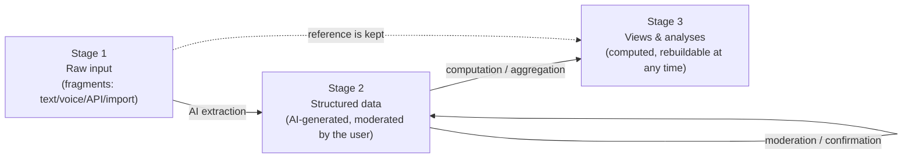
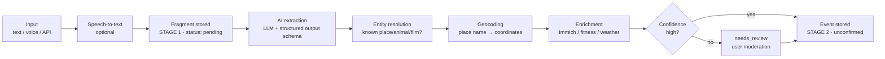
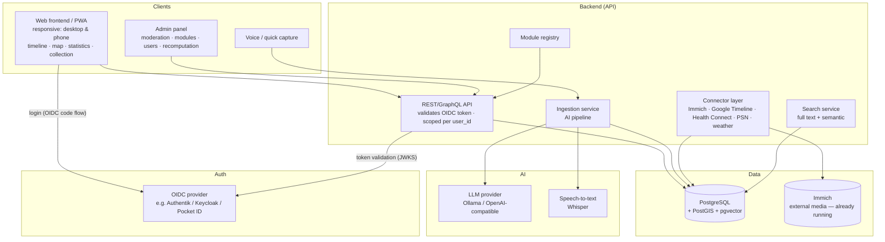

# Life-Dash — concept & MVP

> **Status:** In operation — P0 & P1 done, D1 live on the server, P2.2–P2.7 implemented (see ch. 14)
> **Document type:** architecture & product concept
> **Target environment:** self-hosted (Docker-based)
> **Last updated:** 2026-07-20

---

## 1. Vision

**Life-Dash is a searchable, analysable and visually explorable database about your own life.**

The goal is to bring scattered life data (memories, places, photos, fitness data, events) together into one central, structured database and make it tangible through several views: a timeline, a map, statistics and a collection.

The decisive difference to classic journaling apps: **capture is low-friction, via free text or voice. An AI structures, locates, dates and links the fragments automatically.**

### Guiding principles

| Principle | Meaning |
|---|---|
| **Capture first, structure later** | Entering data must be frictionless. Structure comes from the AI, not from mandatory forms. |
| **Three-stage model** | Raw input (stage 1) → moderated structure (stage 2) → computed views (stage 3). Every stage is derived reproducibly from the previous one. |
| **Raw data is the truth** | Everything always refers back to the unchanged raw input. Structure and views can be recomputed at any time (e.g. with better models). |
| **Everything configurable** | An admin panel allows adjusting modules, prompts, models, enrichment sources and views — without code changes. |
| **Modular and extensible** | New trackable categories (e.g. “concerts”, “books”, “illnesses”) without rebuilding code. |
| **Self-hosted & data sovereignty** | All data stays on your own machine. External AI only optionally and interchangeably. |
| **Confirmed vs. unconfirmed** | Concrete dates are preferred. AI-derived values are marked “unconfirmed” until the user moderates them. |
| **One data model, many views** | Timeline, map, statistics and collection are only computed projections (stage 3) of the same data. |
| **Mobile first** | Capture happens on the go. The UI is a responsive PWA; quick capture, timeline and map are built for a phone just as much as for a desktop. |
| **Multi-user from the start** | Every row in stages 1–3 belongs to a user (`user_id`). Sign-in via **OIDC** (SSO). Retrofitting auth is expensive — so it is anchored in the data model from P0 on. |

### How this software was built (note 52)

**The entire implementation of Life-Dash was written by Anthropic's Claude models — Fable and Opus — working from this concept under the author's direction.** The author sets the direction, decides the architecture, reviews the result and runs it in daily use; the code itself is machine-written. This is stated openly rather than buried, because anyone hosting a database of their own life deserves to know how the thing was made. Two consequences worth naming: the concept document is unusually detailed *because* it is the primary instruction to the machine, and every decision is recorded with its reasoning in [`DECISIONS.md`](DECISIONS.md) so that neither the author nor a later model has to guess.

### 1.1 Where Life-Dash sits (market position, note 53)

The self-hosted field splits into five camps, and all five leave out the same thing:

| Camp | Representatives | What they do well | What is missing |
|---|---|---|---|
| Location history | **Dawarich**, **Reitti**, Traccar, OwnTracks | mature, live tracking, imports everything | places only — no life around them |
| Photos | **Immich**, PhotoPrism | media with time and geo | the timeline is a file list, not a record of events |
| Journals | **Memos**, **Journiv**, Standard Notes, Day One | text, mood, fast capture | text stays text: no structure, no map, no statistics |
| Quantified self | **Heedy**, qs_ledger, Grafana + InfluxDB, Exist.io (SaaS) | metrics and dashboards | numbers without a narrative, no free-text entry point |
| Unified timelines | **Timelinize**, **HPI/Promnesia**, **Dogsheep/Datasette** | conceptually the closest relatives | Timelinize has been “not release-worthy” for years; HPI and Dogsheep are Python libraries for developers — no product, no moderation, no interface |

**The gap Life-Dash actually fills, in four points — the last one is the strongest:**

1. **Free text and speech become structured events via an LLM.** Nothing in the self-hosted space does this. Journals store text; aggregators import APIs. The pipeline *fragment → proposal → confirmed*, with a moderation queue in between, is the genuinely new part.
2. **A human-curated layer of truth.** Timelinize, HPI and Dogsheep pour machine data into one pot. The invariant “machines never change what is confirmed, enrichment is additive only” (ch. 3.1) exists nowhere else.
3. **Retroactive enrichment of manual memories** — weather attached to a holiday from 2002. Aggregators can only enrich what they imported themselves.
4. **Life-Dash covers the pre-digital life.** Every competing product begins where the data exports begin, roughly 2012. Here, “summer 2002, holiday in France” is a first-class record with `season` precision. This is the one property that cannot be copied without adopting the whole architecture, and it is the headline claim: *your memories, including the ones from before the smartphone — as a searchable database.*

**Honest weaknesses.** Against Dawarich and Reitti the map cannot win — the answer is to import from them, not to compete (P2.11). And the LLM dependency is the barrier to entry: unless the local/Ollama path is first-class and clearly documented, the very audience that takes “self-hosted” seriously will bounce.

---

## 2. Glossary & core concepts

| Term | Definition |
|---|---|
| **Event** | The central entity. Something that happened at a point or span of time in a place. “Holiday in France”, “saw an eagle in Detmold”. |
| **Entity (collection item)** | A recurring “thing” in your life: an animal, a film, a country, a game. Events reference entities. |
| **Fragment** | Raw, unstructured input (text/voice/API) before the AI has processed it. **Stage 1 — the immutable source of truth.** |
| **Trackable / module** | A registered type you can track (e.g. `movie`, `animal`, `trip`). Defines schema, icons, statistics. |
| **Fuzzy date** | A date with a precision level (`exact`, `day`, `month`, `season`, `year`, `decade`) plus a time span. Concrete times are preferred; vagueness is the exception. |
| **Confirmed status** | Marks whether a structured value has been moderated/confirmed by the user (`confirmed`) or is AI-derived (`unconfirmed`). |
| **Source** | Where a record came from: `manual`, `ai`, `immich`, `google_timeline`, `health_connect`, `psn`, `weather`, `api`. |
| **Track (route)** | A recorded movement path (LineString) from Google Timeline or fitness workouts. Stage-3 data, drawn on the map as a line layer. |
| **User** | A signed-in user (OIDC identity). All fragments, events, entities and enrichments are user-scoped. |
| **Enrichment** | Automatic augmentation of an event with photos, fitness data, weather etc. based on time and place — also **retroactively** (re-enrichment). |
| **Admin panel** | The central configuration surface: modules, AI prompts/models, enrichment sources, view rules, recomputation. |

---

## 3. Three-stage architecture (core principle)

The whole system is built as a **pipeline of three clearly separated stages**. Every stage is derived **reproducibly** from the previous one. Nothing “computed” is ever the source of truth — it can be discarded and regenerated at any time (e.g. with a better AI model).


```mermaid
flowchart LR
    S1["Stage 1\nRaw input\n(fragments: text/voice/API/import)"]
    S2["Stage 2\nStructured data\n(AI-generated, moderated by the user)"]
    S3["Stage 3\nViews & analyses\n(computed, rebuildable at any time)"]
    S1 -- "AI extraction" --> S2
    S2 -- "moderation / confirmation" --> S2
    S2 -- "computation / aggregation" --> S3
    S1 -. "reference is kept" .-> S3
```

### Stage 1 — raw input (immutable)
- Every input is stored **losslessly and unchanged** as a `Fragment` (original text, audio, imported raw data).
- It is **never overwritten**. All later stages keep a back-reference to their originating fragment.
- Consequence: the entire system can be rebuilt “from zero” out of the raw data at any time.

### Stage 2 — structured database (moderated)
- From stage 1 the AI generates structured `Event` and `Entity` records (date, place, category, linked items).
- Every derived value carries a **`confirmed` status**: `unconfirmed` (AI proposal) or `confirmed` (moderated by the user).
- The user moderates in the review/admin panel: confirm, correct, discard, merge.
- Manual corrections are “sticky”: repeated AI processing must **not** overwrite confirmed values.

### Stage 3 — views & analyses (computed, rebuildable)
- Timeline, map, statistics and collection are **computed projections** of stage 2.
- They additionally contain AI enrichments (photos, fitness, weather) and aggregations (statistics widgets).
- **Fully recomputable** — at the push of a button in the admin panel, e.g. after a model change, new enrichment sources or module updates.

### Why this separation?
| Benefit | Explanation |
|---|---|
| **Reproducibility** | Better models → simply recompute stages 2/3, the raw data stays. |
| **Trust** | A clear separation between “what I said” (S1), “what the AI made of it” (S2) and “how it is presented” (S3). |
| **Safety** | No silent data corruption: raw input is always the fallback. |
| **Moderation** | The user has full control over stage 2 without losing the raw data. |

### 3.1 Refinement: four layers (decision 2026-07-15)

“Stage 2” conceptually mixes two things that must be thought of separately. Conceptually the system consists of **four layers** (over the same tables — the `confirmed` status is the dividing line, no DB rebuild needed):

| Layer | What | Lifetime |
|---|---|---|
| **1 · Inbox** | Raw fragments (text, voice, import summaries). | Immutable, permanent. An evidence archive. |
| **2 · Proposal space** | Unconfirmed AI derivations (`confirmed = unconfirmed`). *Claims, not truth.* | Disposable — discarded and regenerated on recomputation. |
| **3 · Life database** | Confirmed events/entities/locations (`confirmed`) **plus factual enrichments**: weather, media references, tracks. Facts do not change — once fetched, true forever. | **Fixed.** The actual goal of the system. |
| **4 · Derived** | Views, statistics, aggregations, **embeddings** (model-dependent). | Disposable and recomputable at any time; no backup needed. |

**The hard invariant:** *confirmed data is never changed by machines, only extended additively (metrics, media references).* Recomputation touches layers 2 and 4 exclusively. Confirming is the transition 2 → 3 (same row, the status flips); `field_overrides` additionally protects individual manually corrected fields.
*Documented exception:* “resolve place names” replaces generated coordinate titles (“Visit: place (53.49…)”) even on confirmed imported visits — that is a user-initiated data improvement, not an AI re-evaluation; manually renamed titles stay protected.

**Linking & deletability:** every layer-2/3 row references its inbox fragment (`origin_fragment_id`, n:1 — one fragment can produce several events). The proposal space cleans itself up (confirming converts, discarding deletes). The **inbox is deliberately not deleted**, even when everything is confirmed: it costs almost nothing (text), is the provenance record of the life database and the only source for later re-extraction or comparison. At most a manual cleanup of *orphaned* fragments (all events discarded) is legitimate — never automatic.

---

## 4. User scenarios (user stories)

### Capture
- *As a user* I open Life-Dash on my **phone** (installed PWA), type two sentences into quick capture while out and about, and I am done — I moderate later on the desktop.
- *As a user* I type “12/07/2026 was in Detmold and saw an eagle”, so that the AI creates an event with a date, a place (Detmold) and an animal sighting (eagle).
- *As a user* I dictate “summer 2002 holiday in France”, so that an event appears with a date (summer 2002, marked `unconfirmed`), a place (France) and the category “trip”.
- *As a user* I moderate AI proposals: I see which values are `unconfirmed` and confirm or correct them before they count as fact.
- *As a user* I want a follow-up question or preview for ambiguous input before the record is accepted.
- *As a user* I write a **formatted journal entry** (Markdown) for a travel day — as a daily summary above the individual events, so that Life-Dash also works as a travel diary in my own voice (→ package F1). The AI never touches this text.
- *As a user* I type “just saw a kingfisher” while out and **optionally take my phone location** as the place at the push of a button — without typing, but never automatically (→ package F2).

### Views
- *As a user* I zoom the timeline from decade level down to day level to see event density and detail.
- *As a user* I see all the places I have been on a map, filtered by time range.
- *As a user* I open the statistics tab and see “how many countries have I been to?”, “how many km did I run in 2025?”, “which animals have I seen?”.
- *As a user* I open the animal “eagle” in the collection and see all sightings, photos and places linked to it.

### Enrichment & import
- *As a user* the system automatically links Immich photos from 12/07/2026 to the Detmold event (Immich already runs as a service).
- *As a user* I import my **Google Timeline export** from my phone and see visited places as events and my **routes** as lines on the map.
- *As a user* I import my **Health Connect data** (steps, heart rate, workouts) and see steps and heart rate for a hike.
- *As a user* I import my **PSN game history** (games played, trophies, play time) and see under “games” in the collection when I played what.
- *As a user* I see the **weather** for that day and place on every located event (enriched automatically).
- *As a user* I enrich **retroactively**: if I import new photos, fitness or weather data later, existing events are updated automatically (re-enrichment).

### Account & access
- *As a user* I sign in via **SSO (OIDC)** — the same sign-in as for my other services.
- *As a user* I see only my own data; other users (e.g. family members) keep their own, separate life database.

### Search
- *As a user* I search “all the times I was by the sea” and get semantically matching events, not just full-text hits.

---

## 5. Feature areas (views)

### 5.1 Timeline
The central view. A horizontal or vertical line with continuous zoom.

- **Zoom levels:** day → week → month → year → decade.
- **Aggregation:** at high levels events are condensed into “heat” clusters (event density, category colours).
- **Vague events** (e.g. “summer 2002”) are drawn as bars/spans rather than points, and marked `unconfirmed`.
- **Filters:** by category, place, source, day, confirmed status.
- **Interaction:** click an event → detail panel with photos, place, weather, linked entities.

### 5.2 Map
- All located events as markers / clusters / heatmap.
- **Time slider**, synchronised with the timeline.
- Layers: **routes (tracks)** from Google Timeline and workouts as a line layer, trips, individual places, homes, “special moments”.
- Data sources: manual places, Google Timeline import (visits **and** routes), geo tags from Immich photos, GPS tracks from fitness workouts.

### 5.3 Statistics
A configurable dashboard of “widgets”. Every module can contribute its own statistics. The widgets are **computed stage-3 projections** and recomputable at any time.

- Examples: country counter, travel kilometres, animal species seen, films per year, fitness trends, “years of life in numbers”.
- Time-range filter, comparison between years.

### 5.4 Collection
Structured collections of entities, grouped by type.

- Tabs/categories: **animals, films, games, countries, places, books, …** (module-driven).
- A detail page per entity: description, metadata, linked events, mini timeline view, photos.
- Example: “eagle” → all sightings, a map of the sighting locations.

### 5.5 Data capture (ingestion)
- Free-text field, voice recording (speech-to-text), API endpoint.
- Every input is first stored losslessly as a **stage-1 fragment**.
- **AI preview:** shows how the AI interpreted the fragment (date, place, entities, category) → the user confirms or corrects (→ stage 2).
- Batch import (e.g. an old diary, chat logs).

### 5.6 Admin panel & moderation
The central control surface for the whole system.

> **Planned split (A14):** “Settings” (every user — moderation, jobs,
> export/import, tracking choice) and “Admin” (admin role only — user
> management, system, raw DB view, logs), each with tabs.

- **Moderation queue:** review, confirm, correct, discard and merge all `unconfirmed` stage-2 records.
- **Module management:** activate/define trackables, schemas, icons, statistics widgets.
- **AI configuration:** choose provider/model, adjust prompts, set confidence thresholds.
- **Enrichment sources:** configure Immich, Google Timeline, fitness, weather and define linking rules.
- **Recomputation:** recompute stage 2 and/or stage 3 selectively or completely (e.g. after a model change) — confirmed values are kept.
- **Raw data inspection:** navigate from any event back to its originating fragment (stage 1).
- **User management:** OIDC provider configuration, user list, roles (`admin` | `user`). Import configuration (Immich API key, PSN token) is stored **per user**.

### 5.7 Mobile use (phone)

The UI is designed **responsive** from the start — not as an afterthought. The most important mobile use case is **capturing on the go**; analysis and moderation happen more on the desktop but must work on mobile too.

- **PWA:** installable on the home screen, app manifest, offline queue for quick capture (fragments are buffered locally and synchronised when a connection returns — matching the stage-1 principle “capture first”).
- **Layout:** desktop = sidebar navigation; mobile = **bottom navigation** (timeline · map · ➕ capture · statistics · collection) with quick capture as the central, prominent button.
- **Timeline on mobile:** scrolls vertically instead of horizontally; the detail panel is a bottom sheet instead of a side panel.
- **Map on mobile:** fullscreen with a time filter that can be shown or hidden; touch gestures (pinch zoom).
- **Voice input** is the most natural channel on mobile (phase 2, Whisper server-side).
- **Share target (later):** share text/photos from other apps directly to Life-Dash → becomes a fragment.

**Status 2026-07-21 (note 82).** Of the above, the bottom navigation and the vertical timeline exist; the **bottom sheet** and the **full-screen map with a foldable time filter** do not, and the phone layout as a whole is two `@media` blocks. Package **A38** closes the gap — this section is a specification, not a description, until it ships.

---

## 6. Data model (core)

The heart of the system. Deliberately lean and generic so that modules can dock on without schema migrations.

### 6.1 Entities (conceptual)

```
User                     (identity — via OIDC)
  id
  oidc_subject         (stable `sub` claim from the OIDC token)
  email
  display_name
  role                 (admin | user)
  settings             (JSON: e.g. Immich API key, PSN token, import preferences)
  created_at

Fragment                 (STAGE 1 — immutable)
  id
  user_id              (FK → User; applies equally to Event, Entity,
                        MediaRef, Metric, Track — not repeated there)
  raw_text
  audio_ref            (optional)
  source               (manual | voice | api | import)
  status               (pending | processed | needs_review | discarded)
  created_at
  processed_event_ids  (result of the AI processing)

Event                    (STAGE 2 — structured, moderated)
  id
  title                (AI- or user-generated)
  description
  date_start           (timestamp)
  date_end             (timestamp, optional)
  date_precision       (exact | day | month | season | year | decade)
  location_id          (FK → Location, optional)
  category             (trackable key, e.g. "trip", "sighting")
  confidence           (0..1, how sure the AI is)
  confirmed            (unconfirmed | confirmed)  ← moderated by the user?
  field_overrides      (JSON: which fields were manually confirmed/corrected
                        → protected from re-processing)
  source               (manual | ai | immich | google_timeline | fitness | weather)
  origin_fragment_id   (FK → Fragment, stage-1 back-reference)
  embedding            (vector for semantic search)
  created_at / updated_at

Entity            (collection item, STAGE 2)
  id
  type              (animal | movie | game | country | place | book | ...)
  name
  attributes        (JSON, schema depends on the module)
  confirmed         (unconfirmed | confirmed)
  embedding
  created_at

EventEntityLink   (n:m between Event and Entity)
  event_id
  entity_id
  role              (subject | location | mentioned)

Location
  id
  name
  geo               (PostGIS point/polygon)
  type              (city | country | poi | home)
  external_ref      (e.g. OSM ID)

MediaRef          (STAGE 3 — enrichment; a reference to external media, NOT a copy)
  id
  event_id
  provider          (immich | local | url)
  external_id       (e.g. Immich asset ID)
  captured_at
  geo               (optional, for automatic linking)

Metric            (STAGE 3 — enrichment; generic figures: fitness, weather)
  id
  event_id
  key               (steps | heart_rate_avg | distance_km |
                     temperature_c | weather_condition |
                     play_minutes | trophies_earned | ...)
  value
  unit
  source            (health_connect | weather | psn | ...)
  enriched_at       (when enriched → enables re-enrichment)

Track             (STAGE 3 — route; from Google Timeline / workouts)
  id
  date_start / date_end
  geo               (PostGIS LineString, simplified/compressed
                     e.g. via Douglas-Peucker)
  activity_type     (walk | drive | cycle | run | transit | unknown)
  distance_m
  source            (google_timeline | health_connect)
  event_id          (optional, FK → Event — e.g. a hike)
  origin_fragment_id (FK → Fragment, raw import back-reference)
```

### 6.2 Design decisions

- **Three-stage provenance anchored in the model:** `Fragment` = stage 1, `Event`/`Entity` = stage 2, `MediaRef`/`Metric` = stage 3. Every stage-2/3 row references back to stage 1.
- **`confirmed` + `field_overrides`:** separating an AI proposal (`unconfirmed`) from a moderated fact (`confirmed`). `field_overrides` protects individual, manually corrected fields from being overwritten during recomputation.
- **Concrete dates preferred:** `date_precision` allows vagueness (“summer 2002” → `season`), but vague or derived dates stay `unconfirmed` until the user confirms them. The goal is to hold dates that are as concrete and confirmed as possible.
- **Event ↔ Entity as n:m:** one event can reference several animals/items; one entity appears in many events. This is the basis for the collection **and** the statistics. (People are deliberately left out for now — see ch. 8.3.)
- **`attributes` as JSON:** module-specific fields (e.g. film rating, animal species) live in a flexible JSON field with a schema defined by the module (JSON-Schema validation). No DB rebuild for new modules.
- **Embeddings for semantic search:** events and entities get vector embeddings (pgvector) → “all the times by the sea” also finds “beach day in Italy”.
- **Media and metrics are stage 3:** referenced, not copied (Immich stays the single source of truth). `enriched_at` enables **retroactive re-enrichment** without changing stage 2.
- **`user_id` everywhere, strict tenant separation:** every stage-1/2/3 row belongs to exactly one user. The API **always** filters by the signed-in user — there are no shared events/entities (deliberately kept simple; “sharing” would be a later feature). Locations are user-scoped too for now.
- **Tracks separate from events:** a route is not an event (not an “experience”) but context. Raw timeline/GPS data is kept as a fragment (S1); `Track` is the computed, simplified geometry (S3) — regenerable with better simplification algorithms.

---

## 7. AI pipeline (ingestion)

The path from fragment (stage 1) to moderated event (stage 2) to enriched view (stage 3).


```mermaid
flowchart LR
    A[Input<br/>text / voice / API] --> B[Speech-to-text<br/>optional]
    B --> C[Fragment stored<br/>STAGE 1 · status: pending]
    C --> D[AI extraction<br/>LLM + structured output schema]
    D --> E[Entity resolution<br/>known place/animal/film?]
    E --> F[Geocoding<br/>place name → coordinates]
    F --> G[Enrichment<br/>Immich / fitness / weather]
    G --> H{Confidence<br/>high?}
    H -- yes --> I[Event stored<br/>STAGE 2 · unconfirmed]
    H -- no --> J[needs_review<br/>user moderation]
    J --> I
```

### 7.1 Steps in detail

1. **Capture (stage 1):** the fragment is stored raw immediately (never lose data, works offline too).
2. **Speech-to-text** (optional): e.g. `whisper` locally.
3. **Structured extraction (stage 2):** the LLM receives the fragment plus a **structured output schema** (function calling / JSON schema). Output: title, date (span) + precision, places, recognised entities with type, category, confidence. All values are `unconfirmed` at first.
4. **Entity resolution:** matching recognised names against existing entities (“eagle” → existing animal entity? “France” → country?). Fuzzy matching plus embedding similarity. New entities are created as candidates.
5. **Geocoding:** place names → coordinates (a local Nominatim/OSM service, no external dependency needed).
6. **Enrichment (stage 3):** based on time and place, Immich photos, fitness metrics and **weather data** are linked. Also runs **retroactively** as a re-enrichment job when new source data arrives.
7. **Review gate:** on low confidence or ambiguity → `needs_review`. The user moderates and sets values to `confirmed`.
8. **Recomputation:** stages 2 and 3 are reproducible from stage 1 at any time (e.g. with a new model) — `confirmed` values stay protected.

### 7.2 Interchangeable AI provider

The AI is encapsulated behind a **provider interface**:

```
LLMProvider (interface)
  extract_structured(fragment, schema) -> StructuredResult
  embed(text) -> vector

Implementations:
  - OllamaProvider   (local, e.g. Llama/Mistral)
  - OpenAIProvider   (any OpenAI-compatible endpoint)
  - AnthropicProvider
```

This keeps data sovereignty intact and lets you pick different models per task (extraction vs. embedding).

---

## 8. Modularity / extensibility

The central non-functional goal: **track something new without touching the core.**

### 8.1 Module concept (“trackable”)

A module registers a new type declaratively:

```yaml
# module: animals
key: animal
label: Animals
icon: paw
entity_schema:            # JSON schema for Entity.attributes
  species: string
  wild: boolean
  first_seen: date
event_categories:
  - sighting              # "saw an eagle"
statistics:
  - id: species_count
    label: "Species observed"
    type: count_distinct
    field: entity.species
  - id: sightings_per_year
    label: "Sightings per year"
    type: timeseries
compendium_view:
  group_by: species
  detail_map: true        # shows sighting locations on a map
```

### 8.2 What a module can contribute

| Area | The module's contribution |
|---|---|
| **Data model** | JSON schema for `Entity.attributes` (validated, but no DB migration). |
| **Ingestion** | Hints/prompts for how the AI recognises this type. |
| **Statistics** | Declarative widgets (count, timeseries, distinct, sum). |
| **Collection** | Grouping, detail view, map option. |
| **UI** | Icon, label, colour. |
| **Achievements** | Metric plus four thresholds (bronze/silver/gold/platinum), see F6. |

### 8.3 Example modules (starter set)

**Implemented:** `trip` · `animal` · `country` · `artist` (artists/concerts) · `food` (meals) · `milestone` (weddings, births, moving, graduation …) · `movie` · `game` · `book`.
**Planned:** `place` · `sport_activity` · `health_event`.

> Lesson from implementation: a new category touches **three places** — the module YAML (backend), rules/examples in the AI prompt and the frontend (label, colour, collection tab, form options). The declarative goal of “YAML only” is not fully reached yet (see `DECISIONS.md`, note 3).

> **People deliberately left out (for now):** a `person` module is conceptually appealing but too complex to maintain (duplicates, relationships, third-party privacy, constant assignment decisions). The focus is first on **concrete, confirmable facts** (time, place, item). The n:m data model stays laid out so that people can be added later as another module without a rebuild.

---

## 9. Integrations

| Source | Purpose | Approach |
|---|---|---|
| **Immich** | Photos & videos, geo tags, timestamps | **Already running as a service** → the first integration to implement. Immich API (`/api/search/metadata`: query assets by time range/geo), auth via API key (per user in `User.settings`). Linked via `MediaRef` — **references only, no copies**; thumbnails are passed through from Immich by a backend proxy. |
| **Google Timeline** | Visited places **and routes** | ⚠️ Since 2024 the timeline lives **on the device only** (Takeout “Semantic Location History” is gone). Import via the **device export**: Android → Settings → Location → Timeline → “Export timeline” (JSON, `semanticSegments`). File upload in the UI → stored raw as a fragment (S1) → `visit` segments become events/locations, `activity`/`timelinePath` segments become `Track`s (S3). No live access possible, so a recurring manual upload. |
| **Google Health / Health Connect** | Steps, distance, HR, workouts (incl. GPS) | ⚠️ The Google Fit REST API was shut down (2025); its successor **Health Connect** stores **on-device only**, without a cloud API. Import therefore happens by file: a Health Connect export (ZIP) or a sync app, alternatively a direct Garmin/Fitbit export. Daily values and workouts → `Metric` on events; workout GPS → `Track`. |
| **PSN (PlayStation Network)** | Games played, trophies, play time | No official public API. Approach: an unofficial API via an **NPSSO token** (e.g. the Python library `psnawp`) — a token per user in `User.settings`. Periodic sync: titles → `game` entities, sessions/“last played” → events, trophies and play time → `Metric`. Fallback: the pure trophy history (a timestamp per trophy) as an event source. Risk: an unofficial API can break → keep the connector isolated and store sync results as fragments (S1). |
| **Weather** | Context enrichment (temperature, conditions) | A historical weather API (Open-Meteo daily archive) based on time and place. Attached as a `Metric` to located events — retroactively too. |
| **Geocoding** | Place name ↔ coordinates | Nominatim (OSM) or any compatible service, self-hostable. |

**Integration principle:** every source is a **connector** with a uniform interface (`fetch`, `map_to_events`, `enrich`). New sources dock on without core changes. All connector results are **stage-3 enrichments** and recomputable at any time.

**Two kinds of connector:**
- **Pull connectors** (Immich, PSN, weather): the backend queries the source actively/periodically.
- **Upload connectors** (Google Timeline, Health Connect): the user uploads export files — a mobile-friendly upload flow in the UI (shareable directly from a phone). Raw files are archived as fragments (S1) so that re-processing stays possible.

**Duplicate protection on re-import:** imports are **idempotent** — every imported record carries a stable `external_id` key (Immich asset ID, timeline segment hash, PSN trophy ID), so repeated uploads/syncs create no duplicates.

---

## 10. Technical architecture


```mermaid
flowchart TB
    subgraph Clients
      UI[Web frontend / PWA<br/>responsive: desktop & phone<br/>timeline · map · statistics · collection]
      ADMIN[Admin panel<br/>moderation · modules · users · recomputation]
      VOICE[Voice / quick capture]
    end

    subgraph Auth
      OIDC[OIDC provider<br/>e.g. Authentik / Keycloak / Pocket ID]
    end

    subgraph Backend["Backend (API)"]
      API[REST/GraphQL API<br/>validates OIDC token · scoped per user_id]
      ING[Ingestion service<br/>AI pipeline]
      MOD[Module registry]
      CONN[Connector layer<br/>Immich · Google Timeline · Health Connect · PSN · weather]
      SEARCH[Search service<br/>full text + semantic]
    end

    subgraph Data
      PG[(PostgreSQL<br/>+ PostGIS + pgvector)]
      MEDIA[(Immich<br/>external media — already running)]
    end

    subgraph AI
      LLM[LLM provider<br/>Ollama / OpenAI-compatible]
      STT[Speech-to-text<br/>Whisper]
    end

    UI -- "login (OIDC code flow)" --> OIDC
    UI --> API
    ADMIN --> API
    VOICE --> ING
    API -- "token validation (JWKS)" --> OIDC
    API --> PG
    ING --> LLM
    ING --> STT
    ING --> PG
    CONN --> MEDIA
    CONN --> PG
    MOD --> API
    SEARCH --> PG
```

### Layers

- **Frontend:** views as stage-3 projections of the same API. State sync between timeline and map through a shared time-range filter. A **responsive PWA** — one codebase for desktop and phone (sidebar ↔ bottom navigation, panels ↔ bottom sheets).
- **Auth:** OIDC authorization code flow (PKCE) in the frontend; the backend validates tokens against the provider's JWKS endpoint and creates the `User` record automatically on first login (JIT provisioning via the `sub` claim).
- **Admin panel:** its own surface for moderation (stage 2), module/AI configuration, user management and recomputation.
- **API:** thin, authorising, delegating to services. Every query is scoped by `user_id`.
- **Ingestion service:** orchestrates the AI pipeline (ch. 7). Asynchronous (queue) for batch imports and re-enrichment.
- **Module registry:** loads module definitions, provides schemas and statistics.
- **Connector layer:** encapsulates external sources (including weather).
- **Storage:** one PostgreSQL with PostGIS (geo) and pgvector (embeddings) covers relational, geographic and semantic needs in **one** database — ideal for self-hosting.

---

## 11. Recommended tech stack

| Layer | Recommendation | Rationale |
|---|---|---|
| **Backend** | Python + **FastAPI** | Fits the existing Python environment; excellent for AI integration; async. |
| **DB** | **PostgreSQL** + **PostGIS** + **pgvector** | One database for relational, geo and semantic. Fewer moving parts. |
| **ORM/migration** | SQLAlchemy + Alembic | Established, migration-safe. |
| **Queue** | Redis / RQ (or DB-based to start) | Asynchronous ingestion and batch import. |
| **AI (LLM)** | Any **OpenAI-compatible endpoint**, provider-abstracted | Data sovereignty when run locally; interchangeable with cloud vendors. |
| **STT** | **Whisper** (local) | Voice input without the cloud. |
| **Geocoding** | **Nominatim** (public or self-hosted) | No mandatory external dependency. |
| **Auth** | **OIDC** — any standards-compliant provider (Authentik, Keycloak, Pocket ID, Zitadel …); backend: `python-jose`/`authlib` for token validation | SSO across all your services; Life-Dash manages no passwords. |
| **Frontend** | A **responsive PWA** + map library (MapLibre/Leaflet) + timeline rendering | A rich interactive UI; one codebase for desktop and phone; installable, offline capture. |
| **PSN connector** | `psnawp` (Python, NPSSO token) | The most established unofficial PSN library; isolated in the connector layer. |
| **Deployment** | **Docker Compose** | The self-hosting standard; reproducible. Immich runs separately — only a URL and API key are needed. |

> Deliberately **one** database rather than a separate vector store or geo store, to keep operational complexity low.

---

## 12. Security & privacy

- **Self-hosted only:** no data leaves by default. External AI providers are opt-in and clearly marked.
- **Auth: multi-user via OIDC from the start.** Life-Dash stores no passwords; sign-in goes through your OIDC provider (SSO). Every user has a strictly separate data set (`user_id` scoping in every query); roles: `admin` (system configuration) and `user`.
- **User secrets:** per-user connection data (Immich API key, PSN NPSSO token) is stored encrypted in `User.settings` and never delivered to the frontend.
- **Sensitive data:** life data is highly sensitive → encrypted backups, the DB never publicly exposed (only via a reverse proxy/VPN). Movement profiles (tracks) and health data (metrics) are the most sensitive categories — export and deletion must cover them completely.
- **AI transparency:** AI-derived statements are recognisable as such through `confidence`, `source` and `confirmed`; the moderation/review gate prevents silently wrong data.
- **Raw data as a fallback:** because stage 1 is immutable, faulty AI processing can be discarded and recomputed safely at any time.
- **Data control:** a full export (raw plus structured) and deletion are possible at any time.

---

## 13. MVP definition

The goal of the MVP: **the core loop across all three stages works** — enter a fragment (S1) → the AI structures it and the user moderates (S2) → see it on the timeline and map and search it (S3).

### 13.1 MVP scope (in)

| Area | MVP scope |
|---|---|
| **Three-stage foundation** | `Fragment` (S1) immutable → `Event`/`Entity` (S2) with a `confirmed` status → views (S3) recomputable. |
| **Data capture** | Free-text input plus an AI preview with confirmation/correction. (Voice: phase 2.) |
| **AI pipeline** | Extraction (date + precision, place, category, simple entities), geocoding, confidence plus review gate. |
| **Data model** | `Fragment`, `Event`, `Entity`, `EventEntityLink`, `Location` including `confirmed`/`field_overrides`. |
| **Moderation / admin** | A simple moderation panel: review, confirm and correct `unconfirmed` records; trigger recomputation. |
| **Timeline** | Zoom year → month → day; events as points/spans; click for detail; `unconfirmed` visibly marked. |
| **Map** | Located events as markers plus a time-range filter. |
| **Search** | Full text plus semantic search (embeddings). |
| **Collection** | The **animals** type as proof of modularity. |
| **Modules** | A module registry with 2–3 fixed modules (`trip`, `animal`, `country`). |
| **Auth & multi-user** | OIDC login plus `user_id` in all tables plus JIT provisioning. No user management UI in the MVP — users appear by logging in. |
| **Responsive base layout** | A mobile-capable layout (bottom navigation, quick capture) from the start; PWA manifest. Offline queue: phase 2. |
| **Deployment** | Docker Compose (app + Postgres + AI endpoint). |

### 13.2 Deliberately NOT in the MVP (out)

- Voice input / Whisper, offline capture queue (though the PWA foundation is laid)
- Immich, Google Timeline, Health Connect, PSN and weather integration (though the data model and stage-3 concept are prepared)
- Statistics dashboard (only rudimentary counters)
- A people module (deliberately left out)
- A complete module set, decade aggregation
- User management UI, sharing between users (OIDC login and data separation *are* in the MVP)

### 13.3 Definition of done (MVP)

1. I type “12/07/2026 was in Detmold and saw an eagle” → see an AI preview (stage 2, `unconfirmed`) → confirm it (→ `confirmed`).
2. The event appears correctly dated on the timeline **and** as a marker in Detmold on the map.
3. “Summer 2002 holiday in France” is stored as a span (summer 2002, `season`, `unconfirmed`) with the place France.
4. “Eagle” (animal) appears in the collection together with the sighting.
5. I can search for “France” and find the event (full text plus semantic).
6. In the admin panel I can delete the stage-2/3 data and **recompute it from the raw data** — confirmed values are kept.
7. I sign in via OIDC; a second user signs in and sees **none** of my data.
8. On a phone I can capture a fragment via the bottom navigation and read the timeline without scrolling horizontally.

---

## 14. Roadmap & implementation status

### 14.1 What already works

**P0 + P1 complete, D1 (deployment) live**, plus P2.2–P2.7:

| Area | Implemented |
|---|---|
| **Foundation** | Three-stage data model with `user_id`, `confirmed`, `field_overrides`; fragment→event pipeline; mini migration (`migrate.py`). |
| **Deployment (D1, live)** | Running in production: ARM64 single-board server, multi-arch image from GHCR (GitHub Actions), a reverse proxy in front, OIDC live (`AUTH_MODE=oidc`), PostgreSQL 18 as the Compose default, all data as bind mounts next to the Compose file (`./db`, `./data`), runbook in docs/DEPLOY.md. |
| **Auth** | OIDC (code flow + PKCE), JIT provisioning, first user = admin plus legacy data adoption, dev mode for local development. Runs live behind the reverse proxy. |
| **AI** | Provider abstraction (mock / OpenAI-compatible); a worked-out prompt with few-shot examples; retry with backoff; quota protection (a batch stops cleanly, capture-first fallback on single ingest). |
| **Views** | Timeline (zoom day→decade, category filter); map (modes day→all, category filter, calendar jump, daily routes); statistics (12 tiles including age/moves/hottest/coldest day, 4 charts); collection (counters, detail page with map and **Wikipedia description** via a Wikidata concept lookup). |
| **Capture & moderation** | AI preview with correction; **manual capture** (form, confirmed immediately); an **edit dialog** on every event card (including place→geocoding down to house number, comment field); moderation queue; confirming pulls linked entities along. |
| **Stage 3** | Weather enrichment (Open-Meteo, on demand + force); embeddings plus hybrid search (full text + semantic); admin actions with descriptions. |
| **Data control** | **Export/import** (JSON, idempotent, per user) = backup/restore/migration; “delete all data” with a double confirmation. |
| **Life-database tools** | **P2.5** bulk confirm with filters (category/source/confidence/time range) plus a mandatory preview; **P2.6** invariant tests “confirmed data is untouchable” (`backend/tests/`, pytest, offline); **P2.7** confirmation provenance `confirmed_at`/`confirmed_by` (manual/bulk/import) including a migration for existing data, visible in the edit dialog; **P2.4** automatic weather right after capture/AI analysis, weather follow-up when the user corrects time or place. |
| **UX & operations (A1–A3, v0.6.0)** | Toasts plus a confirmation modal in the app's own style instead of native browser popups (all ~20 places, including a typed confirmation for the data wipe); progress bars for timeline/JSON import (staged import, idempotent, `auto_resolve` parameter); version number from `backend/app/version.py` in the sidebar, `/health` and OpenAPI. |
| **Use & operations (v0.7.0)** | **A8** export feedback (a toast with content/size/filename); **A9** central logging (`lifedash.*`, `LOG_LEVEL`, log rotation in Compose, admin/import/geocoding/weather logs); **A10** place-name language fallback plus `namedetails` plus the admin action “transliterate foreign-script names” (`scope=nonlatin`); **A13** times visible for `exact` (“12/07/2026, 14:30–16:05”) plus time fields in the edit dialog (fix: a silent `exact`→`day` downgrade); **A5 map part** marker clustering — all points instead of a 300 cap (the numbered route up to 300 stops remains). |
| **Location, weather & countries (v0.14.0)** | **F2** a 📍 button in AI analysis (coordinates into the fragment, a place suggestion only when the text names no place) and in manual capture (address into the place field, `/api/ingest/reverse-location`). **F3** *(user decision: pure daily values)*: `temp_min_c`/`temp_max_c`, `sunshine_h`, `rain_mm`, `snow_cm`, `wind_max_kmh` plus the daily condition; the UI bundles it all into one line; statistics tiles for sunniest/wettest/windiest/snowiest day, hot/cold uses the real max/min; existing data stays untouched. **F4** country from addressdetails → `Location.country` plus a `country` entity linked to all events at that place (idempotent), applied during place resolution, forward geocoding and location capture; retroactively via the resolution runs. |
| **Modules, tracking & background jobs (v0.13.0)** | **A7** modules fully declarative: label/colour/emoji/collection/forms/AI rules from the YAML (`/api/modules` + `prompt_rules` → a dynamic system prompt); the new modules movie/game/book as proof (one file each). **A15** tracking choice: an onboarding modal on first start plus a setting in the admin area; hides UI and filters the AI prompt (`tracked_modules`). **A22** server jobs: worker threads for weather/embeddings/place names/recomputation (running without an open browser), a stop button plus a 4-second auto refresh in the jobs tab, a nightly schedule per type and user (`job_schedule`, a minute ticker in main.py). **This completes group A.** |
| **Polish & mobile (v0.12.0; 0.11.0 skipped)** | **A20** mobile fixes: the map tab showed nothing on a phone (a CSS flex collapse to height 0), search failed silently (now a local text-search fallback plus a hint). **A19** the “searched address” label was abolished (new imports stay unnamed → a plain address; a startup migration cleans up existing names/titles). **A21** export selection (“without Google Timeline data”, `exclude_source`). **A23** plain language in the UI: raw inbox/proposals/life database/views instead of “stage 1/2/3”. From here on the changelog is written in product language without package codes (note 39); the AGPL-3.0 license took effect with this release. |
| **Admin & logs (v0.10.0)** | **A14** “Settings” with tabs: moderation / my data / jobs (all users) plus system / users / database / logs (admin only) — implemented as one page with role-gated tabs rather than two separate areas (this meets the goal: users see only their own tools). **A17** log view: an admin tab “logs” with a ring buffer (the last 500 lines, level filter, `GET /api/admin/logs`). |
| **Operations & robustness (v0.9.0)** | **A11** jobs with a lock: long runners (weather, recomputation, embeddings, place names, imports) registered as jobs (`/api/jobs`), one lock per type (409 “already running” instead of a double run), a jobs table in the admin area, stale cleanup after 3 minutes without a heartbeat; DB-side duplicate protection for weather (a partial unique index plus cleanup). **A4** raw view with guard rails: enum/JSON/time validation, follow-up recomputations (title→embedding reset, time/place→weather follow-up) visible in the toast, fragment/user deletion blocked, deleting cleans up dependent rows. **A18** cluster threshold configurable (10–300, default 50, `map_cluster_min`). **A16** (fix) `month` counts as a vague date. API error details now reach the UI. |
| **Use & operations (v0.8.0)** | **A5 remainder** visit condensation: from month view up, the map bundles repeated visits to the same place (“59× home — …”, toggle “🔁 merge places”); the timeline groups identical Google visits within a time group into expandable collective cards. **A12** semantic places (“home”/“work”/“searched address”) are reverse geocoded, the label stays as a prefix (“home — Example Street 1”); existing data via “resolve place names”; an optional import filter for minimum location certainty (`min_probability`). **A6** user management in the admin panel (change roles, delete users including their data; last-admin and self-deletion protection). **Compact place names:** display names are built from selectable building blocks (street/district/city/country, per user via `/api/auth/me/settings`) rather than the full Nominatim chain; POI proper names stay in front; the action “shorten addresses” (`scope=verbose`) reformats existing data. Offline tests for A12/A6/place-name formatting. |
| **World & achievements (v0.18.0)** | **F5** a “world” tab: a choropleth world map (Leaflet plus a bundled GeoJSON, Natural Earth 110m, public domain) plus a per-continent checklist with an expandable list of what is missing; country reference data (`backend/app/data/countries.py`, name → ISO → continent) connects the name-only `country` entities to the map shapes and merges aliases. **F6** an “achievements” tab: bronze/silver/gold/platinum, declared in the module YAMLs (metric plus four thresholds), a pure layer-4 derivation counting only confirmed data and respecting the tracked modules. |
| **Print & portability (v0.19.0)** | **F8** a print dialog with a date range, presets and content switches; printing builds a dedicated page containing every event in the range instead of the on-screen view. **A27** the generality audit: `.env.example` is the complete setup reference, Compose no longer forces an AI key or hardwires vendor defaults, README/backend README/DEPLOY rewritten for portability. |
| **Bilingual (v0.20.0)** | **F10** the interface can be switched between German and English (a catalog mechanism where German stays the source of truth), the language is stored per device and on the account, and place-name lookups follow it (`Accept-Language`, the remainder of A25). Documentation switched to English. |
| **Modules** | trip, animal, country, artist (concerts), food (meals), milestone (life events), movie, game, book. |

### 14.2 Roadmap

**Principle:** two groups — **A: necessary/sensible for general use** (operations, usability, data safety) and **B: new features**. **The focus is on group A**; features from B come afterwards or as a deliberate exception in between.

Effort: S = hours · M = ~1 day · L = several days. No package blocks another except where noted.

**Already done** (details in 14.1): D1 deployment · P2.2 timeline import · P2.3 vague-date review · P2.4 auto enrichment · P2.5 bulk confirm · P2.6 invariant test · P2.7 confirmation provenance · **A1–A3 (v0.6.0)** · **A8/A9/A10/A13 plus the A5 map part (v0.7.0)** · **A5 remainder/A12/A6 (v0.8.0)** · **A4/A11/A16/A18 (v0.9.0)** · **A14/A17 (v0.10.0)** · **A19–A21/A23 (v0.12.0)** · **A7/A15/A22 (v0.13.0)** · **F2–F4 (v0.14.0)** · **F1/F7/F9 (v0.15.0)** · **A24–A26 (v0.16.0)** · **F8 first stage (v0.17.0)** · **F5/F6 (v0.18.0)** · **F8 selection dialog/A27 (v0.19.0)** · **F10 (v0.20.0)** · **A28/F14 (v0.21.0)** · **F13 (v0.22.0)** · **F11/F12 (v0.23.0)** · **F15/F8 (v0.24.0)** · **P2.1 stage 1 (v0.25.0)** · **A29 (v0.26.0)** · **A30/A31/A32 (v0.27.0)** · **F16/A33/A34 (v0.28.0)** · **fixes (v0.28.1)** · **A35 (v0.29.0)** · **P3.1 (v0.30.0)** · **fixes (v0.30.1)** · **A36/F17 (v0.31.0)** · **A37 (v0.32.0)** · **A38/A40 (v0.33.0)** · **A39/F18/A41 (v0.34.0)** · **F19/A42 (v0.35.0)**.

#### Group A — necessary & sensible for everyday use

**Group A was complete with v0.20.0; the feedback rounds since have added A28–A42**
— each one an observation from actually using the thing, which is the channel note 86
called the most productive one this project has. **All of them are implemented**, the last
(A42) in v0.35.0 — group A is complete again. The detailed record
of what each package changed lives in 14.1 and in [CHANGELOG.md](../CHANGELOG.md),
so the table below keeps one line per package rather than repeating it.

| No. | Package | Done in | Content |
|---|---|---|---|
| **A1–A3** | UI dialogs/toasts instead of browser popups · progress bars for large imports · version number in sidebar and `/health` | v0.6.0 | — |
| **A4** | Guard rails for the raw DB view: enum/JSON/time validation, visible follow-up recomputations, protected fragments/users | v0.9.0 | — |
| **A5** | Decade aggregation & visit condensation (map and timeline), marker clustering instead of a 300 cap | v0.7.0/v0.8.0 | — |
| **A6** | User management UI (roles, deletion, last-admin and self-deletion protection) | v0.8.0 | — |
| **A7** | Full module build-out: label/colour/emoji/forms/AI rules from the module YAML | v0.13.0 | — |
| **A8** | Export feedback (toast with content, size, filename) | v0.7.0 | — |
| **A9** | Central logging (`lifedash.*`, `LOG_LEVEL`, log rotation) | v0.7.0 | — |
| **A10** | Place-name language fallback plus foreign-script resolution | v0.7.0 | — |
| **A11** | Jobs with a lock (`/api/jobs`), one lock per type, stale cleanup | v0.9.0 | — |
| **A12** | Timeline import: semantic places → real addresses, label kept as a prefix | v0.8.0 | — |
| **A13** | Times visible and editable for `exact` precision | v0.7.0 | — |
| **A14** | Admin split into role-gated tabs (moderation/my data/jobs vs. system/users/DB/logs) | v0.10.0 | — |
| **A15** | Tracking choice by the user (onboarding modal plus setting) | v0.13.0 | — |
| **A16** | Fix: month precision counts as a vague date | v0.9.0 | — |
| **A17** | Log view in the UI (ring buffer, level filter) | v0.10.0 | — |
| **A18** | Map clustering only above a configurable threshold (10–300) | v0.9.0 | — |
| **A19** | “Searched address” label abolished, existing data cleaned by migration | v0.12.0 | — |
| **A20** | Mobile fixes: map tab and search | v0.12.0 | — |
| **A21** | Export with a selection (`exclude_source`) | v0.12.0 | — |
| **A22** | Server-side background jobs plus a nightly schedule per type and user | v0.13.0 | — |
| **A23** | Plain language in the UI instead of “stage 1/2/3” | v0.12.0 | — |
| **A24** | Map height coupled to the viewport plus a fullscreen toggle | v0.16.0 | Closed in v0.19.0: “improve generally” held no decision and is no longer kept open. |
| **A25** | One place-name run with a scope selection instead of three buttons | v0.16.0 | The F10 part (`Accept-Language` follows the app language) landed in v0.20.0. |
| **A26** | “My data” tab regrouped into clear blocks | v0.16.0 | — |
| **A27** | Generality audit: `.env.example` as the complete setup reference, no vendor defaults hardwired, portable docs | v0.16.0/v0.19.0 | — |

**Open in group A:**

| No. | Package | Effort | Content | Benefit |
|---|---|---|---|---|
| **A30** | ✅ **Show that something is happening** *(note 61; done v0.27.0)* | S | Opening the app can take seconds on a large database, and until then the screen simply sits there — indistinguishable from a hang. A loading bar plus skeleton placeholders while the first request runs, and the same treatment wherever a view fetches. **This treats the symptom on purpose** (see note 61): the cause is the payload, and A36 is the cure. Cheap, immediate, and honest as long as nobody claims otherwise. | The difference between “slow” and “broken” is whether anything moves. |
| **A31** | ✅ **Weather record counts days, not entries** *(note 64; fixed v0.27.0)* | S | The F11 aggregations count **events**, but weather is a property of a **day**. After a timeline import a single day holds dozens of visits that all share one weather record, so “rainy days per year” can exceed 365, total sunshine hours are multiplied by the number of entries per day, and “warmest trip” averages over entries instead of days. Fix: collapse to one weather record per calendar day before aggregating, and say so in the panel. | Numbers that are wrong by a factor of ten are worse than no numbers. |
| **A32** | ✅ **One direction for the backup options** *(note 65; done v0.27.0)* | S | The export dialog mixes polarities: “without Google timeline data” excludes, “with photos” includes. Two ticks that mean opposite things sit two lines apart. Fix: everything reads as **include** (“include imported visits”, “include photos”), with photos ticked by default so the complete backup is the default path. | A backup dialog is the last place to make someone think twice about what a tick means. |
| **A33** | ✅ **Delete my own data** *(note 66; done v0.28.0)* | S–M | “Delete all data” exists only for admins and clears the whole instance. Every user needs the same for **their own** data — the counterpart to export, and in a multi-person setup the only honest answer to “get rid of my stuff”. Same rules as the admin version: names of the image files collected first, rows deleted, then the files; typed confirmation; fragments included (they are the user's raw material, not shared evidence). | Data sovereignty means being able to leave, not only to look. |
| **A34** | ✅ **Progress on long-running actions** *(note 67; done v0.28.0)* | S–M | Large export, large import and “delete data” run without any sign of life — not even in the log. Fix: report progress for all three (the archive export streams anyway, so it can count files as it goes), and log start, progress and result the way the jobs do. | Without it, a ten-minute export is indistinguishable from a crashed one. |
| **A35** | ✅ **Sign in without OIDC** *(note 62; done v0.29.0)* | L | `AUTH_MODE=local` as a full alternative: email and password, hashed properly, the first account becomes admin, further accounts created through the existing user management, password change, and sessions as they already work. OIDC stays equal beside it, `dev` mode stays for local development only. **This is a prerequisite for R1**: requiring a running identity provider costs most first-time visitors before they ever see the app. Needs care — it is the first password Life-Dash stores, so: a modern hashing algorithm, no user enumeration through error messages, rate limiting on failed attempts. **Plus a first-run form (note 73):** the sign-up flow offers to enter a few facts straight away — birth date, home town, maybe a milestone or two — which become the first **confirmed** entries (including the birth event that F17 reads), turning an empty app into a populated one. **Delivered in v0.29.0:** scrypt hashing (stdlib, no compiled dependency) with a per-password salt; identical response for wrong password and unknown email, with a dummy hash equalising the timing; per-account lockout after repeated failures; first account becomes admin, further accounts by an admin; a startup warning if SESSION_SECRET is still the placeholder. The first-run form landed as a skippable card on the empty “Today” view (creating a “Geburt” milestone, which F17 will read). Scope note: no password-reset flow and the lockout is per-process (documented in DEPLOY); both are acceptable for a self-hosted tool and revisited only if needed. | Whoever wants to try Life-Dash should not have to install Authentik first. |
| **A36** | ✅ **Slim event list** *(note 61; done v0.31.0)* | M | The timeline loads **every** event with all metrics, media and entities in one request. Measured on 2026-07-20: 2.0 kB per event, so 20,000 events mean **38 MB** in one response — and 74 % of that is detail the list never shows. F12 roughly doubled it by adding weather fields. Fix: a slim list (title, date, place, category, counts) with details fetched when a card is opened. **Decided 2026-07-20: not now** — A30 makes the wait visible first; this package waits until the wait itself becomes the problem. | Three quarters of the transfer is data nobody is looking at. **Delivered in v0.31.0**, but by a smaller cut than the package first imagined: rather than a truly minimal list, only the raw weather metric rows are dropped (they are ~67 % of the payload — 16 rows per entry) and replaced by one compact `weather` object; entities, media and location stay, so the timeline card renders unchanged. `/api/events?slim=1` is used by the timeline, Today and map; the statistics view keeps the full list (it needs the raw figures) and loads it only when opened. Measured 60 % smaller (~19→8 MB at 12k). The heavier, behaviour-changing options (server-side paging) stayed off the table. |
| **A37** | ✅ **Server-side time window** *(note 81; done v0.32.0)* | M–L | Even after A36 the list endpoint sends **every** entry in one response; note 80 measured where the seconds go and named this the next lever. The timeline asks for a **date window** (the current year) and loads more as it scrolls; `/api/events` gains `from`/`to`/`limit`/`offset` and an index of counts per year, so the year headings and the scroll extent are right without loading anything. The three remaining readers of the full list move with it — and *that*, not the paging itself, is the substance of the package: the **map** gets its own thin geo endpoint (id, lat/lon, date, category — roughly 50 instead of 700 bytes per entry, windowed and optionally bounded by the visible area); the **statistics** stop being a client-side reduce over every entry and become **SQL aggregates** (today `loadStats` counts places, categories, milestones, moves, concerts and unconfirmed entries in the browser — under a window those tiles would be quietly wrong, and as aggregates they also get faster); the smaller full-list readers (vague dates, the journal's day lookup, the print range) get server-side filters instead. **Trap to plan for:** F17 derives age from the birth milestone found in the loaded list — outside the window it vanishes, so it needs its own small lookup. Composite index on (`user_id`, `date_start`). **Delivered in v0.32.0**, measured over HTTP at 12,000 entries: the opening request fell from **12.7 MB / 1.49 s to 0.31 MB / 0.08 s** (one page of 300 plus a year index of 474 bytes), and the statistics tab from 26 MB / 5.5 s to **2 kB / 0.39 s**. Everything the plan named was moved: map (own endpoint), statistics, vague dates, journal day, print range, and the F17 birth milestone, which now travels in the year index. Two things the plan did not foresee and the work did: the **F7 child count** had the same defect as the age chip (children can sit on an unloaded page, so the server counts them), and **clicking a statistics tile** had always silently done nothing when the entry was not in memory — with paging that would have been the normal case, so single entries are now fetchable. | Whether the database holds 12,000 or 200,000 entries stops mattering. This is the last hard ceiling on size. |
| **A38** | ✅ **Mobile layout pass** *(note 82; done v0.33.0)* | S–M | Ch. 5.7 promises more than was ever built: the whole phone layout is **two** `@media` blocks. Audited 2026-07-21, in order of how much it costs daily: **nine** navigation items share one bottom bar — about 40 px each on a 360 px screen, below the 44 px touch target, with 10 px labels; the settings page keeps thirteen inline `min-width:215px` label columns that the mobile block never overrides, so its rows squeeze or overflow sideways; the edit dialog is capped at `90vh` while the rest of the app correctly uses `dvh`, so with the browser's address bar showing, its lower edge — the save button — sits off-screen; the raw-data tables are `nowrap` inside a horizontal scroller, which is honest but barely usable. Then the two unfulfilled promises from ch. 5.7: the detail view as a **bottom sheet** instead of a side panel, and the map **full screen** with a time filter that can be folded away. **Delivered in v0.33.0.** The bottom bar carries **four** destinations plus a “More” sheet whose rows are 48 px tall and spell the name out; the sheet is *cloned* from the sidebar rather than written twice, so a future navigation entry cannot exist in one menu and not the other, and the unconfirmed-entries badge is mirrored onto “More”. The promised bottom sheet turned out to be the **edit dialog** — there is no separate detail view; clicking a card opens the editor — so that one dialog satisfies both open promises at once. Two things the audit had not seen, both found by writing the guard rather than by reading the code: the `vh` fault was **not** limited to the edit dialog (the photo lightbox and the log view had it too, and any `max-height` in `vh` has it by construction), and the inline-width fault existed at **four** further places beyond the settings columns (the map's period label, the raw-table inputs, the job names). `tools/check-a38-mobile.js` now enforces both as *rules* — no inline `min-width`, no `max-height` in `vh` — rather than as a list of the places that happened to be wrong. | Capture happens on the phone — “mobile first” is a guiding principle, and the gap between it and the code is now measured. |
| **A40** | ✅ **The map's display controls** *(note 92; done v0.33.0)* | S | Four controls under “Display” that the author could no longer explain — which turned out to be a fair reaction rather than a memory problem, because two of them routinely did nothing while looking switched on. Three defects, in order of how misleading they were: **(a) “Connect route” drew nothing whenever clustering was active** (`!clustered && mp.showRoute`) and gave no sign of it; **(b) “Merge places” did nothing in day and week view**, likewise silently; **(c) two unrelated things were both called a “route”** — the *measured* paths from the timeline import and a *drawn* line through the period's places in chronological order. On top of that, “cluster above N points” put a performance guard in the position of a preference, next to a third, entirely invisible cap (300 markers). Resolved to **two layer switches and one condensing switch**: “Paths travelled” (measured), “Connect in order” (drawn, and **visibly struck through with a reason** when condensing makes an order meaningless), “Merge points” (one switch; whether it merges per place or by proximity follows the zoom level, which is a technical matter and no longer the user's). The threshold moved to the settings. `tools/check-a40-map-controls.js` guards the property that actually mattered: no control may be silently inoperative. | A control that looks switched on and does nothing teaches you to distrust the whole panel. |
| **A39** | ✅ **The city as its own field — and the timeline condensed by it** *(note 88; done in 0.34.0)* | M | After a timeline import a single day holds dozens of visits, each its own line, each named down to the street (“Kaiserstraße, Bilk, Düsseldorf”). Two halves, one prerequisite. **(a) The field:** `Location` carries `country` (F4) but no `city` — the town exists only as a *text fragment inside the assembled name* (`PLACE_NAME_PARTS = road, suburb, city, country`, chosen per user), and the raw `addressdetails` are not stored. So the city cannot be derived from what is already in the database: it needs re-geocoding — but **not a new mechanism**, because the place-name run (A28) already walks the places with backoff, progress and a lock. `city` becomes one more field written by that run, and is filled at import time for new places. **(b) The condensation:** consecutive entries sharing a city collapse into one timeline row (“Düsseldorf · 12 visits · 08:14–19:30”), expandable. Done **server-side** — with A37's paging a client-side collapse would turn a page of 300 into twenty visible rows and make the scroll auto-fill misbehave, the same defect note 85 already had to fix once for the visit filter. **The map is explicitly not touched:** movements are `Track` rows, not events, and are drawn from `/api/tracks` — all lines stay, at full point density (decision 11). One field, three payoffs: “cities visited” as a real statistic, a stable grouping key for the timeline, and both of them independent of which name format the user has chosen. **Delivered in 0.34.0.** Two decisions the plan did not contain and the work forced. **(a) “No city” had to become a stored answer.** A place in the woods genuinely has none, and `NULL` alone cannot tell “never looked” from “looked, there is none” — so the backfill would have re-queried every cityless place on every run, forever. That is precisely the endless-retry trap F12 had to remove with `weather_rev`; here an empty string carries the distinction, and `test_a39_city.py` pins it. **(b) The condensation had to happen *before* the paging, not after.** Grouping a finished page would let a page boundary cut a group in half, and both halves would show a count that is too low — silently. So the *set* is reduced first (one representative per day and city, chosen by `min(id)` because a representative must above all be stable across identical calls) and the paging runs over the representatives; count and time span come from a separate aggregate. One consequence worth stating: a condensed card is **not** an event, so clicking it opens the group rather than the editor — editing an arbitrary one of twelve represented visits is exactly the kind of silent wrongness note 92 named. | The timeline stops being a street-by-street log and goes back to being a timeline — and the collection finally answers “which cities have I been to?”, which today it can only guess from name strings. |
| **A41** | ✅ **Cities you can open — filter, tile and a collection tab** *(notes 94/95; done v0.34.0)* | S–M | A39 delivered `Location.city` as a field, a statistic and a timeline condensation, and left it impossible to *select* on. Three consequences of that one gap, fixed together. **(a) A server-side `city` filter** on the list endpoint — per A37 a selection over the whole holding belongs to the server, not to the loaded window. **(b) The dead ends get destinations:** the “cities visited” tile and every bar of “most-visited cities” (which had no click handler at all) lead into the timeline filtered to that city. **(c) A “Cities” tab in the collection**, beside countries: name, number of visits, first and last time there, leading into the same filtered view. The places, all 800-plus of them, deliberately get **no** tab — note 95 draws the line at whether a set has a horizon; an unbounded coordinate index is what the map is for. **Delivered in v0.34.0**, all three parts — and the tab left one asymmetry behind that only became visible once it existed: a city card is a *tile with a destination*, not a **collection entry**. Every other type in that view opens a detail page (Wikipedia summary with a picture, a map of the linked places, the entries themselves); cities skip straight to the filtered timeline. That is not an oversight but a consequence of the correct decision underneath: cities are deliberately no `Entity` (note 95), and the entire detail path hangs off an entity id. Picked up as **A42**. | “87 cities” is only worth showing if you can then ask which ones — and a bar that looks clickable and is not teaches distrust of the whole page. |
| **A42** | ✅ **The cities become a real collection** *(note 102; done v0.35.0)* | S–M | A41 gave the cities a tab; this gives them a **page**. Today a city card jumps into the filtered timeline, while every other collection type opens a detail view — description, picture, a map of the places it holds, the entries below it. The gap is structural, not forgotten: `openEntityDetail` is built entirely on an entity id (`/api/entities/{id}/events`, `/api/entities/{id}/describe`, which parks the text in `Entity.attributes`), and a city is deliberately **not** an `Entity` — `Location.city` is the single truth, and a mirrored entity row would drift apart at the next place-name run (note 95). So the city needs its own two halves: an **events-by-city endpoint** (the filter from A41 already exists, this only aggregates it) and **somewhere to cache a description**. The latter is the reason for the schedule: a small `city_info` table keyed by name, country and language — a pure layer-4 derivation, discardable at any time, but a **schema addition**, and per ch. 14.3 those are cheap before the demo dataset and expensive after it. Two traps to plan for: **ambiguous names** (Springfield, Frankfurt) mean the country from `CityRead` must go into the Wikidata lookup or the app will confidently describe the wrong city; and `services/wikipedia.py` asks **`de.wikipedia.org` hardcoded**, which since F10 means a German text under an English interface — a pre-existing wart shared with animals and countries that this package would make more visible, so it is fixed here for all of them. **Delivered in v0.35.0**, and both planned traps were real: with the country in the query Wikidata returns Frankfurt *am Main* and a Springfield that exists, without it a disambiguation page. Two things the plan did not contain. **(a) A failed lookup had to become a stored answer** — a place with no article is normal, and without a marker every opening of the page would ask Wikipedia again; this is the third appearance of the same trap (F12's `weather_rev`, A39's empty-string city), so it was written down as a pattern this time rather than as a fix. **(b) The tab was not there at all.** `rebuildCompTabs()` replaces the whole tab bar from the module list the moment `/api/modules` answers, and the cities tab — belonging to no module — was hand-written in the markup beside it. It existed until the first response, which in a real session means never. `check-a41-cities.js` had asserted its existence since the day it shipped and passed, because it read the page *before* the modules loaded: **a guard that checks a state nobody is ever in.** It now drives `applyModules()` first. | A collection answers “which ones do I have?”; a number with a link answers “where were you?”. Cities are the only entry in that view that still answers the second question. |
| **A28** | ✅ **One place-name run instead of a scope selection** *(note 50; done v0.21.0)* | S | The scope selection is gone from the UI: one run covers the **deduplicated union** of all three candidate sets, `unnamed` first, and the three scope-specific progress checks became one condition (`_name_defect`). Every place is geocoded **at most once** instead of up to three times. `scope` survives as an optional API parameter so existing job entries and scripts keep working. | — |
| **A29** | ✅ **Complete backup including media** *(note 58; done v0.26.0)* | M | Once F15 exists, the JSON export is no longer a full backup — binary files do not fit in it. This package restores the property that one action saves everything: a **ZIP export** containing the existing JSON plus the media directory in a defined layout (`export.json` + `media/<id>.<ext>`), and — the half that is easy to forget — an **import side that round-trips it**: the archive is read back, files land in `MEDIA_DIR`, `MediaRef` rows are relinked by their stable IDs, and re-importing the same archive changes nothing (idempotent, as with all imports). The plain JSON export **stays** as a second option: fast, small, readable, diffable, and the right choice for anyone who backs up their media folder by other means. The selective export (`exclude_source`, A21) applies unchanged. Written as a **stream**, never assembled in memory — a life's worth of photos is gigabytes, not megabytes. **Implementation notes:** thumbnails are deliberately left out of the archive (derivable) and regenerated on import; Immich references are exported but their files are not (they belong to another system). Archives are treated as foreign data exactly like uploads: entries outside `media/` or carrying any path component are refused (zip slip), and every file is verified to be a real image before being written. Two pre-existing defects surfaced only because this package forced a genuine backup-and-restore run — see note 59. | One button restores everything, on a new machine too. Without it, “self-hosted data sovereignty” has a hole exactly where the irreplaceable data sits. |

| **A45** | ✅ **A point per geotagged photo** *(note 116; done v0.39.0 — **superseded by note 139**, 2026-08-02)* | M | Reported from use: Immich left behind “London, 1200 pictures” as a single entry and therefore a single dot on the map, although each of those 1200 pictures knows for itself where it was taken. A45 answered that with its own table (`photo_points`), a discardable layer-4 derivation, explicitly creating **no events** — a photo is evidence, not an entry (note 87). **Note 139 reversed the last part and dissolved the table.** With note 138 the day clusters became confirmed events, and two mechanisms were then drawing the same photos onto the same map with two different caps. What A45 established still holds and is why the replacement works: the place comes from `exifInfo` rather than Nominatim, the three filters of note 107 apply, the layer is off by default, and a derivation must never hide the life database (the uploaded pictures in the day strip, note 57). What changed is where the coordinate lives — `PhotoPoint` was a place plus a timestamp plus an asset id, and all three already had a home in the event model. | A single dot for a fortnight in London is not a map, it is a label. |
| **A46** | ✅ **Imports stop producing multi-day events** *(note 116; done v0.39.0)* | S–M | Google reports the start and the end of a stay; the import took both over as they came, so every night in one's own bed became a **two-day** event. At a home address that is not an edge case but almost every night — reported as over two thousand of them. The damage is not the row but what hangs off it: a multi-day entry appears in every day of its span, counts twice in “on this day”, and is the only candidate the bulk day-split run would then turn into child rows. A span is a *statement* — “this lasted several days” — and nobody wants to make it about a night's sleep. **Multi-day now only ever comes from a human.** New visits are cut at the day boundary with the timestamps kept to the second; the existing stock is caught up by a run with a preview that names the number of rows *afterwards*, because “2,000 visits” sounds like tidying up and “4,000 rows” is the number that makes someone pause. The run touches confirmed data, which is why every one of its limits exists: a human starts it, never the nightly schedule, and only `google_timeline` — `date_end` was never a statement there but an artefact of the hand-over. The expensive part was idempotency: rows from before A46 carry the bare hash, so a re-import that only knew the new suffixed keys would have added every night a second time, *beside* the old one. | A promise about the shape of the data is worth more than a filter that hides its consequences. |
| **A47** | ✅ **Choose how coarsely the timeline condenses** *(note 116; done v0.39.0)* | S–M | A39 condensed imported visits by `(day, city)`, hardcoded. That is a good default and a poor rule: “which countries was I in during 2019?” and “which parts of Berlin?” are both fair questions, and which one applies is known only to whoever is looking. Four levels — country, city, district, exact point — as a dropdown rather than a slider, because four named steps are a choice and an unlabelled slider would have to be tried instead of read. **Condensed on the server**, since the timeline pages (A37) and grouping after paging cuts a group at the page boundary, leaving both halves with a number that is too small. The district comes out of `Location.address`, the raw geocoder parts kept since note 110, through a fallback chain — Nominatim names that level `suburb`, `city_district`, `neighbourhood` or `quarter` depending on the country, so a query on `suburb` alone would find nothing across half of Europe and look like “there is no district”. Two findings while building. **(a) JSON columns store Python `None` as JSON `null`, not as SQL NULL** — `address IS NULL` did not match those rows, so the backfill would have skipped them forever while the counter claimed nothing was outstanding. **(b) The place-name run's termination now depends on `_apply_resolved_name` leaving a marker on every path**, and both of its early exits did not; the test suite ran endlessly, which is the same loop notes 77 and 96 describe in two other shapes. | The condensation was answering one question well and three others not at all. |
| **A48** | ✅ **Vector maps as a background map** *(note 116; done v0.39.0)* | S–M | Asked for “Immich's nicer map”. Checking rather than guessing settled it in ten minutes: Immich's style is `"type": "vector"`, specification version 8, served from its own tile endpoint — and it is not an API endpoint at all but an admin setting pointing at a style document. Leaflet cannot draw that; it needs MapLibre plus a Leaflet bridge. Added from the CDN like Leaflet and markercluster themselves, versions pinned, and **no provider preset** (A27) — the help text only says where to look up the one your own Immich uses. The interesting part is the failure mode: a vector map can fail for three reasons — no style URL, no library, no WebGL — and **all three look identical on screen: grey**. So the choice is not offered when it cannot work, and the reason is a sentence in the settings, where it can be acted on. That is A40 one level down. | The map is the view people look at longest; “it is grey” is the least useful thing it can say. |
#### Group B — new features (order: features first, new import sources LAST — decision 2026-07-19)

| No. | Package | Effort | Content | Benefit |
|---|---|---|---|---|
| **F1** | ✅ **Travel journal (formatted text)** *(done v0.15.0 + v0.36.0 — a journal category with a day header, Markdown rendered with hand-written sanitising; the **AI-suggested daily summary** completed it, note 108)* | M–L | Expanding the comment idea (the `note` field exists and is never touched by the AI) into real diary entries: **formatted text (Markdown)** instead of a one-line note, longer texts per event; plus a **day level** — one journal entry per day (its own `journal` category with `date_precision=day`, which fits the event model without a schema rebuild), rendered in the timeline as a day header above the individual events. Markdown is rendered sanitised. | The fact collection becomes a real travel diary — memories in your own voice instead of only structured data. |
| **F2** | ✅ **Take the phone location when capturing (optional)** *(done v0.14.0)* | S–M | Offer the current device location via the geolocation API during quick capture (both AI analysis **and** manual entry): a “📍 use my location” button — **never automatic** (location is sensitive, and entries often concern the past or other places). Coordinates → reverse geocoding → a place suggestion in the preview/form field, overwritable by the user; if the text names a place itself, the text wins. The raw coordinates travel into the fragment (S1) so re-processing knows them. Requires HTTPS. | On the go, typing the place is unnecessary — the most common capture case becomes a two-tap entry. |
| **F3** | ✅ **Refine the weather logic** *(done v0.14.0)* | S–M | Previously: `temperature_c` = the mean of the daily max/min, `weather` = the most significant weather code of the day (one hour of morning rain would mask a sunny day). New: `temp_min_c`/`temp_max_c` as their own metrics, the condition derived from hourly data (the dominant weather during the day), optionally precipitation totals/hours. Existing data can be extended additively by re-enrichment. | The weather shown matches how the day felt; more precise statistics. |
| **F4** | ✅ **Imports feed the collection (countries)** *(done v0.14.0)* | M | The timeline import used to create only events and locations — no entities or links, so the country collection and country statistics stayed untouched by imports. New: take the country from the `addressdetails` during (reverse) geocoding, store it on the `Location` and create/link a `country` entity per visited country — as part of place resolution, retroactively via “resolve place names”. | “How many countries have I been to?” is finally correct — fed from real movement data. |
| **F5** | ✅ **World tab: country map & continent checklist** *(note 27; done v0.18.0)* | M | A tab of its own: a **world map with visited countries shaded** (choropleth over Leaflet plus a bundled country GeoJSON, fed from the `country` entities) and **checklists**: continents (7/7?), countries per continent, “most recently new”. Country reference data (`backend/app/data/countries.py`, ISO/German/English/alias → continent) connects the name-only entities to the map shapes and merges aliases; names that match nothing are surfaced instead of silently dropped. | “Where have I been?” at a glance — and it motivates filling the gaps. |
| **F6** | ✅ **Achievements (bronze/silver/gold/platinum)** *(note 28; done v0.18.0)* | M | A tab with achievements in four tiers, **declared in the module YAMLs**: one metric plus thresholds per achievement, e.g. “animal collector” (5/25/100/500 species seen), “globetrotter” (countries), “concert goer”, “gourmet”. Computed from layer 2 (a layer-4 derivation, recomputable at any time, holding no data of its own). Displayed with a progress bar toward the next tier, which measures from the tier reached rather than from zero. Counts confirmed data only and respects the tracked modules (A15). | A playful incentive to record experiences — it makes the life database rewarding. |
| **F7** | ✅ **Multi-day events with day sub-events** *(note 37, decided: “both”; done v0.15.0)* | M–L | A multi-day event (“Mallorca 05–12 July”) stays ONE trip event but gains **linked day events** (parent–child). **The data-model consequence is small:** one new column `Event.parent_event_id` (self FK, nullable) — no new table type. The work is in the behaviour: day children are created for the span at the push of a button (“Mallorca — day 3”, `day` precision, inheriting place and confirmation); **enrichment (weather, later photos) hangs on the children** = per day; the parent shows the day bar aggregated; the timeline shows children collapsed under the parent (day zoom shows them individually); deleting the parent asks whether the children go too; export/import and recomputation protection (`confirmed`) apply unchanged — children are normal life-database events, only with a provenance link. | Every holiday day carries its own weather, photos and notes — without flooding the timeline with duplicates. |
| **F8** | ✅ **Print view for selected days** *(note 38; first stage done v0.17.0, selection dialog done v0.19.0)* | M | Pick a range → a print-friendly page (light layout, no navigation): events chronologically with place, weather, notes, later photos; the browser print dialog (PDF). Implemented: a dialog with from/to plus presets, switches for descriptions/notes/imported visits/proposals and a live count; printing builds a dedicated `#print-area` instead of the on-screen view, so collapsed groups no longer matter. **Completed in v0.24.0:** “printing with photos” landed with F15 — it never needed Immich, only *some* source of pictures. Prints the preview version, not the original: a page of full-resolution images stalls the print dialog and looks identical at print size. | Memories physically: print holiday days or share them as a PDF. |
| **F9** | ✅ **Light mode** *(note 41; done v0.15.0)* | S–M | The app used to be dark only; the colours already live in CSS variables. New: a light theme plus a switch (auto following the system setting, manually overridable, stored per device). The map switches tile style with it. | Readability in daylight; the basis for the print view (F8). |
| **F10** | ✅ **Bilingual: app de/en, docs in English** *(note 42, decided; done v0.20.0)* | M–L | The **app UI** has a German/English switch (a string catalog instead of hard-coded text — the actual work, since all text lives inline; AI prompts are unaffected). German stays the source of truth in the markup, the `I18N_EN` catalog holds English only, and a missing key falls back to German so no label can ever be empty. The language is stored per device and on the account, and drives `Accept-Language` for place-name lookups (this also completes A25). The **docs (README, CHANGELOG, KONZEPT) are switched to English**: a one-off translation, maintained in English from then on. Discussion and input may stay in any language — translation happens when writing. | Reachability for the international self-hosting community (AGPL + English docs = the GitHub standard). |
| **F11** | ✅ **Get more out of the weather already stored** *(note 49; done v0.23.0)* | S–M | Since v0.14.0 every enriched event carries seven daily values (min/max temperature, sunshine hours, rain, snow, max wind, condition) — but only one statistics block reads them. This package is a **pure layer-4 derivation: no API call, no re-enrichment, nothing new stored.** (a) **Aggregations:** rain days per year, total sunshine hours, “warmest trip”, average temperature per country — the latter fits straight into the world tab (F5). (b) **Weather achievements** on the existing F6 infrastructure: “sun worshipper”, “bad-weather defier”, “frostbite” — one new metric function plus YAML thresholds, no new data. (c) **Patterns:** “you almost only run in sunshine”, “your June 2024 had 12 rainy days”. **Delivered:** the aggregations (a weather-record block plus rainy days per year), six achievements in a dedicated `weather.yaml` module with two new declarative metrics (`weather_event_count`, `weather_sum`), and the average temperature per country in the world tab. **Deliberately dropped:** the free-text “patterns” — a sentence like “you almost only run in sunshine” asserts a correlation that a handful of enriched days cannot support, which is the same overclaiming ch. 3.1 forbids elsewhere. The concrete numbers say it without pretending. | The most valuable weather feature costs nothing: the data is already there and is currently used once. |
| **F12** | ✅ **Additional weather values** *(note 49; done v0.23.0)* | S–M | Fetch fields Open-Meteo already offers but that are discarded today (`services/weather.py` requests seven): **`apparent_temperature_max/min`** (the “feels like” temperature — 5 °C with wind is a different memory than 5 °C without), **`precipitation_hours`** (how *long* it rained, not just how much — already noted as optional in F3), **`sunrise`/`sunset`/`daylight_duration`** (was it dark? interesting for trips to the far north), optionally `windgusts_10m_max` and `uv_index_max`. Added **additively** as new metrics via a re-enrichment run, exactly like the F3 daily values in v0.15.1 — existing values are never overwritten. **Deliberately not part of this:** hourly data for the weather at the event's exact time. That was in the F3 plan and was decided against in favour of pure daily values; reopening it needs a new decision. **Implementation note (0.23.0):** the additive top-up could no longer be decided by asking “which fields are present?”. Open-Meteo does not return every field for every place and date — `uv_index_max` is `null` for older archive years — so an event missing such a field would have been re-fetched on **every** run, forever. Events therefore carry a `weather_rev` metric recording which generation of weather data they hold; a future field addition just bumps `WEATHER_REVISION`. This also retro-fixes the same latent flaw in the 0.15.1 F3 backfill. | Richer memories, and honest ones — “felt like −8 °C” says more about a day than the thermometer does. |
| **F13** | ✅ **Selectable background maps** *(note 51; done v0.22.0)* | S–M | A Leaflet control on every map with a bundled set — theme-following (Carto light/dark), OSM standard, OpenTopoMap, satellite (Esri World Imagery) — **plus a freely configurable tile URL** in the settings, so no provider is hardwired (A27). Attribution and `maxZoom` belong to the layer (OpenTopoMap really does end at 17), which is why a switch rebuilds the layer instead of calling `setUrl`. The choice is stored per device and applies to all maps at once; the light/dark automatism became the *default* rather than a rule — only the “matching the theme” option still follows it. Two guard rails: a custom URL without `{z}/{x}/{y}` is rejected, and “custom” without a stored URL falls back to the default instead of showing a blank map. | Satellite imagery is what people actually want on a holiday map, topographic layers are what they want on a hike — and the custom template means the project never has to pick a favourite provider. |
| **F14** | ✅ **“On this day”** *(note 53; done v0.21.0)* | S | A block above the timeline: events from this calendar day 1, 5, 20 … years ago. A pure layer-4 derivation (`/api/events/on-this-day`), stores nothing, recomputed on every call. Also matches multi-day events that **span** the day rather than starting on it, and prefers an F7 day child over its parent so the same memory never appears twice. Hidden while a search or filter is active, dismissible per device. **Refinement during implementation:** only `exact` and `day` precision qualify — the package text originally included `month`, but with an unknown day “on this day” would assert a precision the data does not have, which contradicts ch. 3.1. An honest “in this month” block can add that later. | The largest emotional payoff per line of code in the whole roadmap: the database stops being an archive and starts talking back. |
| **F15** | ✅ **Attach photos by hand** *(note 57; done v0.24.0)* | M–L | Upload images directly onto an event or a day — no external service required. **This is the photo feature that works for everybody**, whereas P2.1 only works for people already running Immich. Content: an upload button on the event card and in the day view (drag & drop on the desktop, the camera roll or the camera itself on a phone), several images per event, a thumbnail generated server-side, a lightbox in the detail view, a caption per image, ordering, and deletion. **EXIF is read on upload:** capture time and GPS become a suggestion — for a new event they pre-fill date and place, for an existing one they are only offered, never silently applied (the confirmed-data invariant, ch. 3.1). Storage on disk in a configurable media directory (`MEDIA_DIR`, its own Docker volume), original plus thumbnail, with a size limit and an allow-list of formats. Closes the remainder of **F8** — printing with photos no longer waits for Immich. **Implementation notes:** the file type is decided by *opening* the file with Pillow, never from its name or the client's claimed content type; SVG is refused outright (it can carry script); stored names are generated, so a submitted name never reaches the filesystem; files are served through an authenticated endpoint with `nosniff`, never as static files. The invariant of note 57 needed one more guard than expected: `reset_reprocess` deletes unconfirmed events, which would have taken their photos with them — an event carrying an upload is now as untouchable as a confirmed one. Every delete path (picture, entry, account, wipe) removes the files too; without that, each deletion left an orphan on disk. | Photos are the single strongest carrier of memory in the whole product, and this is the version of it that has no prerequisites. |
| **F16** | ✅ **“Today” view with the look-back** *(note 60; done v0.28.0)* | S–M | “On this day” (F14) sits above the timeline and, after a timeline import, buries it: a day five years ago can hold thirty visits. Decision: **its own small “Today” view** — the look-back, plus room to grow (a quick-capture field, what is still unconfirmed). Capped at **3 entries per year**, imported location visits excluded, so it stays a look-back rather than a list. The timeline goes back to being a timeline. **Delivered in v0.28.0** with the cap and the exclusion enforced server-side (so the payload stays small), an honest “+N more” instead of silently truncating, and “Today” as the view the app opens on — a look-back nobody visits is worthless, which was the argument against putting it in the statistics tab. | The feature was right, the place was wrong. |
| **F18** | ✅ **Photos belong to a day, not only to an entry** *(note 87; done v0.34.0)* | S–M | Note 79 named the conceptual gap while fixing a symptom: “the right conceptual home for a photo is a day/moment, not each visit — with flat timeline visits there is no day container”. This package supplies the container **without creating an object for it**: the day is not a new event, it is the date. `MediaRef` already carries a nullable `captured_at`; the change is that **`event_id` becomes nullable** and a media row may be anchored to a date instead. The timeline's day header renders the pictures of that date; attaching to a specific entry stays possible and stays the default when the upload happens from an entry. A media row without an event needs a guaranteed date — from EXIF on upload (F15 already reads it), otherwise entered by the user. The note-57 invariant is untouched: `provider` alone decides life database vs. derivation, regardless of what the picture hangs on. Every delete path has to learn the new case (a date-anchored picture is not reached by deleting an entry), and export/import must round-trip an event-less media row — A29 relinks by stable IDs, so the missing FK is the only new branch. **Delivered in v0.34.0**, and the small feature had a large shadow. **The migration is the first here that CHANGES a column instead of adding one** — PostgreSQL can `DROP NOT NULL`, SQLite cannot and needs the table rebuilt, in one transaction, with the new shape taken from the model rather than hand-written DDL. Writing the test for it found a second defect the package had not foreseen: columns that arrived in old databases via `ADD COLUMN` (`sort_order`, `created_at`) hold NULL for pre-existing rows, while the model now forbids NULL — so the rebuild would have failed on the OLDEST photos, the ones that have been irreplaceable the longest. And the three paths that looked up media *through their event* all had to learn the new case: account deletion, file purging and **the export**, where the failure would have been worst — a backup that silently omits day photos looks complete and is not. | The one place a photo obviously belongs — “that day” — was the one place it could not be attached. |
| **F19** | ✅ **Badges that do not end at platinum** *(note 99; done v0.35.0)* | S–M | Two faults with one cure. The thresholds were set for hand-typed data and are now filled by bulk import — the `event_count` badges and the entire weather set arrive pre-earned after a Google timeline import. And platinum is a **terminal** state, so a database spanning a whole life saturates any fixed ceiling sooner or later; raising the numbers once only moves the date. The four tiers keep their names and meanings, and **past platinum the badge keeps counting** against a rule-generated next mark (“1,240 — next mark 2,500”), so the number never stops saying something; the obviously-too-cheap thresholds are lifted in the same pass. Counting only hand-entered entries was considered and rejected: a confirmed imported visit is as true as a typed one, and the four-layer model has no notion of “earned”. Scheduled **before** the demo dataset, which renders this tab and would otherwise present a fictional life that is instantly platinum in everything. **Delivered in v0.35.0**, and the work found the cause the note had guessed at. Note 99 blamed the thresholds and named "the `event_count` badges" as pre-earned; checking the code showed they are not — imported visits carry the category `event`, and the `event_count` badges ask for `trip`, `concert` and `milestone`. **The whole effect came from the weather set, and it was a counting error, not a threshold:** `weather_event_count` counted *entries* where every description said *days*, so an imported day of thirty visits counted thirty times and collected sunshine hours were multiplied by the entries per day — A31's defect (note 64), fixed for the statistics in 0.27.0 and still alive in the badges, which live in another file. See note 103. The ladder itself gained one qualification that the plan did not have: it applies only to metrics that **can** keep counting. There are seven continents; "next mark: 10" would be a rounding rule with a straight face, delivered to the one person who has finished the collection. | A collection you have finished stops being a reason to come back — and a badge that has stopped moving is a number with nothing left to say. |
| **R1** | **Ready for publication** *(notes 54/55; new prefix R = release readiness)* | L | The gate before any promotion. Six parts, in order: (a) a **demo mode** — a seeded, entirely fictional dataset behind one flag, because nobody evaluates a life database using their own life, and without it there are no screenshots; (b) **screenshots and a short GIF in the README** plus the “why not X” comparison table from ch. 1.1; (c) a genuine **one-command start** (`docker compose up`) with versioned images on ghcr instead of a local build; (d) **hardening**: `AUTH_MODE=dev` must be impossible to start accidentally in a production-shaped environment, no secrets in logs, Dependabot, pinned base images, `SECURITY.md`; (e) **project files**: `CONTRIBUTING.md` stating that this is a single-author project not currently accepting pull requests (note 55), issue templates, questions to Discussions, and a short “what this project deliberately does not do”; (f) a **tested upgrade path** from an older database, since migrations become promises the moment strangers run this; (g) a discreet **donation link** in the README (note 63) — GitHub Sponsors or Ko-fi, deliberately **not** in the app interface, and deliberately not before there is something worth funding. | A stranger has to reach a working, populated instance in ten minutes. Everything else in the roadmap is worthless to the outside world until that is true. |
| **R2** | **A documentation site** *(note 121)* | M | The README has quietly become the only entry point and is now doing three jobs at once: the pitch, the installation, and — since note 115 — a step-by-step guide in a deliberate order. That is one page too many jobs, and it is the page a stranger judges the project by. So: a proper documentation site, in the shape of `docs.immich.app` (overview · install · features · guides · administration · development), built from Markdown in this repository. **No web space is needed for it:** GitHub Pages serves it from the same repository under `<account>.github.io/life-dash/`, built by a third workflow beside the two Docker ones; a custom domain can be put in front later without moving anything. The repository has to be public for that, which it will be at 1.0 anyway (note 54). **MkDocs Material, not Docusaurus** — Immich's site is a Node/React build with a four-figure dependency count, while this project has no build step and no npm in the application at all (note 4), and its only Node is the guard scripts in `tools/`. MkDocs Material is one Python package in a toolchain that already exists, emits static HTML with offline search built in, and renders the Markdown that is already here. What Docusaurus adds beyond it — versioned docs, i18n, React components in pages — is precisely what this project does not need before 1.0. **The real risk is not writing the pages, it is the second copy.** `.env.example` is the setup reference (A27), the README carries the sensible order (note 115), the CHANGELOG carries what changed, the module YAMLs carry the categories: a site that repeats any of them creates a second place the same fact can be wrong in, and documentation drift is silent — which is this project's recurring defect, not brokenness (note 92). The rule is therefore **move or generate, never copy**: `DEPLOY.md` dissolves into the install section rather than being mirrored by it, the settings page is checked against `.env.example` **in both directions** by a guard in the shape of `check-i18n-coverage.js` and `check-job-labels.js` (an undocumented key and an invented key are both defects), and the job catalogue comes out of `JOB_TYPES` rather than out of a hand-written table. `KONZEPT.md` stays out of the navigation and is linked from a “design decisions” page instead — it is the working document, and publishing it as documentation would turn every note in it into a promise. **The screenshots come last, after the demo mode (0.41), for the same reason the README's do:** taken from an unfinished feature set they would be redone with every release — and taken by hand they age without saying so, which is an argument for generating them from the browser harness if that exists by then. Scaffold, structure and text can all start before that. Belongs to stage (ii) of 1.0.0 and runs on `main` **without a version of its own** (note 89): a documentation site is the definition of something no user notices on upgrade. | The one part of the project a stranger reads *before* deciding whether to install it — and today it is a README doing three jobs. |
| **P3.1** | ✅ **Declarative statistics widgets** *(done v0.30.0)* | M | Render widgets generically from the module YAML (`count`, `count_distinct`, `timeseries`) instead of hard-coding them. Builds sensibly on A7. | New modules bring their statistics along automatically. **Delivered in v0.30.0:** a `/api/stats/widgets` endpoint computes every declared widget of the tracked modules (`count`/`count_distinct`/`timeseries`), the stats view renders numbers as tiles and time series as small charts, empty widgets are omitted, and games/films/books gained a `statistics:` block — proving the point that a new module needs no frontend change. `count_distinct` resolves `entity.name` in SQL and `entity.<attr>` in Python (JSON access is not portable across SQLite/Postgres). |
| **P5.1** | ✅ **Offline capture + share target** *(done v0.36.0, note 108)* | M | PWA: buffer fragments offline and synchronise them; sharing from other apps → a fragment. **Not an import source** — it is the capture path itself, which is why note 101 moves it ahead of the demo mode rather than into 1.x with the connectors. | Capturing on the go without a network. |
| **P5.2** | **Whisper voice input** *(stays in 1.x — note 101)* | M | Server-side speech-to-text (instead of the browser API), also for voice memos as a file. **The one package kept behind 1.0 despite not being an import:** it is the only remaining item that adds a heavy new runtime dependency (a model on the machine that today runs a Raspberry Pi), the browser API works meanwhile, and the demo dataset does not render it. | Better dictation quality, independent of the browser. |
| | *— New import sources (deliberately last, once the rest is done):* | | | |
| **P2.1** | ✅ **Immich connector** *(stage 1 done v0.25.0, stage 2 done v0.37.0 — note 109; stage 3 done v0.39.0 — note 116)* | M | An Immich URL/API key per user (settings), linking assets to events by time and geo (`MediaRef`), a thumbnail proxy, photos in the event card and detail, a re-enrichment button. **Stage 2 (note 30): Immich as an event SOURCE,** not only enrichment — (a) condense photo clusters by date and place into event **proposals** (“34 photos on 12 July in Detmold” → a proposal in the proposal space, `unconfirmed`); (b) **analyse albums**: album name + time span + places of the contained photos → a trip/event proposal (album “Denmark 2024” → `trip`). Duplicate protection via asset/album IDs as `external_id`; nothing is confirmed automatically. **Stage 1 shipped in v0.25.0:** URL/API key per user with a connection test, linking by time and geo, a thumbnail proxy, a background job and a “discard links” action. Three decisions worth keeping: entries with a **vague date get no photos at all** (a wrong picture is worse than none), at most 12 pictures per entry, and the API key is never returned to the browser — the settings view reports only whether one is stored. One trap found by checking Immich's OpenAPI spec rather than trusting a mock: `takenAfter`/`takenBefore` are validated against a pattern that **requires a timezone**, so naive timestamps are rejected with 400; Life-Dash sends local time, because `Z` would shift the window by the UTC offset and pick up the neighbouring day's photos. **Stage 2 shipped in v0.37.0** (note 109); **note 107 specifies it in full** (what is created, the slot as identity, the seven cases where an entry already exists, year-wise runs with a preview) and establishes that it needs no schema change. **Corrected in 0.35.0 (note 106):** photos of a day made of imported visits now hang on the **date** (the F18 container) instead of on whichever visit the database handed over first — the ±6-hour window, the 25-km place check and an unordered query had made that choice arbitrary, and A39's condensed card then showed a *different* arbitrary visit, so the photos were usually invisible. **Stage 3 in v0.39.0 (note 116): albums only on request.** An album became *one* multi-day proposal with a single point on the map, and the twin of the trip entered by hand — `covering_event` only catches that twin if the trip is already there, which in a nightly run is luck. The direction is reversed: the human creates the trip, the photos attach themselves (which is what stage 1 does). Albums stay reachable behind an explicit tick, preview obligation intact, and the proposals already in the queue can be discarded in one go — unconfirmed ones only, tombstone fragments left in place. | Photos appear automatically next to memories — the biggest “wow” effect among the import sources. |
| **P4.1** | **Health Connect import** | M | Upload of the Health Connect export, steps/HR/workouts → `Metric`, workout GPS → `Track`. | Fitness context on events. |
| **P4.2** | **PSN connector** | M | An NPSSO token per user, sync via `psnawp`: games → `game` entities, trophies/play time → metrics. | Gaming history in the collection (the `game` module exists since v0.13.0). |
| **P2.8** | **Live location via OwnTracks/Overland** *(note 43, decided 2026-07-19)* | M | An OwnTracks/Overland-compatible receiving endpoint (a token per user): phone apps push the location continuously, and from that visits and tracks are built as in the timeline import (the same condensation and duplicate rules) — the manual Google export ritual eventually disappears. **Dawarich is deliberately NOT run alongside** (no second service, no duplicated data); it serves as a format/API reference (AGPL-compatible; Ruby → no direct code reuse). | Location history flows in automatically — without Google, without exports. |
| **P2.10** | **Media consumption via Trakt as a hub** *(note 56)* | M | Films, series and games watched or played, as events in the life database. **Decision: one connector against the Trakt API instead of six brittle ones.** Netflix, Prime Video, Disney+ and WOW have no public APIs — but established tools already push their exports into Trakt (`Netflix-to-Trakt-Import` reads the `NetflixViewingHistory.csv`), and Jellyfin, Plex and Emby synchronise there anyway (Trakt plugin, WatchState, JellyPlex-Watched). So Life-Dash talks to **one** documented API and inherits the whole ecosystem. Watched entries become events (`media` category, `exact` precision from the Trakt timestamp), titles become entities → the collection and achievements (F6) work at once; `external_id` = the Trakt history ID keeps it idempotent. **Escape hatch:** a direct CSV upload for a Netflix history, for anyone who does not want a Trakt account. **Steam** stays separate and comes with P4.2 — its official Web API (`IPlayerService/GetOwnedGames`, `playtime_forever`) is stable and needs no hub, and the `game` module already exists. | Media consumption is a large, completely unrecorded part of life — and via the hub it costs one connector instead of six that break. |
| **P2.11** | **Import from Dawarich, Reitti and GPX** *(note 53)* | S–M | The dedicated location trackers are far ahead of the Life-Dash map and will stay there. Instead of competing: read their exports — Dawarich and Reitti both export GeoJSON/GPX, and a plain **GPX import** additionally covers watches, Komoot, Strava and every hiking app. It runs through the existing timeline-import path (visit condensation, place resolution, duplicate protection) rather than a second pipeline. | Meets the market where it already is, and turns the strongest competitors into data sources. |
| **P2.9** | **Import automation** *(note 44 — “think it through, implement later”)* | M | Once connectors exist: recurring imports without manual work — scheduled pulls (Immich, PSN) via the job schedule (A22), a watch folder/upload target for file exports (Health Connect), live push via P2.8. Rule from now on: for every new connector, automatability is **considered up front** (the prerequisite of idempotent imports already exists). | The life database fills itself instead of relying on a reminder to export. |

---

### 14.3 Release plan to 1.0 (decided 2026-07-20)

**What 1.0 means here.** Not “feature complete” — it is a *promise*: the data
model is stable, the upgrade path from any 0.2x database is tested, semantic
versioning applies from then on, and a stranger can go from zero to a populated,
working instance in ten minutes. 1.0 is therefore the **publication version**
(note 54: no promotion before it). Everything that does not serve that promise
is deliberately pushed to 1.x.

**Ordering principle:** features first, while the data model is still cheap to
change — then the demo dataset, which freezes what the features look like — then
hardening, packaging and the project surface. **Since 0.39.0 the cut between
“features” and “demo” is a decision, not a plan entry:** work accumulates on
`main` until the author calls the demo, and what has gathered becomes the
release before it. The demo data comes *after* the
features on purpose: seeded from an unfinished feature set, it would have to be
rebuilt with every release.

| Version | Theme | Contains | Effort |
|---|---|---|---|
| **0.21.0** ✅ | **Everyday polish** *(released 2026-07-20)* | **A28** (one place-name run instead of a scope selection) · **F14** (“on this day”). Two small packages with immediate daily payoff; F14 is pulled ahead of the weather packages because it costs the least and changes the feel of the app the most. | S + S |
| **0.22.0** ✅ | **Maps** *(released 2026-07-20)* | **F13**: layer switcher on all maps (OSM, light/dark, OpenTopoMap, satellite) plus a configurable tile URL template, attribution per layer, choice stored per device. | S–M |
| **0.23.0** ✅ | **Weather** *(released 2026-07-20)* | **F11** (aggregations, weather achievements, average temperature per country in the world tab — no API call) and **F12** (feels-like temperature, precipitation hours, sunrise/sunset via re-enrichment). Shipped together so users run **one** re-enrichment pass, not two. | S–M + S–M |
| **0.24.0** ✅ | **Photos by hand** *(released 2026-07-20)* | **F15**: upload onto events and days, thumbnails, lightbox, captions, EXIF as a suggestion, `MEDIA_DIR` as its own volume — plus the three decisions from note 57 (uploaded media belong to the life database and survive recomputation; the media directory is backed up separately from the JSON export; `MediaRef.user_id` closed). **Closes the remainder of F8** — printing with photos. | M–L |
| **0.25.0** ✅ | **Immich** *(released 2026-07-20; stage 2 deferred)* | **P2.1**: URL and API key per user, assets linked to events by time and geo, a thumbnail proxy, a re-enrichment button. Second stage (note 30) — photo clusters and albums as event **proposals** — may split off into 0.25.1 if it grows. Deliberately after F15: the same display surface is reused, and F15 has already proven it. | M |
| **0.26.0** ✅ | **Complete backup** *(released 2026-07-20)* | **A29**: ZIP export containing JSON plus the media directory, a round-tripping import that relinks `MediaRef` rows, streamed rather than assembled in memory; the plain JSON export stays as the fast option. Deliberately straight after the two photo releases — the moment irreplaceable files exist, the backup story has to be whole again. | M |
| **0.27.0** ✅ | **Feedback round & fixes** *(released 2026-07-20)* | **A31** (weather record counts days, not entries — wrong by a factor of ten today) · **A32** (backup options all read as “include”) · **A30** (loading bar and skeletons) · the Immich permissions from note 68 documented in the settings hint. Bugs first: numbers that are wrong are worse than features that are missing. | S ×3 |
| **0.28.0** ✅ | **“Today” & data control** *(released 2026-07-20)* | **F16** (“Today” view with the look-back, capped) · **A33** (every user can delete their own data) · **A34** (progress and logging for export, import and deletion). | S–M ×3 |
| **0.29.0** ✅ | **Sign in without OIDC** *(released 2026-07-20)* | **A35**: `AUTH_MODE=local` with email and password as a full alternative. Its own release — it is the first password Life-Dash stores, and the security duties (hashing, no user enumeration, rate limiting) deserve undivided attention. **Prerequisite for the demo mode and for R1.** | L |
| **0.30.0** ✅ | **Statistics** *(released 2026-07-20)* | **P3.1**: statistics widgets rendered generically from the module YAML, building on A7 — so the demo dataset fills a complete statistics tab without a hand-written widget. | M |
| **0.31.0** ✅ | **Slim list & age** *(released 2026-07-21)* | **A36** (the list endpoint drops the raw metric rows and carries a compact `weather` object instead — 60 % less on the wire, and in slim mode the metrics are no longer loaded as ORM objects at all) · **F17** (age at every entry, derived from the birth milestone). Pulled ahead of the demo mode at the author's request (note 78): the mobile “Failed to fetch” had turned the wait into a blocker rather than a slowness. | M + S |
| **0.32.0** ✅ | **Speed** *(released 2026-07-21)* | **A37** (server-side time window — the timeline loads a date range and grows as it scrolls, the map gets a thin geo endpoint, and the statistics become SQL aggregates instead of a client-side reduce). Planned as “speed **and** phone” together with A38, and tagged before A38 existed — see note 91. A37 is the last release that may reshape the **API** freely; the schema still has one release of slack after it (0.34.0), and from the demo mode onwards both hold still. | M–L |
| **0.33.0** ✅ | **Phone & clarity** *(released 2026-07-22)* | **A38** (the mobile layout pass ch. 5.7 has been owed since the beginning: four destinations plus a “More” sheet instead of nine 40-px targets, the edit dialog as a bottom sheet that keeps **Save** on screen, settings rows that fit, a foldable map filter, wrapping raw tables) · **A40** (the map's display controls, note 92 — two of them had been silently inoperative) · plus the **development build now identifies itself** in the sidebar (`0.33.0-dev`, note 90). Its own version rather than a patch on 0.32.0, because it carries new behaviour, not only fixes. | S–M + S |
| **0.34.0** ✅ | **Cities & day photos** *(released 2026-07-22, notes 87/88/94–97)* | **A39** (`Location.city` as a real field, filled by the existing place-name run; the timeline condenses consecutive visits of one city into a single expandable row, server-side; “cities visited” becomes a statistic) · **F18** (`MediaRef.event_id` becomes nullable, so a picture can hang on a **date** — the day header renders the day's photos, and no day object has to be invented) · **A41**, added after the feedback round on the unreleased build (note 94): A39's city was countable and not *selectable*, so the tile and the “most-visited cities” bars led nowhere — a server-side `city` filter, both of them leading into the filtered timeline, and a **“Cities” tab in the collection** (places deliberately get none, note 95) · plus **two defects the same round exposed in the runs A39 touched**: the place-name job re-asked its failures in every batch and would have walled itself in at 25 of them (note 96), and the weather job rescanned the entire event table before every batch of 25 (note 97). A39 and F18 are **schema changes, which is precisely why they come before the demo mode**: the seeded dataset and the tested upgrade path start holding the model still from 0.35 onwards. A41 has no schema consequence and rides along because it completes A39 rather than following it — a statistic whose subject cannot be opened is half a feature. Two complaints from the same import: after a Google timeline import the timeline is a street-by-street log, and the photos have nowhere to go but onto individual visits (note 79). | M + S–M + S–M |
| **0.35.0** ✅ | **The collection** *(released 2026-07-22, notes 99/101–104)* | **F19** (note 99): the tier ladder stops ending at platinum and keeps counting against a generated next mark; the thresholds that bulk import made trivial are lifted once · **A42** (note 101): the cities get a detail page like every other collection type — an events-by-city endpoint, a cached description, and the hardcoded `de.wikipedia.org` fixed for all types while it is being touched. Both land in the same view, and both are **deliberately before the demo dataset**: 0.38 renders this tab, and a fictional life that is instantly platinum in everything — with cities that lead nowhere — would misrepresent two features to exactly the audience the demo exists for. A42 carries the last planned schema addition (`city_info`, a discardable cache), which is the other reason it goes here rather than after. | S–M ×2 |
| **0.36.0** ✅ | **Capture** *(released 2026-07-22, note 108)* | **P5.1**: the PWA buffers fragments while offline and synchronises them by itself, other apps can share into Life-Dash → a fragment, and starting **without** a connection now opens the capture page instead of an unusable login screen — the branch that made offline and signed-out look alike was the actual hole (note 108) · **the remaining half of F1**: the AI-suggested daily summary, which appears *beside* the journal text and is saved by the human, so the promise from 0.15.0 holds unchanged. Neither is an import source — both are the capture path, which is why note 101 moves them ahead of 1.0 while the connectors stay behind it. | M + S–M |
| **0.37.0** ✅ | **Immich as a source** *(released 2026-07-22; specified in note 107, built in note 109)* | **P2.1 stage 2** (note 30): photo clusters condensed by date and place, and albums, become event **proposals** in the proposal space — never confirmed automatically, and identified by their *slot* (`immich:day:<date>:<place>`, `immich:album:<id>`) rather than by their contents. **Run year by year with a preview before anything is created** (P2.5's pattern), because a twenty-year library otherwise fills a queue built for dozens. Clusters need own, geotagged assets; shared albums feed the album branch, where a human-named container is the evidence. A rejected proposal stays rejected — its `Fragment` is the tombstone, which is why the whole package needs **no schema change**. Its own version on purpose: it is the designated first item of the retreat order below, and a whole row is easier to drop than a package tangled into someone else's release. | M |
| **0.38.0** ✅ | **Feedback round from real use** *(released 2026-07-22, note 110)* | Eight observations from daily use, and the two most expensive were both **silence**: the map dropped every point past the first 300 without saying so, and a fast scroll exhausted the connection pool because the thumbnail proxy held its database connection while waiting on Immich — after which nothing worked, and the timeline looked as though it were loading forever. Plus: address parts are kept, so reformatting place names no longer needs a geocoding run · a second backlog counter (“vaguely dated”) in the Today view · a switch for imported visits in “on this day” · photo strips follow the zoom (week merged, month a labelled selection of twelve). Inserted per note 89's bar — a schema consequence (`Location.address`) **and** observed complaints. | S–M |
| **0.39.0** ✅ | **Photos on the map, a timeline you can zoom out of, and clean visit days** *(released 2026-07-23, note 116)* | **A45** (a point per geotagged photo, as its own layer on map and timeline) · **A46** (imports stop producing multi-day events, plus a clean-up run for the two thousand already there) · **A47** (condense by country, city, district or exact point) · **A48** (MapLibre vector maps as a selectable background) · **P2.1 stage 3** (albums only on request). Inserted per note 89's bar — a schema consequence (`photo_points`) **and** observed complaints. Per note 101 none of these is a 1.x candidate: they improve *exploring*, and 1.0 is defined by exclusion as the complete tool for capturing and exploring by hand. | M–L |
| **0.40.0** | **Whatever daily use turns up** *(open, accumulating on `main` — decided 2026-07-23)* | No planned content. Everything built from here on lands on `main` and is tested from the `:main` image; the release is cut when the author says the demo dataset is next, and whatever has gathered by then becomes 0.40.0. This is note 86's two-track model used the way it was meant to be: a version number exists so that a *user* can tell two states apart, and until publication there is exactly one operator, who is testing continuously and does not need a number for that. It also removes the pressure that produced the note 91 defect twice — a bump set as a starting gun rather than a finish line. **Gathered so far** (feedback round 2026-08-02, notes 139–143): one photo is one event and the `photo_points` table is gone (139) · the map no longer refetches an unchanged corpus (140) · `/api/tracks` stopped truncating silently and the week view stopped freezing (141) · record tiles lead to their day (142) · days lead, entries stand beside them (143). Expected to be **mostly fixes** — it is turning out to be mostly *silence*, which is this project's recurring defect rather than breakage. | ? |
| **0.41.0** | **Demo mode** (R1a) | A seeded, entirely fictional dataset behind one flag: a plausible life with trips, places across several continents, sightings, concerts, journal entries, weather, achievements and a handful of freely licensed images. **This is the release that unblocks everything public.** | M–L |
| **1.0.0** | **Publication** *(three stages on `main`, one tag — note 89)* | The promise above, kept. Reached in three named stages that are **worked on the `main` track without a version number of their own**, because none of them is something a user notices on upgrade: **(i) hardening and operations** (R1c/d/f) — `AUTH_MODE=dev` unstartable in a production-shaped environment · no secrets in logs · pinned base images · Dependabot · `SECURITY.md` · versioned ghcr images and a genuine `docker compose up` · **the upgrade path from 0.41 tested end to end** · backup and restore documented, media folder included; **(ii) project surface** (R1b/e/g **and R2**) — README with screenshots and a short GIF · **the documentation site on GitHub Pages (R2, note 121), which is what the README stops having to be** · the “why not X” comparison table from ch. 1.1 · `CONTRIBUTING.md` · issue templates · questions to Discussions · “what this project deliberately does not do” · the donation link (note 63); **(iii) freeze and fresh-install pass** — no new features, walk the stranger's path from an empty machine, fix what it turns up, verify every `.env.example` key is real and every documented command works. Then promotion in the order set out in note 54: selfh.st → r/selfhosted → awesome-selfhosted → Show HN → Fediverse/Lemmy/r/quantifiedself. | L (i) + S–M (ii) + S–M (iii) |

**Deliberately after 1.0 (the 1.x line)** *(narrowed 2026-07-22, note 101)*. Only
**new import sources**, per the decision of 2026-07-19 that they come last:
**P2.10** (Trakt), **P2.11** (Dawarich/Reitti/GPX), **P2.8** (OwnTracks),
**P2.9** (import automation), **P4.1** (Health Connect), **P4.2** (PSN and
Steam) — plus the single exception **P5.2** (Whisper), which is not an import
but is the only remaining package that adds a heavy runtime dependency. Everything
else that was parked here has moved ahead of 1.0: P5.1 and the rest of F1 into
0.36.0, the second stage of P2.1 into 0.37.0.

This defines 1.0 by exclusion: a complete tool for **capturing and exploring a
life by hand — with pictures, complete backups and statistics that follow the
modules** — with the Google Timeline import and Immich as the bulk sources. Every
further connector widens the intake, not the concept.

**Grown by the feedback round of 2026-07-20 (notes 60–68).** Three releases were inserted: fixes and quick wins (0.27.0), the “Today” view plus data control (0.28.0), and local accounts (0.29.0). The last of these is not a nice-to-have — a tool that demands a running identity provider before it shows anything cannot be handed to strangers, which makes A35 a prerequisite for both the demo mode and R1.

**Pace (decided 2026-07-20, note 58).** There is no deadline, and the plan is
written accordingly: nothing that belongs in a 1.0 is deferred to make a date. Two
packages that an earlier draft pushed into 1.x — P3.1 and the media-inclusive
export — were pulled back in, because a tool that loses photos on restore, or whose
statistics have to be hand-coded per module, is not a 1.0 whatever the label says.

**Risk to watch** *(rewritten 2026-07-22 evening, note 101)*. The runway grew by
**three** releases at once, and this time not by the old bar. Until now an inserted
release had to clear *a schema consequence plus an observed complaint* — that is what
let 0.33.0 and 0.34.0 in, and by that bar A42 still qualifies (a cache table) while
P5.1, the rest of F1 and P2.1 stage 2 plainly do not. They were pulled forward by a
**deliberate change of the rule**, recorded in note 101: what is deferred past 1.0 is
now decided by *kind* — new import connectors, and nothing else — rather than by
urgency. So the honest statement of the risk is no longer “watch for insertions” but
this: **the demo mode now sits three releases further away than the plan of 2026-07-20
put it, and each of those three is a release the author will want to live with for a
day or two** (note 86). That is the cost, it was accepted knowingly, and the thing to
watch is whether the runway keeps growing *after* this decision — because the reason it
could grow this time was a rule change, and a rule can only be changed once before it
stops being one. Should it need shortening, the order of retreat is unchanged in spirit
and now explicit in the table: **0.37.0** first (Immich as an event source — a whole
row, cleanly removable), then the **F1 half of 0.36.0** (the AI daily summary is an
addition to a feature that already works, unlike P5.1 which closes a hole in capture),
then **A42's description half** (the detail page and its map are the substance; the
Wikipedia text is the decoration, and dropping it also drops the schema addition). The
demo mode itself is not negotiable — it decides whether anyone gets to look before
installing.

---

## 15. Open questions & decisions

The decisions log lives in **[`DECISIONS.md`](DECISIONS.md)** — every
observation from real use that changed something, numbered, with the reasoning
that led to the change and the reasoning that was rejected. It is the working
record and it is long; this chapter keeps only what is still *open*.

**There is no ticket system** (note 83). Observations become numbered notes in
`DECISIONS.md`, work packages go into chapter 14 above. One truth, and the one
that gets read while working.

### Currently open

Nothing is open that has been decided but not built. The list below is what is
deliberately *not* decided yet — each entry names the question, not an answer.

| # | Question | Why it is still open |
|---|---|---|
| 144 | **Baseline location for periods without data** — “from birth to age six I want the system to know I was at my parents’ house”. | A standing fact is a fourth kind of statement next to fragment, proposal and event. Getting it wrong means either thousands of generated rows (rejected once already, note 87) or a fact that no aggregation can see. |
| 145 | **Gap detection** — “eventually have at least one place for every day since birth, and let the system find the gaps”. | Depends on 144: without baselines, every childhood day is a gap and the report is noise. |
| 146 | **Shared view across accounts** — two independent databases, laid over each other. | Needs an explicit consent and revocation model before any code. A sharing feature built wrong is not a bug, it is a disclosure. |
| 147 | **Translation workflow** (Weblate or similar). | Evaluated, not adopted: the catalogue would have to leave `index.html` first, and the project has no third-party contributions to serve yet. |
| 154 | **Map controls** — the display row mixes layers, a drawing and a mode, and “merge points” secretly also decides whether the map shows everything. | Analysed with three worked-out designs (note 154). The choice is the author’s: option B changes a control people already know. |

Each of these is written out in `DECISIONS.md` with the alternatives already
weighed — the table here is the index, not the argument.

## Appendix A — example: fragment → structured event

**Input:**
> “12/07/2026 was in Detmold and saw an eagle”

**AI result (structured):**

```json
{
  "title": "Saw an eagle in Detmold",
  "date_start": "2026-07-12",
  "date_end": "2026-07-12",
  "date_precision": "day",
  "category": "sighting",
  "location": { "name": "Detmold", "type": "city" },
  "entities": [
    { "type": "animal", "name": "Eagle", "attributes": { "species": "Eagle", "wild": true } }
  ],
  "confidence": 0.94,
  "source": "ai",
  "confirmed": "unconfirmed"
}
```

**Second example:**
> “Summer 2002 holiday in France”

```json
{
  "title": "Holiday in France",
  "date_start": "2002-06-01",
  "date_end": "2002-08-31",
  "date_precision": "season",
  "category": "trip",
  "location": { "name": "France", "type": "country" },
  "entities": [
    { "type": "country", "name": "France" }
  ],
  "confidence": 0.72,
  "source": "ai",
  "confirmed": "unconfirmed",
  "status": "needs_review"
}
```
