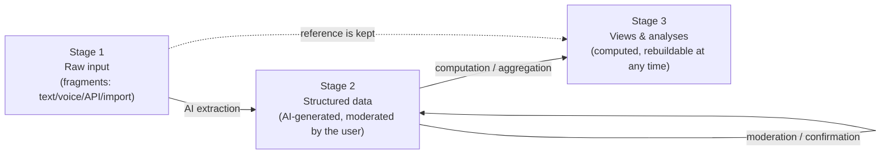
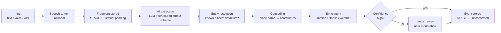
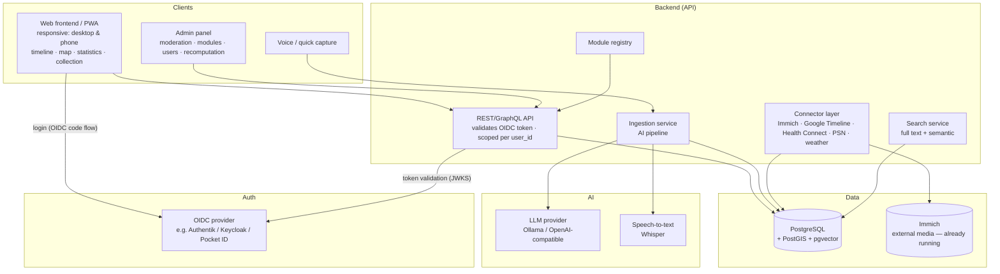

# Life-Dash — concept & MVP

> **Status:** In operation — P0 & P1 done, D1 live on the server, P2.2–P2.7 implemented (see ch. 14)
> **Document type:** architecture & product concept
> **Target environment:** self-hosted (Docker-based)
> **Last updated:** 2026-07-20

---

## 1. Vision

**Life-Dash is a searchable, analysable and visually explorable database about your own life.**

The goal is to bring scattered life data (memories, places, photos, fitness data, events) together into one central, structured database and make it tangible through several views: a timeline, a map, statistics and a collection.

The decisive difference to classic journaling apps: **capture is low-friction, via free text or voice. An AI structures, locates, dates and links the fragments automatically.**

### Guiding principles

| Principle | Meaning |
|---|---|
| **Capture first, structure later** | Entering data must be frictionless. Structure comes from the AI, not from mandatory forms. |
| **Three-stage model** | Raw input (stage 1) → moderated structure (stage 2) → computed views (stage 3). Every stage is derived reproducibly from the previous one. |
| **Raw data is the truth** | Everything always refers back to the unchanged raw input. Structure and views can be recomputed at any time (e.g. with better models). |
| **Everything configurable** | An admin panel allows adjusting modules, prompts, models, enrichment sources and views — without code changes. |
| **Modular and extensible** | New trackable categories (e.g. “concerts”, “books”, “illnesses”) without rebuilding code. |
| **Self-hosted & data sovereignty** | All data stays on your own machine. External AI only optionally and interchangeably. |
| **Confirmed vs. unconfirmed** | Concrete dates are preferred. AI-derived values are marked “unconfirmed” until the user moderates them. |
| **One data model, many views** | Timeline, map, statistics and collection are only computed projections (stage 3) of the same data. |
| **Mobile first** | Capture happens on the go. The UI is a responsive PWA; quick capture, timeline and map are built for a phone just as much as for a desktop. |
| **Multi-user from the start** | Every row in stages 1–3 belongs to a user (`user_id`). Sign-in via **OIDC** (SSO). Retrofitting auth is expensive — so it is anchored in the data model from P0 on. |

### How this software was built (note 52)

**The entire implementation of Life-Dash was written by Anthropic's Claude models — Fable and Opus — working from this concept under the author's direction.** The author sets the direction, decides the architecture, reviews the result and runs it in daily use; the code itself is machine-written. This is stated openly rather than buried, because anyone hosting a database of their own life deserves to know how the thing was made. Two consequences worth naming: the concept document is unusually detailed *because* it is the primary instruction to the machine, and every decision is recorded with its reasoning in [`DECISIONS.md`](DECISIONS.md) so that neither the author nor a later model has to guess.

### 1.1 Where Life-Dash sits (market position, note 53)

The self-hosted field splits into five camps, and all five leave out the same thing:

| Camp | Representatives | What they do well | What is missing |
|---|---|---|---|
| Location history | **Dawarich**, **Reitti**, Traccar, OwnTracks | mature, live tracking, imports everything | places only — no life around them |
| Photos | **Immich**, PhotoPrism | media with time and geo | the timeline is a file list, not a record of events |
| Journals | **Memos**, **Journiv**, Standard Notes, Day One | text, mood, fast capture | text stays text: no structure, no map, no statistics |
| Quantified self | **Heedy**, qs_ledger, Grafana + InfluxDB, Exist.io (SaaS) | metrics and dashboards | numbers without a narrative, no free-text entry point |
| Unified timelines | **Timelinize**, **HPI/Promnesia**, **Dogsheep/Datasette** | conceptually the closest relatives | Timelinize has been “not release-worthy” for years; HPI and Dogsheep are Python libraries for developers — no product, no moderation, no interface |

**The gap Life-Dash actually fills, in four points — the last one is the strongest:**

1. **Free text and speech become structured events via an LLM.** Nothing in the self-hosted space does this. Journals store text; aggregators import APIs. The pipeline *fragment → proposal → confirmed*, with a moderation queue in between, is the genuinely new part.
2. **A human-curated layer of truth.** Timelinize, HPI and Dogsheep pour machine data into one pot. The invariant “machines never change what is confirmed, enrichment is additive only” (ch. 3.1) exists nowhere else.
3. **Retroactive enrichment of manual memories** — weather attached to a holiday from 2002. Aggregators can only enrich what they imported themselves.
4. **Life-Dash covers the pre-digital life.** Every competing product begins where the data exports begin, roughly 2012. Here, “summer 2002, holiday in France” is a first-class record with `season` precision. This is the one property that cannot be copied without adopting the whole architecture, and it is the headline claim: *your memories, including the ones from before the smartphone — as a searchable database.*

**Honest weaknesses.** Against Dawarich and Reitti the map cannot win — the answer is to import from them, not to compete (P2.11). And the LLM dependency is the barrier to entry: unless the local/Ollama path is first-class and clearly documented, the very audience that takes “self-hosted” seriously will bounce.

---

## 2. Glossary & core concepts

| Term | Definition |
|---|---|
| **Event** | The central entity. Something that happened at a point or span of time in a place. “Holiday in France”, “saw an eagle in Detmold”. |
| **Entity (collection item)** | A recurring “thing” in your life: an animal, a film, a country, a game. Events reference entities. |
| **Fragment** | Raw, unstructured input (text/voice/API) before the AI has processed it. **Stage 1 — the immutable source of truth.** |
| **Trackable / module** | A registered type you can track (e.g. `movie`, `animal`, `trip`). Defines schema, icons, statistics. |
| **Fuzzy date** | A date with a precision level (`exact`, `day`, `month`, `season`, `year`, `decade`) plus a time span. Concrete times are preferred; vagueness is the exception. |
| **Confirmed status** | Marks whether a structured value has been moderated/confirmed by the user (`confirmed`) or is AI-derived (`unconfirmed`). |
| **Source** | Where a record came from: `manual`, `ai`, `immich`, `google_timeline`, `health_connect`, `psn`, `weather`, `api`. |
| **Track (route)** | A recorded movement path (LineString) from Google Timeline or fitness workouts. Stage-3 data, drawn on the map as a line layer. |
| **User** | A signed-in user (OIDC identity). All fragments, events, entities and enrichments are user-scoped. |
| **Enrichment** | Automatic augmentation of an event with photos, fitness data, weather etc. based on time and place — also **retroactively** (re-enrichment). |
| **Admin panel** | The central configuration surface: modules, AI prompts/models, enrichment sources, view rules, recomputation. |

---

## 3. Three-stage architecture (core principle)

The whole system is built as a **pipeline of three clearly separated stages**. Every stage is derived **reproducibly** from the previous one. Nothing “computed” is ever the source of truth — it can be discarded and regenerated at any time (e.g. with a better AI model).


```mermaid
flowchart LR
    S1["Stage 1\nRaw input\n(fragments: text/voice/API/import)"]
    S2["Stage 2\nStructured data\n(AI-generated, moderated by the user)"]
    S3["Stage 3\nViews & analyses\n(computed, rebuildable at any time)"]
    S1 -- "AI extraction" --> S2
    S2 -- "moderation / confirmation" --> S2
    S2 -- "computation / aggregation" --> S3
    S1 -. "reference is kept" .-> S3
```

### Stage 1 — raw input (immutable)
- Every input is stored **losslessly and unchanged** as a `Fragment` (original text, audio, imported raw data).
- It is **never overwritten**. All later stages keep a back-reference to their originating fragment.
- Consequence: the entire system can be rebuilt “from zero” out of the raw data at any time.

### Stage 2 — structured database (moderated)
- From stage 1 the AI generates structured `Event` and `Entity` records (date, place, category, linked items).
- Every derived value carries a **`confirmed` status**: `unconfirmed` (AI proposal) or `confirmed` (moderated by the user).
- The user moderates in the review/admin panel: confirm, correct, discard, merge.
- Manual corrections are “sticky”: repeated AI processing must **not** overwrite confirmed values.

### Stage 3 — views & analyses (computed, rebuildable)
- Timeline, map, statistics and collection are **computed projections** of stage 2.
- They additionally contain AI enrichments (photos, fitness, weather) and aggregations (statistics widgets).
- **Fully recomputable** — at the push of a button in the admin panel, e.g. after a model change, new enrichment sources or module updates.

### Why this separation?
| Benefit | Explanation |
|---|---|
| **Reproducibility** | Better models → simply recompute stages 2/3, the raw data stays. |
| **Trust** | A clear separation between “what I said” (S1), “what the AI made of it” (S2) and “how it is presented” (S3). |
| **Safety** | No silent data corruption: raw input is always the fallback. |
| **Moderation** | The user has full control over stage 2 without losing the raw data. |

### 3.1 Refinement: four layers (decision 2026-07-15)

“Stage 2” conceptually mixes two things that must be thought of separately. Conceptually the system consists of **four layers** (over the same tables — the `confirmed` status is the dividing line, no DB rebuild needed):

| Layer | What | Lifetime |
|---|---|---|
| **1 · Inbox** | Raw fragments (text, voice, import summaries). | Immutable, permanent. An evidence archive. |
| **2 · Proposal space** | Unconfirmed AI derivations (`confirmed = unconfirmed`). *Claims, not truth.* | Disposable — discarded and regenerated on recomputation. |
| **3 · Life database** | Confirmed events/entities/locations (`confirmed`) **plus factual enrichments**: weather, media references, tracks. Facts do not change — once fetched, true forever. | **Fixed.** The actual goal of the system. |
| **4 · Derived** | Views, statistics, aggregations, **embeddings** (model-dependent). | Disposable and recomputable at any time; no backup needed. |

**The hard invariant:** *confirmed data is never changed by machines, only extended additively (metrics, media references).* Recomputation touches layers 2 and 4 exclusively. Confirming is the transition 2 → 3 (same row, the status flips); `field_overrides` additionally protects individual manually corrected fields.
*Documented exception:* “resolve place names” replaces generated coordinate titles (“Visit: place (53.49…)”) even on confirmed imported visits — that is a user-initiated data improvement, not an AI re-evaluation; manually renamed titles stay protected.

**Linking & deletability:** every layer-2/3 row references its inbox fragment (`origin_fragment_id`, n:1 — one fragment can produce several events). The proposal space cleans itself up (confirming converts, discarding deletes). The **inbox is deliberately not deleted**, even when everything is confirmed: it costs almost nothing (text), is the provenance record of the life database and the only source for later re-extraction or comparison. At most a manual cleanup of *orphaned* fragments (all events discarded) is legitimate — never automatic.

---

## 4. User scenarios (user stories)

### Capture
- *As a user* I open Life-Dash on my **phone** (installed PWA), type two sentences into quick capture while out and about, and I am done — I moderate later on the desktop.
- *As a user* I type “12/07/2026 was in Detmold and saw an eagle”, so that the AI creates an event with a date, a place (Detmold) and an animal sighting (eagle).
- *As a user* I dictate “summer 2002 holiday in France”, so that an event appears with a date (summer 2002, marked `unconfirmed`), a place (France) and the category “trip”.
- *As a user* I moderate AI proposals: I see which values are `unconfirmed` and confirm or correct them before they count as fact.
- *As a user* I want a follow-up question or preview for ambiguous input before the record is accepted.
- *As a user* I write a **formatted journal entry** (Markdown) for a travel day — as a daily summary above the individual events, so that Life-Dash also works as a travel diary in my own voice (→ package F1). The AI never touches this text.
- *As a user* I type “just saw a kingfisher” while out and **optionally take my phone location** as the place at the push of a button — without typing, but never automatically (→ package F2).

### Views
- *As a user* I zoom the timeline from decade level down to day level to see event density and detail.
- *As a user* I see all the places I have been on a map, filtered by time range.
- *As a user* I open the statistics tab and see “how many countries have I been to?”, “how many km did I run in 2025?”, “which animals have I seen?”.
- *As a user* I open the animal “eagle” in the collection and see all sightings, photos and places linked to it.

### Enrichment & import
- *As a user* the system automatically links Immich photos from 12/07/2026 to the Detmold event (Immich already runs as a service).
- *As a user* I import my **Google Timeline export** from my phone and see visited places as events and my **routes** as lines on the map.
- *As a user* I import my **Health Connect data** (steps, heart rate, workouts) and see steps and heart rate for a hike.
- *As a user* I import my **PSN game history** (games played, trophies, play time) and see under “games” in the collection when I played what.
- *As a user* I see the **weather** for that day and place on every located event (enriched automatically).
- *As a user* I enrich **retroactively**: if I import new photos, fitness or weather data later, existing events are updated automatically (re-enrichment).

### Account & access
- *As a user* I sign in via **SSO (OIDC)** — the same sign-in as for my other services.
- *As a user* I see only my own data; other users (e.g. family members) keep their own, separate life database.

### Search
- *As a user* I search “all the times I was by the sea” and get semantically matching events, not just full-text hits.

---

## 5. Feature areas (views)

### 5.1 Timeline
The central view. A horizontal or vertical line with continuous zoom.

- **Zoom levels:** day → week → month → year → decade.
- **Aggregation:** at high levels events are condensed into “heat” clusters (event density, category colours).
- **Vague events** (e.g. “summer 2002”) are drawn as bars/spans rather than points, and marked `unconfirmed`.
- **Filters:** by category, place, source, day, confirmed status.
- **Interaction:** click an event → detail panel with photos, place, weather, linked entities.

### 5.2 Map
- All located events as markers / clusters / heatmap.
- **Time slider**, synchronised with the timeline.
- Layers: **routes (tracks)** from Google Timeline and workouts as a line layer, trips, individual places, homes, “special moments”.
- Data sources: manual places, Google Timeline import (visits **and** routes), geo tags from Immich photos, GPS tracks from fitness workouts.

### 5.3 Statistics
A configurable dashboard of “widgets”. Every module can contribute its own statistics. The widgets are **computed stage-3 projections** and recomputable at any time.

- Examples: country counter, travel kilometres, animal species seen, films per year, fitness trends, “years of life in numbers”.
- Time-range filter, comparison between years.

### 5.4 Collection
Structured collections of entities, grouped by type.

- Tabs/categories: **animals, films, games, countries, places, books, …** (module-driven).
- A detail page per entity: description, metadata, linked events, mini timeline view, photos.
- Example: “eagle” → all sightings, a map of the sighting locations.

### 5.5 Data capture (ingestion)
- Free-text field, voice recording (speech-to-text), API endpoint.
- Every input is first stored losslessly as a **stage-1 fragment**.
- **AI preview:** shows how the AI interpreted the fragment (date, place, entities, category) → the user confirms or corrects (→ stage 2).
- Batch import (e.g. an old diary, chat logs).

### 5.6 Admin panel & moderation
The central control surface for the whole system.

> **Planned split (A14):** “Settings” (every user — moderation, jobs,
> export/import, tracking choice) and “Admin” (admin role only — user
> management, system, raw DB view, logs), each with tabs.

- **Moderation queue:** review, confirm, correct, discard and merge all `unconfirmed` stage-2 records.
- **Module management:** activate/define trackables, schemas, icons, statistics widgets.
- **AI configuration:** choose provider/model, adjust prompts, set confidence thresholds.
- **Enrichment sources:** configure Immich, Google Timeline, fitness, weather and define linking rules.
- **Recomputation:** recompute stage 2 and/or stage 3 selectively or completely (e.g. after a model change) — confirmed values are kept.
- **Raw data inspection:** navigate from any event back to its originating fragment (stage 1).
- **User management:** OIDC provider configuration, user list, roles (`admin` | `user`). Import configuration (Immich API key, PSN token) is stored **per user**.

### 5.7 Mobile use (phone)

The UI is designed **responsive** from the start — not as an afterthought. The most important mobile use case is **capturing on the go**; analysis and moderation happen more on the desktop but must work on mobile too.

- **PWA:** installable on the home screen, app manifest, offline queue for quick capture (fragments are buffered locally and synchronised when a connection returns — matching the stage-1 principle “capture first”).
- **Layout:** desktop = sidebar navigation; mobile = **bottom navigation** (timeline · map · ➕ capture · statistics · collection) with quick capture as the central, prominent button.
- **Timeline on mobile:** scrolls vertically instead of horizontally; the detail panel is a bottom sheet instead of a side panel.
- **Map on mobile:** fullscreen with a time filter that can be shown or hidden; touch gestures (pinch zoom).
- **Voice input** is the most natural channel on mobile (phase 2, Whisper server-side).
- **Share target (later):** share text/photos from other apps directly to Life-Dash → becomes a fragment.

**Status 2026-07-21 (note 82).** Of the above, the bottom navigation and the vertical timeline exist; the **bottom sheet** and the **full-screen map with a foldable time filter** do not, and the phone layout as a whole is two `@media` blocks. Package **A38** closes the gap — this section is a specification, not a description, until it ships.

---

## 6. Data model (core)

The heart of the system. Deliberately lean and generic so that modules can dock on without schema migrations.

### 6.1 Entities (conceptual)

```
User                     (identity — via OIDC)
  id
  oidc_subject         (stable `sub` claim from the OIDC token)
  email
  display_name
  role                 (admin | user)
  settings             (JSON: e.g. Immich API key, PSN token, import preferences)
  created_at

Fragment                 (STAGE 1 — immutable)
  id
  user_id              (FK → User; applies equally to Event, Entity,
                        MediaRef, Metric, Track — not repeated there)
  raw_text
  audio_ref            (optional)
  source               (manual | voice | api | import)
  status               (pending | processed | needs_review | discarded)
  created_at
  processed_event_ids  (result of the AI processing)

Event                    (STAGE 2 — structured, moderated)
  id
  title                (AI- or user-generated)
  description
  date_start           (timestamp)
  date_end             (timestamp, optional)
  date_precision       (exact | day | month | season | year | decade)
  location_id          (FK → Location, optional)
  category             (trackable key, e.g. "trip", "sighting")
  confidence           (0..1, how sure the AI is)
  confirmed            (unconfirmed | confirmed)  ← moderated by the user?
  field_overrides      (JSON: which fields were manually confirmed/corrected
                        → protected from re-processing)
  source               (manual | ai | immich | google_timeline | fitness | weather)
  origin_fragment_id   (FK → Fragment, stage-1 back-reference)
  embedding            (vector for semantic search)
  created_at / updated_at

Entity            (collection item, STAGE 2)
  id
  type              (animal | movie | game | country | place | book | ...)
  name
  attributes        (JSON, schema depends on the module)
  confirmed         (unconfirmed | confirmed)
  embedding
  created_at

EventEntityLink   (n:m between Event and Entity)
  event_id
  entity_id
  role              (subject | location | mentioned)

Location
  id
  name
  geo               (PostGIS point/polygon)
  type              (city | country | poi | home)
  external_ref      (e.g. OSM ID)

MediaRef          (STAGE 3 — enrichment; a reference to external media, NOT a copy)
  id
  event_id
  provider          (immich | local | url)
  external_id       (e.g. Immich asset ID)
  captured_at
  geo               (optional, for automatic linking)

Metric            (STAGE 3 — enrichment; generic figures: fitness, weather)
  id
  event_id
  key               (steps | heart_rate_avg | distance_km |
                     temperature_c | weather_condition |
                     play_minutes | trophies_earned | ...)
  value
  unit
  source            (health_connect | weather | psn | ...)
  enriched_at       (when enriched → enables re-enrichment)

Track             (STAGE 3 — route; from Google Timeline / workouts)
  id
  date_start / date_end
  geo               (PostGIS LineString, simplified/compressed
                     e.g. via Douglas-Peucker)
  activity_type     (walk | drive | cycle | run | transit | unknown)
  distance_m
  source            (google_timeline | health_connect)
  event_id          (optional, FK → Event — e.g. a hike)
  origin_fragment_id (FK → Fragment, raw import back-reference)
```

### 6.2 Design decisions

- **Three-stage provenance anchored in the model:** `Fragment` = stage 1, `Event`/`Entity` = stage 2, `MediaRef`/`Metric` = stage 3. Every stage-2/3 row references back to stage 1.
- **`confirmed` + `field_overrides`:** separating an AI proposal (`unconfirmed`) from a moderated fact (`confirmed`). `field_overrides` protects individual, manually corrected fields from being overwritten during recomputation.
- **Concrete dates preferred:** `date_precision` allows vagueness (“summer 2002” → `season`), but vague or derived dates stay `unconfirmed` until the user confirms them. The goal is to hold dates that are as concrete and confirmed as possible.
- **Event ↔ Entity as n:m:** one event can reference several animals/items; one entity appears in many events. This is the basis for the collection **and** the statistics. (People are deliberately left out for now — see ch. 8.3.)
- **`attributes` as JSON:** module-specific fields (e.g. film rating, animal species) live in a flexible JSON field with a schema defined by the module (JSON-Schema validation). No DB rebuild for new modules.
- **Embeddings for semantic search:** events and entities get vector embeddings (pgvector) → “all the times by the sea” also finds “beach day in Italy”.
- **Media and metrics are stage 3:** referenced, not copied (Immich stays the single source of truth). `enriched_at` enables **retroactive re-enrichment** without changing stage 2.
- **`user_id` everywhere, strict tenant separation:** every stage-1/2/3 row belongs to exactly one user. The API **always** filters by the signed-in user — there are no shared events/entities (deliberately kept simple; “sharing” would be a later feature). Locations are user-scoped too for now.
- **Tracks separate from events:** a route is not an event (not an “experience”) but context. Raw timeline/GPS data is kept as a fragment (S1); `Track` is the computed, simplified geometry (S3) — regenerable with better simplification algorithms.

---

## 7. AI pipeline (ingestion)

The path from fragment (stage 1) to moderated event (stage 2) to enriched view (stage 3).


```mermaid
flowchart LR
    A[Input<br/>text / voice / API] --> B[Speech-to-text<br/>optional]
    B --> C[Fragment stored<br/>STAGE 1 · status: pending]
    C --> D[AI extraction<br/>LLM + structured output schema]
    D --> E[Entity resolution<br/>known place/animal/film?]
    E --> F[Geocoding<br/>place name → coordinates]
    F --> G[Enrichment<br/>Immich / fitness / weather]
    G --> H{Confidence<br/>high?}
    H -- yes --> I[Event stored<br/>STAGE 2 · unconfirmed]
    H -- no --> J[needs_review<br/>user moderation]
    J --> I
```

### 7.1 Steps in detail

1. **Capture (stage 1):** the fragment is stored raw immediately (never lose data, works offline too).
2. **Speech-to-text** (optional): e.g. `whisper` locally.
3. **Structured extraction (stage 2):** the LLM receives the fragment plus a **structured output schema** (function calling / JSON schema). Output: title, date (span) + precision, places, recognised entities with type, category, confidence. All values are `unconfirmed` at first.
4. **Entity resolution:** matching recognised names against existing entities (“eagle” → existing animal entity? “France” → country?). Fuzzy matching plus embedding similarity. New entities are created as candidates.
5. **Geocoding:** place names → coordinates (a local Nominatim/OSM service, no external dependency needed).
6. **Enrichment (stage 3):** based on time and place, Immich photos, fitness metrics and **weather data** are linked. Also runs **retroactively** as a re-enrichment job when new source data arrives.
7. **Review gate:** on low confidence or ambiguity → `needs_review`. The user moderates and sets values to `confirmed`.
8. **Recomputation:** stages 2 and 3 are reproducible from stage 1 at any time (e.g. with a new model) — `confirmed` values stay protected.

### 7.2 Interchangeable AI provider

The AI is encapsulated behind a **provider interface**:

```
LLMProvider (interface)
  extract_structured(fragment, schema) -> StructuredResult
  embed(text) -> vector

Implementations:
  - OllamaProvider   (local, e.g. Llama/Mistral)
  - OpenAIProvider   (any OpenAI-compatible endpoint)
  - AnthropicProvider
```

This keeps data sovereignty intact and lets you pick different models per task (extraction vs. embedding).

---

## 8. Modularity / extensibility

The central non-functional goal: **track something new without touching the core.**

### 8.1 Module concept (“trackable”)

A module registers a new type declaratively:

```yaml
# module: animals
key: animal
label: Animals
icon: paw
entity_schema:            # JSON schema for Entity.attributes
  species: string
  wild: boolean
  first_seen: date
event_categories:
  - sighting              # "saw an eagle"
statistics:
  - id: species_count
    label: "Species observed"
    type: count_distinct
    field: entity.species
  - id: sightings_per_year
    label: "Sightings per year"
    type: timeseries
compendium_view:
  group_by: species
  detail_map: true        # shows sighting locations on a map
```

### 8.2 What a module can contribute

| Area | The module's contribution |
|---|---|
| **Data model** | JSON schema for `Entity.attributes` (validated, but no DB migration). |
| **Ingestion** | Hints/prompts for how the AI recognises this type. |
| **Statistics** | Declarative widgets (count, timeseries, distinct, sum). |
| **Collection** | Grouping, detail view, map option. |
| **UI** | Icon, label, colour. |
| **Achievements** | Metric plus four thresholds (bronze/silver/gold/platinum), see F6. |

### 8.3 Example modules (starter set)

**Implemented:** `trip` · `animal` · `country` · `artist` (artists/concerts) · `food` (meals) · `milestone` (weddings, births, moving, graduation …) · `movie` · `game` · `book`.
**Planned:** `place` · `sport_activity` · `health_event`.

> Lesson from implementation: a new category touches **three places** — the module YAML (backend), rules/examples in the AI prompt and the frontend (label, colour, collection tab, form options). The declarative goal of “YAML only” is not fully reached yet (see `DECISIONS.md`, note 3).

> **People deliberately left out (for now):** a `person` module is conceptually appealing but too complex to maintain (duplicates, relationships, third-party privacy, constant assignment decisions). The focus is first on **concrete, confirmable facts** (time, place, item). The n:m data model stays laid out so that people can be added later as another module without a rebuild.

---

## 9. Integrations

| Source | Purpose | Approach |
|---|---|---|
| **Immich** | Photos & videos, geo tags, timestamps | **Already running as a service** → the first integration to implement. Immich API (`/api/search/metadata`: query assets by time range/geo), auth via API key (per user in `User.settings`). Linked via `MediaRef` — **references only, no copies**; thumbnails are passed through from Immich by a backend proxy. |
| **Google Timeline** | Visited places **and routes** | ⚠️ Since 2024 the timeline lives **on the device only** (Takeout “Semantic Location History” is gone). Import via the **device export**: Android → Settings → Location → Timeline → “Export timeline” (JSON, `semanticSegments`). File upload in the UI → stored raw as a fragment (S1) → `visit` segments become events/locations, `activity`/`timelinePath` segments become `Track`s (S3). No live access possible, so a recurring manual upload. |
| **Google Health / Health Connect** | Steps, distance, HR, workouts (incl. GPS) | ⚠️ The Google Fit REST API was shut down (2025); its successor **Health Connect** stores **on-device only**, without a cloud API. Import therefore happens by file: a Health Connect export (ZIP) or a sync app, alternatively a direct Garmin/Fitbit export. Daily values and workouts → `Metric` on events; workout GPS → `Track`. |
| **PSN (PlayStation Network)** | Games played, trophies, play time | No official public API. Approach: an unofficial API via an **NPSSO token** (e.g. the Python library `psnawp`) — a token per user in `User.settings`. Periodic sync: titles → `game` entities, sessions/“last played” → events, trophies and play time → `Metric`. Fallback: the pure trophy history (a timestamp per trophy) as an event source. Risk: an unofficial API can break → keep the connector isolated and store sync results as fragments (S1). |
| **Weather** | Context enrichment (temperature, conditions) | A historical weather API (Open-Meteo daily archive) based on time and place. Attached as a `Metric` to located events — retroactively too. |
| **Geocoding** | Place name ↔ coordinates | Nominatim (OSM) or any compatible service, self-hostable. |

**Integration principle:** every source is a **connector** with a uniform interface (`fetch`, `map_to_events`, `enrich`). New sources dock on without core changes. All connector results are **stage-3 enrichments** and recomputable at any time.

**Two kinds of connector:**
- **Pull connectors** (Immich, PSN, weather): the backend queries the source actively/periodically.
- **Upload connectors** (Google Timeline, Health Connect): the user uploads export files — a mobile-friendly upload flow in the UI (shareable directly from a phone). Raw files are archived as fragments (S1) so that re-processing stays possible.

**Duplicate protection on re-import:** imports are **idempotent** — every imported record carries a stable `external_id` key (Immich asset ID, timeline segment hash, PSN trophy ID), so repeated uploads/syncs create no duplicates.

---

## 10. Technical architecture


```mermaid
flowchart TB
    subgraph Clients
      UI[Web frontend / PWA<br/>responsive: desktop & phone<br/>timeline · map · statistics · collection]
      ADMIN[Admin panel<br/>moderation · modules · users · recomputation]
      VOICE[Voice / quick capture]
    end

    subgraph Auth
      OIDC[OIDC provider<br/>e.g. Authentik / Keycloak / Pocket ID]
    end

    subgraph Backend["Backend (API)"]
      API[REST/GraphQL API<br/>validates OIDC token · scoped per user_id]
      ING[Ingestion service<br/>AI pipeline]
      MOD[Module registry]
      CONN[Connector layer<br/>Immich · Google Timeline · Health Connect · PSN · weather]
      SEARCH[Search service<br/>full text + semantic]
    end

    subgraph Data
      PG[(PostgreSQL<br/>+ PostGIS + pgvector)]
      MEDIA[(Immich<br/>external media — already running)]
    end

    subgraph AI
      LLM[LLM provider<br/>Ollama / OpenAI-compatible]
      STT[Speech-to-text<br/>Whisper]
    end

    UI -- "login (OIDC code flow)" --> OIDC
    UI --> API
    ADMIN --> API
    VOICE --> ING
    API -- "token validation (JWKS)" --> OIDC
    API --> PG
    ING --> LLM
    ING --> STT
    ING --> PG
    CONN --> MEDIA
    CONN --> PG
    MOD --> API
    SEARCH --> PG
```

### Layers

- **Frontend:** views as stage-3 projections of the same API. State sync between timeline and map through a shared time-range filter. A **responsive PWA** — one codebase for desktop and phone (sidebar ↔ bottom navigation, panels ↔ bottom sheets).
- **Auth:** OIDC authorization code flow (PKCE) in the frontend; the backend validates tokens against the provider's JWKS endpoint and creates the `User` record automatically on first login (JIT provisioning via the `sub` claim).
- **Admin panel:** its own surface for moderation (stage 2), module/AI configuration, user management and recomputation.
- **API:** thin, authorising, delegating to services. Every query is scoped by `user_id`.
- **Ingestion service:** orchestrates the AI pipeline (ch. 7). Asynchronous (queue) for batch imports and re-enrichment.
- **Module registry:** loads module definitions, provides schemas and statistics.
- **Connector layer:** encapsulates external sources (including weather).
- **Storage:** one PostgreSQL with PostGIS (geo) and pgvector (embeddings) covers relational, geographic and semantic needs in **one** database — ideal for self-hosting.

---

## 11. Recommended tech stack

| Layer | Recommendation | Rationale |
|---|---|---|
| **Backend** | Python + **FastAPI** | Fits the existing Python environment; excellent for AI integration; async. |
| **DB** | **PostgreSQL** + **PostGIS** + **pgvector** | One database for relational, geo and semantic. Fewer moving parts. |
| **ORM/migration** | SQLAlchemy + Alembic | Established, migration-safe. |
| **Queue** | Redis / RQ (or DB-based to start) | Asynchronous ingestion and batch import. |
| **AI (LLM)** | Any **OpenAI-compatible endpoint**, provider-abstracted | Data sovereignty when run locally; interchangeable with cloud vendors. |
| **STT** | **Whisper** (local) | Voice input without the cloud. |
| **Geocoding** | **Nominatim** (public or self-hosted) | No mandatory external dependency. |
| **Auth** | **OIDC** — any standards-compliant provider (Authentik, Keycloak, Pocket ID, Zitadel …); backend: `python-jose`/`authlib` for token validation | SSO across all your services; Life-Dash manages no passwords. |
| **Frontend** | A **responsive PWA** + map library (MapLibre/Leaflet) + timeline rendering | A rich interactive UI; one codebase for desktop and phone; installable, offline capture. |
| **PSN connector** | `psnawp` (Python, NPSSO token) | The most established unofficial PSN library; isolated in the connector layer. |
| **Deployment** | **Docker Compose** | The self-hosting standard; reproducible. Immich runs separately — only a URL and API key are needed. |

> Deliberately **one** database rather than a separate vector store or geo store, to keep operational complexity low.

---

## 12. Security & privacy

- **Self-hosted only:** no data leaves by default. External AI providers are opt-in and clearly marked.
- **Auth: multi-user via OIDC from the start.** Life-Dash stores no passwords; sign-in goes through your OIDC provider (SSO). Every user has a strictly separate data set (`user_id` scoping in every query); roles: `admin` (system configuration) and `user`.
- **User secrets:** per-user connection data (Immich API key, PSN NPSSO token) is stored encrypted in `User.settings` and never delivered to the frontend.
- **Sensitive data:** life data is highly sensitive → encrypted backups, the DB never publicly exposed (only via a reverse proxy/VPN). Movement profiles (tracks) and health data (metrics) are the most sensitive categories — export and deletion must cover them completely.
- **AI transparency:** AI-derived statements are recognisable as such through `confidence`, `source` and `confirmed`; the moderation/review gate prevents silently wrong data.
- **Raw data as a fallback:** because stage 1 is immutable, faulty AI processing can be discarded and recomputed safely at any time.
- **Data control:** a full export (raw plus structured) and deletion are possible at any time.

---

## 13. MVP definition

The goal of the MVP: **the core loop across all three stages works** — enter a fragment (S1) → the AI structures it and the user moderates (S2) → see it on the timeline and map and search it (S3).

### 13.1 MVP scope (in)

| Area | MVP scope |
|---|---|
| **Three-stage foundation** | `Fragment` (S1) immutable → `Event`/`Entity` (S2) with a `confirmed` status → views (S3) recomputable. |
| **Data capture** | Free-text input plus an AI preview with confirmation/correction. (Voice: phase 2.) |
| **AI pipeline** | Extraction (date + precision, place, category, simple entities), geocoding, confidence plus review gate. |
| **Data model** | `Fragment`, `Event`, `Entity`, `EventEntityLink`, `Location` including `confirmed`/`field_overrides`. |
| **Moderation / admin** | A simple moderation panel: review, confirm and correct `unconfirmed` records; trigger recomputation. |
| **Timeline** | Zoom year → month → day; events as points/spans; click for detail; `unconfirmed` visibly marked. |
| **Map** | Located events as markers plus a time-range filter. |
| **Search** | Full text plus semantic search (embeddings). |
| **Collection** | The **animals** type as proof of modularity. |
| **Modules** | A module registry with 2–3 fixed modules (`trip`, `animal`, `country`). |
| **Auth & multi-user** | OIDC login plus `user_id` in all tables plus JIT provisioning. No user management UI in the MVP — users appear by logging in. |
| **Responsive base layout** | A mobile-capable layout (bottom navigation, quick capture) from the start; PWA manifest. Offline queue: phase 2. |
| **Deployment** | Docker Compose (app + Postgres + AI endpoint). |

### 13.2 Deliberately NOT in the MVP (out)

- Voice input / Whisper, offline capture queue (though the PWA foundation is laid)
- Immich, Google Timeline, Health Connect, PSN and weather integration (though the data model and stage-3 concept are prepared)
- Statistics dashboard (only rudimentary counters)
- A people module (deliberately left out)
- A complete module set, decade aggregation
- User management UI, sharing between users (OIDC login and data separation *are* in the MVP)

### 13.3 Definition of done (MVP)

1. I type “12/07/2026 was in Detmold and saw an eagle” → see an AI preview (stage 2, `unconfirmed`) → confirm it (→ `confirmed`).
2. The event appears correctly dated on the timeline **and** as a marker in Detmold on the map.
3. “Summer 2002 holiday in France” is stored as a span (summer 2002, `season`, `unconfirmed`) with the place France.
4. “Eagle” (animal) appears in the collection together with the sighting.
5. I can search for “France” and find the event (full text plus semantic).
6. In the admin panel I can delete the stage-2/3 data and **recompute it from the raw data** — confirmed values are kept.
7. I sign in via OIDC; a second user signs in and sees **none** of my data.
8. On a phone I can capture a fragment via the bottom navigation and read the timeline without scrolling horizontally.

---

## 14. Roadmap

**This chapter holds what is still open.** What was built, in which version
and why, is the project's *history*, and since 2026-08-03 it lives where
history belongs: the reasoning in [`DECISIONS.md`](DECISIONS.md), the
package-and-release record in its
[Appendix A](DECISIONS.md#appendix-a--what-was-built-and-when), and the
user-facing account in [`CHANGELOG.md`](../CHANGELOG.md). A roadmap that also
carries its own record cannot be read as a plan — three quarters of this
chapter was a list of things nobody has to decide again, and the open half was
only findable by scrolling past it.

### 14.1 Where the project stands

**Group A — necessary and sensible for everyday use — is complete**: A1–A48,
the last of them added by the feedback rounds that followed 0.35.0, which is
the channel note 86 calls the most productive one this project has. **Group B**
is built out to **F19**, plus P2.1 (Immich, all three stages), P3.1, P5.1 and
the whole of F1.

Released up to **v0.39.0** (2026-07-23). Everything since accumulates on `main`
without a version number until the author calls the demo dataset (notes 86/89),
so the sidebar reads `0.39.0-dev` and new entries collect under `[Unreleased]`.

### 14.2 Open packages

**Two rules decide where a package sits.** Note 101: only *new import
connectors* wait for the 1.x line, because 1.0 is defined by exclusion as the
complete tool for capturing and exploring a life **by hand** — a connector
widens the intake, not the concept. Note 89: an inserted release needs a schema
consequence **and** an observed complaint; anything else rides on `main`.

Effort: S = hours · M = ~1 day · L = several days. No package blocks another
except where noted.

#### Ahead of 1.0

| No. | Package | Effort | Content | Benefit |
|---|---|---|---|---|
| **F20** | **A baseline location for periods with no data** *(note 144; decided 2026-08-03, not yet built)* | L | “Eventually I want an entry for every single day, even if it only says ‘visit, Bad Segeberg’ — then weather can be enriched on it.” Built as a **derivation, not as rows**: one record per period (“1986-04-02 to 1992-08-31: parents' house, Bad Segeberg”) — a *standing fact with a validity span*, which is a fourth kind of statement beside fragment, proposal and event — plus a day-level layer-4 derivation that fills every day the period covers. Generating 14 600 confirmed events instead was rejected for one reason and it is decisive: layer 2 is untouchable by machines, so a later correction of the period would leave a thousand wrong rows that nothing is permitted to repair (the row count itself is not the objection — note 140 measured 20 000 events at 86 ms). Four decisions are already made and must not be re-opened silently: an inferred day **counts fully** in the world tab, the top places and the badges; the baseline **fills gaps only**, so any real entry that day wins; **one baseline at a time**; and the timeline marks an inferred day as inferred. **The bulk of the work is not the baseline row but the weather:** weather hangs on `Metric.event_id`, so a day without an event has nowhere to put it — F20 needs a day-keyed weather store, layer 4 and rebuildable, as the sibling of `weather_day.day_values`. By note 101 this is a 1.0 candidate (it improves recording, not intake); whether it gets a release of its own or rides in 0.40.0 is a size question and the author's call. | Twenty years of “nothing recorded” become twenty years of “here, and this is how it was” — and it is the prerequisite for F21. |
| **F21** | **Gap detection** *(note 145; depends on F20)* | S–M | A run over the days between the birth milestone and today, reporting stretches with no location of any kind — grouped (“1994-03 to 1994-08, 158 days”) rather than listed, each linking into the timeline at that stretch. Cheap: one `distinct day` query and a walk over the calendar. **Not before F20**, because without baselines every childhood day is a gap and a report of 6 000 gaps is not a report; and because F20's ruling settles what a gap *is* — a baselined day counts, so this answers “where do I know nothing at all” rather than “where did I record nothing”. **A view, never a stored state:** the moment “gap” becomes a row it has to be kept in step with every import, deletion and baseline change, and a stale gap list sends someone looking for data that is already there. | The question “what is missing?” is the only one a life database cannot answer by looking at what it has. |
| **R1** | **Ready for publication** *(notes 54/55; new prefix R = release readiness)* | L | The gate before any promotion. Six parts, in order: (a) a **demo mode** — a seeded, entirely fictional dataset behind one flag, because nobody evaluates a life database using their own life, and without it there are no screenshots; (b) **screenshots and a short GIF in the README** plus the “why not X” comparison table from ch. 1.1; (c) a genuine **one-command start** (`docker compose up`) with versioned images on ghcr instead of a local build; (d) **hardening**: `AUTH_MODE=dev` must be impossible to start accidentally in a production-shaped environment, no secrets in logs, Dependabot, pinned base images, `SECURITY.md`; (e) **project files**: `CONTRIBUTING.md` stating that this is a single-author project not currently accepting pull requests (note 55), issue templates, questions to Discussions, and a short “what this project deliberately does not do”; (f) a **tested upgrade path** from an older database, since migrations become promises the moment strangers run this; (g) a discreet **donation link** in the README (note 63) — GitHub Sponsors or Ko-fi, deliberately **not** in the app interface, and deliberately not before there is something worth funding. | A stranger has to reach a working, populated instance in ten minutes. Everything else in the roadmap is worthless to the outside world until that is true. |
| **R2** | **A documentation site** *(note 121)* | M | The README has quietly become the only entry point and is now doing three jobs at once: the pitch, the installation, and — since note 115 — a step-by-step guide in a deliberate order. That is one page too many jobs, and it is the page a stranger judges the project by. So: a proper documentation site, in the shape of `docs.immich.app` (overview · install · features · guides · administration · development), built from Markdown in this repository. **No web space is needed for it:** GitHub Pages serves it from the same repository under `<account>.github.io/life-dash/`, built by a third workflow beside the two Docker ones; a custom domain can be put in front later without moving anything. The repository has to be public for that, which it will be at 1.0 anyway (note 54). **MkDocs Material, not Docusaurus** — Immich's site is a Node/React build with a four-figure dependency count, while this project has no build step and no npm in the application at all (note 4), and its only Node is the guard scripts in `tools/`. MkDocs Material is one Python package in a toolchain that already exists, emits static HTML with offline search built in, and renders the Markdown that is already here. What Docusaurus adds beyond it — versioned docs, i18n, React components in pages — is precisely what this project does not need before 1.0. **The real risk is not writing the pages, it is the second copy.** `.env.example` is the setup reference (A27), the README carries the sensible order (note 115), the CHANGELOG carries what changed, the module YAMLs carry the categories: a site that repeats any of them creates a second place the same fact can be wrong in, and documentation drift is silent — which is this project's recurring defect, not brokenness (note 92). The rule is therefore **move or generate, never copy**: `DEPLOY.md` dissolves into the install section rather than being mirrored by it, the settings page is checked against `.env.example` **in both directions** by a guard in the shape of `check-i18n-coverage.js` and `check-job-labels.js` (an undocumented key and an invented key are both defects), and the job catalogue comes out of `JOB_TYPES` rather than out of a hand-written table. `KONZEPT.md` stays out of the navigation and is linked from a “design decisions” page instead — it is the working document, and publishing it as documentation would turn every note in it into a promise. **The screenshots come last, after the demo mode (0.41), for the same reason the README's do:** taken from an unfinished feature set they would be redone with every release — and taken by hand they age without saying so, which is an argument for generating them from the browser harness if that exists by then. Scaffold, structure and text can all start before that. Belongs to stage (ii) of 1.0.0 and runs on `main` **without a version of its own** (note 89): a documentation site is the definition of something no user notices on upgrade. | The one part of the project a stranger reads *before* deciding whether to install it — and today it is a README doing three jobs. |

#### Behind 1.0 (the 1.x line)

Narrowed on 2026-07-22 (note 101) to **new import sources** plus two named
exceptions. Everything else that was once parked here has moved forward.

| No. | Package | Effort | Content | Benefit |
|---|---|---|---|---|
| **P6.1** | **A shared view across accounts** *(note 146; confirmed for after 1.0 on 2026-08-03)* | M–L | Two independent databases laid over each other: who was where and when on one map, plus a tab for days spent together, the date of first meeting, the furthest place per year. **The tab is the easy half and needs no new data** — `day_number` plus `Location.city` (note 143) make “same city on the same day” a one-line intersection. The half that decides everything is the `Share` row: from account, to account, **scope** (*presence* — day and city only — / *events* / *everything*, defaulting to presence, because none of the listed features reads a note), granted at, revoked at. Per direction, revocable at any time, listable from one screen, and the shared data is **read through the share at query time and never copied**, so revocation actually revokes and a deleted account takes its data with it. By note 101 it is not a 1.0 candidate: it does not extend recording or exploring one's own life, it adds a second life. **Nothing is to be prepared early** — a sharing feature built wrong is not a bug but a disclosure, and it is the one package here that a re-run cannot correct. | The one feature in this project that two people can use, and the only one where being wrong is irreversible. |
| **P5.2** | **Whisper voice input** *(stays in 1.x — note 101)* | M | Server-side speech-to-text (instead of the browser API), also for voice memos as a file. **The one package kept behind 1.0 despite not being an import:** it is the only remaining item that adds a heavy new runtime dependency (a model on the machine that today runs a Raspberry Pi), the browser API works meanwhile, and the demo dataset does not render it. | Better dictation quality, independent of the browser. |
| | *— New import sources (deliberately last, once the rest is done):* | | | |
| **P4.1** | **Health Connect import** | M | Upload of the Health Connect export, steps/HR/workouts → `Metric`, workout GPS → `Track`. | Fitness context on events. |
| **P4.2** | **PSN connector** | M | An NPSSO token per user, sync via `psnawp`: games → `game` entities, trophies/play time → metrics. | Gaming history in the collection (the `game` module exists since v0.13.0). |
| **P2.8** | **Live location via OwnTracks/Overland** *(note 43, decided 2026-07-19)* | M | An OwnTracks/Overland-compatible receiving endpoint (a token per user): phone apps push the location continuously, and from that visits and tracks are built as in the timeline import (the same condensation and duplicate rules) — the manual Google export ritual eventually disappears. **Dawarich is deliberately NOT run alongside** (no second service, no duplicated data); it serves as a format/API reference (AGPL-compatible; Ruby → no direct code reuse). | Location history flows in automatically — without Google, without exports. |
| **P2.10** | **Media consumption via Trakt as a hub** *(note 56)* | M | Films, series and games watched or played, as events in the life database. **Decision: one connector against the Trakt API instead of six brittle ones.** Netflix, Prime Video, Disney+ and WOW have no public APIs — but established tools already push their exports into Trakt (`Netflix-to-Trakt-Import` reads the `NetflixViewingHistory.csv`), and Jellyfin, Plex and Emby synchronise there anyway (Trakt plugin, WatchState, JellyPlex-Watched). So Life-Dash talks to **one** documented API and inherits the whole ecosystem. Watched entries become events (`media` category, `exact` precision from the Trakt timestamp), titles become entities → the collection and achievements (F6) work at once; `external_id` = the Trakt history ID keeps it idempotent. **Escape hatch:** a direct CSV upload for a Netflix history, for anyone who does not want a Trakt account. **Steam** stays separate and comes with P4.2 — its official Web API (`IPlayerService/GetOwnedGames`, `playtime_forever`) is stable and needs no hub, and the `game` module already exists. | Media consumption is a large, completely unrecorded part of life — and via the hub it costs one connector instead of six that break. |
| **P2.11** | **Import from Dawarich, Reitti and GPX** *(note 53)* | S–M | The dedicated location trackers are far ahead of the Life-Dash map and will stay there. Instead of competing: read their exports — Dawarich and Reitti both export GeoJSON/GPX, and a plain **GPX import** additionally covers watches, Komoot, Strava and every hiking app. It runs through the existing timeline-import path (visit condensation, place resolution, duplicate protection) rather than a second pipeline. | Meets the market where it already is, and turns the strongest competitors into data sources. |
| **P2.9** | **Import automation** *(note 44 — “think it through, implement later”)* | M | Once connectors exist: recurring imports without manual work — scheduled pulls (Immich, PSN) via the job schedule (A22), a watch folder/upload target for file exports (Health Connect), live push via P2.8. Rule from now on: for every new connector, automatability is **considered up front** (the prerequisite of idempotent imports already exists). | The life database fills itself instead of relying on a reminder to export. |

---

### 14.3 Release plan to 1.0 (decided 2026-07-20)

**What 1.0 means here.** Not “feature complete” — it is a *promise*: the data
model is stable, the upgrade path from any 0.2x database is tested, semantic
versioning applies from then on, and a stranger can go from zero to a populated,
working instance in ten minutes. 1.0 is therefore the **publication version**
(note 54: no promotion before it). Everything that does not serve that promise
is deliberately pushed to 1.x.

**Ordering principle:** features first, while the data model is still cheap to
change — then the demo dataset, which freezes what the features look like — then
hardening, packaging and the project surface. **Since 0.39.0 the cut between
“features” and “demo” is a decision, not a plan entry:** work accumulates on
`main` until the author calls the demo, and what has gathered becomes the
release before it. The demo data comes *after* the
features on purpose: seeded from an unfinished feature set, it would have to be
rebuilt with every release.

| Version | Theme | Contains | Effort |
|---|---|---|---|
| **0.40.0** | **Whatever daily use turns up** *(open, accumulating on `main` — decided 2026-07-23)* | No planned content. Everything built from here on lands on `main` and is tested from the `:main` image; the release is cut when the author says the demo dataset is next, and whatever has gathered by then becomes 0.40.0. This is note 86's two-track model used the way it was meant to be: a version number exists so that a *user* can tell two states apart, and until publication there is exactly one operator, who is testing continuously and does not need a number for that. It also removes the pressure that produced the note 91 defect twice — a bump set as a starting gun rather than a finish line. **Gathered so far** (feedback round 2026-08-02, notes 139–143): one photo is one event and the `photo_points` table is gone (139) · the map no longer refetches an unchanged corpus (140) · `/api/tracks` stopped truncating silently and the week view stopped freezing (141) · record tiles lead to their day (142) · days lead, entries stand beside them (143). Second pass 2026-08-03 (notes 148–156): the collection leads with days and can be sorted · the clean-up button's 500 · the map stopped building an object per photo · the statistics tab became three views with rankings. Third pass (notes 157–159), and this one came from the **list of things earlier rounds measured and left lying** rather than from a report: the map payload halved and its query stopped building 20 000 ORM objects (157) · the map's weather had been silently gone since note 139 (158) · the paths switch says when it cannot draw (159, the one finding of note 154 that was a rule violation rather than a design choice). Fourth pass (note 160): **the map controls rebuilt** — two labelled groups, four named condensing levels, the 300-point cap decoupled from the merge switch, cluster bubbles sized by count instead of labelled with it, and the photo layer given a colour of its own; note 154 is closed with it, as is A18's cluster threshold. Expected to be **mostly fixes** — it is turning out to be mostly *silence*, which is this project's recurring defect rather than breakage. | ? |
| **0.41.0** | **Demo mode** (R1a) | A seeded, entirely fictional dataset behind one flag: a plausible life with trips, places across several continents, sightings, concerts, journal entries, weather, achievements and a handful of freely licensed images. **This is the release that unblocks everything public.** | M–L |
| **1.0.0** | **Publication** *(three stages on `main`, one tag — note 89)* | The promise above, kept. Reached in three named stages that are **worked on the `main` track without a version number of their own**, because none of them is something a user notices on upgrade: **(i) hardening and operations** (R1c/d/f) — `AUTH_MODE=dev` unstartable in a production-shaped environment · no secrets in logs · pinned base images · Dependabot · `SECURITY.md` · versioned ghcr images and a genuine `docker compose up` · **the upgrade path from 0.41 tested end to end** · backup and restore documented, media folder included; **(ii) project surface** (R1b/e/g **and R2**) — README with screenshots and a short GIF · **the documentation site on GitHub Pages (R2, note 121), which is what the README stops having to be** · the “why not X” comparison table from ch. 1.1 · `CONTRIBUTING.md` · issue templates · questions to Discussions · “what this project deliberately does not do” · the donation link (note 63); **(iii) freeze and fresh-install pass** — no new features, walk the stranger's path from an empty machine, fix what it turns up, verify every `.env.example` key is real and every documented command works. Then promotion in the order set out in note 54: selfh.st → r/selfhosted → awesome-selfhosted → Show HN → Fediverse/Lemmy/r/quantifiedself. | L (i) + S–M (ii) + S–M (iii) |

Everything before 0.40.0 — the releases from 0.21.0 on, with what each
contained and why it sat where it sat — is in
[`DECISIONS.md` Appendix A.4](DECISIONS.md#a4-releases-0210--0390).

**What waits behind 1.0** is listed in 14.2 above and was narrowed on
2026-07-22 (note 101) to **new import sources** plus two exceptions: **P5.2**
(Whisper — not an import, but the only remaining package that adds a heavy
runtime dependency) and **P6.1** (the shared view — it does not extend recording
or exploring one's *own* life, it adds a second one). Everything else that was
parked there has moved ahead of 1.0: P5.1 and the rest of F1 into 0.36.0, the
second stage of P2.1 into 0.37.0.

This defines 1.0 by exclusion: a complete tool for **capturing and exploring a
life by hand — with pictures, complete backups and statistics that follow the
modules** — with the Google Timeline import and Immich as the bulk sources. Every
further connector widens the intake, not the concept.

**Pace (decided 2026-07-20, note 58).** There is no deadline, and the plan is
written accordingly: nothing that belongs in a 1.0 is deferred to make a date. Two
packages that an earlier draft pushed into 1.x — P3.1 and the media-inclusive
export — were pulled back in, because a tool that loses photos on restore, or whose
statistics have to be hand-coded per module, is not a 1.0 whatever the label says.

**Risk to watch** *(rewritten 2026-07-22 evening, note 101)*. The runway grew by
**three** releases at once, and this time not by the old bar. Until now an inserted
release had to clear *a schema consequence plus an observed complaint* — that is what
let 0.33.0 and 0.34.0 in, and by that bar A42 still qualifies (a cache table) while
P5.1, the rest of F1 and P2.1 stage 2 plainly do not. They were pulled forward by a
**deliberate change of the rule**, recorded in note 101: what is deferred past 1.0 is
now decided by *kind* — new import connectors, and nothing else — rather than by
urgency. So the honest statement of the risk is no longer “watch for insertions” but
this: **the demo mode now sits three releases further away than the plan of 2026-07-20
put it, and each of those three is a release the author will want to live with for a
day or two** (note 86). That is the cost, it was accepted knowingly, and the thing to
watch is whether the runway keeps growing *after* this decision — because the reason it
could grow this time was a rule change, and a rule can only be changed once before it
stops being one. Should it need shortening, the order of retreat is unchanged in spirit
and now explicit in the table: **0.37.0** first (Immich as an event source — a whole
row, cleanly removable), then the **F1 half of 0.36.0** (the AI daily summary is an
addition to a feature that already works, unlike P5.1 which closes a hole in capture),
then **A42's description half** (the detail page and its map are the substance; the
Wikipedia text is the decoration, and dropping it also drops the schema addition). The
demo mode itself is not negotiable — it decides whether anyone gets to look before
installing.

---

## 15. Open questions & decisions

The decisions log lives in **[`DECISIONS.md`](DECISIONS.md)** — every
observation from real use that changed something, numbered, with the reasoning
that led to the change and the reasoning that was rejected. It is the working
record and it is long; this chapter keeps only what is still *open*.

**There is no ticket system** (note 83). Observations become numbered notes in
`DECISIONS.md`, work packages go into chapter 14 above. One truth, and the one
that gets read while working.

### Currently open

**Nothing is open.** The four questions that stood here on 2026-08-02 were all
answered on 2026-08-03; two of them became packages, two became rulings.

| # | Question | How it was settled |
|---|---|---|
| 144 | **Baseline location for periods with no data** — “from birth to age six I want the system to know I was at my parents’ house”. | **Decided → [F20](#142-open-packages).** As a *derivation*, not as generated rows: one record per period plus a layer-4 day fill. An inferred day counts fully; it fills gaps only; one baseline at a time. |
| 145 | **Gap detection** — “eventually have at least one place for every day since birth, and let the system find the gaps”. | **Decided → [F21](#142-open-packages)**, after F20 and not before it. A view, never a stored state. |
| 146 | **Shared view across accounts** — two independent databases, laid over each other. | **Confirmed for after 1.0 → [P6.1](#142-open-packages).** Nothing is to be prepared early: the preparation that matters is already in place and consists of things this project did not do (no cross-account copying, `user_id` filtered at the query). |
| 147 | **Translation workflow** (Weblate or similar). | **Not now, and the trigger is named:** a third language or an outside contributor. Until then the inline catalogue plus `check-i18n-coverage.js` is the whole apparatus; nothing is extracted “so it is ready”. |
| 162 | **What a merged bubble should look like** — “I don’t really like either of them.” | The *inconsistency* between the two bubble styles is fixed (note 161); the look itself is taste, and so is whether it should be a setting at all. Asked back with a visual comparison. |

**Closed earlier:** **154** (map controls) — the choice between the three designs
was made from an interactive mockup and built as note 160: two labelled groups,
four named condensing levels, the cap decoupled from the merge switch, and a
colour of its own for the photo layer.

Each of these is written out in `DECISIONS.md` with the alternatives already
weighed — the table here is the index, not the argument. **When a question is
answered, this table keeps the answer in one line and the reasoning stays
there**; a question that vanishes from the index once it is decided takes with
it the fact that it was ever asked.

## Appendix A — example: fragment → structured event

**Input:**
> “12/07/2026 was in Detmold and saw an eagle”

**AI result (structured):**

```json
{
  "title": "Saw an eagle in Detmold",
  "date_start": "2026-07-12",
  "date_end": "2026-07-12",
  "date_precision": "day",
  "category": "sighting",
  "location": { "name": "Detmold", "type": "city" },
  "entities": [
    { "type": "animal", "name": "Eagle", "attributes": { "species": "Eagle", "wild": true } }
  ],
  "confidence": 0.94,
  "source": "ai",
  "confirmed": "unconfirmed"
}
```

**Second example:**
> “Summer 2002 holiday in France”

```json
{
  "title": "Holiday in France",
  "date_start": "2002-06-01",
  "date_end": "2002-08-31",
  "date_precision": "season",
  "category": "trip",
  "location": { "name": "France", "type": "country" },
  "entities": [
    { "type": "country", "name": "France" }
  ],
  "confidence": 0.72,
  "source": "ai",
  "confirmed": "unconfirmed",
  "status": "needs_review"
}
```
