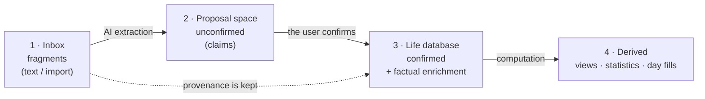
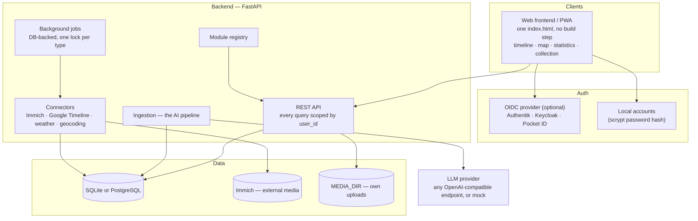

# Life-Dash — architecture

> **What this document is:** the description of the system as it stands — what
> Life-Dash is, how it is built, and which rules it holds itself to.
> **What it is not:** a plan, and not a record of how it got here.
>
> | Question | Document |
> |---|---|
> | What is still open? | [`ROADMAP.md`](ROADMAP.md) |
> | Why is it built this way, and when did it arrive? | [`DECISIONS.md`](DECISIONS.md) |
> | What does a user notice between two versions? | [`../../CHANGELOG.md`](../../CHANGELOG.md) |
> | How do I run it? | [`../DEPLOY.md`](../DEPLOY.md) and `.env.example` |
>
> **The rule that keeps these four apart:** nothing here may be a promise. A
> sentence in this file describes something that exists and can be checked
> against the code. Anything that only *should* be true belongs in the roadmap.

---

## 1. What Life-Dash is

**A searchable, analysable and visually explorable database about your own
life.** It brings scattered life data — memories, places, photos, weather,
milestones — into one structured store and makes it tangible through four
views: a timeline, a map, statistics and a collection.

The decisive difference to journaling apps: **capture is low-friction, via free
text. An AI structures, dates, locates and links the fragments, and nothing it
produces counts as fact until a human confirms it.**

### Guiding principles

| Principle | Meaning |
|---|---|
| **Capture first, structure later** | Entering data must be frictionless. Structure comes from the AI, not from mandatory forms. |
| **Raw data is the truth** | Everything refers back to the unchanged raw input. Derived layers can be recomputed at any time, e.g. with a better model. |
| **Confirmed vs. unconfirmed** | AI-derived values are marked as claims until a human moderates them. |
| **Machines never change what is confirmed** | The hard invariant. Enrichment is additive only. |
| **One data model, many views** | Timeline, map, statistics and collection are projections of the same rows. |
| **Modular** | New trackable types (concerts, books, games) arrive as declarative YAML, without a schema migration. |
| **Self-hosted, data sovereignty** | All data stays on your own machine. External AI is opt-in and interchangeable. |
| **Mobile first** | Capture happens on the go. The UI is a responsive PWA; the phone is not an afterthought. |
| **Multi-user from the start** | Every row belongs to a user. Retrofitting tenancy is expensive, so it was anchored in the model from the first commit. |

### The one property that cannot be copied

Every competing product begins where the data exports begin, roughly 2012.
Here, **“summer 2002, holiday in France” is a first-class record** with `season`
precision — a date that is deliberately vague and still fully searchable,
mappable and countable. Life-Dash covers the pre-digital life, and that follows
from the architecture rather than from a feature: fuzzy dates, a moderation
gate, and retroactive enrichment are the same mechanism seen from three sides.

### How this software was built

**The implementation was written by Anthropic's Claude models — Fable and Opus
— from this documentation, under the author's direction.** The author sets the
direction, decides the architecture, reviews the result and runs it in daily
use; the code itself is machine-written. This is stated openly rather than
buried, because anyone hosting a database of their own life deserves to know
how the thing was made. Two consequences worth naming: the documentation is
unusually detailed *because* it is the primary instruction to the machine, and
every decision is recorded with its reasoning in
[`DECISIONS.md`](DECISIONS.md), so that neither the author nor a later model
has to guess.

### Where Life-Dash sits

The self-hosted field splits into five camps, and all five leave out the same
thing:

| Camp | Representatives | What they do well | What is missing |
|---|---|---|---|
| Location history | Dawarich, Reitti, Traccar, OwnTracks | mature, live tracking, imports everything | places only — no life around them |
| Photos | Immich, PhotoPrism | media with time and geo | the timeline is a file list, not a record of events |
| Journals | Memos, Journiv, Day One | text, mood, fast capture | text stays text: no structure, no map, no statistics |
| Quantified self | Heedy, Grafana + InfluxDB, Exist.io | metrics and dashboards | numbers without a narrative, no free-text entry point |
| Unified timelines | Timelinize, HPI/Promnesia, Dogsheep | conceptually the closest relatives | libraries for developers — no product, no moderation, no interface |

**Honest weaknesses.** Against Dawarich and Reitti the map cannot win — the
answer is to import from them, not to compete. And the LLM dependency is the
barrier to entry: unless the local/Ollama path is first-class and clearly
documented, the very audience that takes “self-hosted” seriously will bounce.

---

## 2. Glossary

| Term | Definition |
|---|---|
| **Event** | The central record. Something that happened at a point or span of time, in a place. |
| **Entity** | A recurring thing in a life: an animal, a film, a country, a game. Events reference entities; the collection is the view over them. |
| **Fragment** | Raw, unstructured input before the AI has touched it. Layer 1 — the immutable source. |
| **Module / trackable** | A registered type (`animal`, `trip`, `movie`) defined declaratively in `backend/modules/*.yaml`. Carries labels, colours, statistics and achievements. |
| **Fuzzy date** | A date with a precision level (`exact`, `day`, `month`, `season`, `year`, `decade`) plus a span. |
| **Confirmed status** | Whether a value was moderated by the user (`confirmed`) or is an AI claim (`unconfirmed`). |
| **Source** | Where a record came from: `manual`, `ai`, `immich`, `google_timeline`, `weather`, `api`. |
| **Track** | A recorded movement path from a Google Timeline import. Context, not an event. |
| **Residence** | A standing fact with a validity period — “between 1986 and 1992 I lived at my parents' house”. A fourth kind of statement; see §3.2. |
| **Enrichment** | Automatic augmentation of an event with photos, weather or metrics, based on time and place — retroactively too. |

---

## 3. The four layers — the core principle

The system is a pipeline of clearly separated layers. Every layer is derived
**reproducibly** from the one before it, and nothing computed is ever the source
of truth.



| Layer | What | Lifetime |
|---|---|---|
| **1 · Inbox** | Raw fragments — text, import summaries. | Immutable, permanent. An evidence archive. |
| **2 · Proposal space** | Unconfirmed AI derivations. *Claims, not truth.* | Disposable — discarded and regenerated on recomputation. |
| **3 · Life database** | Confirmed events, entities and locations, **plus factual enrichments**: weather, media references, tracks. Facts do not change — once fetched, true forever. | **Fixed.** The actual goal of the system. |
| **4 · Derived** | Views, statistics, aggregations, residence day fills. | Disposable, recomputable, never backed up. |

Layers 2 and 3 live in the **same tables**; the `confirmed` column is the
dividing line, and confirming is that column flipping on one row.

### 3.1 The hard invariant

> **Confirmed data is never changed by machines — only extended additively**
> (metrics, media references). Recomputation touches layers 2 and 4
> exclusively.

`field_overrides` additionally protects individual manually corrected fields
from a re-run.

*Documented exception:* “resolve place names” replaces generated coordinate
titles (`Visit: place (53.49…)`) even on confirmed imported visits — that is a
user-initiated data improvement, not an AI re-evaluation. Manually renamed
titles stay protected.

**Provenance and deletability.** Every layer-2/3 row references its inbox
fragment (`origin_fragment_id`, n:1 — one fragment can produce several events).
The proposal space cleans itself up: confirming converts, discarding deletes.
The **inbox is deliberately never deleted automatically**, even when everything
is confirmed — it costs almost nothing, it is the provenance record, and it is
the only source for a later re-extraction.

### 3.2 The fourth kind of statement — the residence

A fragment says *this was said*, a proposal says *this may have happened*, an
event says *this happened*. A **residence** says something none of them
can: *this was the normal case, as long as nothing else is known.*

It is stored as **one row per period** (`BaselineLocation`), never as generated
days. The days are computed at query time in `services/baseline.py` and stored
nowhere. Both halves of that are deliberate:

- A generated day would be `confirmed`, and would therefore fall under the hard
  invariant above — a later correction (“I actually moved in 1998”) would leave
  a thousand wrong rows that nobody is allowed to touch. **A statement that
  pretends to be a thousand statements is not more precise, only harder to
  correct.**
- A stored derivation would have to be maintained on every import, deletion and
  period change, and a stale derivation is worse than none.

**The property everything else stands on: the two day sets are disjoint.** A
residence fills gaps only, so no day has both a recorded event and a residence.
That is why every statistic may simply *add*, and why the weather union cannot
double-count. `test_f20_baseline.py` pins exactly that first — everything
downstream goes quietly wrong the moment it stops holding.

**Consequence for anyone writing a statistic:** a figure over **days** must
count residence days; a figure over **entries** must not.

**One caveat that follows from the rule, and bites in practice:** an entry
occupies only its **starting day** (`recorded_days` reads `date_start`). A
two-week holiday entered as a *single* entry therefore leaves thirteen days for
the residence to fill, and the statistics will place you at home for them. The
remedy is the existing *split multi-day entries* run, which is why it stands
before the residence form in the recommended order; the residence form says so
as well.

**The word in the code is `baseline`, the word everywhere else is
“residence”.** The table, the model, the endpoints (`/api/baselines`,
`/api/days/baseline`) and the service module keep the older, more general name;
the interface, this document and the README say what it actually is. Renaming
the code would be a migration plus a pass through `wipe.py` for a change no
user can see — deliberately not done (note 183), but worth knowing before
grepping for one word and finding none.

---

## 4. What you can do with it

### 4.1 Timeline

The central view. Vertical, zoomable from decade to day.

- **Zoom levels:** day · week · month · year · decade. The server delivers a
  window (`limit`/`offset`, 300 per page); anything counted over the *whole*
  corpus comes from `/api/events/index`, never from a client-side reduce.
- **Vague events** are drawn as spans rather than points and marked as
  unconfirmed.
- **Condensation:** imported visits are grouped per (day, city, source) —
  *before* paging, so a page boundary cannot cut a group in half.
- **Filters:** category, place, source, confirmed status, granularity
  (country → city → district → point).
- Photo strips follow the zoom level; a day header carries that day's weather.
- Residence days appear as such, marked as derived.

### 4.2 Map

- Located events as points, with four **named** condensing levels — every
  point · by proximity · per place · per city — and the zoom level decides
  nothing about which one applies.
- Layers with their own switches: manual entries · imported visits (Google) ·
  photos (Immich) · paths · residences. A switch that cannot currently
  do anything says so (`inert`) instead of lying.
- Photos and dense point sets are drawn on a **canvas with no object per
  point** — the object load, not the draw load, is what breaks a map.
- Residences are drawn as **one mark per period, not per day**: six
  years at one coordinate is one point with a weight, and the day count belongs
  in the popup. The timeline does the opposite, for the same reason — it is a
  list of *days*, the map a list of *places*.
- Raster and vector basemaps, following the app theme.

### 4.3 Statistics

Four panes: **Numbers · Charts · Rankings · Gaps**.

- Every figure over the whole corpus is computed server-side
  (`services/stats_overview.py`, `stats_toplists.py`).
- **Rankings and their headline tiles are the same computation** — the tile is
  rank 1 of the list, so that two rankings cannot drift apart at the first edge
  case.
- **Gaps** answers the one question a life database cannot answer by looking at
  what it has: *where do I know nothing at all?* Its window is the whole point
  — with a birth milestone it runs birth → today, without one it runs first →
  last known day, and the view states which of the two it is showing. Clicking
  a gap carries its dates into the residence form.

### 4.4 Collection

Entities grouped by type — animals, films, games, countries, places, books —
driven by the modules. A detail page per entity with linked events and a map;
cities have their own page with a Wikipedia-sourced description. **Days lead,
entries stand beside them** (“47 days · 312 entries”).

### 4.5 Capture

- Free-text field → fragment → AI preview → confirm or correct.
- Manual entry with a form, for when the structure is already known.
- **Pick a place on the map** instead of typing its name — and that is a
  genuinely different statement: a typed name is the claim and the coordinate
  is looked up from it; a clicked point is the claim and the address is only
  its label.
- A Markdown journal note per day, which the AI never touches, with an optional
  AI-drafted suggestion beside it.
- **An offline queue** for captures made without a connection, which shows what
  it holds and why.

### 4.6 Settings, moderation and jobs

- **Moderation queue:** review, confirm, correct, discard, bulk-confirm.
- **My data:** the import and enrichment runs, in the order that actually works
  — modules → Google Timeline → place names → Immich → day entries → weather →
  backup. A live strip shows running jobs and keeps the last finished one with
  its result.
- **Admin:** users, system jobs, raw log buffer, module management.
- **Export/import:** a full ZIP backup, and a JSON export that carries media
  *metadata* — the media directory is a separate backup.

#### Where a running thing shows up — two questions, not one

Every long-running action answers these separately, and conflating them is what
made the interface inconsistent until note 172.

1. **Who paces it?**
   - *The server* — a job runner keeps going after the page is closed. It shows
     up in the **Jobs tab**: weather, place names, recompute, Immich.
   - *The browser* — it ends with the page. It shows up in the **progress
     overlay**: the blurred backdrop with a title, the sentence saying what is
     happening right now, a bar, an estimate and a cancel button.
2. **Is it registered?** `startJob` takes a per-type lock and writes a record.
   This is **independent of question 1**. The backup and timeline imports are
   paced by the browser *and* registered, so a second tab cannot start the same
   import — so they appear in both places, which is two answers to two
   questions rather than a contradiction.

Below both: a single short request gets the thin net bar at the top of the
window and nothing else. The overlay waits 300 ms before appearing, so a view
change that finishes in 120 ms never flashes one.

---

## 5. Data model

The heart of the system, deliberately lean so modules can dock on without
migrations. Below is what the tables actually hold; `user_id` sits on every
user-owned row and is not repeated per table.

```
User
  id · oidc_subject · email · display_name · role (admin|user)
  password_hash        (local accounts only; NULL for OIDC and dev mode)
  settings             (JSON: Immich API key, import preferences, language)

Fragment                                                    LAYER 1
  raw_text · audio_ref · source · status
  capture_lat / capture_lng   (optional device location, only on request)

Location                                                    LAYER 2
  name · type (city|country|poi|home|photo) · lat · lng
  city · country              (own fields — a name format is not a key)
  address                     (JSON: the raw geocoder parts; three states —
                               NULL = never looked, {} = looked, nothing found,
                               filled = parts present)
  external_ref

BaselineLocation                                            LAYER 3 (see §3.2)
  location_id · label · date_start · date_end (NULL = until today)

Event                                                       LAYER 2 → 3
  title · description · note (Markdown, never AI-touched)
  date_start · date_end · date_precision
  category · confidence · source · location_id
  confirmed · confirmed_at · confirmed_by (manual|bulk|import)
  field_overrides             (which fields are protected from re-processing)
  origin_fragment_id          (layer-1 back-reference)
  parent_event_id             (self-FK: multi-day event → per-day children)
  external_id                 (stable import key → re-import is idempotent)
  embedding                   (JSON vector; currently unused, see §7)

Entity            type · name · attributes (JSON, module schema) · confirmed
EventEntityLink   event_id · entity_id · role (subject|location|mentioned)

MediaRef                                                    LAYER 3
  event_id (nullable — a photo may hang on the DAY instead)
  provider (immich = reference, disposable | local = upload, life database)
  external_id · captured_at

Metric            event_id · key · value · unit · source · enriched_at
DayMetric         the same shape, keyed by DAY — for residence days, which
                  have no event to hang weather on
Track             date_start/end · geo (LineString as JSON) · activity_type
                  · distance_m · source · event_id
Job               background runs: type · status · progress · heartbeat
CityInfo          Wikipedia description cache; deliberately has no user_id
```

### Design decisions worth knowing

- **Provenance is in the model,** not in a log: every layer-2/3 row points back
  to its fragment.
- **`confirmed` + `field_overrides`** separate a claim from a moderated fact,
  and protect individual corrected fields from a re-run.
- **Concrete dates are preferred, vagueness is possible.** `date_precision`
  makes “summer 2002” storable without pretending it is a day.
- **Event ↔ Entity is n:m** — the basis for both the collection and the
  statistics.
- **`attributes` as JSON:** module-specific fields need no migration.
- **Media and metrics are enrichment, referenced not copied.** Immich stays the
  single source of truth for its own assets. `MediaRef.provider` carries the
  layer: `immich` is disposable, `local` is an upload and therefore life
  database that no recomputation may touch.
- **`user_id` everywhere, strict separation.** Every query filters by the
  signed-in user; there are no shared rows. Locations are user-scoped too.
- **Tracks are separate from events.** A route is not an experience but
  context, and it is regenerable from the import.
- **One photo is one event** (`immich:photo:<asset>`), deduplicated by its
  coordinate rounded to five places. The map shows the *picture*, the timeline
  shows the *fact*.
- **People are deliberately left out.** A `person` module is conceptually
  appealing but expensive to maintain — duplicates, relationships, third-party
  privacy, endless assignment decisions. The n:m model stays laid out so that
  people can arrive later as just another module.

---

## 6. The AI pipeline


1. **Capture:** the fragment is stored raw and immediately — never lose data.
2. **Structured extraction:** the LLM receives the fragment plus a JSON schema.
   Output: title, date span plus precision, place, category, recognised
   entities, confidence. Everything starts `unconfirmed`.
3. **Entity resolution:** recognised names are matched against existing
   entities; new ones are created as candidates.
4. **Geocoding:** place names → coordinates via a Nominatim-compatible service
   (or LocationIQ), with 429 backoff. **A failed lookup is written down** —
   otherwise the run asks the same unanswerable question forever.
5. **Enrichment:** weather and photos are attached by time and place, and
   **retroactively** when new source data arrives.
6. **Moderation:** the user confirms, corrects or discards. Only then is it
   fact.

**The AI provider is interchangeable** behind a small interface
(`app/ai/`): any OpenAI-compatible endpoint, plus a mock provider that makes
the whole test suite run offline. Speech-to-text uses the browser API; a
server-side Whisper path is on the roadmap, not in the build.

---

## 7. Modules

**The goal: track something new without touching the core.** A module is a
declarative YAML file in `backend/modules/`:

```yaml
key: animal
label: Animals
icon: paw
entity_schema:            # JSON schema for Entity.attributes
  species: string
  wild: boolean
event_categories:
  - sighting
statistics:
  - id: species_count
    label: "Species observed"
    type: count_distinct
    field: entity.species
compendium_view:
  group_by: species
  detail_map: true
```

| Area | The module's contribution |
|---|---|
| Data model | JSON schema for `Entity.attributes` — validated, no migration |
| Ingestion | hints for how the AI recognises this type |
| Statistics | declarative widgets (count, timeseries, distinct, sum) |
| Collection | grouping, detail view, map option |
| UI | icon, label, colour |
| Achievements | a metric plus four thresholds (bronze/silver/gold/platinum) |

**Implemented:** `trip` · `animal` · `country` · `artist` · `food` ·
`milestone` · `movie` · `game` · `book`.

> **Known gap, stated rather than hidden:** the declarative goal is not fully
> reached. A **new category still touches three places** — the module YAML, the
> rules and examples in the AI prompt, and the frontend (label, colour,
> collection tab, form options).

---

## 8. Integrations

| Source | Purpose | How |
|---|---|---|
| **Immich** | photos, geo tags, timestamps | API with a per-user key. Every owned, located, timeline-visible photo becomes an immediately confirmed event; thumbnails are proxied by the backend. References only — no copies. |
| **Google Timeline** | visited places and routes | Since 2024 the timeline lives on the device only. Import is a file upload of the device export (`semanticSegments`) → stored raw as a fragment → `visit` segments become events, `activity` segments become tracks. |
| **Weather** | context enrichment | Open-Meteo's historical archive, by time and place, retroactively too. Attached as a `Metric` on events and a `DayMetric` on residence days. |
| **Geocoding** | place name ↔ coordinates, both directions | Nominatim or LocationIQ, self-hostable, with backoff. |
| **Wikipedia / Wikidata** | city descriptions | Cached in `CityInfo`; a failed lookup is recorded so it is not repeated forever. |

**Integration principles.**

- Every source is a connector; results are enrichment and recomputable.
- **Imports are idempotent** — every imported record carries a stable
  `external_id`, so a repeated upload creates no duplicates.
- **An outgoing request must serve a stored fact of your own.** That is why a
  city description is fetched and “born on this day” is not.
- **Every connector gets an HTTP double** in `tools/` alongside its unit tests.
  Unit tests replace the client entirely and therefore cannot see paging,
  time zones or real DTOs — three defects were found exactly there.

---

## 9. Technical architecture



### The stack, as built

| Layer | What is actually used |
|---|---|
| **Backend** | Python 3.13 + **FastAPI** + **SQLAlchemy** |
| **Database** | **SQLite** (file) or **PostgreSQL** — the same models on both; PostgreSQL is what it is operated on |
| **Migrations** | `app/migrate.py`, hand-written `ALTER TABLE` steps (`_MISSING_COLUMNS`, `_DROPPED_TABLES`, plus an SQLite table rebuild for relaxing `NOT NULL`) |
| **Geo** | plain `lat`/`lng` columns plus a Nominatim-compatible service. **No PostGIS** — tracks are JSON line strings |
| **Background work** | a `Job` table plus a minute ticker in the app lifespan, one lock per job type and a heartbeat. **No Redis, no external queue** |
| **AI** | any OpenAI-compatible endpoint behind a provider interface, plus a mock provider |
| **Auth** | OIDC (any compliant provider), **local accounts**, or a dev mode that must never reach production |
| **Frontend** | one `frontend/index.html` — CSS, HTML and JavaScript together, **no build step, no npm in the application**, served by the backend at `/`. Leaflet plus MapLibre for vector basemaps |
| **Deployment** | Docker Compose; Immich runs separately and needs only a URL and a key |

**Two deliberate absences, because they are the ones a reader will look for.**

- **No build step in the application.** The frontend is one file on purpose;
  the only Node in this repository is the guard scripts under `tools/`. This
  costs some ergonomics and buys a deployment with nothing between the source
  and the browser.
- **No semantic search any more.** Events still carry an `embedding` column,
  but the search is full-text only. The embedding path loaded every embedded
  event into the app process and computed cosine in pure Python — the one path
  that did not scale, and it took the whole response down when the embed
  service was unavailable. Should it return, it belongs in the database as a
  layer-4 derivation with a vector index, not in the process.

### Performance rules that the code holds to

These are not optimisations; they are correctness rules that were each paid for
once.

- **Anything counted over the whole corpus is counted by the server.** A
  client-side reduce over the loaded page counts the page.
- **Capping is not truncating.** A limit takes an evenly spread selection
  (`sqlutil.even_spread`), never the first *n* chronologically — otherwise a
  busy month silently loses its second half.
- **A view that cannot show everything must say so**, where the eye already is,
  and it must name what *is* shown before what is hidden.
- **A proxy endpoint is not a database endpoint.** Return the connection before
  the network call, or a browser's parallel image fetches will drain the pool
  and every other request fails with it.
- **Never one drawing object per element.** A canvas renderer is half the
  answer; the other half is not creating an object per point.
- **Deleting rows in bulk needs one table list, not one per caller.** SQLite
  does not enforce foreign keys, so a forgotten child table is green in every
  test and fails only on PostgreSQL — after the per-table log lines have
  already claimed success. `app/wipe.py` holds the order; `WIPE_KEEPS` holds
  what stays, with a reason, so “forgotten” and “left on purpose” stay
  distinguishable.

---

## 10. Security & privacy

- **Self-hosted by default.** No data leaves unless you configure an external
  AI provider, and that choice is explicit.
- **Multi-user with strict separation.** Every row belongs to one user and
  every query filters by them. Roles are `admin` and `user`.
- **Three sign-in modes.** OIDC (no password stored), local accounts (scrypt
  hash), and a dev mode. **The dev mode is the sharp edge in this list** —
  making it impossible to start accidentally in a production-shaped environment
  is an open hardening item, not a solved one.
- **Per-user secrets** (the Immich API key) live in `User.settings` and are
  never delivered to the frontend.
- **The most sensitive categories are tracks and health metrics** — movement
  profiles and body data. Export and deletion must cover them completely, and
  they do.
- **Rate limits belong to the instance, not the account.** A run that calls
  Nominatim, Open-Meteo or Immich is gated globally, because it is the
  instance's quota being spent — even though the data it writes is one user's.
- **AI transparency:** every AI-derived statement is recognisable as such
  through `confidence`, `source` and `confirmed`, and it stays a claim until a
  human moderates it.
- **Raw data is the fallback:** because layer 1 is immutable, faulty processing
  can be discarded and recomputed without loss.
- **Full export and deletion at any time** — a ZIP backup including media, and
  a JSON export. The media directory is a separate backup, and the
  documentation says so rather than implying it.

---

## Appendix — a fragment becoming an event

**Input:**

> “12/07/2026 was in Detmold and saw an eagle”

**What the AI returns (layer 2, a claim):**

```json
{
  "title": "Saw an eagle in Detmold",
  "date_start": "2026-07-12",
  "date_end": "2026-07-12",
  "date_precision": "day",
  "category": "sighting",
  "location": { "name": "Detmold", "type": "city" },
  "entities": [
    { "type": "animal", "name": "Eagle",
      "attributes": { "species": "Eagle", "wild": true } }
  ],
  "confidence": 0.94,
  "source": "ai",
  "confirmed": "unconfirmed"
}
```

The user confirms it. The same row flips to `confirmed`, and from that moment
no machine may change it — only add to it: the weather in Detmold that day, the
photos taken there, the eagle in the collection.
